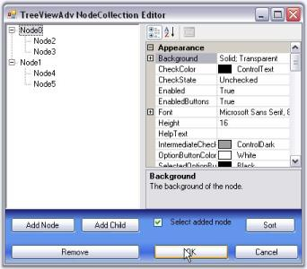
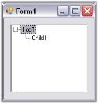

# Getting Started

This section will provide a step-by-step procedure to design a TreeViewAdv control by using designer and through programmatical approach in .NET application.

## Through Designer

Tree nodes can be added to the control at design time as follows.

1. Create an application in Visual Studio .NET.
2. In the designer, drag and drop a TreeViewAdvcontrol to your form, from the toolbox.
3. Select the TreeViewAdv control in the form. In theproperties, click the ellipsis button of the Nodes property to open the NodeCollection Editor. You can also open this editor using task window or by right clicking the control and selecting Node Editor.
4. This TreeViewAdv NodeCollection Editor can also be invoked by clicking the Node Editor option, which appears when the TreeViewAdv control is right clicked at the design time. User can also add top level nodes by clicking the Add Node option. The below image illustrates the same. The nodes added can be customized using the NodeCollection Editor.

   

5. Click "Add Node". This will add a new top-level node.
6. The node's properties will be displayed in the property grid to the right. Specify a custom label for the node by changing its text property as shown in the below image.

   

7. Click "Add Node" to add another sibling to the selected node.
8. Click "Add Child" to add a child node to the selected node.
9. Repeat steps 5 and 6 as required in the application.
10. Click "Remove" to delete a selected node.
11. To move a node to a different parent, just drag-and-drop that node over the parent or besides the desired sibling.
12. Click "OK" to save changes.

## Through Code

Tree nodes can be added to the control programmatically as follows.

1. Add the namespace Syncfusion.Windows.Forms.Tools in your project.

   ~~~ cs

		using Syncfusion.Windows.Forms.Tools;

   ~~~
   {:.prettyprint}

   ~~~ vbnet

		Imports Syncfusion.Windows.Forms.Tools

   ~~~
   {:.prettyprint}

2. Add theTreeViewAdvcontrol to your form in the designer.
3. A TreeViewAdv control can be created programmatically using the below code snippet.

   ~~~ cs

		private Syncfusion.Windows.Forms.Tools.TreeViewAdv treeViewAdv1;

		treeViewAdv1 = new Syncfusion.Windows.Forms.Tools.TreeViewAdv();

		treeViewAdv1.Name = "NewTreeViewAdv";

		this.Controls.Add(this.treeViewAdv1);

   ~~~
   {:.prettyprint}

   ~~~ vbnet

		Private treeViewAdv1 As Syncfusion.Windows.Forms.Tools.TreeViewAdv

		treeViewAdv1 = New Syncfusion.Windows.Forms.Tools.TreeViewAdv 

		treeViewAdv1.Name = "NewTreeViewAdv" 

		Me.Controls.Add(Me.treeViewAdv1)

   ~~~
   {:.prettyprint}

4. Create a new instance of a node.

   ~~~ cs

		//Creating new instance of node.

		TreeNodeAdv node = new TreeNodeAdv("Top1");

   ~~~
   {:.prettyprint}

   ~~~ vbnet

		'Creating new instance of node.

		Dim node As New TreeNodeAdv("Top1")

   ~~~
   {:.prettyprint}

5. Add the created node to the tree control. This will add as a top-level node.

   ~~~ cs

		//Add the created nodes to the TreeViewAdv.

		this.treeViewAdv1.Nodes.Add(node);

   ~~~
   {:.prettyprint}

   ~~~ vbnet

		'Add the created nodes to the TreeViewAdv.

		Me.TreeViewAdv1.Nodes.Add(node)
  
   ~~~
   {:.prettyprint}

6. If you want to add a node to an existing node, use the code snippet shown below.

   ~~~ cs

		//Add nodes to the existing nodes.

		node.Nodes.Add(new TreeNodeAdv("Child 1"));

   ~~~
   {:.prettyprint}

   ~~~ vbnet

		'Add nodes to the existing nodes.

		node.Nodes.Add(New TreeNodeAdv("Child 1"))

   ~~~
   {:.prettyprint}

7. Repeat steps 3 to 5 to continue adding more top-level nodes and child nodes.
8. Run the application.
9. The resulting form is shown in the below image.

