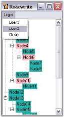

# TreeViewAdv Events

This section covers the events related to the below concepts.

## Node Painting Events

This section discusses the below node painting events.

### AfterNodePaint Event

This event is discussed [here](/windowsforms/treeview/treeview-appearance#drawing-selected-node-foreground).

### BeforeNodePaint

This event is discussed in [Drawing Selected Node Foreground](/windowsforms/treeview/treeview-appearance#drawing-selected-node-foreground).

## CheckBox Event

This section discusses AfterInteractiveChecks Event.

### AfterInteractiveChecks Event

InteractiveCheckBox settings available for the TreeNodeAdv indicates whether the node will have an interactive checkbox. This AfterInteractiveChecks event will be triggered when the checked state of one or more nodes of a TreeViewAdv has changed due to this InteractiveCheckbox setting.

#### Event Data

The TreeNodeAdvEventHandler receives an argument of type TreeNodeAdvEventArgs containing data related to this event. The following TreeNodeAdvEventArgs members provide information specific to this event.

Members Table

<table>
<tr>
<th>
Members</th><th>
Description</th></tr>
<tr>
<td>
Action</td><td>
Gets or sets the Syncfusion.Windows.Forms.Tools.TreeViewAdvAction associated with the event.</td></tr>
<tr>
<td>
Node</td><td>
Gets or sets the Syncfusion.Windows.Forms.Tools.TreeNodeAdv associated with the event.</td></tr>
</table>




private void treeViewAdv1_AfterInteractiveChecks(object sender, Syncfusion.Windows.Forms.Tools.TreeNodeAdvEventArgs e)
{

//This prints the treenodeadv action associated with the event in the output window at run time.
    Console.Write("Action :" + e.Action.ToString());

//This prints the treenodeadv associated with the event in the output window at run time.
    Console.Write("TreeNodeAdv :" + e.Node.ToString());
}





Private Sub treeViewAdv1_AfterInteractiveChecks(ByVal sender As Object, ByVal e As Syncfusion.Windows.Forms.Tools.TreeNodeAdvEventArgs)

'This prints the treenodeadv action associated with the event in the output window at run time.
Console.Write("Action :" + e.Action.ToString())

'This prints the treenodeadv associated with the event in the output window at run time.
Console.Write("TreeNodeAdv :" + e.Node.ToString())
End Sub






Checkbox and Option buttons



## General Events

This section discusses the following general events.

### BeforeExpand Event

BeforeExpand event occurs before a node is expanded. It is illustrated in the [LoadOnDemand](/windowsforms/treeview/loadondemand) topic.

### Deactivated Event

The Deactivated event is triggered when the TreeViewAdv control is deactivated or lost focus.




private void treeViewAdv1_Deactivated(object sender, EventArgs e)
{

//The below line will be printed in the output window at run time.
    Console.Write("Deactivated Event is raised ");
}





Private Sub treeViewAdv1_Deactivated(ByVal sender As Object, ByVal e As EventArgs)

'The below line will be printed in the output window at run time.
Console.Write("Deactivated Event is raised ")
End Sub




### FillSplitterPaneChanged Event

The FillSplitterPane property of a TreeViewAdv control is the one that toggles support for using the control inside a dynamic splitter window and sharing scrollbars with the parent window. The FillSplitterPaneChanged event will be raised when this property is changed.




private void treeViewAdv1_FillSplitterPaneChanged(object sender, EventArgs e)
{

//The below line will be printed in the output window at run time.
    Console.Write("FillSplitterPaneChanged Event is raised ");
}





Private Sub treeViewAdv1_FillSplitterPaneChanged(ByVal sender As Object, ByVal e As EventArgs)

'The below line will be printed in the output window at run time.
Console.Write("FillSplitterPaneChanged Event is raised ")
End Sub




This event is triggered when the key is first pressed. An example which uses the KeyDown event is as follows.

### Event Data

The KeyEventHandler receives an argument of type KeyEventArgs containing data related to this event. The following KeyEventArgs members provide information specific to this event.

Members Table

<table>
<tr>
<th>
Members</th><th>
Description</th></tr>
<tr>
<td>
Alt</td><td>
Gets a value indicating whether the ALT key was pressed.</td></tr>
<tr>
<td>
Control</td><td>
Gets a value indicating whether the CTRL key was pressed.</td></tr>
<tr>
<td>
Handled</td><td>
Gets or sets a value indicating whether the event was handled.</td></tr>
<tr>
<td>
KeyCode</td><td>
Gets the keyboard code for a KeyDown or KeyUp event.</td></tr>
<tr>
<td>
KeyData</td><td>
Gets the key data for a KeyDown or KeyUp event.</td></tr>
<tr>
<td>
KeyValue</td><td>
Gets the keyboard value for a KeyDown or KeyUp event.</td></tr>
<tr>
<td>
Modifiers</td><td>
Gets the modifier flags for a KeyDown or KeyUp event. The flags indicate which combination of CTRL, SHIFT, and ALT keys was pressed.</td></tr>
<tr>
<td>
Shift</td><td>
Gets a value indicating whether the SHIFT key was pressed.</td></tr>
<tr>
<td>
SuppressKeyPress</td><td>
Gets or sets a value indicating whether the key event should be passed on to the underlying control.</td></tr>
</table>

Adding nodes into the TreeViewAdv using KeyBoard

The nodes can be added to the TreeViewAdv when any key is pressed, whereby the text of the node reflects the key that has been used for adding the node, by using the following code in the TreeViewAdv KeyDown event handler.

#### Border Settings




// Setting the key data to the newly added node.

// Add the nodes to the selected node.
private void treeViewAdv1_KeyDown(object sender, System.Windows.Forms.KeyEventArgs e) 
{ 
// Setting the key data to the newly added node.
     TreeNodeAdv node=new TreeNodeAdv("Node"+" "+e.KeyData.ToString()); 

// Add the nodes to the selected node.
     this.treeViewAdv1.SelectedNode.Nodes.Add(node); 
     Console.WriteLine("The "+node.Text+" "+"is added"); 
} 





Private Sub treeViewAdv1_KeyDown(ByVal sender As Object, ByVal e As System.Windows.Forms.KeyEventArgs)

' Setting the key data to the newly added node.
Dim node As TreeNodeAdv = New TreeNodeAdv("Node" & " " & e.KeyData.ToString())

' Add the nodes to the selected node.
Me.treeViewAdv1.SelectedNode.Nodes.Add(node)
Console.WriteLine("The " & node.Text & " " & "is added")

End Sub




### KeyDown Event

This event is triggered when the key is first pressed. An example which uses the KeyDown event is as follows.

####  Event Data

The KeyEventHandler receives an argument of type KeyEventArgs containing data related to this event. The following KeyEventArgs members provide information specific to this event.

Members Table
<table>
<tr>
<th>
Members</th><th>
Description</th></tr>
<tr>
<td>
Alt	</td><td>
Gets a value indicating whether the ALT key was pressed.</td></tr>
<tr>
<td>
Control	</td><td>
Gets a value indicating whether the CTRL key was pressed.</td></tr>
<tr>
<td>Handled	</td><td>
Gets or sets a value indicating whether the event was handled.</td></tr>
<tr>
<td>KeyCode	</td><td>
Gets the keyboard code for a KeyDown or KeyUp event.</td></tr>
<tr>
<td>KeyData	</td><td>
Gets the key data for a KeyDown or KeyUp event.</td></tr>
<tr>
<td>KeyValue</td><td>
Gets the keyboard value for a KeyDown or KeyUp event.</td></tr>
<tr>
<td>Modifiers</td><td>
Gets the modifier flags for a KeyDown or KeyUp event. The flags indicate which combination of CTRL, SHIFT, and ALT keys was pressed.</td></tr>
<tr>
<td>Shift</td><td>
Gets a value indicating whether the SHIFT key was pressed.</td></tr>
<tr>
<td>SuppressKeyPress</td><td>
Gets or sets a value indicating whether the key event should be passed on to the underlying control.
</td>
</tr>
</table>

#### Adding Nodes into the TreeViewAdv using KeyBoard

The nodes can be added to the TreeViewAdv when any key is pressed, whereby the text of the node reflects the key that has been used for adding the node, by using the following code in the TreeViewAdv KeyDown event handler.

#### Border Settings




// Setting the key data to the newly added node.
// Add the nodes to the selected node.
private void treeViewAdv1_KeyDown(object sender, System.Windows.Forms.KeyEventArgs e) 
{ 
 // Setting the key data to the newly added node.
     TreeNodeAdv node=new TreeNodeAdv("Node"+" "+e.KeyData.ToString()); 

// Add the nodes to the selected node.
     this.treeViewAdv1.SelectedNode.Nodes.Add(node); 
     Console.WriteLine("The "+node.Text+" "+"is added"); 
}





Private Sub treeViewAdv1_KeyDown(ByVal sender As Object, ByVal e As System.Windows.Forms.KeyEventArgs)

' Setting the key data to the newly added node.
Dim node As TreeNodeAdv = New TreeNodeAdv("Node" & " " & e.KeyData.ToString())

' Add the nodes to the selected node.
Me.treeViewAdv1.SelectedNode.Nodes.Add(node)
Console.WriteLine("The " & node.Text & " " & "is added")
End Sub



 

Nodes added using Keyboard
{:.caption}

### BeforeCheck Event

This event is triggered when the checkbox is checked in the control. Below is an example which handles this event.

#### Event Data

The TreeNodeAdvBeforeCheckEventHandler receives an argument of type TreeNodeAdvBeforeCheckEventArgs containing data related to this event. The following  TreeNodeAdvBeforeCheckEventArgs' members provide information specific to this event.

Members Table

<table>
<tr>
<th>
Members</th><th>
Description</th></tr>
<tr>
<td>
NewCheckState</td><td>
Gets the check state of the node.</td></tr>
<tr>
<td>
Cancel</td><td>
A boolean property which indicates whether the event is to be canceled.</td></tr>
<tr>
<td>
Node</td><td>
Gets the TreeNodeAdv which is associated with this action.</td></tr>
</table>
Check or uncheck TreeNodeAdv using the Mouse

This can be done by handling the TreeViewAdv's BeforeCheck event as shown below.




private void treeViewAdv1_BeforeCheck(object sender, Syncfusion.Windows.Forms.Tools.TreeNodeAdvBeforeCheckEventArgs e)
{
   if (Control.MouseButtons == MouseButtons.Left)
   {
// Allow check or uncheck.
   }
   else
// Ignore all other ways to check/uncheck the node.
   e.Cancel = true;
}





Private Sub treeViewAdv1_BeforeCheck(ByVal sender As Object, ByVal e As Syncfusion.Windows.Forms.Tools.TreeNodeAdvBeforeCheckEventArgs)
If Control.MouseButtons = MouseButtons.Left Then

' Allow check or uncheck.
Else

' Ignore all other ways to check/uncheck the node.
e.Cancel = True
End If
End Sub




### Leave Event

This event is triggered when the control is no longer the active control of the form. An example which uses the Leave event is as follows.

How to Use Delete Key for Deleting and as a Shortcut to BarItems / MenuItems of TreeViewAdv

The form contains a treeViewAdv with nodes with LabelEdit property set to true as well as BarItems or MenuItems with Delete key as their shortcut. 

After editing the node by pressing F2, if the Delete key is pressed, to avoid the menu shortcut from getting triggered and trigger the deletion of text in the editor, follow the procedure below.

Disable the menu shortcut as soon as the editor gets focus and enable the shortcut as soon as the editor loses focus. It can be done by handling the TreeViewAdv's BeforeEdit event, setting the bar item's shortcut to None and listening to the node's edit textbox's Leave event. Within this Leave event handler, set the bar item's shortcut back to Del.




TextBox editor;
private void treeViewAdv1_BeforeEdit(object sender, Syncfusion.Windows.Forms.Tools.TreeNodeAdvBeforeEditEventArgs e)
{
    this.editor = e.TextBox;
    this.editor.Leave += new EventHandler(editor_Leave);

// Disabling  the menu shortcut as soon as the editor gets focused.
    this.barItem1.Shortcut = Shortcut.None;
}

// Enabling the shortcut as soon as the editor loses focus.
private void editor_Leave(object sender, EventArgs args)
{
    this.barItem1.Shortcut = Shortcut.Del;
}





Private editor As TextBox
Private Sub treeViewAdv1_BeforeEdit(ByVal sender As Object, ByVal e As Syncfusion.Windows.Forms.Tools.TreeNodeAdvBeforeEditEventArgs)
Me.editor = e.TextBox
AddHandler editor.Leave, AddressOf editor_Leave

'Disabling the menu shortcut as soon as the editor gets focused.
Me.barItem1.Shortcut = Shortcut.None
End Sub
Private Sub editor_Leave(ByVal sender As Object, ByVal args As EventArgs)

' Enabling the shortcut as soon as the editor loses focus.
Me.barItem1.Shortcut = Shortcut.Del
End Sub




## Node Images Events

This section illustrates the events related to the node images.

### DefaultCollapseImageIndexChanged Event

DefaultCollapseImageIndex property of the TreeViewAdv sets the index of the default image for collapse button. This event is triggered when this property is changed.




private void treeViewAdv1_DefaultCollapseImageIndexChanged(object sender, EventArgs e)
{

//The below line will be printed in the output window at run time.
    Console.Write("DefaultCollapseImageIndexChanged Event is raised ");
}





Private Sub treeViewAdv1_DefaultCollapseImageIndexChanged(ByVal sender As Object, ByVal e As EventArgs)

'The below line will be printed in the output window at run time.
Console.Write("DefaultCollapseImageIndexChanged Event is raised ")
End Sub




### DefaultExpandImageIndexChanged Event

DefaultExpandImageIndex property of the TreeViewAdv sets the index of the default image for Expand button. The DefaultExpandImageIndexChanged event is triggered when this property is changed.




private void treeViewAdv1_DefaultExpandImageIndexChanged(object sender, EventArgs e)
{

//The below line will be printed in the output window at run time.
    Console.Write("DefaultExpandImageIndexChanged Event is raised ");
}





Private Sub treeViewAdv1_DefaultExpandImageIndexChanged(ByVal sender As Object, ByVal e As EventArgs)

'The below line will be printed in the output window at run time.
Console.Write("DefaultExpandImageIndexChanged Event is raised ")

End Sub




### NodeStateImageListChanged Event

NodeStateImageList holds the state images for the nodes. When this image list is changed then, the NodeStateImageListChanged event will be triggered.




private void treeViewAdv1_NodeStateImageListChanged(object sender, EventArgs e)
{

//The below line will be printed in the output window at run time.
    Console.Write("NodeStateImageListChanged Event is raised ");
}





Private Sub treeViewAdv1_NodeStateImageListChanged(ByVal sender As Object, ByVal e As EventArgs)

'The below line will be printed in the output window at run time.
Console.Write("NodeStateImageListChanged Event is raised ")

End Sub




## Node Collections

TreeViewAdv has properties that specifies the collection of expanded nodes, collapsed nodes, checked nodes and selected nodes.

Property Table

<table>
<tr>
<th>
TreeViewAdv Property</th><th>
Description</th></tr>
<tr>
<td>
ExpandedNodes</td><td colspan = "2">
Specifies the collection of nodes that are in expanded state.</td></tr>
<tr>
<td>
CollapsedNodes</td><td colspan = "2">
Specifies the collection of nodes that are in collapsed state.</td></tr>
<tr>
<td>
CheckedNodes</td><td colspan = "2">
Specifies the collection of checked nodes.</td></tr>
<tr>
<td>
SelectedNodes</td><td colspan = "2">
Specifies the collection of selected nodes.</td></tr>
</table>

## Appearance Events

This section discusses those events that are handled on changing some appearance related properties. They are as follows.

### GradientBackgroundChanged Event

This event occurs when the GradientBackground of the tree changes.




private void treeViewAdv1_GradientBackgroundChanged(object sender, EventArgs e)
{

//The below line will be printed in the output window at run time.
    Console.Write("Gradient Background Changed Event is raised ");
}





Private Sub treeViewAdv1_GradientBackgroundChanged(ByVal sender As Object, ByVal e As EventArgs)

'The below line will be printed in the output window at run time.
Console.Write("Gradient Background Changed Event is raised ")

End Sub






Background Settings



### GradientColorsChanged Event

This event occurs when the GradientColors of the tree changes.




private void treeViewAdv1_GradientColorsChanged(object sender, EventArgs e)
{

//The below line will be printed in the output window at run time.
    Console.Write("Gradient Colors Changed Event is raised ");
}





Private Sub treeViewAdv1_GradientColorsChanged(ByVal sender As Object, ByVal e As EventArgs)

'The below line will be printed in the output window at run time.
Console.Write("Gradient Colors Changed Event is raised ")
End Sub






Background Settings



## VerticalGradientChanged Event

This event occurs when the tree's VerticalGradient is changed.




private void treeViewAdv1_VerticalGradientChanged(object sender, EventArgs e)
{

//The below line will be printed in the output window at run time.
    Console.Write("Vertical GradientChanged Event is raised ");
}





Private Sub treeViewAdv1_VerticalGradientChanged(ByVal sender As Object, ByVal e As EventArgs)

'The below line will be printed in the output window at run time.
Console.Write("Vertical GradientChanged Event is raised ")

End Sub






Background Settings



## Node Editing Events

This section will walk through the following node editing events.



Context Menu



### NodeEditorValidating Event

This event is used to validate a new node label entered by the user.

Event Data

The TreeNodeAdvCancelableEditEventHandler receives an argument of type TreeNodeAdvCancelableEditEventArgs containing data related to this event. The following TreeNodeAdvCancelableEditEventArgs members provide information specific to this event.

Members Table

<table>
<tr>
<th>
Members</th><th>
Description</th></tr>
<tr>
<td>
Node</td><td>
Indicates a TreeNodeAdv which is currently edited.</td></tr>
<tr>
<td>
Label</td><td>
A new text for the node.</td></tr>
<tr>
<td>
Cancel</td><td>
Indicates whether the event should be canceled.</td></tr>
<tr>
<td>
ContinueEditing</td><td>
Indicates whether editing should end now.</td></tr>
</table>

How To Validate Node Label Text

This topic shows how you can validate the text of the label of a node in the TreeViewAdv control. You need to listen to the NodeEditorValidating event of the TreeViewAdv control to validate the node's label text entered by the user. The code sample below demonstrates how you can prevent blank labels in a node. 




private void treeViewAdv1_NodeEditorValidating(object sender, Syncfusion.Windows.Forms.Tools.TreeNodeAdvCancelableEditEventArgs e)
{
    if(e.Label.Length == 0)
     {
// Cancel the label edit action, inform the user, and place the node in edit mode again. 
          e.Cancel = true;
          MessageBox.Show("The label cannot be blank", "Node Label Edit");

// To end editing mode,call: e.ContinueEditing = False;
     }
} 





Private  Sub treeViewAdv1_NodeEditorValidating(ByVal sender As Object, ByVal e As Syncfusion.Windows.Forms.Tools.TreeNodeAdvCancelableEditEventArgs)
If e.Label.Length = 0 Then

' Cancel the label edit action, inform the user, and place the node in edit mode again. 
e.Cancel = True
MessageBox.Show("The label cannot be blank", "Node Label Edit")

' To end editing mode,call: e.ContinueEditing = False;
End If
End Sub




### NodeEditorValidated Event

This event is raised after the newly entered text in the Node editor gets stored.

Event Data

The event handler receives an argument of type TreeNodeAdvEditEventArgs containing data related to this event. The following TreeNodeAdvEditEventArgs properties provide information specific to this event.

Members Table

<table>
<tr>
<th>
Members</th><th>
Description</th></tr>
<tr>
<td>
Label</td><td>
Returns the label for the node.</td></tr>
<tr>
<td>
Node</td><td>
Returns the TreeNodeAdv that is currently being edited.</td></tr>
</table>




private void treeViewAdv1_NodeEditorValidated(object sender, Syncfusion.Windows.Forms.Tools.TreeNodeAdvEditEventArgs e)
{

//This prints the label for the node in the output window at run time.
    Console.Write("Label :" + e.Label.ToString());

//This prints the treenodeadv associated with the event in the output window at run time.
    Console.Write("TreeNodeAdv :" + e.Node.ToString());
}





Private Sub treeViewAdv1_NodeEditorValidated(ByVal sender As Object, ByVal e As Syncfusion.Windows.Forms.Tools.TreeNodeAdvEditEventArgs)

'This prints the treenodeadv action associated with the event in the output window at run time.
Console.Write("Label :" + e.Action.ToString())

'This prints the treenodeadv associated with the event in the output window at run time.
Console.Write("TreeNodeAdv :" + e.Node.ToString())

End Sub




### NodeEditorValidateString Event

This event is triggered when the text entered by the user changes in the Node editor control. 

#### Event Data

The event handler receives an argument of type TreeNodeAdvEditEventArgs containing data related to this event. The following TreeNodeAdvEditEventArgs properties provide information specific to this event.

Members Table

<table>
<tr>
<th>
Members</th><th>
Description</th></tr>
<tr>
<td>
Cancel</td><td>
Indicates whether the event should be canceled.</td></tr>
<tr>
<td>
ContinueEditing</td><td>
Indicates whether editing should end now.</td></tr>
<tr>
<td>
Label</td><td>
Returns the label for the node.</td></tr>
<tr>
<td>
Node</td><td>
Returns the TreeNodeAdv that is currently being edited.</td></tr>
</table>




private void treeViewAdv1_NodeEditorValidateString(object sender, Syncfusion.Windows.Forms.Tools.TreeNodeAdvCancelableEditEventArgs e)
{

//The below code cancels the event
    e.Cancel = true;

//This property is consulted only when Cancel is set to true. 

//If you Cancel the operation and if this property is set to false,editing mode will end; 

//otherwise editing mode will be preserved. Default is true.
    e.ContinueEditing = false;

//This prints the label for the node in the output window at run time.
    Console.Write("Label :" + e.Label.ToString());

//This prints the treenodeadv associated with the event in the output window at run time.
    Console.Write("TreeNodeAdv :" + e.Node.ToString());
}





Private Sub treeViewAdv1_NodeEditorValidateString(ByVal sender As Object, ByVal e As Syncfusion.Windows.Forms.Tools.TreeNodeAdvCancelableEditEventArgs)

'The below code cancels the event
e.Cancel = true

'This property is consulted only when Cancel is set to true. 

'If you Cancel the operation and if this property is set to false,editing mode will end; 

'otherwise editing mode will be preserved. Default is true.
e.ContinueEditing = False

'This prints the treenodeadv action associated with the event in the output window at run time.
Console.Write("Label :" + e.Action.ToString())

'This prints the treenodeadv associated with the event in the output window at run time.
Console.Write("TreeNodeAdv :" + e.Node.ToString())
End Sub




N> Another use case illustrating this event - [How to limit the characters, that the user type for editing the treeNodeAdv using LabelEdit](/windowsforms/treeview/faq/how-to-limit-the-characters-that-the-user-type-for-editing)

### BeforeEdit Event

This event is raised before the node goes into edit mode. Below are examples which handles the BeforeEdit event.

#### Event Data

The TreeNodeAdvBeforeEditEventHandler receives an argument of type TreeNodeAdvBeforeEditEventArgs containing data related to this event. The following  TreeNodeAdvBeforeEditEventArgs' members provide information specific to this event.

Members Table

<table>
<tr>
<th>
Members</th><th>
Description</th></tr>
<tr>
<td>
Node</td><td>
This returns a TreeNodeAdv.</td></tr>
<tr>
<td>
TextBox</td><td>
Returns the textbox that is used to edit the node.</td></tr>
<tr>
<td>
Cancel</td><td>
Gets or Sets a value indicating whether the event should be canceled.</td></tr>
</table>

#### Method to Set UnEditable Nodes

Methods to make a node completely un editable even when the,

1. Node is visible.
2. Node is click able.

BeforeEdit event can be used for this purpose. In this example, the Parent Nodes are made un editable.TreeNodeAdvBeforeEditEventArgs.Node indicates the target node for editing.

The desired condition is checked on that node and based on the result, the TreeNodeAdvBeforeEditEventArgs.Cancel property is set appropriately.




private void treeViewAdv1_BeforeEdit(object sender, Syncfusion.Windows.Forms.Tools.TreeNodeAdvBeforeEditEventArgs e)
{

// Check if they are parent nodes.
    if ((e.Node.Text == "Node0") || (e.Node.Text == "Node5")) 
    {
        e.Cancel = true;
    }
}





Private Sub treeViewAdv1_BeforeEdit(ByVal sender As Object, ByVal e As Syncfusion.Windows.Forms.Tools.TreeNodeAdvBeforeEditEventArgs)

' Check if they are parent nodes.
If (e.Node.Text = "Node0") OrElse (e.Node.Text = "Node5") Then
e.Cancel = True
End If
End Sub




Cancel Read / Write property for particular user nodes

By canceling the BeforeEdit event for particular nodes of particular users, the Read/Write property can be canceled. 




private void treeViewAdv1_BeforeEdit(object sender, Syncfusion.Windows.Forms.Tools.TreeNodeAdvBeforeEditEventArgs e)
{

// By cancel the BeforeEdit event for particular nodes helps to cancel the Read/Write property of that nodes. 
    if(username=="user1")
    {
        if ((e.Node.Text == "Node0") || (e.Node.Text == "Node5")||(e.Node.Text == "Node3")||(e.Node.Text == "Node8")) 
        {
            e.Cancel = true;
        }
    }
    else if(username=="user2")
    if ((e.Node.Text == "Node2") || (e.Node.Text == "Node4")||(e.Node.Text == "Node6")||(e.Node.Text == "Node10")) 
    {
        e.Cancel = true;
    }
}





Private Sub treeViewAdv1_BeforeEdit(ByVal sender As Object, ByVal e As Syncfusion.Windows.Forms.Tools.TreeNodeAdvBeforeEditEventArgs)

' By cancel the BeforeEdit event for particular nodes helps to cancel the Read/Write property of that nodes. 
If username="user1" Then
If (e.Node.Text = "Node0") OrElse (e.Node.Text = "Node5") OrElse (e.Node.Text = "Node3") OrElse (e.Node.Text = "Node8") Then
e.Cancel = True
End If
Else If username="user2" Then
If (e.Node.Text = "Node2") OrElse (e.Node.Text = "Node4") OrElse (e.Node.Text = "Node6") OrElse (e.Node.Text = "Node10") Then
e.Cancel = True
End If
End If
End Sub




The following figure shows the color change for some of the nodes of the user that indicates the canceled Read/Write property for that node.

## Node Selection

### BeforeSelect Event

This event occurs before a node is selected. This event is illustrated in [How to prevent a node from being selected](/windowsforms/treeview/faq/how-to-prevent-a-node-from-being-selected) topic.

### HotTracking Events in TreeViewAdv

#### Description

In TreeViewAdv, a NodeHotTrackChanged event enables users to retrieve the TreeViewAdv node which is currently being hot tracked by the mouse. This event will be triggered when the mouse moves over the nodes in a tree view, and the node that is currently selected by the mouse pointer is the hot tracked node.

#### Use Cases

If a user needs to get a particular node’s details as it is being tracked by the mouse pointer, this event will provide this information through its event arguments.

#### Event Table

Events Table

<table>
<tr>
<th>
Event</th><th>
Parameters</th><th>
Description</th></tr>
<tr>
<td>
NodeHotTrackChanged</td><td>
TreeViewAdvNodeEventArgs </td><td>
This event will be triggered when mouse hover occurs in TreeViewAdv nodes it will return the particular node currently being tracked by mouse pointer from its argument.When TreeView HotTracking is set as False, this event will not return details for the particular node being HotTracked.This event can return entire details of a node as it is tracked by the mouse.</td></tr>
</table>




//Enable hot tracking.
this.treeViewAdv1.HotTracking = true;

//Hooking a hot tracking event.
this.treeViewAdv1.NodeHotTrackChanged += new System.EventHandler(this.treeViewAdv1_NodeHotTrackChanged);

//A NodeHotTrackChanged event.
private void treeViewAdv1_NodeHotTrackChanged(object sender, Syncfusion.Windows.Forms.Tools.TreeViewAdvNodeEventArgs e) {
this.textBox1.Text = e.Node.Text;





' Enable hot tracking.
Me.treeViewAdv1.HotTracking = true

' Hooking a NodeHotTrackChanged event.
AddHandler Me.treeViewAdv1.NodeHotTrackChanged, AddressOf Me.treeViewAdv1_NodeHotTrackChanged

' A NodeHotTrackChanged event.
Private Sub treeViewAdv1_NodeHotTrackChanged(ByVal sender As Object, ByVal e As Syncfusion.Windows.Forms.Tools.TreeViewAdvNodeEventArgs)
Me.textBox1.Text = e.Node.Text
End Sub




## Mouse Events

The following mouse events and Mouse related events are discussed in this section.

### Mouse Events

MouseDown and MouseUp Event

The event, MouseDown is raised when the mouse pointer is over the control and a mouse button is pressed. The event, MouseUp is raised when the mouse pointer is over the control and a mouse button is released. An example which uses the MouseDown and MouseUp events are as follows.

Event Data

The MouseEventHandler receives an argument of type MouseEventArgs containing data related to this event. The following MouseEventArgs members provide information specific to this event.

Members Table

<table>
<tr>
<th>
Members</th><th>
Description</th></tr>
<tr>
<td>
Button</td><td>
Gets which mouse button was pressed.</td></tr>
<tr>
<td>
Clicks</td><td>
Gets the number of times the mouse button was pressed and released.</td></tr>
<tr>
<td>
Delta</td><td>
Gets a signed count of number of detects the mouse wheel has rotated. A detect is one notch of the mouse wheel.</td></tr>
<tr>
<td>
Location</td><td>
Gets the location of mouse when during generating mouse events.</td></tr>
<tr>
<td>
X</td><td>
Gets the X - coordinate of the mouse when during generating mouse events.</td></tr>
<tr>
<td>
Y</td><td>
Gets the Y - coordinate of the mouse during generating mouse events.</td></tr>
</table>
Hide Context Menu When user clicks on an Empty Space on the TreeViewAdv

If the user clicks on an empty space on the TreeViewAdv, the appearance of the context menu can be avoided by handling MouseDown and MouseUp event handlers. With the help of this, the user will be able to know which node is being edited currently. Here the Selected node is set to RMouseDownNode. The RMouseDownNode gets / sets the node on which, the user had done a Right-MouseDown.




private void treeViewAdv1_MouseDown(object sender, MouseEventArgs e) 
{ 

// Suspends the painting of the control.
    if(e.Button == MouseButtons.Right)
    {
        this.treeViewAdv1.BeginUpdate();
        if(this.treeViewAdv1.RMouseDownNode!=null) 
        if (this.treeViewAdv1.RMouseDownNode.TextBounds.Contains(this .treeViewAdv1.LastMousePositionToClient())) 
        {

// Selected Node is set to RMouseDownNode.
            this.treeViewAdv1.SelectedNode = this.treeViewAdv1.RMouseDownNode; 
        }
    } 
} 

private void treeViewAdv1_MouseUp(object sender, MouseEventArgs e) 
{ 

// Resumes the painting of the control.
     this.treeViewAdv1.EndUpdate(true); 
} 





Private Sub treeViewAdv1_MouseDown(ByVal sender As Object, ByVal e As MouseEventArgs)

' Suspends the painting of the control.
If e.Button = MouseButtons.Right Then
Me.treeViewAdv1.BeginUpdate(True)
If Not Me.treeViewAdv1.RMouseDownNode Is Nothing Then
If Me.treeViewAdv1.RMouseDownNode.TextBounds.Contains(Me.treeViewAdv1.LastMousePositionToClient()) Then

' SelectedNode is set to RMouseDownNode.
Me.treeViewAdv1.SelectedNode = Me.treeViewAdv1.RMouseDownNode
End If
End If
End If
End Sub
Private Sub treeViewAdv1_MouseUp(ByVal sender As Object, ByVal e As MouseEventArgs)

' Resumes the painting of the control.
Me.treeViewAdv1.EndUpdate(True)

End Sub




### MouseWheelZoom Event

MouseWheelZoom event occurs when the user holds the Control Key and rolls the mouse wheel.

#### Event Data

The event handler receives an argument of type MouseWheelZoomEventArgs containing data related to this event. The following MouseWheelZoomEventArgs member provide information specific to this event.

Members Table

<table>
<tr>
<th>
Member</th><th>
Description</th></tr>
<tr>
<td>
Delta</td><td>
Returns the number of rows or columns to scroll.</td></tr>
</table>




private void treeViewAdv1_MouseWheelZoom(object sender, Syncfusion.Windows.Forms.Tools.MouseWheelZoomEventArgs e)
{

//This code prints the no of rows or columns to scroll

//This will be displayed in the output window at run time.
    Console.Write("Delta Value :" + e.Delta.ToString());
}





Private Sub treeViewAdv1_MouseWheelZoom(ByVal sender As Object, ByVal e As Syncfusion.Windows.Forms.Tools.MouseWheelZoomEventArgs)

'This code prints the no of rows or columns to scroll

'This will be displayed in the output window at run time.
Console.Write("Delta Value :" + e.Delta.ToString())
End Sub




### IntellijMouseDragScrolling Event

This event is triggered when the user presses the mouse wheel and drags the mouse. 

Event Data

The event handler receives an argument of type IntellijMouseDragScrollEventArgs containing data related to this event. The following IntellijMouseDragScrollEventArgs members provide information specific to this event.

Members Table

<table>
<tr>
<th>
Members</th><th>
Description</th></tr>
<tr>
<td>
Cancel</td><td>
Indicates whether the event should be canceled.</td></tr>
<tr>
<td>
DX</td><td>
Gets or sets the distance in pixels, the mouse pointer has been moved horizontally.</td></tr>
<tr>
<td>
DY</td><td>
Gets or sets the distance in pixels, the mouse pointer has been moved vertically.</td></tr>
<tr>
<td>
Scrolled</td><td>
When set to true, indicates you have scrolled and do not want the default scrolling behavior.</td></tr>
</table>




private void treeViewAdv1_IntelliMouseDragScrolling(object sender, Syncfusion.Windows.Forms.Tools.IntelliMouseDragScrollEventArgs e)
{

//This prints the distance in pixels, the mouse pointer has been moved 

//horizontally in the output window at run time.
Console.Write("Distance Horizontally :" + e.DX.ToString());

//This prints the distance in pixels, the mouse pointer has been moved 

//vertically in the output window at run time.
Console.Write("distance Vertically :" + e.DY.ToString());

//This when set to true indicates that you have scrolled and do not want the default scrolling behavior
e.Scrolled = true;

//The below code cancels the event
e.Cancel = true;

}





Private Sub treeViewAdv1_IntelliMouseDragScrolling(ByVal sender As Object, ByVal e As Syncfusion.Windows.Forms.Tools.IntelliMouseDragScrollEventArgs)

'This prints the distance in pixels, the mouse pointer has been moved 

'horizontally in the output window at run time.
Console.Write("distance Horizontally :" + e.DY.ToString())

'This prints the distance in pixels, the mouse pointer has been moved 

'vertically in the output window at run time.
Console.Write("distance Vertically :" + e.DY.ToString())

'This when set to true indicates that you have scrolled and do not want the default scrolling behavior
e.Scrolled = True

'The below code cancels the event
e.Cancel = True
End Sub




### Mouse Selection Events in TreeViewAdv and MultiColumnTreeView

#### Description

The event NodeMouseClick is raised when the mouse pointer is over the TreeNodeAdv control and the left mouse button is single clicked. The event NodeMouseDoubleClick is raised when the mouse pointer is over the TreeNodeAdv control and a left mouse button is double-clicked. An example that uses the NodeMouseClick and NodeMouseDoubleClick events follows.

#### Event Data

The TreeViewAdvMouseClickEventArgs contain the following members to provide information specific to this event.

Members Table

<table>
<tr>
<th>
Members</th><th>
Description</th></tr>
<tr>
<td>
Button</td><td>
Gets which mouse button was pressed.</td></tr>
<tr>
<td>
Clicks</td><td>
Gets the number of times the mouse button was pressed and released.</td></tr>
<tr>
<td>
Delta</td><td>
Gets a signed count of the number of detects the mouse wheel has rotated, multiplied by the WHEEL_DELTA constant. A detect is one notch of the mouse wheel.</td></tr>
<tr>
<td>
Location</td><td>
Gets the location of the mouse during the generating mouse event.</td></tr>
<tr>
<td>
Node</td><td>
Gets the node that was clicked.</td></tr>
<tr>
<td>
X</td><td>
Gets the x-coordinate of the mouse during the generating mouse event.</td></tr>
<tr>
<td>
Y</td><td>
Gets the y-coordinate of the mouse during the generating mouse event.</td></tr>
</table>




void treeViewAdv1_NodeMouseClick(object sender, TreeViewAdvMouseClickEventArgs e)
{

//Gets the number of times the mouse button was pressed and released.
    int clickCount = e.Clicks;

//Gets which mouse button was pressed.
    MouseButtons clickedButtons = e.Mousebutton;

//Gets the x-coordinate of the mouse during the generating mouse event.
    int xPosition = e.X;

//Gets the y-coordinate of the mouse during the generating mouse event
    int yPosition = e.Y;

//Gets a signed count of the number of detects the mouse wheel has rotated, multiplied by the WHEEL_DELTA constant. A detect is one notch of the mouse wheel.
   int delta = e.Delta;

//Gets the node that was clicked.
   TreeNodeAdv clickedNode = e.Node;
}
void treeViewAdv1_NodeMouseDoubleClick(object sender, TreeViewAdvMouseClickEventArgs e)
{

//Gets the number of times the mouse button was pressed and released.
    int clickCount = e.Clicks;

//Gets which mouse button was pressed.
    MouseButtons clickedButtons = e.Mousebutton;

//Gets the x-coordinate of the mouse during the generating mouse event.
    int xPosition = e.X;

//Gets the y-coordinate of the mouse during the generating mouse event.
    int yPosition = e.Y;

//Gets a signed count of the number of detects the mouse wheel has rotated, multiplied by the WHEEL_DELTA constant. A detect is one notch of the mouse wheel.
   int delta = e.Delta;

//Gets the node that was clicked.
   TreeNodeAdv clickedNode = e.Node;
}





Private Sub treeViewAdv1_NodeMouseClick(sender As Object, e As TreeViewAdvMouseClickEventArgs)

'Gets the number of times the mouse button was pressed and released.
Dim clickCount As Integer = e.Clicks

'Gets which mouse button was pressed.
Dim clickedButtons As MouseButtons = e.Mousebutton

'Gets the x-coordinate of the mouse during the generating mouse event.
Dim xPosition As Integer = e.X

'Gets the y-coordinate of the mouse during the generating mouse event.
Dim yPosition As Integer = e.Y

'Gets a signed count of the number of detects the mouse wheel has rotated, multiplied by the WHEEL_DELTA constant. A detect is one notch of the mouse wheel.
Dim delta As Integer = e.Delta

'Gets the node that was clicked.
Dim clickedNode As TreeNodeAdv = e.Node
End Sub
Private Sub treeViewAdv1_NodeMouseDoubleClick(sender As Object, e As TreeViewAdvMouseClickEventArgs)

'Gets the number of times the mouse button was pressed and released.
Dim clickCount As Integer = e.Clicks

'Gets which mouse button was pressed.
Dim clickedButtons As MouseButtons = e.Mousebutton

'Gets the x-coordinate of the mouse during the generating mouse event.
Dim xPosition As Integer = e.X

'Gets the y-coordinate of the mouse during the generating mouse event.
Dim yPosition As Integer = e.Y

'Gets a signed count of the number of detects the mouse wheel has rotated, multiplied by the WHEEL_DELTA constant. A detect is one notch of the mouse wheel.
Dim delta As Integer = e.Delta

'Gets the node that was clicked.
Dim clickedNode As TreeNodeAdv = e.Node
End Sub




## Drag and Drop Events

Events that are handled during drag and drop operation, using highlight tracker functionality are as follows.



Drag and Drop



### QueryDragInsertInfo

This event is discussed in [Highlighting Drag and Drop](/windowsforms/treeview/drag-and-drop#highlighting-drag-and-drop) topic.

### Drag and Drop Events

The drag drop events given below are discussed here.

* DragOver
* DragLeave
* DragEnter
* ItemDrag
* DragDrop
* GiveFeedback
* QueryContinueDrag

### QueryAllowedPositionForNode

This event is discussed here.

## Scrolling Events

This section discusses about the events during scrolling operation.

### ScrollbarsVisibleChanged Event

This event is triggered when the scrollbars are hidden or shown.




private void treeViewAdv1_ScrollbarsVisibleChanged(object sender, EventArgs e)
{

//The below line will be printed in the output window at run time.
    Console.Write("ScrollbarsVisibleChanged Event is raised ");
}





Private Sub treeViewAdv1_ScrollbarsVisibleChanged(ByVal sender As Object, ByVal e As EventArgs)

'The below line will be printed in the output window at run time.
Console.Write("ScrollbarsVisibleChanged Event is raised ")
End Sub




### ScrollControlHandledMouseDown Event

The event, MouseDown is raised when the mouse pointer is over the control and a mouse button is pressed. Once this event is raised, ScrollControlHandledMouseDown event will also be raised.

Event Data

The event handler receives an argument of type MouseEventArgs containing data related to this event. The following MouseEventArgs members provide information specific to this event.

Members Table

<table>
<tr>
<th>
Members</th><th>
Description</th></tr>
<tr>
<td>
Button</td><td>
Gets which mouse button was pressed.</td></tr>
<tr>
<td>
Clicks</td><td>
Gets the number of times the mouse button was pressed and released.</td></tr>
<tr>
<td>
Delta</td><td>
Gets a signed count of the detects the mouse had rotated, whereas a detect is one notch of the mouse wheel.</td></tr>
<tr>
<td>
Location</td><td>
Gets the location of the mouse during generating mouse events.</td></tr>
<tr>
<td>
X</td><td>
Gets the X-coordinates of the mouse during generating mouse events.</td></tr>
<tr>
<td>
Y</td><td>
Gets the Y-coordinates of the mouse during generating mouse events.</td></tr>
</table>




private void treeViewAdv1_ScrollControlHandledMouseDown(object sender, MouseEventArgs e)
{

//This code prints mouse button that is pressed.
    Console.Write("Button :" + e.Button.ToString());

//This returns the no of times the mouse button was pressed.
    Console.Write("Clicks :" + e.Clicks.ToString());

//This print the Delta value.
    Console.Write("Delta value :" + e.Delta.ToString());

//This returns the location of the mouse while generating mouse events.
    Console.Write("Location :" + e.Location.ToString());

//This returns the X coordinates of the mouse while generating mouse events.
    Console.Write("X coordinate :" + e.X.ToString());

//This returns the Y coordinates of the mouse while generating mouse events.
    Console.Write("Y coordinate :" + e.Y.ToString());
}





Private Sub treeViewAdv1_ScrollControlHandledMouseDown(ByVal sender As Object, ByVal e As MouseEventArgs)

'This code prints mouse button that is pressed.
Console.Write("Button :" + e.Button.ToString())

'This returns the no of times the mouse button was pressed.
Console.Write("Clicks  :" + e.Clicks.ToString())

'This print the Delta value.
Console.Write("delta Value :" + e.Delta.ToString())

'This returns the location of the mouse while generating mouse events.
Console.Write("Location :" + e.Location.ToString())

'This returns the X coordinates of the mouse while generating mouse events.
Console.Write("X coordinate :" + e.X.ToString())

'This returns the Y coordinates of the mouse while generating mouse events.
Console.Write("Y coordinate :" + e.Y.ToString())

End Sub




### ScrollControlHandledMouseMove Event

The event, MouseMove is raised when the mouse pointer is moved over the control. After AutoScrolling and once this event is raised, ScrollControlHandledMouseMove event will also be triggered.

Event Data

The event handler receives an argument of type MouseEventArgs containing data related to this event. The following MouseEventArgs members provide information specific to this event.

Members Table

<table>
<tr>
<th>
Members</th><th>
Description</th></tr>
<tr>
<td>
Button</td><td>
Gets which mouse button was pressed.</td></tr>
<tr>
<td>
Clicks</td><td>
Gets the number of times the mouse button was pressed and released.</td></tr>
<tr>
<td>
Delta</td><td>
Gets a signed count of the detects the mouse had rotated, whereas a detect is one notch of the mouse wheel.</td></tr>
<tr>
<td>
Location</td><td>
Gets the location of the mouse during generating mouse events.</td></tr>
<tr>
<td>
X</td><td>
Gets the X-coordinates of the mouse during generating mouse events.</td></tr>
<tr>
<td>
Y</td><td>
Gets the Y-coordinates of the mouse during generating mouse events.</td></tr>
</table>




private void treeViewAdv1_ScrollControlHandledMouseMove(object sender, MouseEventArgs e)
{

//This code prints mouse button that is pressed.
    Console.Write("Button :" + e.Button.ToString());

//This returns the no of times the mouse button was pressed.
    Console.Write("Clicks :" + e.Clicks.ToString());

//This print the Delta value.
    Console.Write("Delta value :" + e.Delta.ToString());

//This returns the location of the mouse while generating mouse events.
    Console.Write("Location :" + e.Location.ToString());

//This returns the X coordinates of the mouse while generating mouse events.
    Console.Write("X coordinate :" + e.X.ToString());

//This returns the Y coordinates of the mouse while generating mouse events.
    Console.Write("Y coordinate :" + e.Y.ToString());
}





Private Sub treeViewAdv1_ScrollControlHandledMouseMove(ByVal sender As Object, ByVal e As MouseEventArgs)

'This code prints mouse button that is pressed.
Console.Write("Button :" + e.Button.ToString())

'This returns the no of times the mouse button was pressed.
Console.Write("Clicks  :" + e.Clicks.ToString())

'This print the Delta value.
Console.Write("delta Value :" + e.Delta.ToString())

'This returns the location of the mouse while generating mouse events.
Console.Write("Location :" + e.Location.ToString())

'This returns the X coordinates of the mouse while generating mouse events.
Console.Write("X coordinate :" + e.X.ToString())

'This returns the Y coordinates of the mouse while generating mouse events.
Console.Write("Y coordinate :" + e.Y.ToString())
End Sub




### ScrollControlHandledMouseUp Event

The event, MouseUp is raised when the mouse pointer is over the control and a mouse button is released. Once this event is raised, ScrollControlHandledMouseUp event will also be triggered.

Event Data

The event handler receives an argument of type MouseEventArgs containing data related to this event. The following MouseEventArgs members provide information specific to this event.

Members Table

<table>
<tr>
<th>
Members</th><th>
Description</th></tr>
<tr>
<td>
Button</td><td>
Gets which mouse button was pressed.</td></tr>
<tr>
<td>
Clicks</td><td>
Gets the number of times the mouse button was pressed and released.</td></tr>
<tr>
<td>
Delta</td><td>
Gets a signed count of the detects the mouse had rotated, whereas a detect is one notch of the mouse wheel.</td></tr>
<tr>
<td>
Location</td><td>
Gets the location of the mouse during generating mouse events.</td></tr>
<tr>
<td>
X</td><td>
Gets the X-coordinates of the mouse during generating mouse events.</td></tr>
<tr>
<td>
Y</td><td>
Gets the Y-coordinates of the mouse during generating mouse events.</td></tr>
</table>




private void treeViewAdv1_ScrollControlHandledMouseUp(object sender, MouseEventArgs e)
{

//This code prints mouse button that is pressed.
    Console.Write("Button :" + e.Button.ToString());

//This returns the no of times the mouse button was pressed.
    Console.Write("Clicks :" + e.Clicks.ToString());

//This print the Delta value.
    Console.Write("Delta value :" + e.Delta.ToString());

//This returns the location of the mouse while generating mouse events.
    Console.Write("Location :" + e.Location.ToString());

//This returns the X coordinates of the mouse while generating mouse events.
    Console.Write("X coordinate :" + e.X.ToString());

//This returns the Y coordinates of the mouse while generating mouse events.
    Console.Write("Y coordinate :" + e.Y.ToString());
}





Private Sub treeViewAdv1_ScrollControlHandledMouseUp(ByVal sender As Object, ByVal e As MouseEventArgs)

'This code prints mouse button that is pressed.
Console.Write("Button :" + e.Button.ToString())

'This returns the no of times the mouse button was pressed.
Console.Write("Clicks  :" + e.Clicks.ToString())

'This print the Delta value.
Console.Write("delta Value :" + e.Delta.ToString())

'This returns the location of the mouse while generating mouse events.
Console.Write("Location :" + e.Location.ToString())

'This returns the X coordinates of the mouse while generating mouse events.
Console.Write("X coordinate :" + e.X.ToString())

'This returns the Y coordinates of the mouse while generating mouse events.
Console.Write("Y coordinate :" + e.Y.ToString())
End Sub




### ScrollControlMouseDown Event

The event, MouseDown is raised when the mouse pointer is over the control and a mouse button is pressed. The ScrollControlMouseDown event will be raised before a MouseDown is raised and allows you to cancel the mouse event.

### Event Data

The event handler receives an argument of type CancelMouseEventArgs containing data related to this event. The following CancelMouseEventArgs members provide information specific to this event.

Members Table

<table>
<tr>
<th>
Members</th><th>
Description</th></tr>
<tr>
<td>
Cancel</td><td>
Gets or sets a value indicating whether event should be canceled.</td></tr>
<tr>
<td>
MouseEventArgs</td><td>
Indicates the MouseEventArgs data for this event.</td></tr>
</table>




private void treeViewAdv1_ScrollControlHandledMouseDown(object sender, Syncfusion.Windows.Forms.CancelMouseEventArgs e)
{

//Returns the MouseEventArgs data for this event
    Console.Write("Mouse Button :" + e.MouseEventArgs.Button.ToString() + "No of clicks" + e.MouseEventArgs.Clicks.ToString() + "Delta value" + e.MouseEventArgs.Delta.ToString() + "Location of the mouse" + e.MouseEventArgs.Location.ToString() + "X cord" + e.MouseEventArgs.X.ToString() + " Y cord:" + e.MouseEventArgs.Y.ToString()");

//Cancel the event using the below code.
    e.Cancel = true;
}





Private Sub treeViewAdv1_ScrollControlHandledMouseDown(ByVal sender As Object, ByVal e As Syncfusion.Windows.Forms.CancelMouseEventArgs)

//Returns the MouseEventArgs data for this event
Console.Write("Mouse Button :" + e.MouseEventArgs.Button.ToString() + "No of clicks" + e.MouseEventArgs.Clicks.ToString() + "Delta value" + e.MouseEventArgs.Delta.ToString() + "Location of the mouse" + e.MouseEventArgs.Location.ToString() + "X cord" + e.MouseEventArgs.X.ToString() + " Y cord:" + e.MouseEventArgs.Y.ToString()")

//Cancel the event using the below code.
e.Cancel = True
End Sub




### ScrollControlMouseMove Event

The event, MouseMove is raised when the mouse pointer is moved over the control. ScrollControlMouseMove event occurs before a MouseMove event is raised and allows you to cancel the mouse event.

Event Data

The event handler receives an argument of type CancelMouseEventArgs containing data related to this event. The following CancelMouseEventArgs members provide information specific to this event.

Members Table

<table>
<tr>
<th>
Members</th><th>
Description</th></tr>
<tr>
<td>
Cancel</td><td>
Gets or sets a value indicating whether event should be canceled.</td></tr>
<tr>
<td>
MouseEventArgs</td><td>
Indicates the MouseEventArgs data for this event.</td></tr>
</table>




private void treeViewAdv1_ScrollControlHandledMouseMove(object sender, Syncfusion.Windows.Forms.CancelMouseEventArgs e)
{

//Returns the MouseEventArgs data for this event
    Console.Write("Mouse Button :" + e.MouseEventArgs.Button.ToString() + "No of clicks" + e.MouseEventArgs.Clicks.ToString() + "Delta value" + e.MouseEventArgs.Delta.ToString() + "Location of the mouse" + e.MouseEventArgs.Location.ToString() + "X cord" + e.MouseEventArgs.X.ToString() + " Y cord:" + e.MouseEventArgs.Y.ToString()");

//Cancel the event using the below code.
    e.Cancel = true;
}





Private Sub treeViewAdv1_ScrollControlHandledMouseMove(ByVal sender As Object, ByVal e As Syncfusion.Windows.Forms.CancelMouseEventArgs)

//Returns the MouseEventArgs data for this event
Console.Write("Mouse Button :" + e.MouseEventArgs.Button.ToString() + "No of clicks" + e.MouseEventArgs.Clicks.ToString() + "Delta value" + e.MouseEventArgs.Delta.ToString() + "Location of the mouse" + e.MouseEventArgs.Location.ToString() + "X cord" + e.MouseEventArgs.X.ToString() + " Y cord:" + e.MouseEventArgs.Y.ToString()")

//Cancel the event using the below code.
e.Cancel = True
End Sub




### ScrollControlMouseUp Event

The event, MouseUp is raised when the mouse pointer is over the control and a mouse button is released. ScrollControlMouseUp event occurs before a MouseUp event is raised and allows you to cancel the mouse event.

#### Event Data

The event handler receives an argument of type CancelMouseEventArgs containing data related to this event. The following CancelMouseEventArgs members provide information specific to this event.

Members Table

<table>
<tr>
<td>
Members</td><td>
Description</td></tr>
<tr>
<td>
Cancel</td><td>
Gets or sets a value indicating whether event should be canceled.</td></tr>
<tr>
<td>
MouseEventArgs</td><td>
Indicates the MouseEventArgs data for this event.</td></tr>
</table>




private void treeViewAdv1_ScrollControlHandledMouseUp(object sender, Syncfusion.Windows.Forms.CancelMouseEventArgs e)
{

//Returns the MouseEventArgs data for this event
    Console.Write("Mouse Button :" + e.MouseEventArgs.Button.ToString() + "No of clicks :" + e.MouseEventArgs.Clicks.ToString() + "Delta value :" + e.MouseEventArgs.Delta.ToString() + "Location of the mouse :" + e.MouseEventArgs.Location.ToString() + "X coordinate :" + e.MouseEventArgs.X.ToString() + " Y coordinate :" + e.MouseEventArgs.Y.ToString()");

//Cancel the event using the below code.
    e.Cancel = true;
}





Private Sub treeViewAdv1_ScrollControlHandledMouseUp(ByVal sender As Object, ByVal e As Syncfusion.Windows.Forms.CancelMouseEventArgs)

//Returns the MouseEventArgs data for this event
Console.Write("Mouse Button :" + e.MouseEventArgs.Button.ToString() + "No of clicks :" + e.MouseEventArgs.Clicks.ToString() + "Delta value :" + e.MouseEventArgs.Delta.ToString() + "Location of the mouse:" + e.MouseEventArgs.Location.ToString() + "X coordinate :" + e.MouseEventArgs.X.ToString() + " Y coordinate :" + e.MouseEventArgs.Y.ToString()")

//Cancel the event using the below code.
e.Cancel = True
End Sub




### ScrollTipFeedback Event

This event is triggered when the user is dragging the scrollbar thumb.

#### Event Data

The event handler receives an argument of type ScrollTipFeedbackEventArgs containing data related to this event. The following ScrollTipFeedbackEventArgs members provide information specific to this event.

Members Table

<table>
<tr>
<th>
Members</th><th>
Description</th></tr>
<tr>
<td>
Action</td><td>
Returns a ScrollTipAction value that specifies the user action that led to this event.</td></tr>
<tr>
<td>
BackColor</td><td>
Gets or sets the back color to be used for the scroll tip text.</td></tr>
<tr>
<td>
BorderStyle</td><td>
Gets or sets the border style to be used for the scroll tip text.</td></tr>
<tr>
<td>
Font</td><td>
Gets or sets the Font to be used for the scroll tip text.</td></tr>
<tr>
<td>
ForeColor</td><td>
Gets or sets the text color to be used for the scroll tip text.</td></tr>
<tr>
<td>
Format</td><td>
Gets or sets the text layout information for the text in the Scroll tip.</td></tr>
<tr>
<td>
Location</td><td>
Gets or sets the location of the scroll tip window.</td></tr>
<tr>
<td>
ScrollBar</td><td>
Returns the scrollbar that is the source of this event.</td></tr>
<tr>
<td>
Size</td><td>
Gets or sets the size of the scroll tip window.</td></tr>
<tr>
<td>
Text</td><td>
Get or sets the text to display in scroll tip.</td></tr>
<tr>
<td>
Value</td><td>
Returns the new scroll position.</td></tr>
</table>




private void treeViewAdv1_ScrollTipFeedback(object sender, Syncfusion.Windows.Forms.ScrollTipFeedbackEventArgs e)
{

//Returns the ScrollTipActions value
    Console.Write("Action :" + e.Action.ToString());

//This prints the Back Color to be used for the Scroll Tip Text
    Console.Write("BackColor:" + e.BackColor.ToString());

//This prints the Border style to be used for the Scroll Tip Text
    Console.Write("Border Style:" + e.BorderStyle.ToString());

//This prints the Font to be used for the Scroll Tip text
    Console.Write("Font:" + e.Font.ToString());

//This prints the text color to be used for the Scroll Tip text
    Console.Write("Fore Color:" + e.ForeColor.ToString());

//This prints the layout out info to be used for the Scroll Tip text
    Console.Write("Format:" + e.Format.ToString());

//This prints the Location of the ScrollTipWindow
    Console.Write("Location:" + e.Location.ToString());

//This prints the scrollbar which is the source of this event.
    Console.Write("Scrollbar:" + e.ScrollBar.ToString());

//This prints the size of the ScrollTipWindow
    Console.Write("Size :" + e.Size.ToString());

//This prints the text for the ScrollTip
    Console.Write("Scrolltip Text:" + e.Text.ToString());

//This returns the new scroll position
    Console.Write("Scroll position:" + e.Value.ToString());
}





Private Sub treeViewAdv1_ScrollTipFeedback(ByVal sender As Object, ByVal e As Syncfusion.Windows.Forms.ScrollTipFeedbackEventArgs)

'Returns the ScrollTipActions value
Console.Write("Action :" + e.Action.ToString())

'This prints the Back Color to be used for the Scroll Tip Text
Console.Write("BackColor:" + e.BackColor.ToString())

'This prints the Border style to be used for the Scroll Tip Text
Console.Write("Border Style:" + e.BorderStyle.ToString())

'This prints the Font to be used for the Scroll Tip text
Console.Write("Font:" + e.Font.ToString())

'This prints the text color to be used for the Scroll Tip text
Console.Write("Fore Color:" + e.ForeColor.ToString())

'This prints the layout out info to be used for the Scroll Tip text
Console.Write("Format:" + e.Format.ToString())

'This prints the Location of the ScrollTipWindow
Console.Write("Location:" + e.Location.ToString())

'This prints the scrollbar which is the source of this event.
Console.Write("Scrollbar:" + e.ScrollBar.ToString())

'This prints the size of the ScrollTipWindow
Console.Write("Size :" + e.Size.ToString())

'This prints the text for the ScrollTip
Console.Write("Scrolltip Text:" + e.Text.ToString())

'This returns the new scroll position
Console.Write("Scroll position:" + e.Value.ToString())
End Sub



