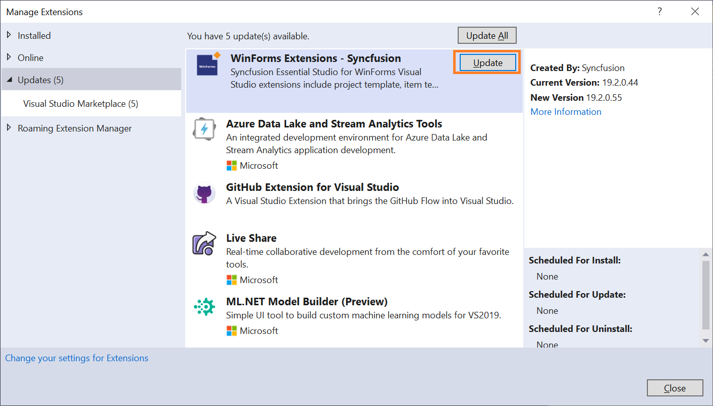
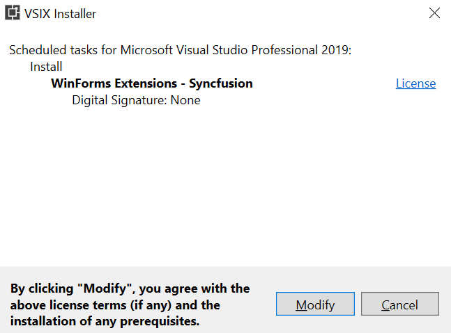

# Upgrading Syncfusion Windows Forms components to the latest version

Syncfusion publishes the Visual Studio extension in the [Visual Studio marketplace](https://marketplace.visualstudio.com/items?itemName=SyncfusionInc.Windows-Extensions) for every Syncfusion Volume release, with exciting new features, and a Service Pack release with major bug fixes in the volume release.

You can upgrade to our latest version from any installed Syncfusion version.

## Upgrading to the latest version

Before starting the upgrade, close all Visual Studio instances and stop any running debugging sessions. Updating the extension while Visual Studio is running requires closing Visual Studio during the install step.

1.  In Visual Studio go to **Extensions -> Manage Extensions -> Updates** and find the Syncfusion WinForms extension.

    N> In Visual Studio 2017 or earlier, go to **Tools -> Extensions and Updates**.

2.  Then, click on the **Update** button to update the extension.

    

3.  Close Visual Studio and click **Modify** in the VSIX installer dialog.

    

4.  After the VSIX installer finishes, restart Visual Studio. Open **Extensions -> Manage Extensions -> Installed** and verify the Syncfusion WinForms extension shows the new version.

### Toolbox recovery

If the Syncfusion toolbox controls disappear after the extension update, run the Syncfusion installer (or re-run the extension installer) with the **Configure Syncfusion controls in Visual Studio** option enabled. This re-registers the toolbox items for the current Visual Studio version.