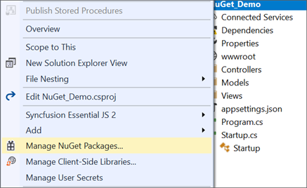
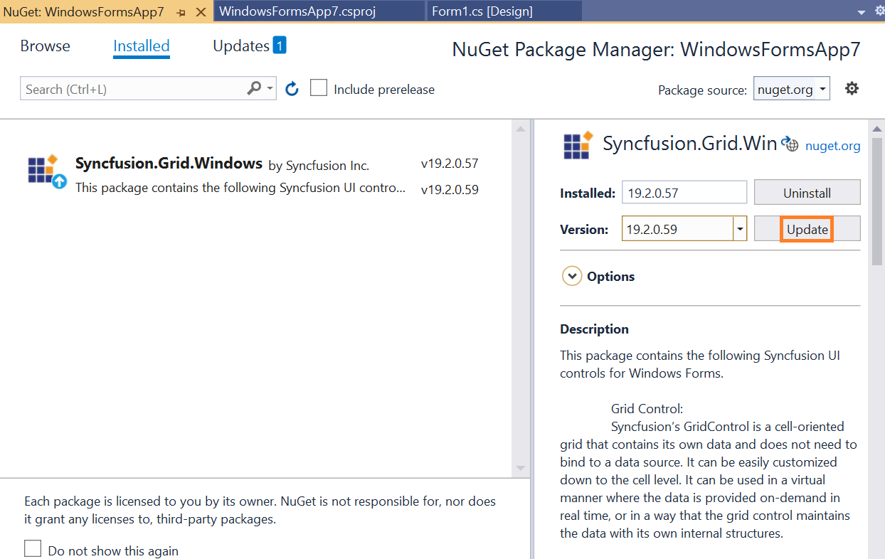
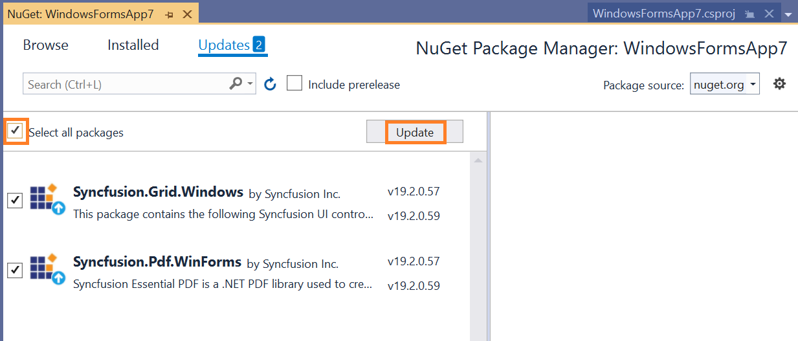
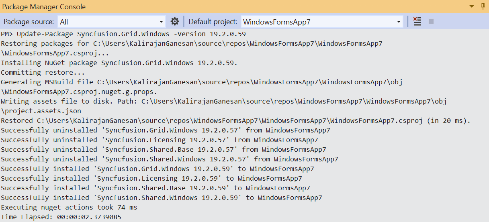

# Upgrading Syncfusion WinForms NuGet packages to a latest version

Every three months, Syncfusion releases new volumes with interesting new features. For this volume, there will be weekly NuGet releases and a service pack. Syncfusion WinForms NuGet packages are released on a weekly basis to address critical issue fixes.

From any Syncfusion WinForms NuGet version you have installed; you can update to our most recent version.

## Upgrade NuGet packages through Package Manager UI

The NuGet **Package Manager UI** in Visual Studio allows you to easily install, uninstall, and update NuGet packages in applications and solutions. You can find and upgrade the Syncfusion WinForms NuGet packages to the most recent version or to specific version in the WinForms solution or application and this process is easy with the steps below:

1. Right-click on the WinForms application or solution in the Solution Explorer tab, and choose **Manage NuGet Packages...**

    

    As an alternative, after opening the WinForms application in Visual Studio, go to the **Tools** menu and after hovering **NuGet Package Manager**, select **Manage NuGet Packages for Solution...**

2. The Manage NuGet Packages window will open. Navigate to the **Updates** tab, then search for the Syncfusion WinForms NuGet packages using a term like **"Syncfusion"** and select the appropriate Syncfusion WinForms NuGet package for your application.

    > The [nuget.org](https://api.nuget.org/v3/index.json) package source is selected by default in the Package source drop-down. If your Visual Studio does not have nuget.org configured, follow the instructions in the [Microsoft documents](https://docs.microsoft.com/en-us/nuget/tools/package-manager-ui#package-sources) to set up the nuget.org feed URL.

3. By default, the package selected with latest version. You can select the required version and click the **Update** button and accept the license terms. The package will be upgraded to selected version in your WinForms application.

    

    You can choose the multiple NuGet packages by selecting the checkbox like below and click the **Update** button to update the multiple Syncfusion NuGet packages in your application.

    

## Upgrade NuGet packages through .NET CLI

There is no distinct command for the update procedure in the .NET CLI. Unless you specify the package version, .NET CLI installs the latest version of the Syncfusion WinForms NuGet packages when you use the dotnet add package command.

To specify a version, add the -v parameter:

```dotnet add package Syncfusion.Grid.Windows -v 19.2.0.59.```

## Upgrade NuGet packages through Package Manager Console

The **Package Manager Console** saves NuGet packages upgrade time since you don't have to search for the package you want to update, and you can just type the command to update the appropriate Syncfusion WinForms NuGet package. Follow the steps below to upgrade the installed Syncfusion NuGet packages using the Package Manager Console in your WinForms application.

1. To show the Package Manager Console, open your WinForms application in Visual Studio and navigate to **Tools** in the Visual Studio menu and after hovering **NuGet Package Manager**, select **Package Manager Console**.

    

2. The Package Manager Console will be shown at the bottom of the screen. You can install the Syncfusion WinForms NuGet packages by enter the following NuGet update commands.

    ***Update specified Syncfusion WinForms NuGet package***

    The below command will update the Syncfusion WinForms NuGet package in the default ASP.NET Core application

    ```Update-Package <Package Name>```

    **For example:** Update-Package Syncfusion.Grid.Windows

    ***Update specified Syncfusion WinForms NuGet package in specified WinForms application***

    The below command will update the Syncfusion WinForms NuGet package in the given WinForms application alone

    ```Update-Package <Package Name> -ProjectName <Project Name>```

    **For example:** Update-Package Syncfusion.Grid.Windows -ProjectName SyncfusionWinformsApp

3. By default, the package will be installed with latest version. You can give the required version with the -Version term like below to install the Syncfusion WinForms NuGet packages in the appropriate version.

    ```Update-Package Syncfusion.Grid.Windows -Version 19.2.0.59```

    

4. The NuGet package manager will update the Syncfusion WinForms NuGet package as well as the dependencies it has.