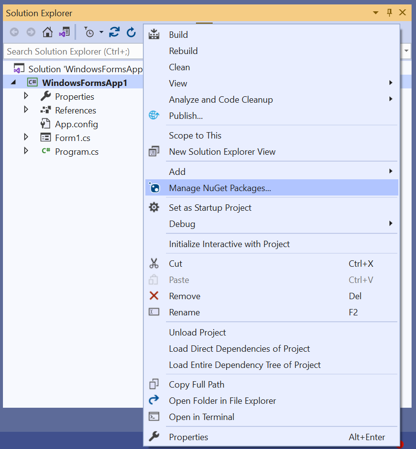
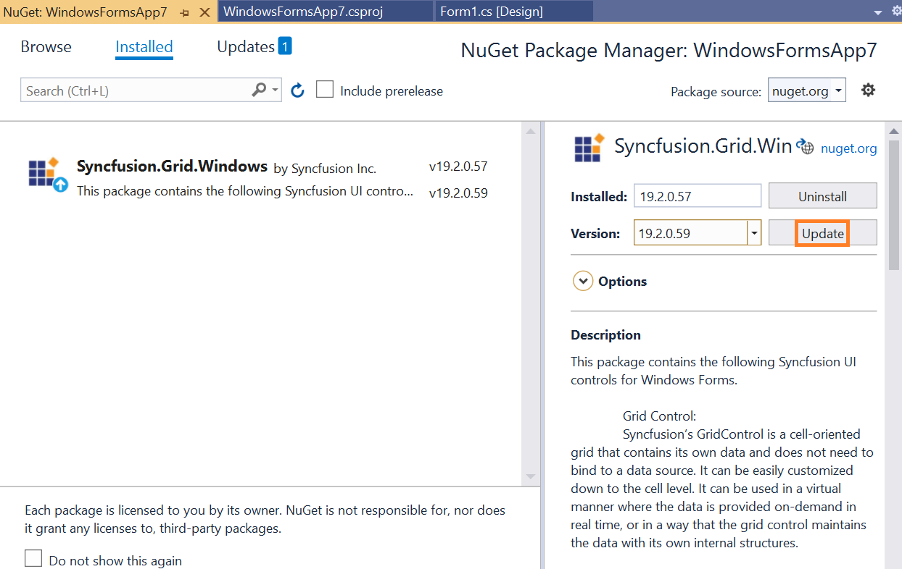
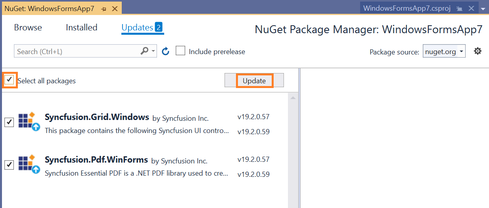
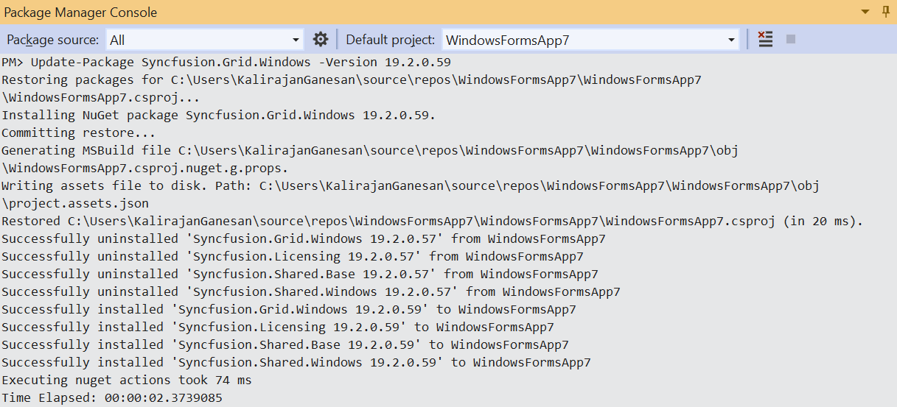

# Upgrading Syncfusion WinForms NuGet packages to the latest version

Every three months, Syncfusion releases new volumes with interesting new features. For this volume, there will be weekly NuGet releases and a service pack. Syncfusion WinForms NuGet packages are released on a weekly basis to address critical issue fixes.

From any Syncfusion WinForms NuGet version you have installed, you can update to our most recent version.

## Upgrade NuGet packages through Package Manager UI

The NuGet **Package Manager UI** in Visual Studio allows you to easily install, uninstall, and update NuGet packages in applications and solutions. You can find and upgrade the Syncfusion WinForms NuGet packages to the most recent version or to specific version in the WinForms solution or application and this process is easy with the steps below:

1. Right-click on the WinForms application or solution in the Solution Explorer tab, and choose **Manage NuGet Packages...**

    

    As an alternative, after opening the WinForms application in Visual Studio, go to the **Tools** menu and after hovering **NuGet Package Manager**, select **Manage NuGet Packages for Solution...**

2. The Manage NuGet Packages window will open. Navigate to the **Updates** tab, then search for the Syncfusion WinForms NuGet packages using a term like **"Syncfusion"** and select the appropriate Syncfusion WinForms NuGet package for your application.

    > The [nuget.org](https://api.nuget.org/v3/index.json) package source is selected by default in the Package source drop-down. If your Visual Studio does not have nuget.org configured, follow the instructions in the [Microsoft documents](https://docs.microsoft.com/en-us/nuget/tools/package-manager-ui#package-sources) to set up the nuget.org feed URL.

3. By default, the package is selected with the latest version. You can select the required version and click the **Update** button and accept the license terms. The package will be upgraded to the selected version in your WinForms application.

    

    You can choose the multiple NuGet packages by selecting the checkbox like below and click the **Update** button to update the multiple Syncfusion NuGet packages in your application.

    

4. After the upgrade, perform a **Clean** and then **Rebuild** of the solution. Verify the upgraded version in the `.csproj`/`.vbproj` file or in the **Installed** tab of the NuGet Package Manager.

## Upgrade NuGet packages through .NET CLI

The .NET CLI does not have a separate update command. To upgrade an already-installed Syncfusion WinForms NuGet package to a newer version, navigate to the project folder and re-run `dotnet add package` with the desired version. The CLI replaces the existing reference in the `.csproj` file and then runs `dotnet restore`.

1. Open a command prompt and navigate to the project folder:

    `cd C:\Projects\MyWinFormsApp`

2. To upgrade to a specific version, run:

    ```dotnet add package Syncfusion.Grid.Windows -v 26.1.0.35```

    To upgrade to the latest version, omit the `-v` parameter:

    ```dotnet add package Syncfusion.Grid.Windows```

3. After the command completes, perform a **Clean** and then **Rebuild** of the solution.

N> The `dotnet add package` command uses the `-v` flag to specify a version. This is different from the Package Manager Console, which uses the `-Version` parameter.

N> To roll back to a previous version, run `dotnet add package <PackageName> -v <PreviousVersion>` again with the desired older version.

## Upgrade NuGet packages through Package Manager Console

The **Package Manager Console** saves NuGet packages upgrade time since you don't have to search for the package you want to update, and you can just type the command to update the appropriate Syncfusion WinForms NuGet package. Follow the steps below to upgrade the installed Syncfusion NuGet packages using the Package Manager Console in your WinForms application.

1. To show the Package Manager Console, open your WinForms application in Visual Studio and navigate to **Tools** in the Visual Studio menu and after hovering **NuGet Package Manager**, select **Package Manager Console**. In the **Default project** dropdown at the top of the Package Manager Console, select the project in which you want to update the package.

    

2. The **Package Manager Console** will be shown at the bottom of the screen. You can update the Syncfusion WinForms NuGet packages by entering the following NuGet update commands.

    ### Updating a specified Syncfusion WinForms NuGet package

    The command below updates the Syncfusion WinForms NuGet package in the default WinForms application.

    ```Update-Package <Package Name>```

    **For example:** Update-Package Syncfusion.Grid.Windows

    ### Updating a specified Syncfusion WinForms NuGet package in a specified WinForms application

    The command below updates the Syncfusion WinForms NuGet package in the given WinForms application.

    ```Update-Package <Package Name> -ProjectName <Project Name>```

    **For example:** `Update-Package Syncfusion.Grid.Windows -ProjectName SyncfusionWinformsApp`

3. By default, the package will be updated to the latest version. To update to a specific version, use the `-Version` parameter (note: Package Manager Console uses `-Version`, while the .NET CLI uses the shorter `-v`).

    ```Update-Package Syncfusion.GridF.Windows -Version 26.1.0.35```

    

4. The NuGet package manager will update the Syncfusion WinForms NuGet package as well as its dependencies. When the update is complete, the console shows the updated package version.

5. After the upgrade, perform a **Clean** and then **Rebuild** of the solution. Verify the upgraded version in the **Installed** tab of the NuGet Package Manager or in the `.csproj`/`.vbproj` file.