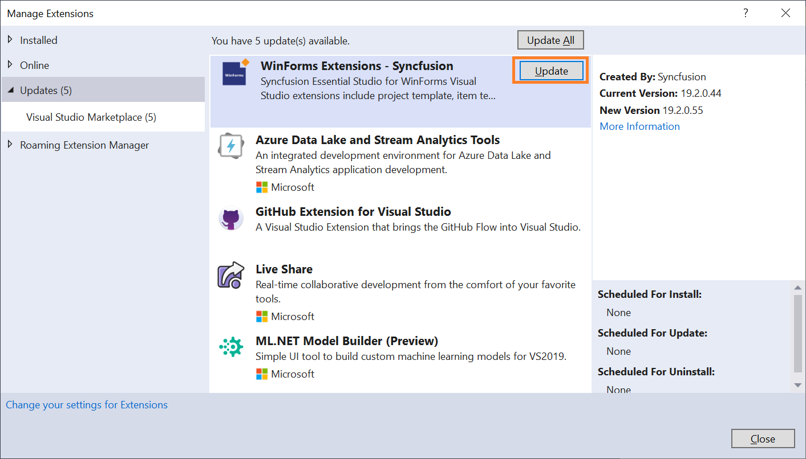
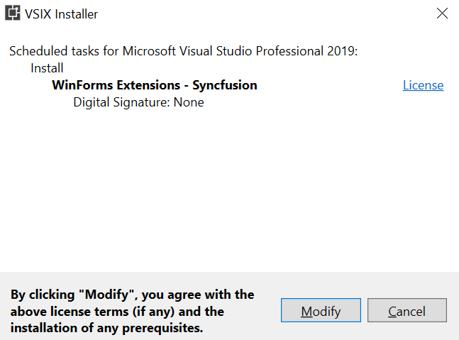

# Upgrading Syncfusion WinForms Extensions

Syncfusion releases new volumes once every three months, with exciting new features. There will be one Service Pack release for this volume releases. Service Pack releases are provided to address major bug fixes in the volume releases.

You can upgrade to our latest version from any installed Syncfusion version.

See our “Upgrade Guide” for WinForms – EJ2 to learn more about the “Breaking Changes, Bug Fixes, Features and Knows Issues” between your current version and the latest version you are trying to upgrade.

## Upgrading to the latest version

    1.  In Visual Studio go to Extensions -> Manage Extensions -> Updates and find the Syncfusion WinForms extension.

    2.  Then, click on the Update button to update the extension.

        

    3.  Now close the Visual Studio and click on the Modify button in VSIX installer dialog.

        