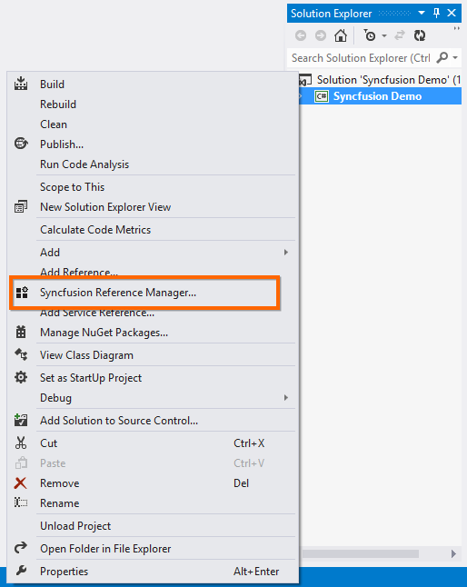
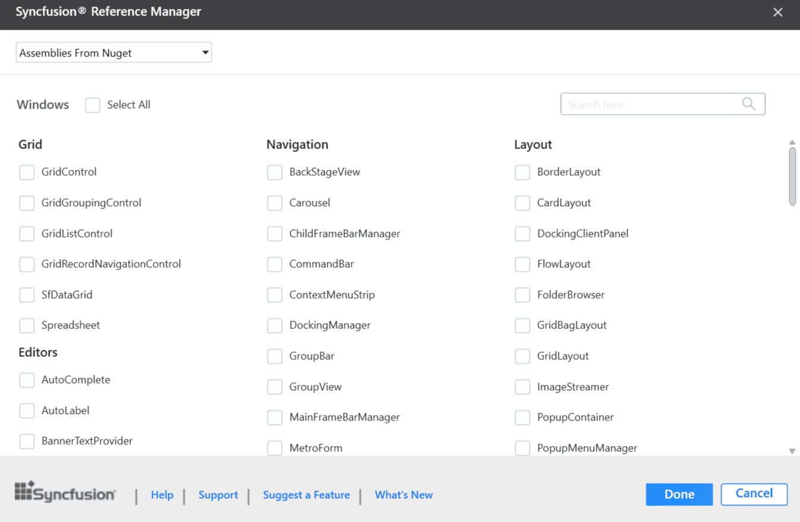
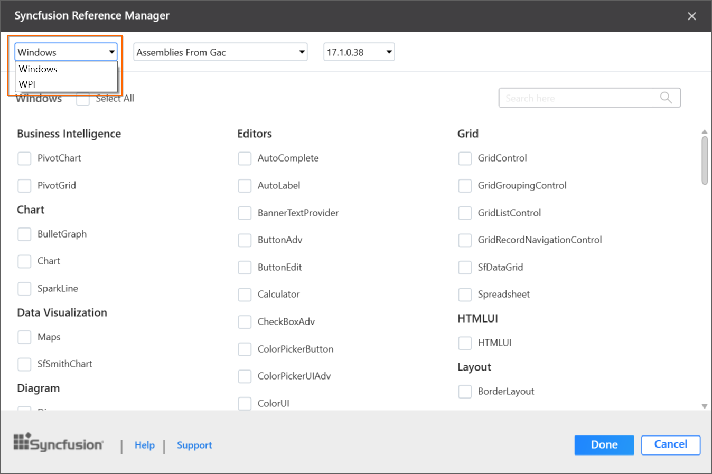
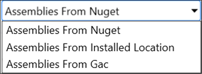
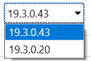
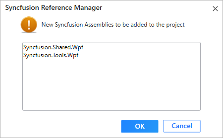

# Add Reference for WinForms

**Syncfusion® Reference Manager** is a Visual Studio add-in for the WinForms platform that helps manage Syncfusion® assembly references in your projects. It allows you to add references from either the GAC or the Essential Studio® WinForms installed location. Additionally, it can migrate projects containing older versions of Syncfusion® assemblies to newer or specific versions. The add-in supports Microsoft Visual Studio 2015 and later and has been included since the Essential Studio® 2013 Volume 3 release.

N> This Reference Manager can be applied to a project for Syncfusion® assembly versions 10.4.0.71 and later.

Follow the given steps to add the Syncfusion® references in Visual Studio:

> Before using the Syncfusion® WinForms Reference Manager, verify that the **Syncfusion WinForms** extension is installed by going to **Extensions → Manage Extensions → Installed** in Visual Studio 2019 or later, or **Tools → Extensions and Updates → Installed** in Visual Studio 2017 or lower. If this extension is not installed, install the extension by following the steps from the [download and installation](https://help.syncfusion.com/windowsforms/visual-studio-integration/download-and-installation) help topic.

1. Open a new or existing **WinForms** application.

2. To open the Syncfusion® Reference Manager, follow either of the options below:

   **Option 1:**  
   Click **Extensions -> Syncfusion Menu** and choose **Essential Studio® for WinForms -> Add References…** or any other Form in **Visual Studio**.

   

   N> In Visual Studio 2017 or lower, the Syncfusion® menu is available directly in the Visual Studio main menu.

   [Syncfusion Reference Manager via Syncfusion Menu](Syncfusion-Reference-Manger_images/Syncfusion_Menu_AddReference.png)

   **Option 2:**  
   Right-click the selected project file in **Solution Explorer**, then select **Syncfusion® Reference Manager…** from the context menu. The following screenshot shows this option in Visual Studio.

   

3. The Syncfusion Reference Manager Wizard that contains the list of Syncfusion® WinForms controls that are loaded.

   

   **Platform Selection:** If launched the Syncfusion® Reference Manager from Console/Class Library project, Platform selection option will be appeared as option in Syncfusion® Reference Manager. Choose the required platform. 

   

   **Assembly From:** Choose the assembly location, from where the assembly is added to the project.

   

   N> The GAC option will not be available, if you have selected WinForms (.NET 8.0, .NET 7.0, .NET 6.0, .NET 5.0, and .NET Core 3.1) application in Visual Studio 2019 or later.

   **Version:** Choose the build version to add the corresponding version assemblies to the project.

   

   N> Windows Forms (.NET Core 3.1 and .NET 5.0) applications in Visual Studio 2019 are supported from 18.2.0.44. .NET 6.0 applications in Visual Studio 2022 are supported from 19.4.0.38. .NET 7.0 applications in Visual Studio 2022 are supported from 20.4.0.38. .NET 8.0 applications in Visual Studio 2022 are supported from 23.2.4. The Version combobox is not visible for the NuGet option.

4. Choose the required controls that you want to include in the project. Then, click Done to add the required assemblies for the selected controls into the project. The following screenshot shows the list of required assemblies for the selected controls to be added.

   

5. Click **OK**. The listed Syncfusion assemblies are added to the project. A notification **"Syncfusion assemblies have been added successfully"** appears in the Visual Studio status bar.

   

6. Then, Syncfusion® licensing registration required message box will be shown, if you installed the trial setup or NuGet packages since Syncfusion® introduced the licensing system from 2018 Volume 2 (v16.2.0.41) Essential Studio® release. Navigate to the  [help topic](https://help.syncfusion.com/common/essential-studio/licensing/license-key#how-to-generate-syncfusion-license-key), which is shown in the licensing message box to generate and register the Syncfusion license key to your project. Refer to this [blog](https://blog.syncfusion.com/post/Whats-New-in-2018-Volume-2-Licensing-Changes-in-the-1620x-Version-of-Essential-Studio.aspx) post for understanding the licensing changes introduced in Essential Studio®.

   

N>  Syncfusion® provides Reference Manager support for specific .NET Framework versions, based on the assemblies shipped with the Syncfusion® Essential Studio® setup. If you attempt to add Syncfusion® assemblies to a project whose target framework is not supported by the selected Syncfusion® version, a dialog will appear with the following message: **“Current build v{version} does not support this framework v{Framework Version}.”**

