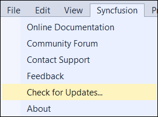
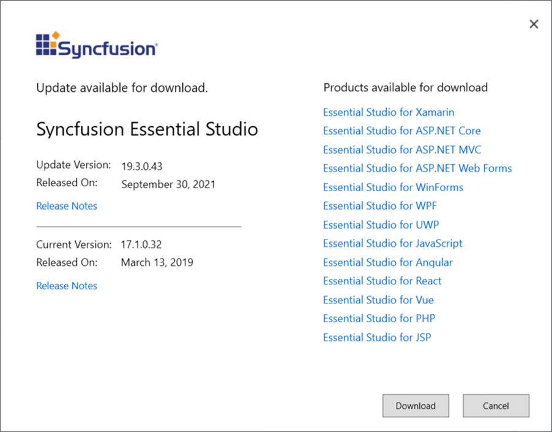

# Check for Updates in Syncfusion® Essential Windows Forms

Syncfusion® provides the Check for Updates extension to find the latest version of the Essential Studio® release. If an update is available, the extension provides the option to update to the most recent version. This ensures you always get the latest features, fixes, and improvements by installing the most recent version.

I> The Syncfusion® Check for Updates feature is available from v17.1.0.32.

You can check for available updates in Visual Studio, and then install the update version if required.

1. Choose **Extensions->Syncfusion -> Check for Updates…** in the Visual Studio menu

   

   N> In Visual Studio 2017 or lower, the Syncfusion® menu is available directly in the Visual Studio main menu.

   
   
2. The **Check for Updates** dialog opens. If no update is available, the dialog indicates that you are using the latest version. If an update is available, the dialog lists the latest version and provides the **Update** option.

   

3. You can download the latest Syncfusion Essential Studio from the Syncfusion website by selecting **Download**.
