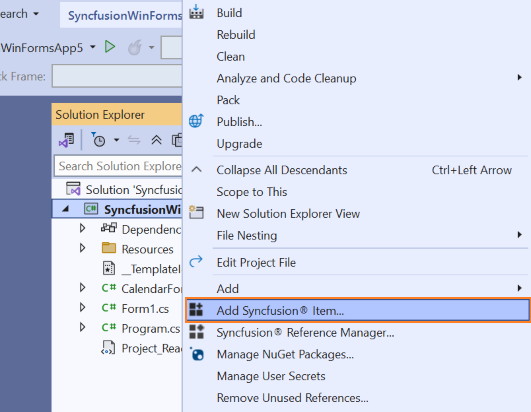
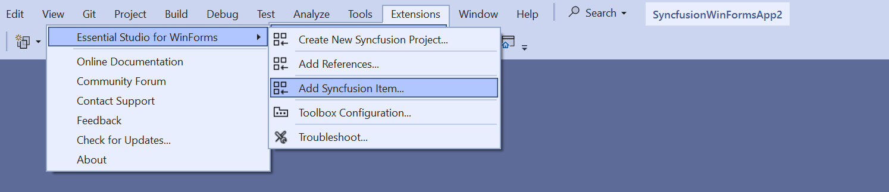
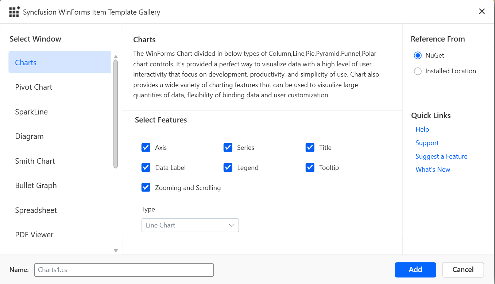
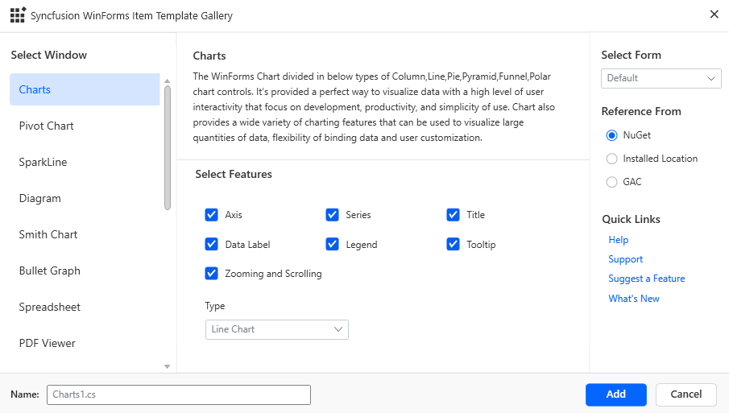
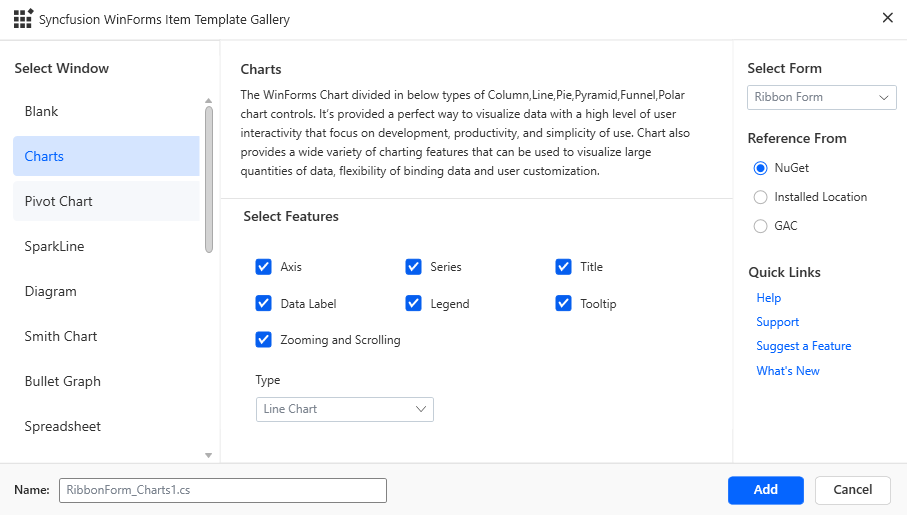
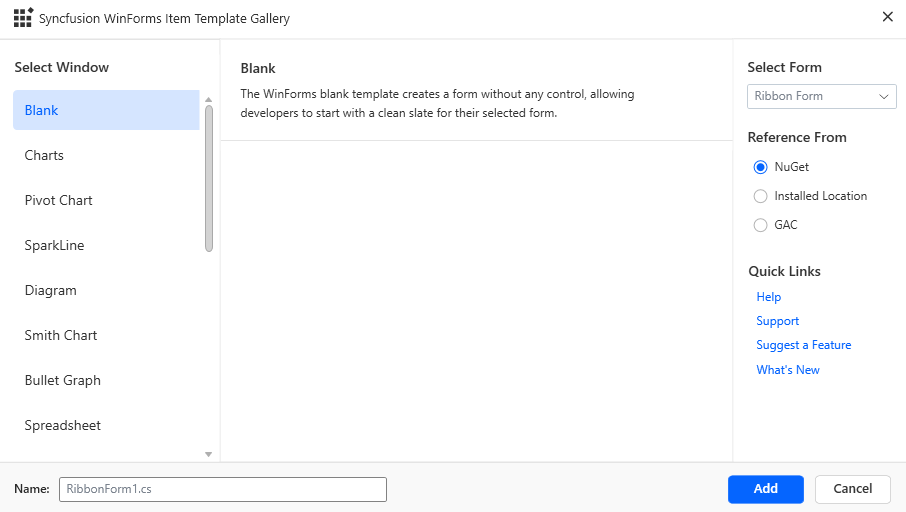
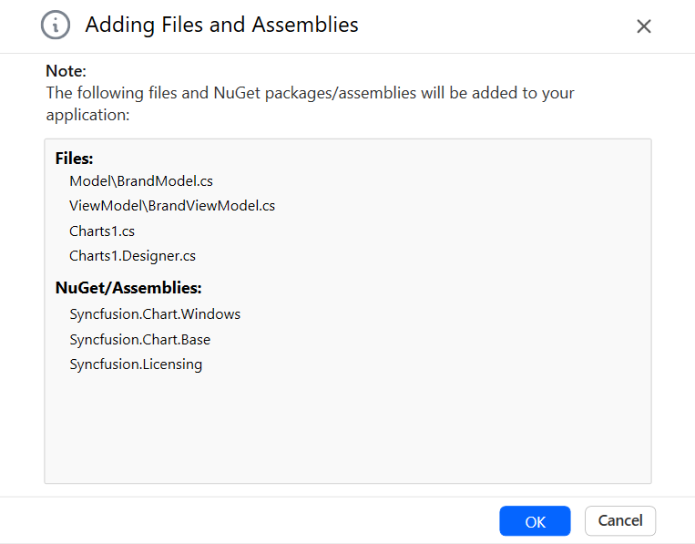
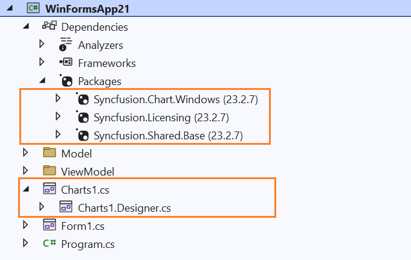
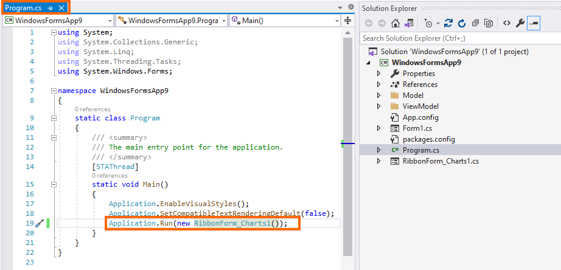
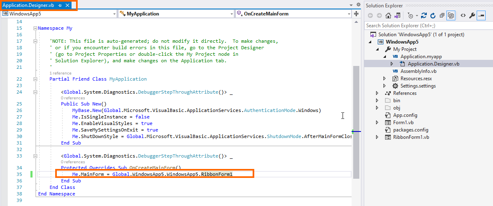

# Add Syncfusion components to the WinForms Application

Syncfusion provides robust support for Visual Studio Item Templates, which facilitate the seamless integration of Syncfusion WinForms components and preconfigured forms into your WinForms application. These templates include all necessary Syncfusion WinForms libraries, ensuring a smooth development experience.

I> The Syncfusion Windows Forms item templates are available from v13.1.0.21.

The following steps will guide you in adding the Syncfusion WinForms components to your Visual Studio WinForms application.

> Check whether the **WinForms Extensions - Syncfusion** are installed or not in Visual Studio Extension Manager by going to **Extensions -> Manage Extensions -> Installed** for Visual Studio 2019 or later and Visual Studio 2017 or lower by going to **Tools -> Extensions and Updates -> Installed**. If this extension is not installed, please install the extension by following the steps from the [download and installation](https://help.syncfusion.com/windowsforms/visual-studio-integration/download-and-installation) help topic.

## Add components using Syncfusion Item Template

1.	Open a new or existing WinForms application.

	**Option 1:**

2.	From the **Solution Explorer, right-click** on the WinForms application. Choose **Add Syncfusion Item...**.

	

	**Option 2:**

3.	Click **Extensions > Essential Studio for WinForms > Add Syncfusion Item…** in Visual Studio.

	

4.	The Syncfusion WinForms Item Template wizard will be launched as follows.

	

5.	Please choose one of the following scenarios to add Syncfusion Forms in your application:

    **Default Form with Syncfusion Component:** If you select the **Default** form and then choose any Syncfusion component and the specific features that are essential for your project, the selected component will be added with the default Microsoft form layout.

	

    **Syncfusion Form with Syncfusion Component:** If you select a Syncfusion form and then choose any Syncfusion component and the specific features that are essential for your project, the selected component will be added with the layout of the selected Syncfusion form.

	

    **Syncfusion Form without Syncfusion Components:** If you select a Syncfusion form and then choose the **Blank** option from the Syncfusion component list, a blank Syncfusion form will be added without any Syncfusion components.

	 

6.	Choose an assembly reference option such as GAC location, Essential Studio installed location, or NuGet packages to specify where the required Syncfusion assemblies 	are added to the project.

	N> If the Syncfusion Essential WindowsForm build is installed, the Installed location and GAC options will be enabled. Without installing the Syncfusion Essential WindowsForm setup, use the NuGet option. The GAC option will not be available when using the Syncfusion WinForms components in a .NET Core application. The Version drop-down lists the installed WinForms versions.

7.  Click **Add**, and a pop-up will appear providing information about adding component **files** and **NuGet/Assemblies** details.

		

8.	Click **OK** to incorporate the chosen components into the WinForms application, along with the necessary Syncfusion assemblies.

	

9.	Then, Syncfusion licensing registration required message box will be shown if you installed the trial setup or NuGet packages since Syncfusion introduced the 			licensing system from 2018 Volume 2 (v16.2.0.41) Essential Studio release. Navigate to the [help topic](https://help.syncfusion.com/common/essential-studio/licensing/overview#how-to-generate-syncfusion-license-key), which is shown in the licensing message box to generate and register the Syncfusion license key to 		your project. Refer to this [blog](https://www.syncfusion.com/blogs/post/whats-new-in-2018-volume-2.aspx) post 	 for understanding the licensing changes introduced in Essential Studio.

    

10. To run the application using the selected Syncfusion form, set the added Syncfusion Form as the startup form in your application. This ensures that when you launch the application, it opens with the selected Syncfusion Form.

	**For C#:** Open the **Program.cs** file in your project. Locate the line of code where the main form is being instantiated and set as the startup form.

	

	**For VB:**  Open the **Application.Designer.vb** file in your project. Locate the line of code where the main form is being instantiated and set as the startup form.

	