# Add Syncfusion® components to the WinForms Application

Syncfusion® offers robust support for Visual Studio Item Templates that enable seamless integration of Syncfusion® WinForms components and preconfigured forms into your WinForms application. These templates include all necessary Syncfusion® WinForms libraries, ensuring a smooth development experience.

I> The Syncfusion® Windows Forms item templates are available from v13.1.0.21.

The following steps will guide you in adding the Syncfusion® WinForms components to your Visual Studio WinForms application.

> Check whether the **Syncfusion WinForms** extension is installed in Visual Studio Extension Manager by going to **Extensions → Manage Extensions → Installed** for Visual Studio 2019 or later, and to **Tools → Extensions and Updates → Installed** for Visual Studio 2017 or lower. If this extension is not installed, install the extension by following the steps from the [download and installation](https://help.syncfusion.com/windowsforms/visual-studio-integration/download-and-installation) help topic.

N> Item Templates are available from v13.1.0.21. The Item Template wizard supports **WinForms App (.NET Framework)** and **WinForms App (.NET)** project types.

## Add components using Syncfusion® Item Template

1.	Open a new or existing **WinForms** project. Then choose one of the following options to open the wizard:

    - **Option 1:** In **Solution Explorer**, right-click the WinForms project and choose **Add Syncfusion Item...**.

        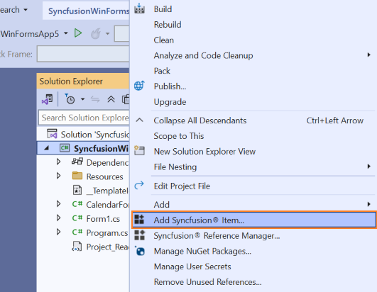

    - **Option 2:** Click **Extensions → Essential Studio® for WinForms → Add Syncfusion Item…** in Visual Studio.

        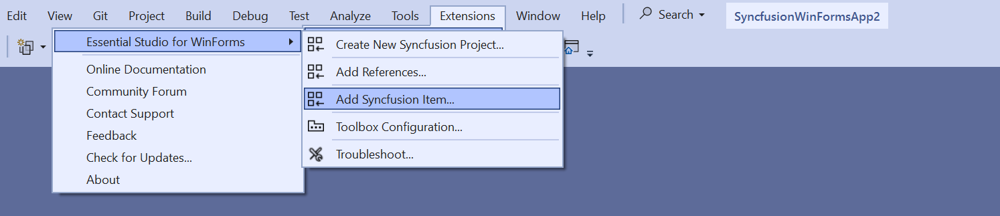

2.	The Syncfusion® WinForms Item Template wizard opens as shown below.

	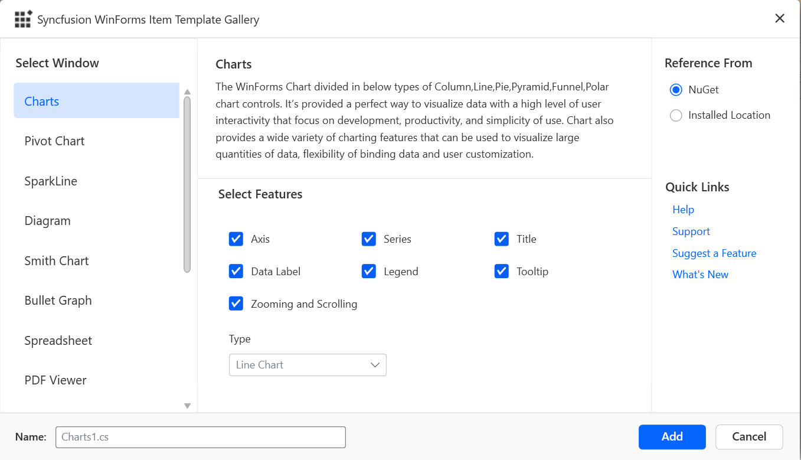

3.	Choose one of the following scenarios to add a Syncfusion® form in your application:

    | Scenario | When to use |
    |----------|-------------|
    | Default Form with Syncfusion® Component | Use the default Microsoft WinForms layout, but add a Syncfusion® control. |
    | Syncfusion® Form with Syncfusion® Component | Use a Syncfusion® form (e.g., MetroForm, RibbonForm) and add a Syncfusion® control. |
    | Syncfusion® Form without Syncfusion® Component | Add a blank Syncfusion® form without any components. |

    **Default Form with Syncfusion® Component:** If you select the **Default** form and then choose any Syncfusion® component and the specific features that are essential for your project, the selected component is added with the default Microsoft WinForms layout.

	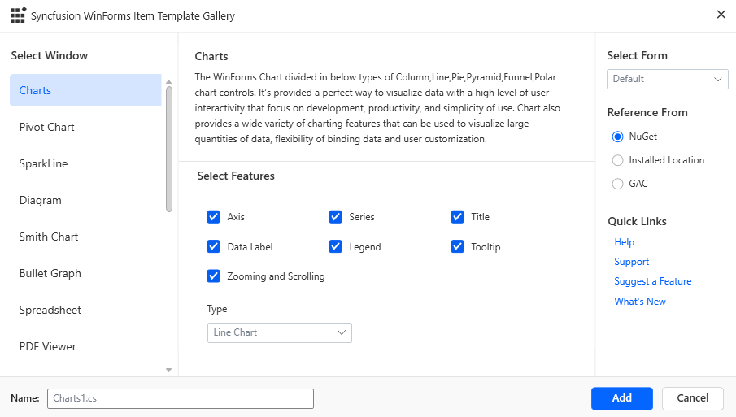

    **Syncfusion® Form with Syncfusion® Component:** If you select a Syncfusion® form and then choose any Syncfusion® component and the specific features that are essential for your project, the selected component is added with the layout of the selected Syncfusion® form. Available Syncfusion® forms include MetroForm, RibbonForm, Office2007Form, Office2010Form, TabbedForm, and XPMainForm.

	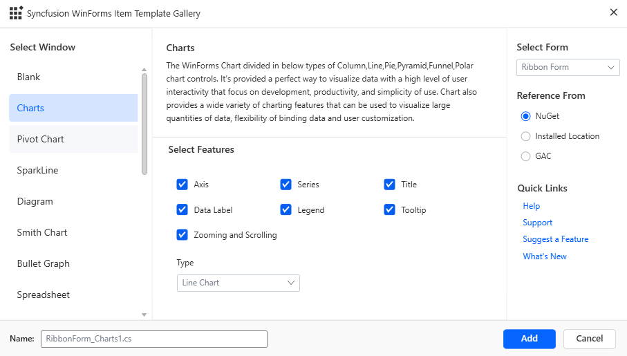

    **Syncfusion® Form without Syncfusion® Components:** If you select a Syncfusion® form and then choose **Blank** from the Syncfusion® component list, a blank Syncfusion® form is added without any Syncfusion® components.

	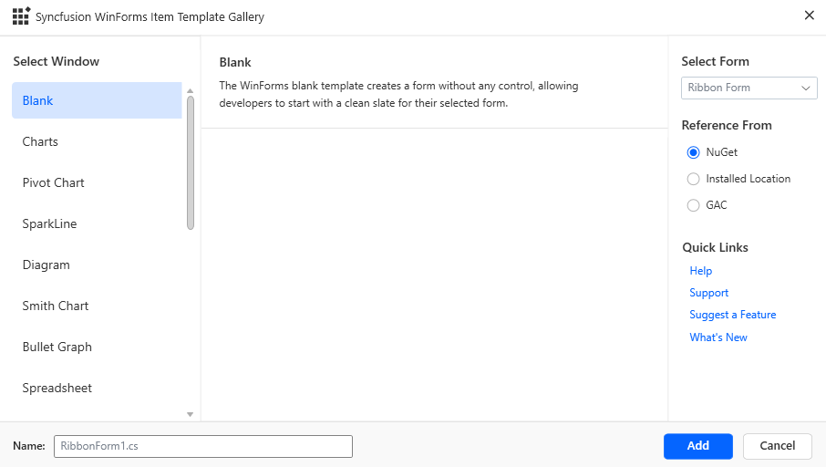 

6.	Choose an assembly reference option such as GAC location, Essential Studio® installed location, or NuGet packages to specify where the required Syncfusion® assemblies 	are added to the project.

	N> If the Syncfusion®® Essential WindowsForm build is installed, the Installed location and GAC options will be enabled. Without installing the Syncfusion Essential WindowsForm setup, use the NuGet option. The GAC option will not be available when using the Syncfusion® WinForms components in a .NET Core application. The Version drop-down lists the installed WinForms versions.

7.  Click **Add**, and a pop-up will appear providing information about adding component **files** and **NuGet/Assemblies** details.

	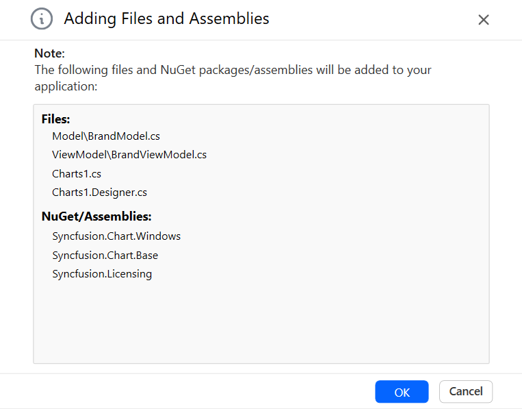	

8.	Click **OK** to incorporate the chosen components into the WinForms application, along with the necessary Syncfusion® assemblies.

	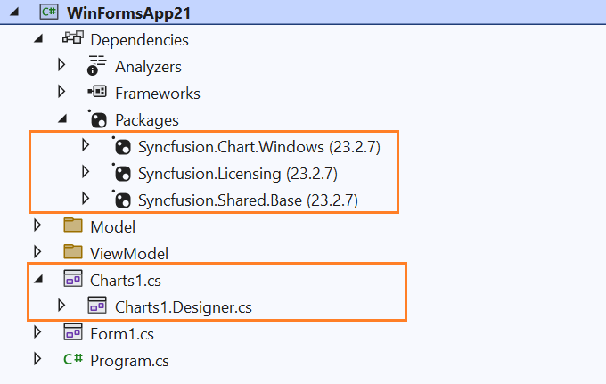

9.	Then, Syncfusion® licensing registration required message box will be shown if you installed the trial setup or NuGet packages since Syncfusion® introduced the 			licensing system from 2018 Volume 2 (v16.2.0.41) Essential Studio® release. Navigate to the [help topic](https://help.syncfusion.com/common/essential-studio/licensing/overview#how-to-generate-syncfusion-license-key), which is shown in the licensing message box to generate and register the Syncfusion® license key to 		your project. Refer to this [blog](https://www.syncfusion.com/blogs/post/whats-new-in-2018-volume-2.aspx) post 	 for understanding the licensing changes introduced in Essential Studio®.

    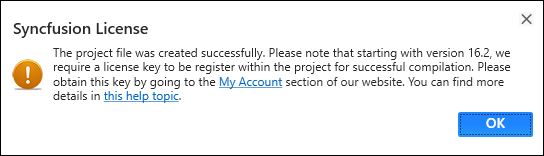

10. To run the application using the selected Syncfusion® form, set the added Syncfusion® Form as the startup form in your application. This ensures that when you launch the application, it opens with the selected Syncfusion® Form.

	**For C#:** Open the **Program.cs** file in your project. Locate the line of code where the main form is being instantiated and set as the startup form.

	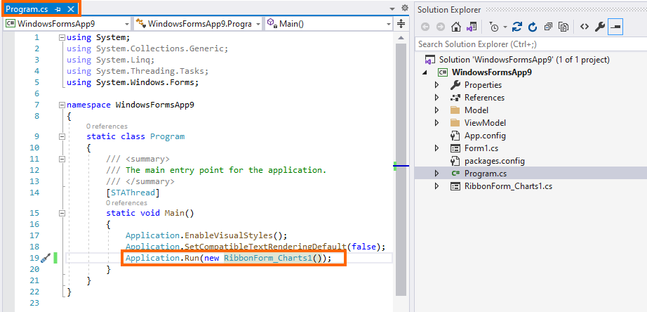

	**For VB:**  Open the **Application.Designer.vb** file in your project. Locate the line of code where the main form is being instantiated and set as the startup form.

	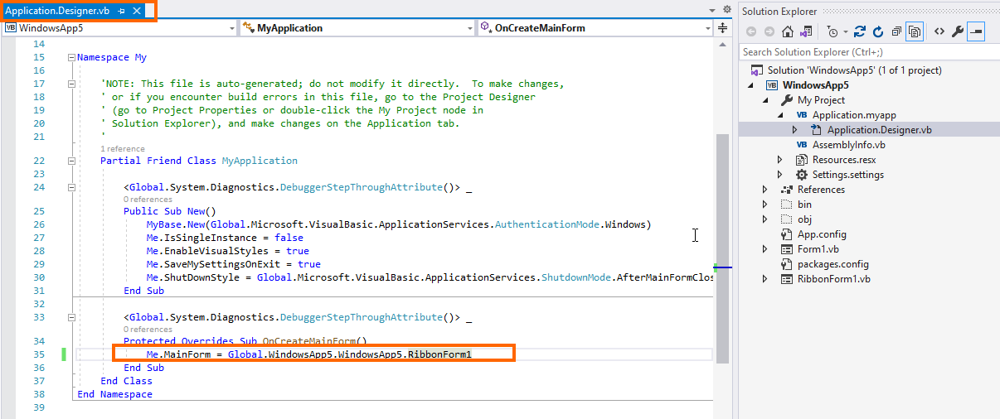