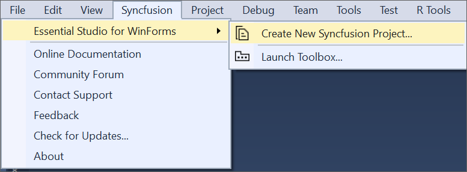
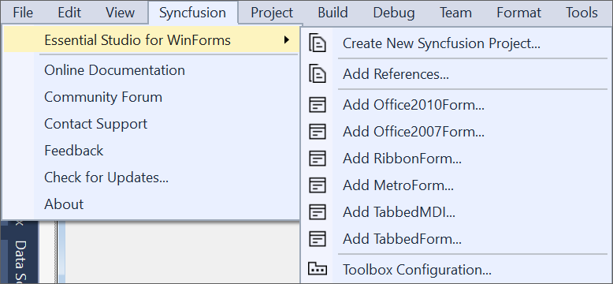
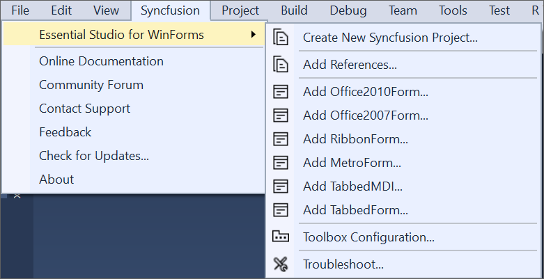

# Syncfusion® Windows Forms Extensions

The Syncfusion® WinForms Visual Studio Extensions can be accessed through the Syncfusion® Menu to create and configure the project with Syncfusion® references in Visual Studio. The Syncfusion® WinForms Extensions supports Microsoft Visual Studio 2015 or higher.

N> Syncfusion® Extension is published in the Visual Studio Marketplace. We provide separate Syncfusion® WinForms Extension support for Visual Studio 2022 and Visual Studio 2019 or lower. Please refer to the marketplace links below. Kindly install this extension by following the steps from the [download and installation](https://help.syncfusion.com/windowsforms/visual-studio-integration/vs2019-extensions/download-and-installation) help topic.

[Visual Studio 2022](https://marketplace.visualstudio.com/items?itemName=SyncfusionInc.WindowsVSExtensions)

[Visual Studio 2019 or lower](https://marketplace.visualstudio.com/items?itemName=SyncfusionInc.Windows-Extensions). 

I> The Syncfusion® WinForms menu option is available from v17.1.0.32.

Syncfusion® provides the following support in Visual Studio:

1.	[Create Project](https://help.syncfusion.com/windowsforms/Visual-Studio-Integration/Create-Project): Creates the Syncfusion® WinForms application by adding the required Syncfusion® assemblies and forms.
2.	[Item Template](https://help.syncfusion.com/windowsforms/Visual-Studio-Integration/Item-Template): Adds predefined Syncfusion® items (Forms) and the required Syncfusion® assemblies to the WinForms application.
3.	[Add References](https://help.syncfusion.com/windowsforms/Visual-Studio-Integration/Add-References): Adds the required Syncfusion® assembly to the Windows project reference based on the selected control(s).
4.	[Toolbox](https://help.syncfusion.com/windowsforms/visual-studio-integration/toolbox-configuration): Configures the Syncfusion® controls in the Visual Studio .NET toolbox.
5.	[Troubleshooting](https://help.syncfusion.com/windowsforms/Visual-Studio-Integration/Troubleshooting): Troubleshoots the project with the Syncfusion® configuration and applies fixes such as a wrong Framework Syncfusion® assembly added to the project, or a missing Syncfusion® dependent assembly of a referred assembly.

**No project selected in Visual Studio**

**Selected Microsoft WinForms application in Visual Studio**

**Selected Syncfusion® WinForms application in Visual Studio**

N> In Visual Studio 2017 or lower, you can see the Syncfusion menu directly in the Visual Studio menu.

