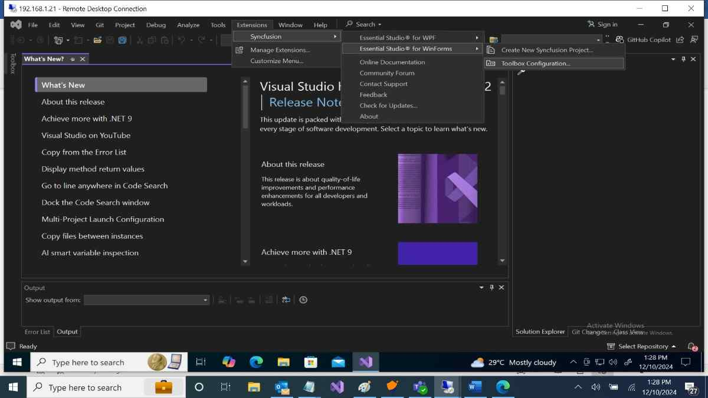

# Syncfusion Windows Forms Extensions

The Syncfusion WinForms Visual Studio Extensions can be accessed through the Syncfusion Menu to create and configure the project with Syncfusion references in Visual Studio. The Syncfusion WinForms Extensions supports Microsoft Visual Studio 2013 or higher.

N> Syncfusion Extension is published in Visual Studio Marketplace. We provided separate Syncfusion WPF Extension support for Visual Studio 2022 and Visual Studio 2019 or lower. Please refer below marketplace link. Kindly install this extension by follow the steps from the [download and installation](https://help.syncfusion.com/windowsforms/visual-studio-integration/visual-studio-extensions/vs2019-extensions/download-and-installation/) help topic.

[Visual Studio 2022](https://marketplace.visualstudio.com/items?itemName=SyncfusionInc.WindowsVSExtensions)

[Visual Studio 2019 or lower](https://marketplace.visualstudio.com/items?itemName=SyncfusionInc.Windows-Extensions). 

I> The Syncfusion WinForms menu option is available from v17.1.0.32.

The Syncfusion provides the following supports in Visual Studio:

1.	[Create Project](https://help.syncfusion.com/windowsforms/Visual-Studio-Integration/Visual-Studio-Extensions/Create-Project): Creates the Syncfusion WinForms application by adding the required Syncfusion assemblies and forms.
2.	[Item Template](https://help.syncfusion.com/windowsforms/Visual-Studio-Integration/Visual-Studio-Extensions/Item-Template): Add predefined Syncfusion items (Forms) and the required Syncfusion assemblies in WinForms Application.
3.	[Add References](https://help.syncfusion.com/windowsforms/Visual-Studio-Integration/Visual-Studio-Extensions/Add-References): Add the required Syncfusion assembly to Windows project reference based on the selected control(s).
4.	[Toolbox](https://help.syncfusion.com/windowsforms/visual-studio-integration/toolbox-configuration): Configure the Syncfusion controls into the Visual Studio .NET toolbox.
5.	[Troubleshooting](https://help.syncfusion.com/windowsforms/Visual-Studio-Integration/Visual-Studio-Extensions/Troubleshooting): Troubleshoots the project with the Syncfusion configuration and apply the fix like, wrong Framework Syncfusion assembly added to the project or missing any Syncfusion dependent assembly of a referred assembly.

**No project selected in Visual Studio**

**Selected Microsoft WinForms application in Visual Studio**

**Selected Syncfusion WinForms application in Visual Studio**

N> In Visual Studio 2017 or lower, you can see the Syncfusion menu directly in the Visual Studio menu.

