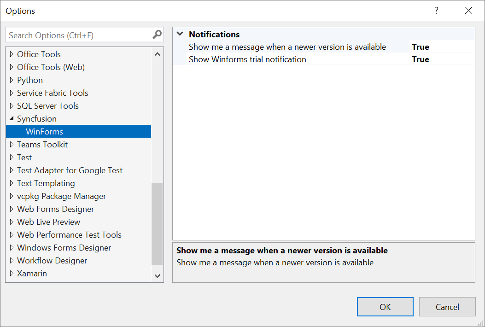
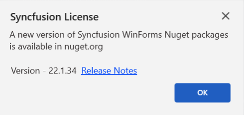
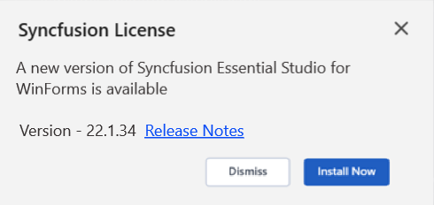
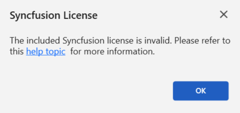

# Syncfusion® Notifications

Syncfusion® enhances the user experience in Windows Forms applications through informative notification messages. These notifications include alerts for trial applications using Syncfusion® trial assemblies, updates on the availability of the latest Syncfusion® NuGet packages, and announcements of new Essential Studio® releases. By keeping developers informed, Syncfusion® ensures they stay up to date with the latest features and enhancements.

N> The Syncfusion® Notification feature is available from Essential Studio® v22.1.34.

## Notification Configuration

The Syncfusion® Options page allows you to configure notification settings. Customise trial and newer version notifications with a simple true or false toggle.

It can be accessed by clicking **Tools -> Options -> Syncfusion -> Winforms**

## Notification Types

**1. Syncfusion Trial Application Notification**

When you utilize Syncfusion® trial assemblies in your Windows Forms application, you will receive a notification stating, **This application uses a trial Syncfusion license.** This notification encourages you to obtain a valid license key, enabling you to fully explore and experience the extensive features and capabilities offered by Syncfusion®.

**2. Newer Syncfusion® NuGet Package Notification**

If you have installed lower versions of Syncfusion® NuGet packages in your application, you will be notified about the availability of higher versions of Syncfusion® NuGet packages on nuget.org. This empowers you to easily identify opportunities to upgrade and gain access to new features, performance enhancements, and bug fixes.

**3. Newer Essential Studio® Build Notification**

If you use older versions of Syncfusion® assemblies or NuGet packages from **Essential Studio® Windows**, Syncfusion® will notify you about new releases of the latest Essential Studio® build. Updating to the latest version ensures access to new features, enhancements, and critical updates—maximizing the capabilities of Syncfusion® in your Windows Forms development projects.

**4. Invalid License Key Notification**

If you mistakenly use an incorrect license key or a key from another version or platform in your Windows Forms application, Syncfusion® will display a notification stating: **The provided Syncfusion license key is invalid.** This message serves as a reminder to obtain a valid license key and ensure proper licensing for Syncfusion® components.

  

