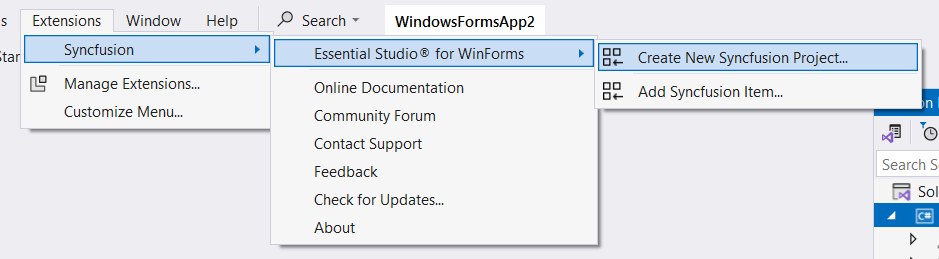
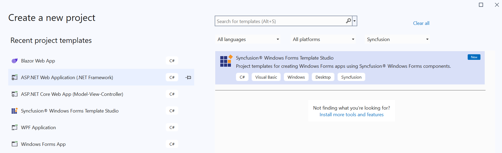
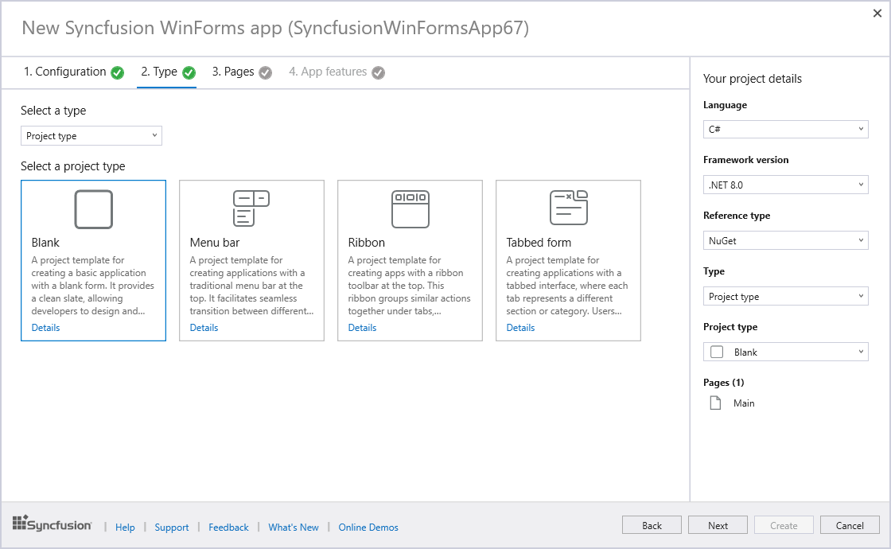
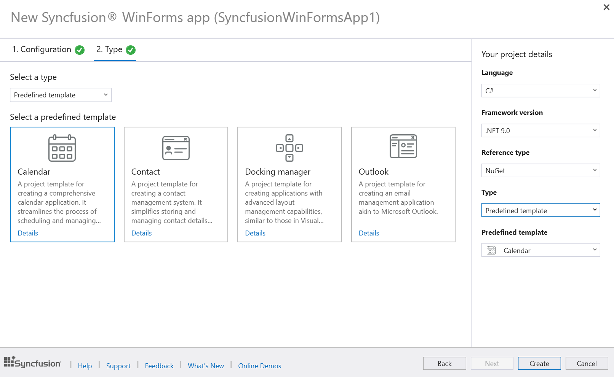
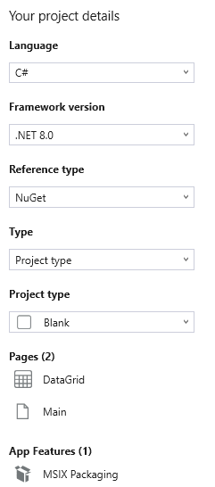

# Syncfusion WinForms Template Studio

The WinForms Template Studio by Syncfusion® is a specialized tool for constructing applications with their WinForms components. This studio simplifies development by incorporating crucial Syncfusion® components, handling required NuGet references, offering preset namespaces, and creating component render code. Acting as a wizard, it facilitates the creation of WinForms applications using Syncfusion® components, streamlining the process for developers.

I> The Syncfusion® WinForms Template Studio is available from v24.1.41.

N> WinForms Template Studio is compatible with Visual Studio 2022, Visual Studio 2019, and Visual Studio 2017. For the Visual Studio 2015 or lower versions, it is recommended to use a [WinForms project template](https://help.syncfusion.com/windowsforms/visual-studio-integration/create-project).

Create the Syncfusion® WinForms project using the Visual Studio Project Template by following the provided steps.

> Check whether the **WinForms Extensions - Syncfusion** are installed or not in Visual Studio Extension Manager by going to **Extensions -> Manage Extensions -> Installed** for Visual Studio 2019 or later, and for Visual Studio 2017 by going to **Tools -> Extensions and Updates -> Installed**. If this extension is not installed, please install the extension by following the steps from the [download and installation](https://help.syncfusion.com/windowsforms/visual-studio-integration/download-and-installation) help topic.

1.	Open the Visual Studio 2022.

2.	Select one of the following options to create the Syncfusion® WinForms application

	**Option 1:**  
	Choose **Extension -> Syncfusion -> Essential Studio® for WinForms -> Create New Syncfusion Project…** from the Visual Studio menu.
    
	

	N> In Visual Studio 2017, you can see the Syncfusion menu directly in the Visual Studio menu.

	**Option 2:**   
	Choose **File -> New -> Project** from the menu. This launches a new dialogue for creating a new application. Filtering the application type by Syncfusion or typing Syncfusion as a keyword in the search option can help you find the Syncfusion® templates for WinForms.

	

3.	Select the **Syncfusion WinForms Template Studio** and click Next.

	

4.	When you launch the **Syncfusion WinForms Template Studio**, you will encounter a configuration wizard that allows you to set up your Syncfusion® WinForms application. Within this wizard, you will have the option to specify your preferred .NET Core Version or .NET Framework Version, select the desired language(CSharp or Visual Basic), and choose the reference type according to your requirements.

	

	N> The installed location and GAC options will be available only after the Syncfusion® Essential WinForms setup has been installed. Use the NuGet option instead of installing the Syncfusion® Essential WinForms setup. Also, the GAC option will not be available when you choose .NET 6.0, .NET 7.0, .NET 8.0 and .NET 9.0 from the project type option in Visual Studio.

	I> Visual Basic Language support is available in WinForms Template Studio starting from version 25.1.35.

5.  Navigate to the **Type** tab and choose the Syncfusion® WinForms application type you want. When selecting the type of template for your application, you have two options:

	

	**Predefined template:** Choose this option to select from 5 predefined templates, including Calendar, Contact, Outlook, Docking Manager, and Spreadsheet. By choosing one of these templates, you can create your application without needing to follow any further steps.

	

	**Project type:** Choose this option to select from 4 project types, including Blank, Menu Bar, Ribbon, and Tabbed Form.

6. Click **Next** or navigate to the **Pages** tab to access a list of available Syncfusion® WinForms components you can add to the application.

	

	To unselect the added control(s), Click ‘x’ for the corresponding control in the control list from the Project Details.

		N> The Control Features option is not accessible for Blank Pages.

7. Click **Next** or navigate to the **Control Features** tab to view the listed features for the selected controls. From here, choose the features needed.

	

8. Click **Next** or navigate the **App Features** tab to select the desired application features.

	

    N> The App Features option is not accessible for .NET Framework.	

	**Project Details Section**

	In the **Project Details** section, modify configurations and project types. Additionally, you can remove one or more controls from the selected list and remove the chosen application feature.

     

9.	Click **Create** to generate the Syncfusion® WinForms application. Once you've created the project, the relevant Syncfusion® NuGet packages will be automatically added to your project for the chosen components. For example, if you add an **DataGrid** control, the corresponding Syncfusion® NuGet packages required for that control will be installed.

	

    

	To find out which NuGet packages are needed for other WinForms controls, please refer to this [documentation link](https://help.syncfusion.com/windowsforms/control-dependencies) for detailed information on the required packages for each control.

10. When you create a WinForms project, the following Dependency Injection (DI) setup is added to the **Program.cs** file. This setup registers services, view models, and views with the DI container, ensuring proper functionality and service management within your application. Below **ConfigureServices** method in program.cs file establishes the DI setup in a WinForms project. It manages the application's services, view models, and views. Here's a detailed breakdown:
      
     *I. Application Host:*
     - Registers **ApplicationHostService** to manage the app's lifecycle.

     *II. Specific Services:*
     - Registers **PageService** and **NavigationService** for handling page navigation.

    *III. Views and ViewModels:*
    - **ShellWindow:** Registers the main application window.
    - **DataGridPage:** Registers the added component DataGrid on UI.
    - **MainPage:** Registers the main page of the application.

    *IV. Configuration:*
    - Binds the app's configuration settings to the **AppConfig** class using the settings from the configuration file.

	

11. In a WinForms MVVM application, the **PageService.cs** class is responsible for managing navigation and page creation. It registers view models with their corresponding pages, allowing for seamless navigation within the application.
Here's a simple explanation:
    
     *I. Initialization:*
     - The constructor of PageService takes an IServiceProvider to access the registered services. This allows the service to resolve and instantiate the required view models and views.

     *II. Registering Pages:*
     - **Configure `<DataGridPage>()`:** Registers DataGridPage with the service provider.
     - **Configure `<MainPage>()`:** Registers MainPage with the service provider.

	

12. Some components require additional resource files, such as pdf and other necessary files, to function correctly. For example, if you add the **PDFViewer** and **Diagram** components to your WinForms project, the respective PDF and ico files will be added to the Resources folder in your project.

       
 

	> The .NET 6.0, .NET 7.0, .NET 8.0 and .NET 9.0 options will be available in the Select a framework version dropdown only if the respective .NET SDKs are installed on your system. The table below outlines the .NET versions, the specific product versions from which they are available, and the Visual Studio versions that support them:
	> <table>
	>   <thead>
	>     <tr>
	>       <th>.NET Version</th>
	>       <th>Available From Version</th>
	>       <th>Supported from Visual Studio</th>
	>     </tr>
	>   </thead>
	>   <tbody>
	>     <tr>
	>       <td>.NET 6.0</td>
	>       <td>v19.4.0.38</td>
	>       <td>Visual Studio 2022</td>
	>     </tr>
	>     <tr>
	>       <td>.NET 7.0</td>
	>       <td>v20.4.0.38</td>
	>       <td>Visual Studio 2022</td>
	>     </tr>
	>     <tr>
	>       <td>.NET 8.0</td>
	>       <td>v23.2.4</td>
	>       <td>Visual Studio 2022</td>
	>     </tr>
	>     <tr>
	>       <td>.NET 9.0</td>
	>       <td>v27.2.2</td>
	>       <td>Visual Studio 2022</td>
	>     </tr>
	>   </tbody>
	> </table>

13.	If you install the trial setup or NuGet packages from nuget.org, you must register the Syncfusion® license key to your application since Syncfusion® introduced the licensing system from the 2018 Volume 2 (v16.2.0.41) Essential Studio® release. Navigate to the [help topic](https://help.syncfusion.com/common/essential-studio/licensing/overview#how-to-generate-syncfusion-license-key) to generate and register the Syncfusion® license key to your application. Refer to this [blog](https://www.syncfusion.com/blogs/post/whats-new-in-2018-volume-2.aspx) post for understanding the licensing changes introduced in 	Essential Studio®.

	   