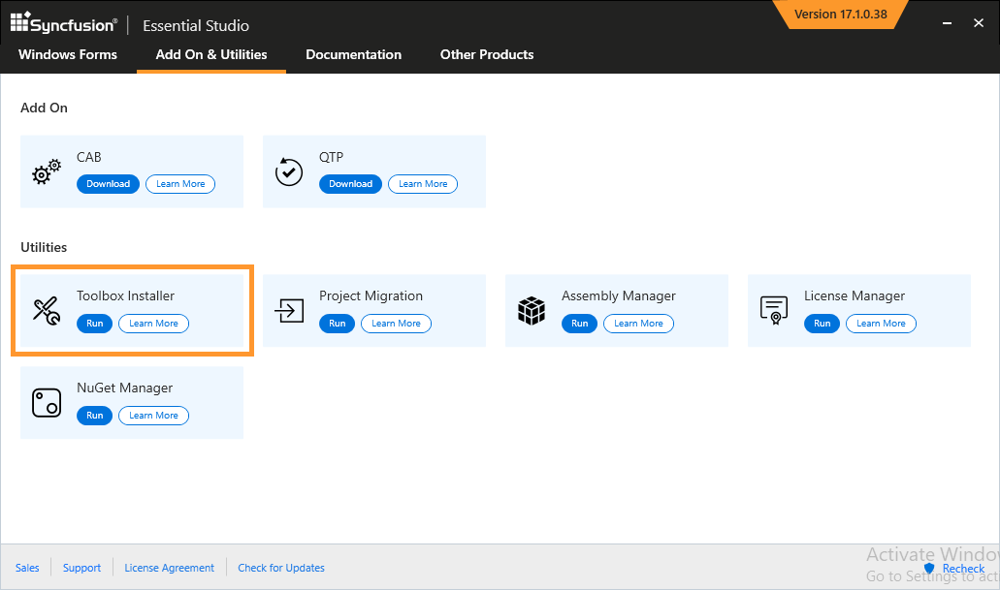
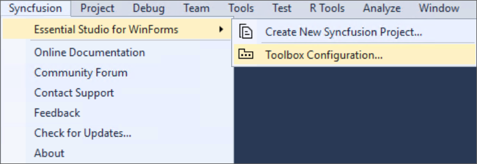
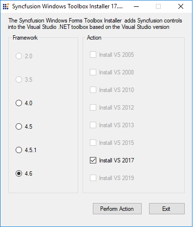

# Toolbox Configuration

The Syncfusion® Toolbox utility adds the Syncfusion® WinForms controls into the Visual Studio .NET toolbox.

N> Visual Studio Express Edition does not support toolbox configuration. However, you can manually configure the Syncfusion® controls into the Visual Studio Express Toolbox. To do so, refer the [Manual Toolbox Configuration](https://help.syncfusion.com/common/faq/how-to-configure-the-toolbox-of-visual-studio-manually).

Syncfusion® controls will be automatically configured in the Visual Studio toolbox, while installing the Syncfusion® Windows Forms installer, if the <b>“Configure Syncfusion® Controls in Visual Studio”</b> checkbox is selected from installer UI.

Use the following steps to add the Syncfusion® WinForms controls through the Syncfusion® Toolbox Installer:

1. To launch Toolbox configuration utility, follow either one of the options below:

   **Option 1:**   
   To open the Syncfusion Control Panel, click **Add On and Utilities > Toolbox Installer**.
   
   
   
   **Option 2:**  
   Click **Syncfusion menu** and choose **Essential Studio® for WinForms > Toolbox Configuration...** in **Visual Studio**.

   

   N> From Visual Studio 2019, Syncfusion menu is available under Extensions in Visual Studio menu.

2. Toolbox Installer will be opened.

   

   The following options are available in Toolbox Configuration:

   * Install VS2015 – Configures Framework 4.6.2 Syncfusion controls in VS 2015 toolbox.
   * Install VS2017 – Configures Framework 4.6.2 Syncfusion controls in VS 2017 toolbox.
   * Install VS2019 – Configures Framework 4.6.2 Syncfusion controls in VS 2019 toolbox.
   * Install VS2022 – Configures Framework 4.6.2 Syncfusion controls in VS 2022 toolbox.

    N> You can also configure Syncfusion® controls from a lower version Framework assembly to higher version of Visual Studio.
   
3. The successful configuration of Toolbox is indicated by an Information message. Click **OK**.

   
   
   
   N> * If your installed controls are not reflected properly in the Visual Studio Toolbox, you'll have to reset the Toolbox. 
   * This tool configures only the controls that are located under {Installed Location}\Assemblies\{Framework version}.
   
## Configuring toolbox for .NET Framework in Visual Studio 2022   

From 2021 Volume 3, Syncfusion® started providing toolbox support for .NET Framework in Visual Studio 2022 Toolbox. After installing the Syncfusion® Windows Forms installer, Syncfusion® controls will be automatically configured in the Visual Studio 2022 toolbox for Windows Forms .NET Framework projects.

## Configuring toolbox for Windows Forms .NET 8.0\9.0 projects from NuGet packages

From 2021 Volume 3, Syncfusion® started providing toolbox support for Windows Forms .NET 8.0\9.0 projects. Please install the respective Syncfusion® WinForms NuGet packages in .NET 8.0\9.0 project to get the Syncfusion® WinForms controls in the .NET 8.0\9.0 Toolbox. After installing the NuGet packages, our WinForms controls will be populated in the Visual Studio toolbox for .NET 8.0\9.0 WinForms project.

Refer [this](https://help.syncfusion.com/windowsforms/add-syncfusion-controls) documentation link to find Syncfusion® WinForms nuget packages for the appropriate controls.
