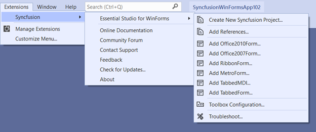
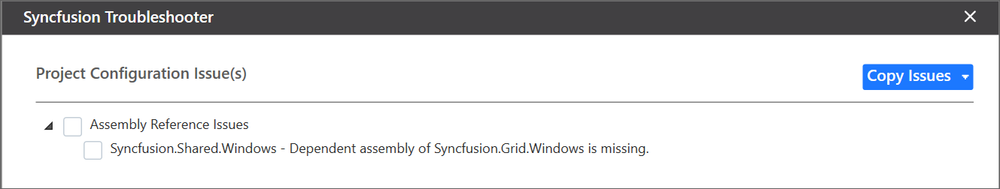
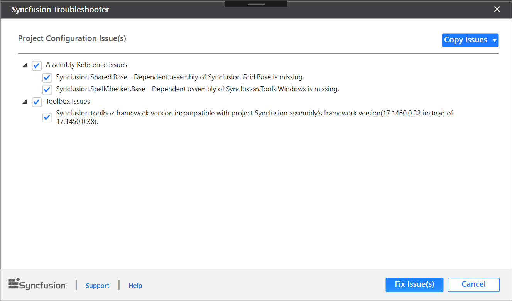

# Troubleshoot the project

Troubleshoot the project with the Syncfusion configuration and apply the fix, such as adding a Syncfusion assembly to the project with the wrong .NET Framework version or missing any Syncfusion dependent assembly of a referred assembly. The Syncfusion Troubleshooter is capable of performing the following tasks:

* Report the Configuration issues.  
* Apply the solution.

## Report the Configuration issues

The following steps help you to utilize the Syncfusion Troubleshooter by Visual Studio. 

> Before use the Syncfusion Troubleshooter for WinForms, check whether the **WinForms Extensions - Syncfusion** installed or not in Visual Studio Extension Manager by clicking on the **Extensions -> Manage Extensions -> Installed** for Visual Studio 2019 or later, and for Visual Studio 2017 or lower by going to **Tools -> Extensions and Updates -> Installed**.If this extension not installed, please install the extension by follow the steps from the [download and installation](https://help.syncfusion.com/windowsforms/visual-studio-integration/download-and-installation) help topic.

1. To open Syncfusion Troubleshooter Wizard, follow either one of the options below: 
   
   **Option 1:**  
   Open an existing Syncfusion WinForms Application, Click **Extensions-> Syncfusion Menu** and choose **Essential Studio for WinForms > Troubleshoot…** in Visual Studio.

   

   N> In Visual Studio 2017 or lower, click Syncfusion Menu and choose Essential Studio for WinForms > Troubleshoot…. 

   

   **Option 2:**  
   Right-click the Project file in Solution Explorer, then select the command Syncfusion Troubleshooter…

   

2. Analyze the project now, and if any Syncfusion controls project configuration errors are discovered, they will be reported in the Troubleshooter dialog.  If there are no configuration issues with the project, the dialog box will indicate that no modifications are required in the following areas:

* Syncfusion assembly references.
* Syncfusion NuGet Packages. 
* Syncfusion Toolbox Configuration.

   

I> The Syncfusion Troubleshooter command will be visible only for Syncfusion projects that means Syncfusion assemblies or Syncfusion NuGet packages should be referred in to the project and project should be .NET Framework project.

The Syncfusion Troubleshooter handles the following project configuration issues: 

1. Assembly Reference Issues.

2. NuGet related Issues.

3. Toolbox Configuration Issues.

### Assembly Reference Issues

The Syncfusion Troubleshooter deals with the following assembly reference issues in Syncfusion Projects. 

1. Dependent assemblies are missing for referred assemblies from project. 

   **For Instance:**  If “Syncfusion.Grid.Windows” assembly referred in project and “Syncfusion.Shared.Windows” (dependent of Syncfusion.Grid.Windows) not referred in project, the Syncfusion Troubleshooter will show dependent assembly missing.

   

2. Syncfusion assembly version mismatched. Compare to all Syncfusion assembly’s versions in the same project. If found any Syncfusion assembly version inconsistency, the Syncfusion Troubleshooter will show Syncfusion assemblies version mismatched. 

   **For Instance:**  If “Syncfusion.Tools.Windows” assembly (v15.2450.0.40) referred in project, but other Syncfusion assemblies referred assembly version is v15.2450.0.43. Syncfusion Troubleshooter will be shown Syncfusion assembly version mismatched.

   

3. Framework version mismatching (Syncfusion Assemblies) with project’s .NET Framework version. Find the supported .NET Framework details for Syncfusion assemblies in the following link,

   <https://help.syncfusion.com/common/essential-studio/assembly-information#supported-framework-version-for-essential-studio-assemblies> 

   **For Instance:** The.NET Framework of the application is v4.5 and “Syncfusion.Tools.Windows” assembly (v17.1460.0.38 & .NET Framework version 4.6) referred in same application. The Syncfusion Troubleshooter will show Syncfusion assembly .NET Framework version is incompatible with project’s .NET Framework version.

   

   

### NuGet Issues

The Syncfusion Troubleshooter deals with the following NuGet package related issues in Syncfusion projects. 

1. Multiple versions of Syncfusion NuGet Packages are installed. If Syncfusion NuGet Package version is differ from other Syncfusion NuGet Package version, the Syncfusion Troubleshooter will show Syncfusion NuGet package version is mismatched. 

   **For Instance:** Syncfusion WinForms platform packages installed multiple version (v16.4.0.54 & v17.1.0.38), Syncfusion Troubleshooter will be shown Syncfusion package version mismatched.
 
   

2. Installed Syncfusion NuGet package’s Framework version is differing from the project’s .NET Framework version.

   **For Instance:** Syncfusion.SfBulletGraph.Windows40 NuGet package version(v15.2.0.17 with 4.0 Framework) installed in project, But the project .NET Framework version is 4.5. So, the Syncfusion Troubleshooter will show Syncfusion package Framework version is mismatched.
  
   

3. Dependent NuGet package of the installed Syncfusion NuGet packages is missing.

   **For Instance:** If install Syncfusion.Chart.Windows NuGet package alone in project, the Syncfusion Troubleshooter will show the Syncfusion.Chart.Base and other dependent NuGet package missing.
 
   

I> Internet connection is required to restore the missing dependent packages. If internet is not available, the dependent packages will not be restored.

### Toolbox Configuration Issues

The Syncfusion Troubleshooter deals with the following Toolbox Configuration related issues in Syncfusion projects. 

1. If the project .NET Framework version is not installed/configured Syncfusion Toolbox, the Syncfusion Troubleshooter will show Syncfusion Toolbox .NET Framework version is mismatched. 

   **For Instance:** The project .NET Framework version is 4.5 and Syncfusion Toolbox is not configured 4.6 framework assemblies only in corresponding Visual Studio, the Syncfusion Troubleshooter will show Syncfusion Toolbox framework version mismatched.
 
   

2. If Syncfusion Toolbox configured version is differed from latest Syncfusion assembly reference version or NuGet package version in same project, the Syncfusion Troubleshooter will show Syncfusion Toolbox version is mismatched.

   **For Instance:** If latest Syncfusion assembly reference version is v17.1.0.38 but Toolbox assemblies configured v17.1.0.32, the Syncfusion Troubleshooter will show Syncfusion Toolbox version mismatched.
  
   

## Apply the solution

1. After loading the Syncfusion Troubleshooter dialog, check the corresponding check box of the issue to be resolved. Then click the “Fix Issue(s)” button. 

   

2. A dialog appears, which will ask to take a backup of the project before performing the troubleshooting process. If you need to backup the project before troubleshooting, click “Yes” button. 

   

3. Wait for a while, the Syncfusion Troubleshooter is resolving the selected issues. After the troubleshooting process completed, there will be a status message in the Visual Studio status bar as “Troubleshooting process completed successfully”.

   

4. Then, Syncfusion licensing registration required message box will be shown, if you installed the trial setup or NuGet packages since Syncfusion introduced the licensing system from 2018 Volume 2 (v16.2.0.41) Essential Studio release. Navigate to the  [help topic](https://help.syncfusion.com/common/essential-studio/licensing/overview#how-to-generate-syncfusion-license-key), which is shown in the licensing message box to generate and register the Syncfusion license key to your project. Refer to this [blog](https://www.syncfusion.com/blogs/post/whats-new-in-2018-volume-2.aspx) post for understanding the licensing changes introduced in Essential Studio.   

   