# Troubleshoot the project

Troubleshoot your project for Syncfusion® configuration issues and apply necessary fixes, such as correcting a Syncfusion® assembly targeting the incorrect .NET Framework version or resolving missing dependent Syncfusion® assemblies. The Syncfusion Troubleshooter is capable of performing the following tasks:

* Report the configuration issues.  
* Apply the solution.

## Report the configuration issues

The following steps help you to use the Syncfusion Troubleshooter in Visual Studio. 

> Before using the Syncfusion Troubleshooter for WinForms, check whether the **WinForms Extensions - Syncfusion** is installed or not in Visual Studio Extension Manager by going to **Extensions > Manage Extensions > Installed** for Visual Studio 2019 or later, and for Visual Studio 2017 or lower, by going to **Tools > Extensions and Updates > Installed**. If this extension is not installed, please install the extension by following the steps from the [download and installation](https://help.syncfusion.com/windowsforms/visual-studio-integration/download-and-installation) help topic.

1. To open the Syncfusion Troubleshooter wizard, follow either of the options below: 
   
   **Option 1:**  
   Open an existing Syncfusion WinForms application, click **Extensions > Syncfusion > Essential Studio® for WinForms > Troubleshoot…** in Visual Studio.

   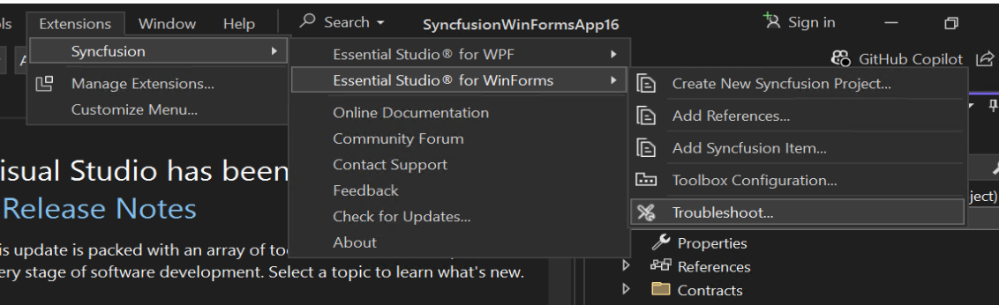

   N> In Visual Studio 2017 or lower, click the Syncfusion menu and choose Essential Studio® for WinForms > Troubleshoot…. 

   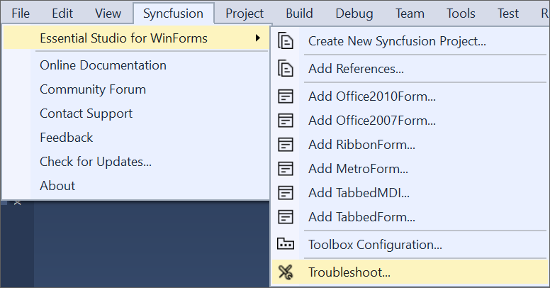

   **Option 2:**  
   Right-click the project file in Solution Explorer, then select the **Syncfusion Troubleshooter…** command.

   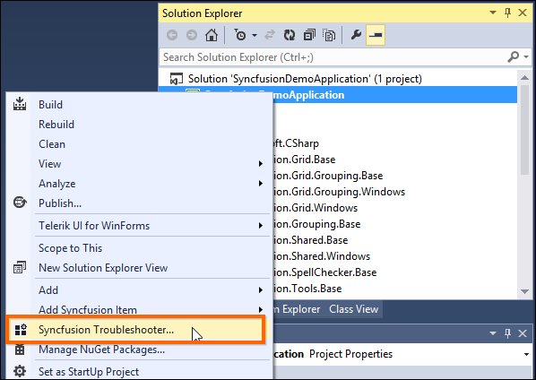

2. The project is analyzed, and if any Syncfusion® control configuration errors are detected, they will be reported in the Troubleshooter dialog. If no configuration issues are found, the dialog box will indicate that no modifications are required in the following areas:

* Syncfusion assembly references.
* Syncfusion NuGet Packages. 
* Syncfusion Toolbox Configuration.

   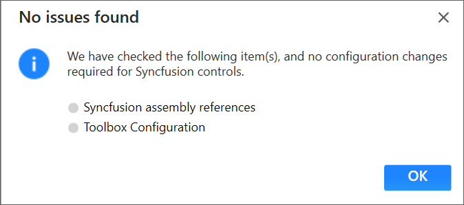

I> The Syncfusion Troubleshooter command is visible only for Syncfusion® projects—that is, projects that reference Syncfusion® assemblies or NuGet packages and target the .NET Framework.

The Syncfusion Troubleshooter handles the following project configuration issues: 

1. Assembly Reference Issues.

2. NuGet-related Issues.

3. Toolbox Configuration Issues.

### Assembly Reference Issues

The Syncfusion Troubleshooter deals with the following assembly reference issues in Syncfusion® projects. 

1. Dependent assemblies are missing for referred assemblies in the project. 

   **For Instance:**  If the “Syncfusion.Grid.Windows” assembly is referred to in the project and “Syncfusion.Shared.Windows” (a dependent of Syncfusion.Grid.Windows) is not referred to in the project, the Syncfusion Troubleshooter will show the dependent assembly as missing.

   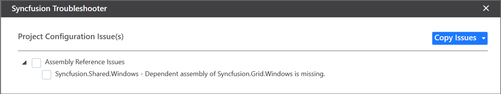

2. Syncfusion assembly version mismatch detected. The Syncfusion Troubleshooter compares all Syncfusion assembly versions within the project and, if any inconsistencies are found, displays a Syncfusion assemblies version mismatch warning. 

   **For Instance:**  If the “Syncfusion.Tools.Windows” assembly (v15.2450.0.40) is referred to in the project, but other Syncfusion assemblies' referred assembly version is v15.2450.0.43, the Syncfusion Troubleshooter will show a Syncfusion assembly version mismatch.

   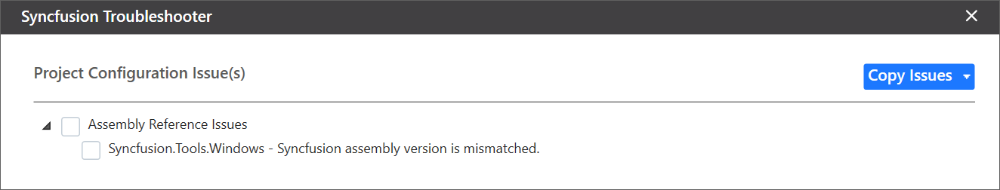

3. Framework version mismatch (Syncfusion assemblies) with the project’s .NET Framework version. Find the supported .NET Framework details for Syncfusion® assemblies in the following link:

   <https://help.syncfusion.com/common/essential-studio/assembly-information#supported-framework-version-for-essential-studio-assemblies> 

   **For Instance:** The .NET Framework of the application is v4.5 and the “Syncfusion.Tools.Windows” assembly (v17.1460.0.38 & .NET Framework version 4.6) is referred to in the same application. The Syncfusion Troubleshooter will show that the Syncfusion assembly .NET Framework version is incompatible with the project’s .NET Framework version.

   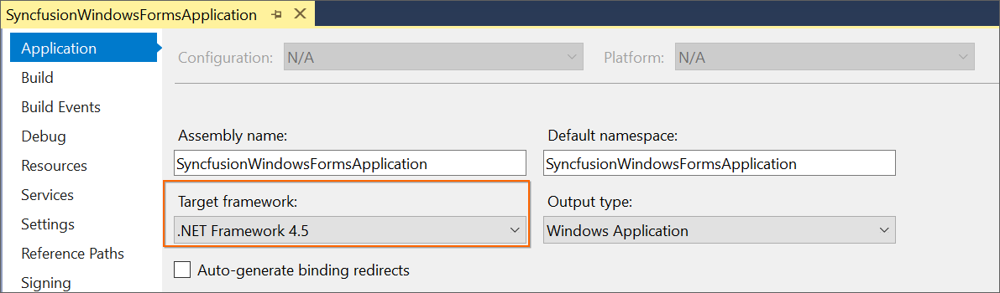

   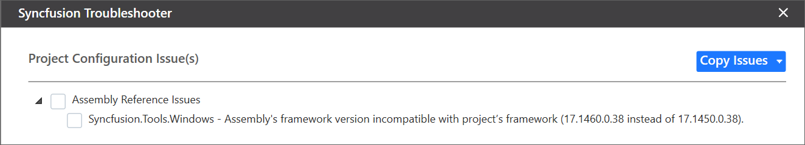

### NuGet Issues

The Syncfusion Troubleshooter deals with the following NuGet package related issues in Syncfusion® projects. 

1. Multiple versions of Syncfusion® NuGet Packages are installed. If the Syncfusion NuGet Package version differs from other Syncfusion NuGet Package versions, the Syncfusion Troubleshooter will show a Syncfusion NuGet package version mismatch. 

   **For Instance:** Syncfusion WinForms platform packages installed in multiple versions (v16.4.0.54 & v17.1.0.38), the Syncfusion Troubleshooter will show a Syncfusion package version mismatch.
 
   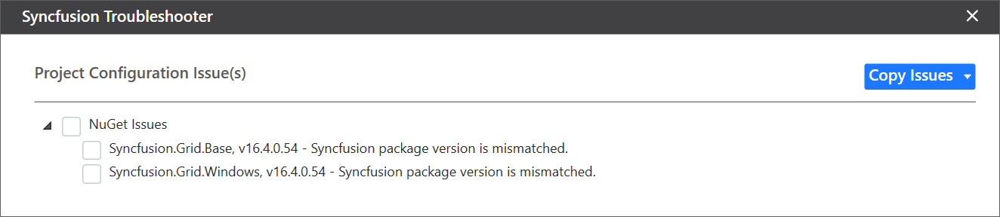

2. The installed Syncfusion® NuGet package’s Framework version differs from the project’s .NET Framework version.

   **For Instance:** The Syncfusion.SfBulletGraph.Windows40 NuGet package version (v15.2.0.17 with 4.0 Framework) is installed in the project, but the project .NET Framework version is 4.5. So, the Syncfusion Troubleshooter will show that the Syncfusion package Framework version is mismatched.
  
   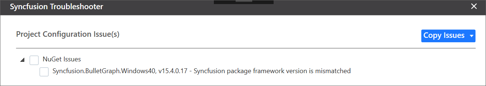

3. A dependent NuGet package of the installed Syncfusion NuGet packages is missing.

   **For Instance:** If you install the Syncfusion.Chart.Windows NuGet package alone in the project, the Syncfusion Troubleshooter will show that the Syncfusion.Chart.Base and other dependent NuGet packages are missing.
 
   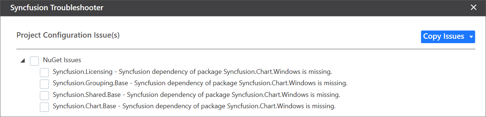

I> An internet connection is required to restore the missing dependent packages. If the internet is not available, the dependent packages will not be restored.

### Toolbox Configuration Issues

The Syncfusion Troubleshooter deals with the following Toolbox Configuration related issues in Syncfusion projects. 

1. If the project .NET Framework version is not installed/configured for the Syncfusion Toolbox, the Syncfusion Troubleshooter will show a Syncfusion Toolbox .NET Framework version mismatch. 

   **For Instance:** The project .NET Framework version is 4.5 and the Syncfusion Toolbox is configured with 4.6 framework assemblies only in the corresponding Visual Studio, the Syncfusion Troubleshooter will show a Syncfusion Toolbox framework version mismatch.
 
   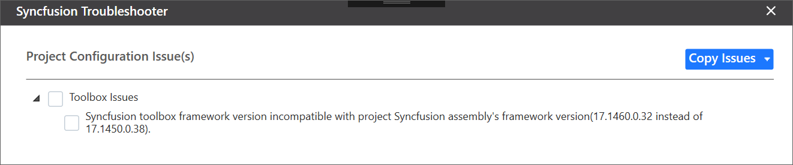

2. If the Syncfusion Toolbox configured version differs from the latest Syncfusion assembly reference version or NuGet package version in the same project, the Syncfusion Troubleshooter will show a Syncfusion Toolbox version mismatch.

   **For Instance:** If the latest Syncfusion assembly reference version is v17.1.0.38 but the Toolbox assemblies are configured with v17.1.0.32, the Syncfusion Troubleshooter will show a Syncfusion Toolbox version mismatch.
  
   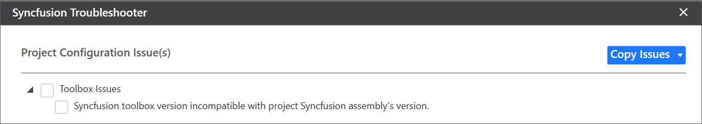

## Apply the solution

1. After loading the Syncfusion Troubleshooter dialog, check the corresponding check box of the issue to be resolved. Then click the **Fix Issue(s)** button. 

   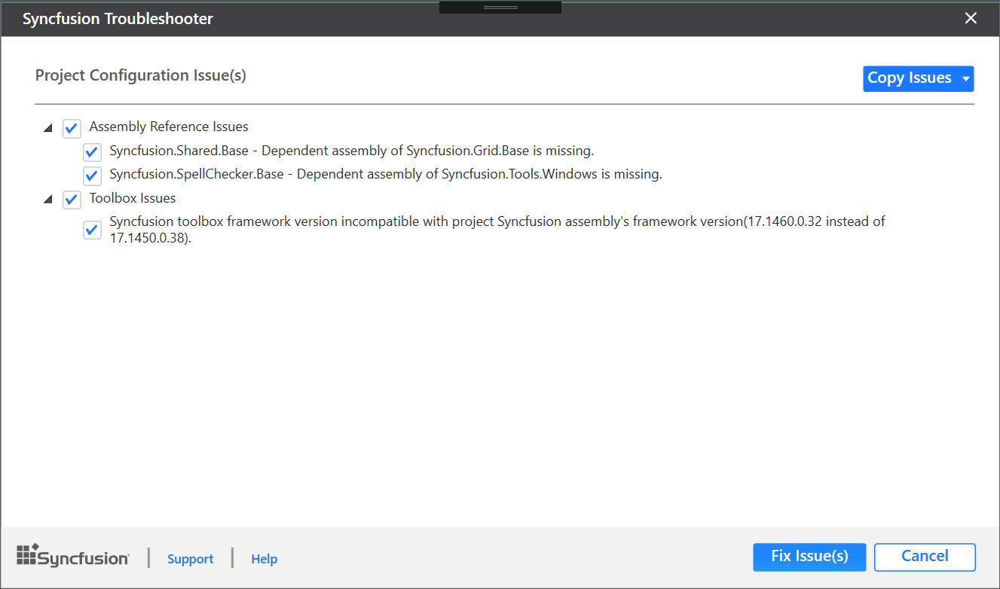

2. A dialog appears, which will ask to take a backup of the project before performing the troubleshooting process. If you need to back up the project before troubleshooting, click the **Yes** button. 

   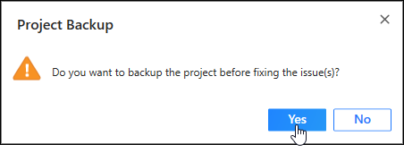

3. Wait for a while as the Syncfusion Troubleshooter resolves the selected issues. After the troubleshooting process is completed, there will be a status message in the Visual Studio status bar as “Troubleshooting process completed successfully”.

   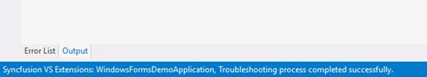

4. A Syncfusion® licensing registration required message box will be shown if you installed the trial setup or NuGet packages, since Syncfusion® introduced the licensing system from the 2018 Volume 2 (v16.2.0.41) Essential Studio® release. Navigate to the [help topic](https://help.syncfusion.com/common/essential-studio/licensing/overview#how-to-generate-syncfusion-license-key), which is shown in the licensing message box, to generate and register the Syncfusion® license key to your project. Refer to this [blog](https://www.syncfusion.com/blogs/post/whats-new-in-2018-volume-2.aspx) post to understand the licensing changes introduced in Essential Studio®.   

   