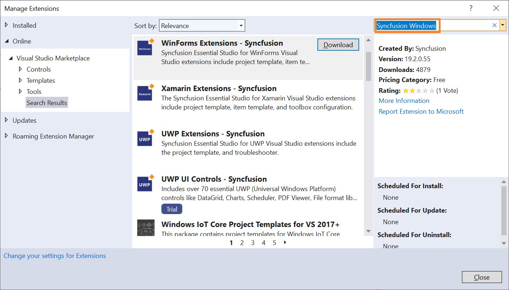
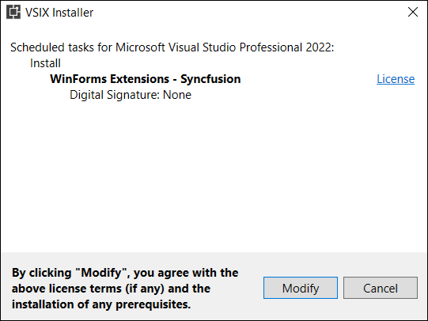
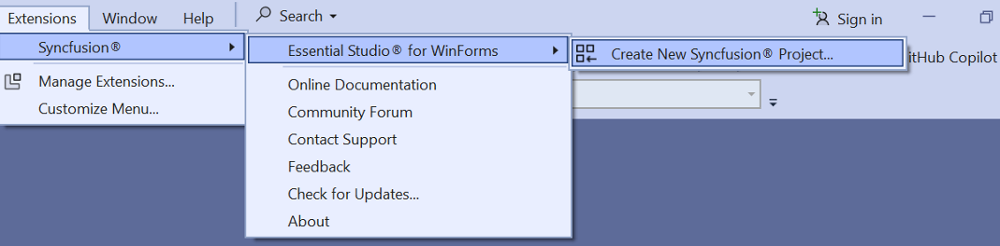

# Download and Installation

Syncfusion® publishes its Visual Studio extension on the Visual Studio Marketplace at the link below. You can install it directly from within Visual Studio or download it from the Marketplace.

[Visual Studio 2022](https://marketplace.visualstudio.com/items?itemName=SyncfusionInc.WindowsVSExtensions)

[Visual Studio 2019 or lower](https://marketplace.visualstudio.com/items?itemName=SyncfusionInc.Windows-Extensions)

## Prerequisites

The following software prerequisites must be installed to use the Syncfusion® WinForms extension for creating projects, adding code snippets, converting, and upgrading Syncfusion® WinForms applications.

* [Visual Studio 2010 or later](https://visualstudio.microsoft.com/downloads).

## Install through the Visual Studio Manage Extensions

The steps below assist you to how to install the Syncfusion WinForms extensions from **Visual Studio Manage Extensions**.

1. Open the Visual Studio.

2. Navigate to **Extension ->Manage Extensions** and open the Manage Extensions.

     N>  In Visual Studio 2017 or lower, go to Tools -> Extensions and Updates

3. On the left, click the **Online** tab and type **"Syncfusion Windows"** in the **search box**.

    

4. Click the **Download** button in the **“WinForms Extensions - Syncfusion”**.

5. After downloading the extensions, close all instances of Visual Studio to begin the installation process. You will then see the following VSIX installation prompt.

    

6. Click the **Modify** button.

7. After the installation is complete, open Visual Studio.

8. Now, under the menu **Extensions**, you can use the Syncfusion extensions from the Visual Studio.

    

    N> In Visual Studio 2017 or lower, you can see the Syncfusion menu directly in the Visual Studio menu. 

## Install from the Visual Studio Marketplace

The steps below illustrate how to download and install the Syncfusion Windows extension from the Visual Studio Marketplace.

1. Download the Syncfusion WinForms Extensions from the below Visual Studio Marketplace link.

    [Visual Studio 2022](https://marketplace.visualstudio.com/items?itemName=SyncfusionInc.WindowsVSExtensions)

    [Visual Studio 2019 or lower](https://marketplace.visualstudio.com/items?itemName=SyncfusionInc.Windows-Extensions)

2. Close all Visual Studio instances running, if any.

3. Double-click the downloaded VSIX file to start the installation. You will see the VSIX installation prompts with checkboxes to select the Visual Studio versions where you want to install the extension.

    

4. Click the **Modify** button.

5. After the installation is complete, open Visual Studio. You can now use Syncfusion extensions from the Visual Studio under the **Extensions** menu.

     

     N> In Visual Studio 2017 or lower, you can see the Syncfusion menu directly in the Visual Studio menu. 