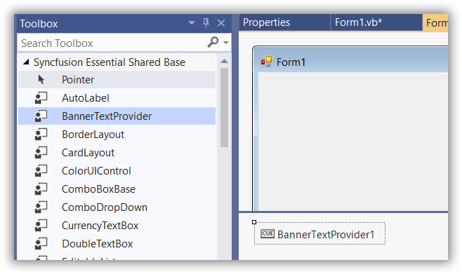
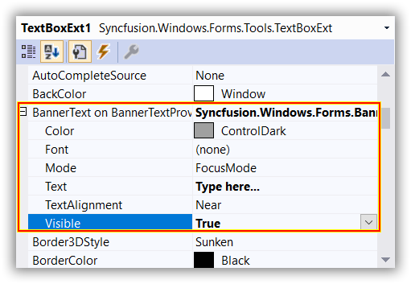

# Getting Started with Windows Forms Watermark Text Provider

This section briefly describes how to create a new Windows Forms project in Visual Studio and add [BannerTextProvider](https://help.syncfusion.com/cr/windowsforms/Syncfusion.Windows.Forms.BannerTextProvider.html) with its basic functionalities.

## Assembly deployment

Refer to the [control dependencies](https://help.syncfusion.com/windowsforms/control-dependencies#bannertextprovider) section to get the list of assemblies or the details of NuGet package that needs to be added as reference to use the control in any application.

Refer to this [documentation](https://help.syncfusion.com/windowsforms/installation/install-nuget-packages) to find more details about installing nuget packages in a Windows Forms application.

## Creating Application with BannerTextProvider
Create new Windows Forms Project in Visual Studio to display watermark for editor controls using [BannerTextProvider](https://help.syncfusion.com/cr/windowsforms/Syncfusion.Windows.Forms.BannerTextProvider.html) control.

## Adding BannerTextProvider control via designer

1) Create a new Windows Forms application using Visual Studio.

2) Add the the [BannerTextProvider](https://help.syncfusion.com/cr/windowsforms/Syncfusion.Windows.Forms.BannerTextProvider.html) control to an application by dragging it from the toolbox to Form designer window. The [dependent assemblies](https://help.syncfusion.com/windowsforms/control-dependencies#bannertextprovider) will be added automatically.

 

3) Drag the required control from toolbox and add to the form. For example, you can choose [TextBoxExt](https://help.syncfusion.com/cr/windowsforms/Syncfusion.Windows.Forms.Tools.TextBoxExt.html) control and get an extender provider property as illustrated in the following sample.

 

 

## Adding BannerTextProvider control via code

In order to add [BannerTextProvider](https://help.syncfusion.com/cr/windowsforms/Syncfusion.Windows.Forms.BannerTextProvider.html) control manually, do the below steps,

1) 	Add the required [assembly references](https://help.syncfusion.com/windowsforms/control-dependencies#bannertextprovider) to the project.

2) Add the required namespace and create the [BannerTextProvider](https://help.syncfusion.com/cr/windowsforms/Syncfusion.Windows.Forms.BannerTextProvider.html) control instance then add it to the Form.





using Syncfusion.Windows.Forms;





Imports Syncfusion.Windows.Forms









BannerTextProvider bannerTextProvider1 = new BannerTextProvider(this.components);





Dim bannerTextProvider As bannerTextProvider1 = New BannerTextProvider(Me.components)





## Assigning banner text to a control

1) Add the control to which you want to set BannerText in the form. For example, you can choose [TextBoxExt](https://help.syncfusion.com/cr/windowsforms/Syncfusion.Windows.Forms.Tools.TextBoxExt.html) and add it to the form.





TextBoxExt textBoxExt = new TextBoxExt()
{
    Size = new Size(150, 50),
    Location = new Point(50, 50)
};

this.Controls.Add(textBoxExt);





 Dim textBoxExt As TextBoxExt = New TextBoxExt() With 
{
    .Size = New Size(150, 50),
    .Location = New Point(50, 50)
}

Me.Controls.Add(textBoxExt)





2) Assign the banner text to the control.




 BannerTextInfo bannerTextInfo = new BannerTextInfo()
{
    Text = "Type here...",
    Visible = true,
};

bannerTextProvider1.SetBannerText(textBoxExt, bannerTextInfo);





Dim bannerTextInfo As BannerTextInfo = New BannerTextInfo() With 
{
    .Text = "Type here...",
    .Visible = True
}

bannerTextProvider1.SetBannerText(textBoxExt, bannerTextInfo)




N> Make sure to clear the default value of the [Text](https://help.syncfusion.com/cr/windowsforms/Syncfusion.Windows.Forms.BannerTextInfo.html#Syncfusion_Windows_Forms_BannerTextInfo_Text) property of the control before setting the banner text.

The [Visible](https://help.syncfusion.com/cr/windowsforms/Syncfusion.Windows.Forms.BannerTextInfo.html#Syncfusion_Windows_Forms_BannerTextInfo_Visible) property allows you to customize visibility of BannerTextProvider control. [Text](https://help.syncfusion.com/cr/windowsforms/Syncfusion.Windows.Forms.BannerTextInfo.html#Syncfusion_Windows_Forms_BannerTextInfo_Text) and [Color](https://help.syncfusion.com/cr/windowsforms/Syncfusion.Windows.Forms.BannerTextInfo.html#Syncfusion_Windows_Forms_BannerTextInfo__ctor_System_String_System_Boolean_System_Drawing_Font_System_Drawing_Color_Syncfusion_Windows_Forms_BannerTextMode_) properties allows you to set the watermark text and it's fore color. The [Font](https://help.syncfusion.com/cr/windowsforms/Syncfusion.Windows.Forms.BannerTextInfo.html#Syncfusion_Windows_Forms_BannerTextInfo__ctor_System_String_System_Boolean_System_Drawing_Font_System_Drawing_Color_Syncfusion_Windows_Forms_BannerTextMode_) property allows to customize the Font of watermark.

The rendering mode for disappearing the banner text can be customized by using [Mode](https://help.syncfusion.com/cr/windowsforms/Syncfusion.Windows.Forms.BannerTextInfo.html#Syncfusion_Windows_Forms_BannerTextInfo_Mode) property using the following values,

* FocusMode - The banner text disappears when the control gets focus.
* EditMode - The banner text disappears only when the control is in Edit mode or when the associated text box is not empty.




bannerTextProvider1.SetBannerText(textBoxExt, new Syncfusion.Windows.Forms.BannerTextInfo("Type here...", true, new System.Drawing.Font("Verdana", 8.25F, System.Drawing.FontStyle.Italic), System.Drawing.Color.RoyalBlue, Syncfusion.Windows.Forms.BannerTextMode.EditMode));





bannerTextProvider1.SetBannerText(textBoxExt, New Syncfusion.Windows.Forms.BannerTextInfo("Type here...", True, New System.Drawing.Font("Verdana", 8.25F, System.Drawing.FontStyle.Italic), System.Drawing.Color.RoyalBlue, Syncfusion.Windows.Forms.BannerTextMode.EditMode))



 
  

## Controls which supports BannerText

 [BannerTextProvider](https://help.syncfusion.com/cr/windowsforms/Syncfusion.Windows.Forms.BannerTextProvider.html) feature can only be used for the following controls only.

* [TextBoxBarItem](https://help.syncfusion.com/windowsforms/popupmenu/baritem-types#textboxbaritem ) (XPMenus)
* [ComboBoxBarItem](https://help.syncfusion.com/windowsforms/popupmenu/baritem-types#comboboxbaritem ) (XPMenus)
* [TextBox](https://help.syncfusion.com/windowsforms/ribbon/getting-started#add-toolstriptextbox ) (ToolStripEx)
* [ComboBox](https://help.syncfusion.com/windowsforms/ribbon/getting-started#toolstripcombobox ) (ToolStripEx)
* [ComboBoxEx](https://help.syncfusion.com/windowsforms/ribbon/getting-started#toolstripcomboboxex ) (ToolStripEx)
* [TextBoxExt](https://help.syncfusion.com/windowsforms/textbox/overview ) (Editor Control)
* [CurrencyTextBox](https://help.syncfusion.com/windowsforms/currency-textbox/overview ) (Editor Control)
* [ComboBoxAdv](https://help.syncfusion.com/windowsforms/classic/combobox/overview ) (Editor Control)
* [ComboDropDown](https://help.syncfusion.com/windowsforms/combobox-dropdown/overview ) (Editor Control)
* [ComboBoxAutoComplete](https://help.syncfusion.com/windowsforms/classic/autocomplete/overview ) (Editor Control)
* [Integer TextBox](https://help.syncfusion.com/windowsforms/integer-textbox/overview ) (Editor Control)
* [Double TextBox](https://help.syncfusion.com/windowsforms/double-textbox/overview ) (Editor Control)
* [Percent TextBox](https://help.syncfusion.com/windowsforms/percent-textbox/overview )(Editor Control)
* Other Microsoft Editor Controls

