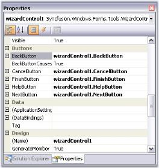

# Browse Buttons in Windows Forms Wizard

The default buttons which are available for the Wizard control are Back, Next, Cancel, and Help. The Next and the Back buttons facilitate users to navigate between wizard pages.

N> You can navigate between the pages at Design Time also. See Page Navigation at Design time topic for more details.

### Button visibility

By default, all the buttons are visible for all the Wizard pages. To change their visibility, use the below properties in individual pages.

* [BackVisible](https://help.syncfusion.com/cr/windowsforms/Syncfusion.Windows.Forms.Tools.WizardControlPage.html#Syncfusion_Windows_Forms_Tools_WizardControlPage_BackVisible)
* [CancelVisible](https://help.syncfusion.com/cr/windowsforms/Syncfusion.Windows.Forms.Tools.WizardControlPage.html#Syncfusion_Windows_Forms_Tools_WizardControlPage_CancelVisible)
* [FinishVisible](https://help.syncfusion.com/cr/windowsforms/Syncfusion.Windows.Forms.Tools.WizardControlPage.html#Syncfusion_Windows_Forms_Tools_WizardControlPage_FinishVisible)
* [HelpVisible](https://help.syncfusion.com/cr/windowsforms/Syncfusion.Windows.Forms.Tools.WizardControlPage.html#Syncfusion_Windows_Forms_Tools_WizardControlPage_HelpVisible)
* [NextVisible](https://help.syncfusion.com/cr/windowsforms/Syncfusion.Windows.Forms.Tools.WizardControlPage.html#Syncfusion_Windows_Forms_Tools_WizardControlPage_NextVisible)

N> When you use more than one wizard page, you may set the [BackVisible](https://help.syncfusion.com/cr/windowsforms/Syncfusion.Windows.Forms.Tools.WizardControlPage.html#Syncfusion_Windows_Forms_Tools_WizardControlPage_BackVisible) property of the first page to `true` to hide the back button.





this.wizardControlPage1.BackVisible = true;

this.wizardControlPage1.NextVisible = true;

this.wizardControlPage1.CancelVisible = true;

this.wizardControlPage1.HelpVisible = true;

this.wizardControlPage1.FinishVisible = true;





Me.wizardControlPage1.BackVisible = True

Me.wizardControlPage1.NextVisible = true

Me.wizardControlPage1.CancelVisible = True

Me.wizardControlPage1.HelpVisible = true

Me.wizardControlPage1.FinishVisible = True





You can enable or disable the buttons using the respective button enabled properties.

* [BackEnabled](https://help.syncfusion.com/cr/windowsforms/Syncfusion.Windows.Forms.Tools.WizardControlPage.html#Syncfusion_Windows_Forms_Tools_WizardControlPage_BackEnabled)
* [CancelEnabled](https://help.syncfusion.com/cr/windowsforms/Syncfusion.Windows.Forms.Tools.WizardControlPage.html#Syncfusion_Windows_Forms_Tools_WizardControlPage_CancelEnabled)
* [FinishEnabled](https://help.syncfusion.com/cr/windowsforms/Syncfusion.Windows.Forms.Tools.WizardControlPage.html#Syncfusion_Windows_Forms_Tools_WizardControlPage_FinishEnabled)
* [HelpEnabled](https://help.syncfusion.com/cr/windowsforms/Syncfusion.Windows.Forms.Tools.WizardControlPage.html#Syncfusion_Windows_Forms_Tools_WizardControlPage_HelpEnabled)
* [NextEnabled](https://help.syncfusion.com/cr/windowsforms/Syncfusion.Windows.Forms.Tools.WizardControlPage.html#Syncfusion_Windows_Forms_Tools_WizardControlPage_NextEnabled)

### Adding finish button

In order to display the Finish button in the last wizard page, user should set [CancelOverFinish](https://help.syncfusion.com/cr/windowsforms/Syncfusion.Windows.Forms.Tools.WizardControlPage.html#Syncfusion_Windows_Forms_Tools_WizardControlPage_CancelOverFinish) property in the [WizardControlPage](https://help.syncfusion.com/cr/windowsforms/Syncfusion.Windows.Forms.Tools.WizardControlPage.html) Collection Editor to `false`. This property determines if the Cancel button is positioned over the Finish button. If this property is set to `true`, it will override the [FinishVisible]([FinishVisible](https://help.syncfusion.com/cr/windowsforms/Syncfusion.Windows.Forms.Tools.WizardControlPage.html#Syncfusion_Windows_Forms_Tools_WizardControlPage_FinishVisible)) property.





this.finishPage.CancelOverFinish = false;





Me.finishPage.CancelOverFinish = False





A sample which includes button settings is available in the below sample installation location.

…\My Documents\Syncfusion\EssentialStudio\Version Number\Windows\Tools.Windows\Samples\Advanced Editor Functions\ActionGroupingDemo

### Adding and reordering buttons

#### Adding new button to a page

The following code snippet shows how to add a button to the wizard control browse buttons.





// To add a new button 

Button button = new Button(); 

button.Text = "New Button"; 

// Add button to the WizardControl

this.wizardControl1.Controls.Add(button); 

// Set the constraints for the newly created Button 

this.wizardControl1.GridBagLayout.GetConstraintsRef(button).GridPosX = 6; 

this.wizardControl1.GridBagLayout.GetConstraintsRef(button).GridPosY = 5; 





' To add a new button 

Private button As Button = New Button()

Private button.Text = "New Button"

'Add button to the WizardControl

Me.wizardControl1.Controls.Add(button)

' Set the constraints for the newly created Button 

Me.wizardControl1.GridBagLayout.GetConstraintsRef(button).GridPosX = 6

Me.wizardControl1.GridBagLayout.GetConstraintsRef(button).GridPosY = 5





#### Reordering the button sequence

In order to change the position of the buttons, user should handle the GridPostX property and change the position programmatically.

N> Wizard control automatically sets position for some buttons after page change. Setting the position for controls manually, is not supported in those cases.





//Setting the GridPosX property for changing the position of buttons

this.wizardControl1.GridBagLayout.GetConstraintsRef(this.wizardControl1.BackButton).GridPosX = 5;

this.wizardControl1.GridBagLayout.GetConstraintsRef(this.wizardControl1.NextButton).GridPosX = 6;

this.wizardControl1.GridBagLayout.GetConstraintsRef(this.wizardControl1.CancelButton).GridPosX = 4;

this.wizardControl1.GridBagLayout.GetConstraintsRef(this.wizardControl1.FinishButton).GridPosX = 3;

this.wizardControl1.GridBagLayout.GetConstraintsRef(this.wizardControl1.HelpButton).GridPosX = 2; 





'Setting the GridPosX property for changing the position of buttons

Me.wizardControl1.GridBagLayout.GetConstraintsRef(Me.wizardControl1.BackButton).GridPosX = 5

Me.wizardControl1.GridBagLayout.GetConstraintsRef(Me.wizardControl1.NextButton).GridPosX = 6

Me.wizardControl1.GridBagLayout.GetConstraintsRef(Me.wizardControl1.CancelButton).GridPosX = 4

Me.wizardControl1.GridBagLayout.GetConstraintsRef(Me.wizardControl1.FinishButton).GridPosX= 3

Me.wizardControl1.GridBagLayout.GetConstraintsRef(Me.wizardControl1.HelpButton).GridPosX = 2





#### Button appearance

The default browse buttons are the normal windows button controls. Appearance of the buttons can be controlled using the properties available. Some appearance properties are listed below.

Property table

<table>
<tr>
<th>
Button property</th><th>
Description</th></tr>
<tr>
<td>
FlatStyle</td><td>
Sets the appearance of the button control. The flat style are, Flat,Popup, Standard and System.</td></tr>
<tr>
<td>
FlatAppearance</td><td>
Sets the appearance of the border, color for mouse state and check state. This setting will be effective only when FlatStyle is set to Flat.</td></tr>
<tr>
<td>
Font</td><td>
Sets the Font Style for the button text.</td></tr>
<tr>
<td>
ForeColor</td><td>
Sets the fore color for the button text.</td></tr>
<tr>
<td>
Image</td><td>
Sets an image icon for the button.</td></tr>
<tr>
<td>
ImageAlign</td><td>
Specifies the image alignment in the control.</td></tr>
<tr>
<td>
ImageIndex</td><td>
Specifies the image index for the button, when ImageList property is used.</td></tr>
<tr>
<td>
ImageList</td><td>
Specifies the image list.</td></tr>
<tr>
<td>
Text</td><td>
Specifies the button text.</td></tr>
<tr>
<td>
TextAlign</td><td>
Specifies the alignment of the text.</td></tr>
<tr>
<td>
TextImageRelation</td><td>
Specifies the relative location of the image to the text on the button.</td></tr>
</table>





//Sets the flat style settings for the Cancel button

this.wizardControl1.CancelButton.FlatStyle = System.Windows.Forms.FlatStyle.Flat;

this.wizardControl1.CancelButton.ForeColor = System.Drawing.Color.SteelBlue;

this.wizardControl1.CancelButton.FlatAppearance.BorderSize = 1;

this.wizardControl1.CancelButton.FlatAppearance.BorderColor = System.Drawing.Color.DarkBlue;

this.wizardControl1.CancelButton.FlatAppearance.MouseOverBackColor = System.Drawing.Color.PowderBlue;





'Sets the flat style settings for the Cancel button

Me.wizardControl1.CancelButton.FlatStyle = System.Windows.Forms.FlatStyle.Flat 

Me.wizardControl1.CancelButton.ForeColor = System.Drawing.Color.SteelBlue

this.wizardControl1.CancelButton.FlatAppearance.BorderSize = 1;

this.wizardControl1.CancelButton.FlatAppearance.BorderColor = System.Drawing.Color.DarkBlue;

this.wizardControl1.CancelButton.FlatAppearance.MouseOverBackColor = System.Drawing.Color.PowderBlue;





N> You can access the properties of CancelButton, FinishButton, HelpButton and NextButton using [WizardControl.CancelButton](https://help.syncfusion.com/cr/windowsforms/Syncfusion.Windows.Forms.Tools.WizardControl.html#Syncfusion_Windows_Forms_Tools_WizardControl_CancelButton), [WizardControl.FinishButton](https://help.syncfusion.com/cr/windowsforms/Syncfusion.Windows.Forms.Tools.WizardControl.html#Syncfusion_Windows_Forms_Tools_WizardControl_FinishButton), [WizardControl.HelpButton](https://help.syncfusion.com/cr/windowsforms/Syncfusion.Windows.Forms.Tools.WizardControl.html#Syncfusion_Windows_Forms_Tools_WizardControl_HelpButton) and [WizardControl.NextButton](https://help.syncfusion.com/cr/windowsforms/Syncfusion.Windows.Forms.Tools.WizardControl.html#Syncfusion_Windows_Forms_Tools_WizardControl_NextButton) properties respectively.

