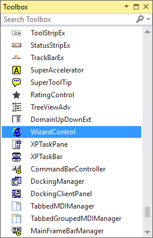
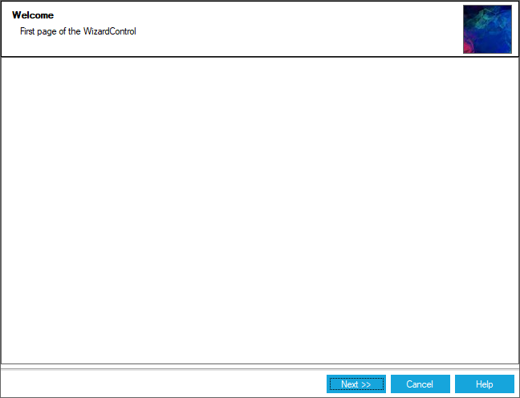
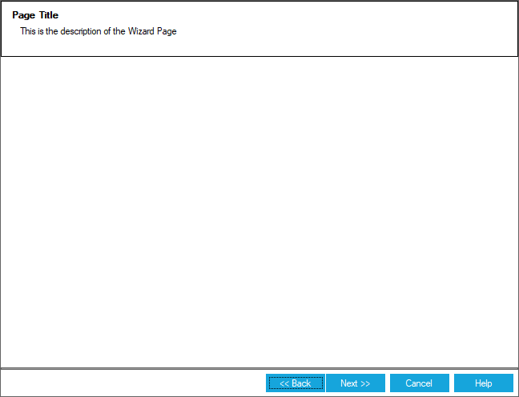

# Getting Started with Windows Forms Wizard Control

This section describes how to add [WizardControl](https://help.syncfusion.com/cr/windowsforms/Syncfusion.Windows.Forms.Tools.WizardControl.html) in a Windows Forms application and overview of its basic functionalities.

## Assembly deployment

Refer [control dependencies](https://help.syncfusion.com/windowsforms/control-dependencies#wizardcontrol) section to get the list of assemblies or NuGet package needs to be added as reference to use the control in any application.
 
Please find more details regarding how to install the nuget packages in windows form application in the below link:
 
[How to install nuget packages](https://help.syncfusion.com/windowsforms/installation/install-nuget-packages)

## Creating simple application with WizardControl

You can create the Windows Forms application with WizardControl control as follows:

1. [Creating project](#creating-the-project)
2. [Adding control via designer](#adding-control-via-designer)
3. [Adding control manually using code](#adding-control-manually-in-code)
4. [Configure WizardPages](#configure-wizardpages)

### Creating the project

Create a new Windows Forms project in the Visual Studio to display the [WizardControl](https://help.syncfusion.com/cr/windowsforms/Syncfusion.Windows.Forms.Tools.WizardControl.html) with functionalities.

## Adding control via designer

The [WizardControl](https://help.syncfusion.com/cr/windowsforms/Syncfusion.Windows.Forms.Tools.WizardControl.html) control can be added to the application by dragging it from the toolbox and dropping it in a designer view. The following required assembly references will be added automatically:

* Syncfusion.Grid.Base.dll
* Syncfusion.Grid.Windows.dll
* Syncfusion.Shared.Base.dll
* Syncfusion.Shared.Windows.dll
* Syncfusion.Tools.Base.dll
* Syncfusion.Tools.Windows.dll

## Adding control manually in code

To add control manually in C#, follow the given steps:

**Step 1** : Add the following required assembly references to the project:

        * Syncfusion.Grid.Base.dll
        * Syncfusion.Grid.Windows.dll
        * Syncfusion.Shared.Base.dll
        * Syncfusion.Shared.Windows.dll
        * Syncfusion.Tools.Base.dll
        * Syncfusion.Tools.Windows.dll

**Step 2** : Include the namespaces **Syncfusion.Windows.Forms.Tools**.






using Syncfusion.Windows.Forms.Tools;





Imports Syncfusion.Windows.Forms.Tools



 

{{ codesnippet1 | OrderList_Indent_Level_1 }}

**Step 3** : Create [WizardControl](https://help.syncfusion.com/cr/windowsforms/Syncfusion.Windows.Forms.Tools.WizardControl.html) control instance and add it to the form.






WizardControl wizardControl1 = new WizardControl();

this.wizardControl1.Style = Theme.Metro;

this.Controls.Add(wizardControl1);





Dim wizardControl1 As WizardControl = New WizardControl()

Me.wizardControl1.Style = Theme.Metro

Me.Controls.Add(wizardControl1)





{{ codesnippet2 | OrderList_Indent_Level_1 }}

**Add wizard page into WizardControl**

Create an instance of [WizardContainer](https://help.syncfusion.com/cr/windowsforms/Syncfusion.Windows.Forms.Tools.WizardContainer.html), add it to WizardControl and set it as [WizardPageContainer](https://help.syncfusion.com/cr/windowsforms/Syncfusion.Windows.Forms.Tools.WizardControl.html#Syncfusion_Windows_Forms_Tools_WizardControl_WizardPageContainer) of WizardControl. WizardControlPages can be added to using [WizardPages](https://help.syncfusion.com/cr/windowsforms/Syncfusion.Windows.Forms.Tools.WizardControl.html#Syncfusion_Windows_Forms_Tools_WizardControl_WizardPages) collection property.





// Create instance of page elements

WizardControlPage wizardControlPage1 = new WizardControlPage();
WizardControlPage wizardControlPage2 = new WizardControlPage();
WizardControlPage wizardControlPage3 = new WizardControlPage();

// configure pages
this.wizardControlPage1.Title = "Welcome";
this.wizardControlPage1.Description = "First page of the WizardControl";
this.wizardControlPage1.BackVisible = false;

this.wizardControlPage2.Title = "Processing";
this.wizardControlPage2.Description = "Second page of the WizardControl";

this.wizardControlPage3.Title = "Finished";
this.wizardControlPage3.Description = "Final page of the WizardControl";
this.wizardControlPage3.NextVisible = false;
this.wizardControlPage3.CancelVisible = false;
this.wizardControlPage3.FinishVisible = true;

this.pictureBox1.Image = ((System.Drawing.Image)(resources.GetObject("pictureBox1.Image")));
this.wizardControl1.Banner = this.pictureBox1;

// Add pages into wizard Control
 this.wizardControl1.WizardPages = new Syncfusion.Windows.Forms.Tools.WizardControlPage[] {
        this.wizardControlPage1,
        this.wizardControlPage2,
        this.wizardControlPage3};





' Create instance of page elements

Dim wizardControlPage1 As New WizardControlPage()
Dim wizardControlPage2 As New WizardControlPage()
Dim wizardControlPage3 As New WizardControlPage()

' configure pages
Me.wizardControlPage1.Title = "Welcome"
Me.wizardControlPage1.Description = "First page of the WizardControl"
Me.wizardControlPage1.BackVisible = False

Me.wizardControlPage2.Title = "Processing"
Me.wizardControlPage2.Description = "Second page of the WizardControl"

Me.wizardControlPage3.Title = "Finish"
Me.wizardControlPage3.Description = "Final page of the WizardControl"
Me.wizardControlPage3.NextVisible = False
Me.wizardControlPage3.CancelVisible = False
Me.wizardControlPage3.FinishVisible = True

Me.pictureBox1.Image = (CType(resources.GetObject("pictureBox1.Image"), System.Drawing.Image))
Me.wizardControl1.Banner = Me.pictureBox1

' Add pages into wizard Control
 Me.wizardControl1.WizardPages = New Syncfusion.Windows.Forms.Tools.WizardControlPage() { Me.wizardControlPage1, Me.wizardControlPage2, Me.wizardControlPage3}





**Configure BannerPanel** 

Controls can be added to header of the WizardControl using [BannerPanel](https://help.syncfusion.com/cr/windowsforms/Syncfusion.Windows.Forms.Tools.WizardControl.html#Syncfusion_Windows_Forms_Tools_WizardControl_BannerPanel) property where panel containing the desired controls is added. 





// Create instance of controls to be added

GradientPanel gradientPanel1 = new GradientPanel();
Label label1 = new Label();
Label label2 = new Label();

this.label1.Text = "Page Title";
this.label2.Text = "This is the description of the Wizard Page";

this.gradientPanel1.Controls.Add(this.label1);
this.gradientPanel1.Controls.Add(this.label2);

// Adding it to WizardControl

this.wizardControl1.Controls.Add(this.gradientPanel1);

this.wizardControl1.Title = this.label1;
this.wizardControl1.Description = this.label2;
this.wizardControl1.BannerPanel = this.gradientPanel1;





'' Create instance of controls to be added

Dim gradientPanel1 As New GradientPanel()
Dim label1 As New Label()
Dim label2 As New Label()

Me.label1.Text = "Page Title"
Me.label2.Text = "This is the description of the Wizard Page"

Me.gradientPanel1.Controls.Add(Me.label1)
Me.gradientPanel1.Controls.Add(Me.label2)
 
'' Adding it to WizardControl 

Me.wizardControl1.Controls.Add(Me.gradientPanel1)

Me.wizardControl1.Title = Me.label1
Me.wizardControl1.Description = Me.label2
Me.wizardControl1.BannerPanel = Me.gradientPanel1





## Change navigation buttons visibility

You can change the visibility of the Back, Cancel, Next, Help and Finish navigation buttons in the wizard control and wizard page. This is done by using the [BackVisible](https://help.syncfusion.com/cr/windowsforms/Syncfusion.Windows.Forms.Tools.WizardControlPage.html#Syncfusion_Windows_Forms_Tools_WizardControlPage_BackVisible), [CancelVisible](https://help.syncfusion.com/cr/windowsforms/Syncfusion.Windows.Forms.Tools.WizardControlPage.html#Syncfusion_Windows_Forms_Tools_WizardControlPage_CancelVisible), [NextVisible](https://help.syncfusion.com/cr/windowsforms/Syncfusion.Windows.Forms.Tools.WizardControlPage.html#Syncfusion_Windows_Forms_Tools_WizardControlPage_NextVisible), [HelpVisible](https://help.syncfusion.com/cr/windowsforms/Syncfusion.Windows.Forms.Tools.WizardControlPage.html#Syncfusion_Windows_Forms_Tools_WizardControlPage_HelpVisible) and [FinishVisible](https://help.syncfusion.com/cr/windowsforms/Syncfusion.Windows.Forms.Tools.WizardControlPage.html#Syncfusion_Windows_Forms_Tools_WizardControlPage_FinishVisible) properties respectively.



this.wizardControlPage1.BackVisible = true;

this.wizardControlPage1.NextVisible = true;

this.wizardControlPage1.CancelVisible = true;

this.wizardControlPage1.HelpVisible = true;

this.wizardControlPage1.FinishVisible =false;


Me.wizardControlPage1.BackVisible = True

Me.wizardControlPage1.NextVisible = true

Me.wizardControlPage1.CancelVisible = True

Me.wizardControlPage1.HelpVisible = true

Me.wizardControlPage1.FinishVisible = False

 

