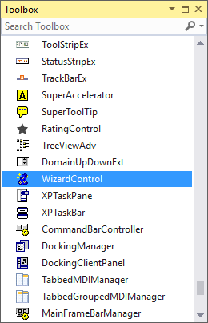
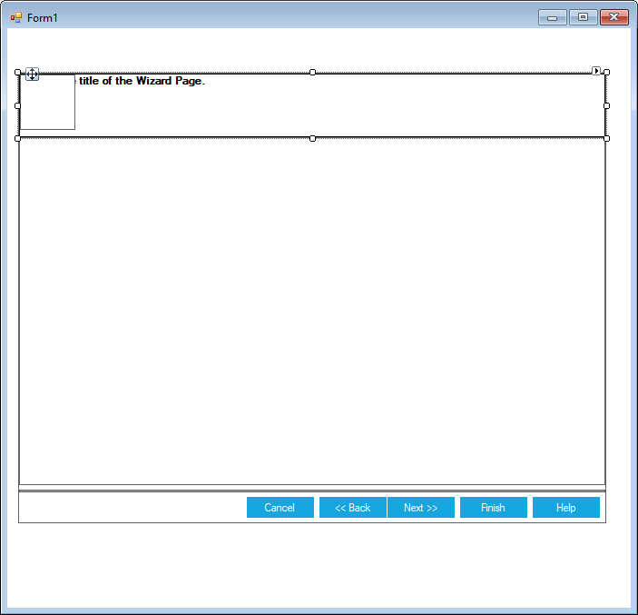
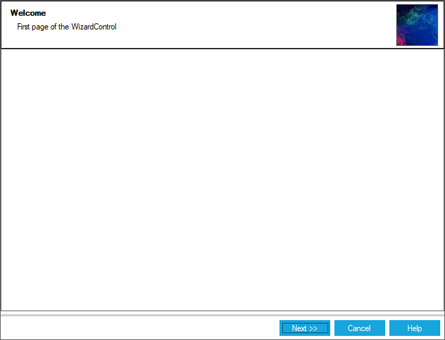
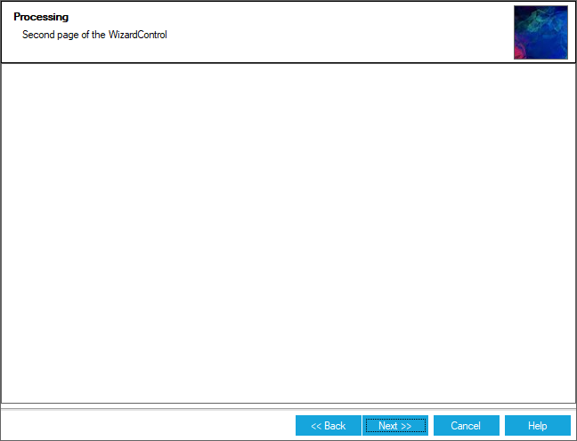
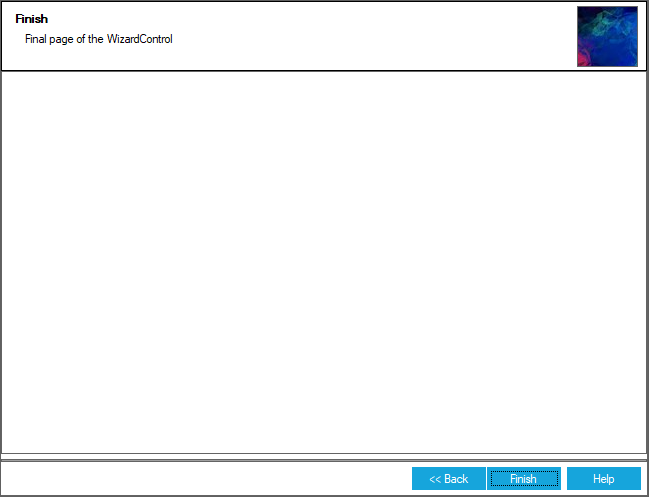
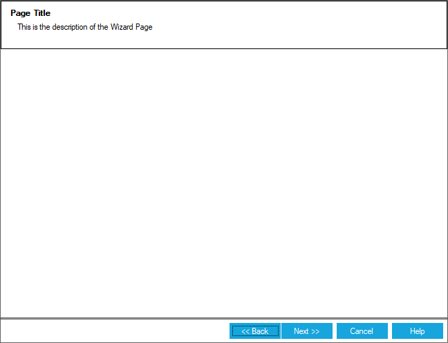

# Getting Started with Windows Forms Wizard Control

This section describes how to add the [WizardControl](https://help.syncfusion.com/cr/windowsforms/Syncfusion.Windows.Forms.Tools.WizardControl.html) to a Windows Forms application and provides an overview of its basic functionalities.

## Assembly deployment

Refer to the [control dependencies](https://help.syncfusion.com/windowsforms/control-dependencies#wizardcontrol) section for the list of assemblies and the NuGet package that must be added to use the control. The `Syncfusion.Tools.Windows` NuGet package brings in `Syncfusion.Grid.Base`, `Syncfusion.Grid.Windows`, `Syncfusion.Shared.Base`, `Syncfusion.Shared.Windows`, and `Syncfusion.Tools.Base` as transitive dependencies.

For more details on installing NuGet packages in a Windows Forms application, see:
[How to install NuGet packages](https://help.syncfusion.com/windowsforms/installation/install-nuget-packages).

To install via the NuGet Package Manager Console, run:

```powershell
Install-Package Syncfusion.Tools.Windows
```

## Creating a simple application with the WizardControl

You can create a Windows Forms application with the WizardControl as follows:

1. [Create the project](#creating-the-project)
2. [Add the control via the designer](#adding-control-via-the-designer)
3. [Add the control manually in code](#add-the-control-manually-in-code)
4. [Add wizard pages](#add-wizard-pages)
5. [Configure the BannerPanel](#configure-the-bannerpanel)

### Creating the project

Create a new Windows Forms project in Visual Studio to host the [WizardControl](https://help.syncfusion.com/cr/windowsforms/Syncfusion.Windows.Forms.Tools.WizardControl.html). For prerequisites, see [Assembly deployment](#assembly-deployment) above.

## Adding control via designer

The [WizardControl](https://help.syncfusion.com/cr/windowsforms/Syncfusion.Windows.Forms.Tools.WizardControl.html) can be added to the form by dragging it from the **Toolbox → Syncfusion** tab and dropping it onto the designer view. The following required assembly references are added automatically:

* Syncfusion.Grid.Base.dll
* Syncfusion.Grid.Windows.dll
* Syncfusion.Shared.Base.dll
* Syncfusion.Shared.Windows.dll
* Syncfusion.Tools.Base.dll
* Syncfusion.Tools.Windows.dll

After the control is dropped, set `WizardControl.Dock = DockStyle.Fill` so it fills the form.





N> In .NET Core / .NET 5+, the **Collection Editor** for the `WizardPages` property may display the title **ControlProxy`1 Collection Editor** instead of **WizardControlPage Collection Editor**. This is a known issue in the .NET Windows Forms Designer (external to Syncfusion) and does not affect functionality. For details, see GitHub issue [dotnet/winforms#14049](https://github.com/dotnet/winforms/issues/14049).

## Add the control manually in code

To add the control manually in C# or VB, follow these steps.

**Step 1**: Add the following required assembly references to the project (only required when adding references manually, not when using the `Syncfusion.Tools.Windows` NuGet package):

* Syncfusion.Grid.Base.dll
* Syncfusion.Grid.Windows.dll
* Syncfusion.Shared.Base.dll
* Syncfusion.Shared.Windows.dll
* Syncfusion.Tools.Base.dll
* Syncfusion.Tools.Windows.dll

**Step 2**: Include the `Syncfusion.Windows.Forms.Tools` namespace. Also include `Syncfusion.Windows.Forms`, which contains the [Theme](https://help.syncfusion.com/cr/windowsforms/Syncfusion.Windows.Forms.Tools.Theme.html) enum used to set the control's style (for example, `Theme.Metro`, `Theme.Office2016Colorful`).





using Syncfusion.Windows.Forms.Tools;
using Syncfusion.Windows.Forms;




Imports Syncfusion.Windows.Forms.Tools
Imports Syncfusion.Windows.Forms




{{ codesnippet1 | OrderList_Indent_Level_1 }}

**Step 3**: Create a [WizardControl](https://help.syncfusion.com/cr/windowsforms/Syncfusion.Windows.Forms.Tools.WizardControl.html) instance and add it to the form. Place the following code inside `Form1` (for example, in the `Form1` constructor or the `Form1_Load` handler).

Declare the `wizardControl1` field at the class scope of `Form1`:


public partial class Form1 : Form
{
    private WizardControl wizardControl1;
    public Form1()
    {
        InitializeComponent();
    }
}



Public Partial Class Form1
    Inherits Form
    Private wizardControl1 As WizardControl
    Public Sub New()
        InitializeComponent()
    End Sub
End Class


Then, instantiate and add the control to `Form1`:





this.wizardControl1 = new WizardControl();
this.wizardControl1.Style = Theme.Metro;
this.wizardControl1.Dock = DockStyle.Fill;
this.Controls.Add(this.wizardControl1);




Me.wizardControl1 = New WizardControl()
Me.wizardControl1.Style = Theme.Metro
Me.wizardControl1.Dock = DockStyle.Fill
Me.Controls.Add(Me.wizardControl1)




{{ codesnippet2 | OrderList_Indent_Level_1 }}

### Add wizard pages

[WizardControlPages](https://help.syncfusion.com/cr/windowsforms/Syncfusion.Windows.Forms.Tools.WizardControlPage.html) can be added to the [WizardPages](https://help.syncfusion.com/cr/windowsforms/Syncfusion.Windows.Forms.Tools.WizardControl.html#Syncfusion_Windows_Forms_Tools_WizardControl_WizardPages) array property of the WizardControl. The optional [WizardPageContainer](https://help.syncfusion.com/cr/windowsforms/Syncfusion.Windows.Forms.Tools.WizardControl.html#Syncfusion_Windows_Forms_Tools_WizardControl_WizardPageContainer) / [WizardContainer](https://help.syncfusion.com/cr/windowsforms/Syncfusion.Windows.Forms.Tools.WizardContainer.html) model is the underlying mechanism but is not required for the typical scenario.

To avoid a `System.NullReferenceException` thrown by the wizard's `ReInitialize` step during initialization, configure all properties and assign the `WizardPages` array inside the `Form1` constructor after `InitializeComponent()`.




// Create instance of page elements
WizardControlPage wizardControlPage1 = new WizardControlPage();
WizardControlPage wizardControlPage2 = new WizardControlPage();
WizardControlPage wizardControlPage3 = new WizardControlPage();

// configure pages
this.wizardControlPage1.Title = "Welcome";
this.wizardControlPage1.Description = "First page of the WizardControl";
this.wizardControlPage1.BackVisible = false;

this.wizardControlPage2.Title = "Processing";
this.wizardControlPage2.Description = "Second page of the WizardControl";

this.wizardControlPage3.Title = "Finished";
this.wizardControlPage3.Description = "Final page of the WizardControl";
this.wizardControlPage3.NextVisible = false;
this.wizardControlPage3.CancelVisible = false;
this.wizardControlPage3.FinishVisible = true;

this.pictureBox1.Image = ((System.Drawing.Image)(resources.GetObject("pictureBox1.Image")));
this.wizardControl1.Banner = this.pictureBox1;

// Add pages into the WizardControl
 this.wizardControl1.WizardPages = new Syncfusion.Windows.Forms.Tools.WizardControlPage[] {
        this.wizardControlPage1,
        this.wizardControlPage2,
        this.wizardControlPage3};




' Create instance of page elements

Dim wizardControlPage1 As New WizardControlPage()
Dim wizardControlPage2 As New WizardControlPage()
Dim wizardControlPage3 As New WizardControlPage()

' configure pages
Me.wizardControlPage1.Title = "Welcome"
Me.wizardControlPage1.Description = "First page of the WizardControl"
Me.wizardControlPage1.BackVisible = False

Me.wizardControlPage2.Title = "Processing"
Me.wizardControlPage2.Description = "Second page of the WizardControl"

Me.wizardControlPage3.Title = "Finish"
Me.wizardControlPage3.Description = "Final page of the WizardControl"
Me.wizardControlPage3.NextVisible = False
Me.wizardControlPage3.CancelVisible = False
Me.wizardControlPage3.FinishVisible = True

Me.pictureBox1.Image = (CType(resources.GetObject("pictureBox1.Image"), System.Drawing.Image))
Me.wizardControl1.Banner = Me.pictureBox1

' Add pages into the WizardControl
 Me.wizardControl1.WizardPages = New Syncfusion.Windows.Forms.Tools.WizardControlPage() { Me.wizardControlPage1, Me.wizardControlPage2, Me.wizardControlPage3}










### Configure the BannerPanel

Use the [BannerPanel](https://help.syncfusion.com/cr/windowsforms/Syncfusion.Windows.Forms.Tools.WizardControl.html#Syncfusion_Windows_Forms_Tools_WizardControl_BannerPanel) property to set the header content of the WizardControl by assigning a [GradientPanel](https://help.syncfusion.com/cr/windowsforms/Syncfusion.Windows.Forms.Tools.GradientPanel.html) that contains the desired title and description labels. Assigning `BannerPanel` re-parents the panel; you do not need to also add it to `WizardControl.Controls`. The `Title` and `Description` properties accept `Label` references; if the labels are not children of the `BannerPanel`, they are re-parented automatically.




// Create instance of controls to be added

GradientPanel gradientPanel1 = new GradientPanel();
Label label1 = new Label();
Label label2 = new Label();

this.label1.Text = "Page Title";
this.label2.Text = "This is the description of the Wizard Page";

this.gradientPanel1.Controls.Add(this.label1);
this.gradientPanel1.Controls.Add(this.label2);

// Adding it to WizardControl

this.wizardControl1.Controls.Add(this.gradientPanel1);

this.wizardControl1.Title = this.label1;
this.wizardControl1.Description = this.label2;
this.wizardControl1.BannerPanel = this.gradientPanel1;





' Create instance of controls to be added

Dim gradientPanel1 As New GradientPanel()
Dim label1 As New Label()
Dim label2 As New Label()

Me.label1.Text = "Page Title"
Me.label2.Text = "This is the description of the Wizard Page"

Me.gradientPanel1.Controls.Add(Me.label1)
Me.gradientPanel1.Controls.Add(Me.label2)
 
' Adding it to WizardControl

Me.wizardControl1.Controls.Add(Me.gradientPanel1)

Me.wizardControl1.Title = Me.label1
Me.wizardControl1.Description = Me.label2
Me.wizardControl1.BannerPanel = Me.gradientPanel1







For more details on banner customization, see [Banner Settings](Banner-Settings.md). For per-page title and description overrides, see [Wizard Page Settings](Wizard-Page-Settings.md). For modern theming using `WizardControl.ThemeName` and `ThemeStyle`, see [Appearance](Wizard-Control-Appearance.md). For event handling, see [Event Handling](Event-Handling.md).

## Change navigation button visibility

You can change the visibility of the Back, Cancel, Next, Help, and Finish navigation buttons on each [WizardControlPage](https://help.syncfusion.com/cr/windowsforms/Syncfusion.Windows.Forms.Tools.WizardControlPage.html) using the [BackVisible](https://help.syncfusion.com/cr/windowsforms/Syncfusion.Windows.Forms.Tools.WizardControlPage.html#Syncfusion_Windows_Forms_Tools_WizardControlPage_BackVisible), [CancelVisible](https://help.syncfusion.com/cr/windowsforms/Syncfusion.Windows.Forms.Tools.WizardControlPage.html#Syncfusion_Windows_Forms_Tools_WizardControlPage_CancelVisible), [NextVisible](https://help.syncfusion.com/cr/windowsforms/Syncfusion.Windows.Forms.Tools.WizardControlPage.html#Syncfusion_Windows_Forms_Tools_WizardControlPage_NextVisible), [HelpVisible](https://help.syncfusion.com/cr/windowsforms/Syncfusion.Windows.Forms.Tools.WizardControlPage.html#Syncfusion_Windows_Forms_Tools_WizardControlPage_HelpVisible), and [FinishVisible](https://help.syncfusion.com/cr/windowsforms/Syncfusion.Windows.Forms.Tools.WizardControlPage.html#Syncfusion_Windows_Forms_Tools_WizardControlPage_FinishVisible) properties.




this.wizardControlPage1.BackVisible = true;
this.wizardControlPage1.NextVisible = true;
this.wizardControlPage1.CancelVisible = true;
this.wizardControlPage1.HelpVisible = true;
this.wizardControlPage1.FinishVisible = false;




Me.wizardControlPage1.BackVisible = True
Me.wizardControlPage1.NextVisible = True
Me.wizardControlPage1.CancelVisible = True
Me.wizardControlPage1.HelpVisible = True
Me.wizardControlPage1.FinishVisible = False





