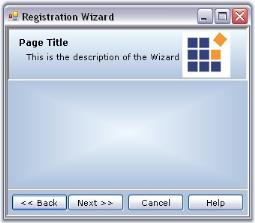

# Wizard control appearance

This section discusses the various appearance settings of the Wizard controls.

## Foreground settings

### Wizard control foreground

The appearance of the text in the Wizard control can be controlled using the [Font](https://docs.microsoft.com/en-us/dotnet/api/system.windows.forms.control.font?redirectedfrom=MSDN&view=netframework-4.7.2#System_Windows_Forms_Control_Font) and [ForeColor](https://docs.microsoft.com/en-us/dotnet/api/system.windows.forms.control.forecolor?view=netframework-4.7.2) properties.

N> These [WizardControl.Font](https://docs.microsoft.com/en-us/dotnet/api/system.windows.forms.control.font?redirectedfrom=MSDN&view=netframework-4.7.2#System_Windows_Forms_Control_Font) property will be applied only to the Description text and the Button texts of the Wizard Page. [WizardControl.ForeColor](https://docs.microsoft.com/en-us/dotnet/api/system.windows.forms.control.forecolor?view=netframework-4.7.2) property will be applied to the Page [Title](https://help.syncfusion.com/cr/windowsforms/Syncfusion.Windows.Forms.Tools.WizardControl.html#Syncfusion_Windows_Forms_Tools_WizardControl_Title) and [description](https://help.syncfusion.com/cr/windowsforms/Syncfusion.Windows.Forms.Tools.WizardControl.html#Syncfusion_Windows_Forms_Tools_WizardControl_Description) text alone. To set Font style for Title and description, see Title and Description Settings topic.





//Foreground Settings for the display text 

this.wizardControl1.Font = new System.Drawing.Font("Verdana", 8.25F, System.Drawing.FontStyle.Regular);

this.wizardControl1.ForeColor = System.Drawing.Color.DarkBlue;





'Foreground Settings for the display text 

Me.wizardControl1.Font = New System.Drawing.Font("Verdana", 8.25F, System.Drawing.FontStyle.Regular)

Me.wizardControl1.ForeColor = System.Drawing.Color.DarkBlue





 

N> These settings can be overridden by the individual [WizardPage.Font](https://docs.microsoft.com/en-us/dotnet/api/system.windows.forms.control.font?redirectedfrom=MSDN&view=netframework-4.7.2#System_Windows_Forms_Control_Font) and [WizardControl.ForeColor](https://docs.microsoft.com/en-us/dotnet/api/system.windows.forms.control.forecolor?view=netframework-4.7.2) settings.

The foreground settings for the Button text can be overridden by the [WizardPage.Button.Font](https://docs.microsoft.com/en-us/dotnet/api/system.windows.forms.control.font?redirectedfrom=MSDN&view=netframework-4.7.2#System_Windows_Forms_Control_Font) and [WizardPage.Button.ForeColor](https://docs.microsoft.com/en-us/dotnet/api/system.windows.forms.control.forecolor?view=netframework-4.7.2) settings also. See Button Appearance topic.

### Wizard page foreground

The font and fore color for the display text in a Wizard page can be controlled through below properties.

* [Font](https://docs.microsoft.com/en-us/dotnet/api/system.windows.forms.control.font?redirectedfrom=MSDN&view=netframework-4.7.2#System_Windows_Forms_Control_Font)
* [ForeColor](https://docs.microsoft.com/en-us/dotnet/api/system.windows.forms.control.forecolor?view=netframework-4.7.2)





this.wizardControl1.Font = new System.Drawing.Font("Verdana", 8.25F, System.Drawing.FontStyle.Regular);

this.wizardControl1.ForeColor = System.Drawing.Color.Black;





Me.wizardControl1.Font = New System.Drawing.Font("Verdana", 8.25F, System.Drawing.FontStyle.Regular) 

Me.wizardControl1.ForeColor = System.Drawing.Color.Black





 

## Background settings

### Wizard control background

The background of the Wizard control can be customized through the below properties.

* [BackColor](https://docs.microsoft.com/en-us/dotnet/api/system.windows.forms.control.backcolor?redirectedfrom=MSDN&view=netframework-4.7.2#System_Windows_Forms_Control_BackColor)
* [BackgroundImage](https://docs.microsoft.com/en-us/dotnet/api/system.windows.forms.control.backgroundimage?view=netframework-4.7.2)
* [BackgroundImageLayout](https://docs.microsoft.com/en-us/dotnet/api/system.windows.forms.control.backgroundimagelayout?view=netframework-4.7.2)





this.wizardControl1.BackColor = System.Drawing.Color.LightSteelBlue;





Me.wizardControl1.BackColor = System.Drawing.Color.LightSteelBlue





N> By default the background settings of the Wizard control will be overridden by the Wizard Container background settings.

### Banner panel background

The below properties lets you customize the banner panel in a Wizard Control.

* [BackColor](https://docs.microsoft.com/en-us/dotnet/api/system.windows.forms.control.backcolor?redirectedfrom=MSDN&view=netframework-4.7.2#System_Windows_Forms_Control_BackColor)
* [BackgroundColor](https://docs.microsoft.com/en-us/dotnet/api/system.windows.forms.control.backcolor?redirectedfrom=MSDN&view=netframework-4.7.2#System_Windows_Forms_Control_BackColor)
* [BackgroundImage](https://docs.microsoft.com/en-us/dotnet/api/system.windows.forms.control.backgroundimage?view=netframework-4.7.2)
* [BackgroundImageLayout](https://docs.microsoft.com/en-us/dotnet/api/system.windows.forms.control.backgroundimagelayout?view=netframework-4.7.2)





this.gradientPanel1.BackgroundColor = new Syncfusion.Drawing.BrushInfo(Syncfusion.Drawing.GradientStyle.Vertical, System.Drawing.Color.AliceBlue, System.Drawing.Color.LightSteelBlue);





Me.gradientPanel1.BackgroundColor = New Syncfusion.Drawing.BrushInfo(Syncfusion.Drawing.GradientStyle.Vertical, System.Drawing.Color.AliceBlue, System.Drawing.Color.LightSteelBlue) 





 

### Wizard page background

The below properties lets you customize the Wizard page in a Wizard Control.

* [BackColor](https://docs.microsoft.com/en-us/dotnet/api/system.windows.forms.control.backcolor?redirectedfrom=MSDN&view=netframework-4.7.2#System_Windows_Forms_Control_BackColor)
* [BackgroundColor](https://docs.microsoft.com/en-us/dotnet/api/system.windows.forms.control.backcolor?redirectedfrom=MSDN&view=netframework-4.7.2#System_Windows_Forms_Control_BackColor)
* [BackgroundImage](https://docs.microsoft.com/en-us/dotnet/api/system.windows.forms.control.backgroundimage?view=netframework-4.7.2)
* [BackgroundImageLayout](https://docs.microsoft.com/en-us/dotnet/api/system.windows.forms.control.backgroundimagelayout?view=netframework-4.7.2)





this.wizardControlPage2.BackgroundColor = new Syncfusion.Drawing.BrushInfo(Syncfusion.Drawing.GradientStyle.PathRectangle, System.Drawing.Color.AliceBlue, System.Drawing.Color.LightSteelBlue);





Me.wizardControlPage2.BackgroundColor = New Syncfusion.Drawing.BrushInfo(Syncfusion.Drawing.GradientStyle.PathRectangle, System.Drawing.Color.AliceBlue, System.Drawing.Color.LightSteelBlue) 





 

## Border styles

### Wizard control

The various border styles for a Wizard control are as follows.

* None
* FixedSingle and
* Fixed3D





this.wizardControl1.BorderStyle = System.Windows.Forms.BorderStyle.FixedSingle;





Me.wizardControl1.BorderStyle = System.Windows.Forms.BorderStyle.FixedSingle





 

### Banner panel

Banner Panel is a simple gradient panel whose 3D border styles are as follows.

* RaisedOuter
* SunkenOuter
* RaisedInner
* Raised
* Etched
* SunkenInner
* Bump
* Sunken
* Adjust
* Flat

N> The [GradientPanel.BorderStyle](https://help.syncfusion.com/cr/windowsforms/Syncfusion.Windows.Forms.Tools.GradientPanel.html#Syncfusion_Windows_Forms_Tools_GradientPanel_BorderStyle) property should be set to Fixed3D to make this setting effective.





this.gradientPanel1.Border3DStyle = System.Windows.Forms.Border3DStyle.Sunken;

this.gradientPanel1.BorderStyle = System.Windows.Forms.BorderStyle.Fixed3D;





Me.gradientPanel1.Border3DStyle = System.Windows.Forms.Border3DStyle.Sunken

Me.gradientPanel1.BorderStyle = System.Windows.Forms.BorderStyle.Fixed3D





 

You can use the below properties to set 2D border style for the Banner Control when [GradientPanel.BorderStyle](https://help.syncfusion.com/cr/windowsforms/Syncfusion.Windows.Forms.Tools.GradientPanel.html#Syncfusion_Windows_Forms_Tools_GradientPanel_BorderStyle) property is set to FixedSingle.

* [BorderColor](https://help.syncfusion.com/cr/windowsforms/Syncfusion.Windows.Forms.Tools.GradientPanel.html#Syncfusion_Windows_Forms_Tools_GradientPanel_BorderColor)
* [BorderSides](https://help.syncfusion.com/cr/windowsforms/Syncfusion.Windows.Forms.Tools.GradientPanel.html#Syncfusion_Windows_Forms_Tools_GradientPanel_BorderSides)
* [BorderSingle](https://help.syncfusion.com/cr/windowsforms/Syncfusion.Windows.Forms.Tools.GradientPanel.html#Syncfusion_Windows_Forms_Tools_GradientPanel_BorderSingle)

### Wizard page border

The below properties controls the border settings for a Wizard control page.

* [BorderStyle](https://help.syncfusion.com/cr/windowsforms/Syncfusion.Windows.Forms.Tools.GradientPanel.html#Syncfusion_Windows_Forms_Tools_GradientPanel_BorderStyle)
* [Border3DStyle](https://help.syncfusion.com/cr/windowsforms/Syncfusion.Windows.Forms.Tools.GradientPanel.html#Syncfusion_Windows_Forms_Tools_GradientPanel_Border3DStyle)
* [BorderColor](https://help.syncfusion.com/cr/windowsforms/Syncfusion.Windows.Forms.Tools.GradientPanel.html#Syncfusion_Windows_Forms_Tools_GradientPanel_BorderColor)
* [BorderSides](https://help.syncfusion.com/cr/windowsforms/Syncfusion.Windows.Forms.Tools.GradientPanel.html#Syncfusion_Windows_Forms_Tools_GradientPanel_BorderSides)
* [BorderSingle](https://help.syncfusion.com/cr/windowsforms/Syncfusion.Windows.Forms.Tools.GradientPanel.html#Syncfusion_Windows_Forms_Tools_GradientPanel_BorderSingle)

