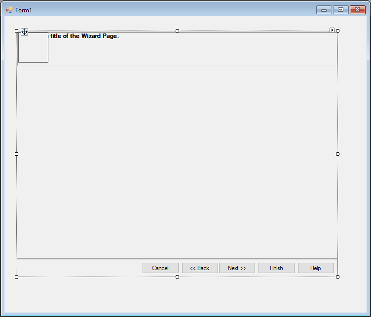
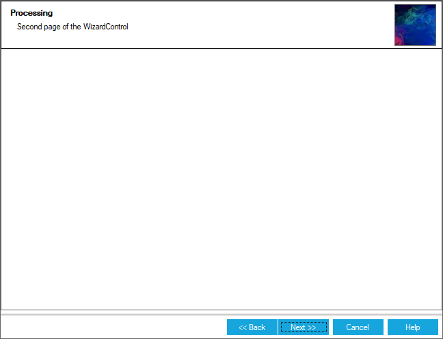
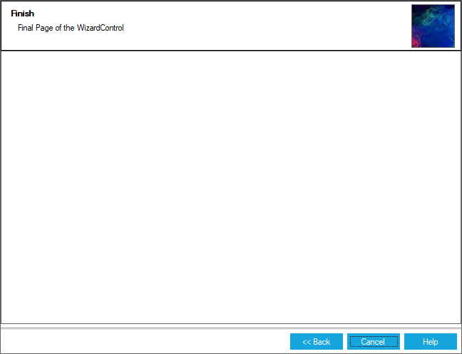

# Getting started

This section describes how to add [WizardControl](https://help.syncfusion.com/cr/cref_files/windowsforms/tools/Syncfusion.Tools.Windows~Syncfusion.Windows.Forms.Tools.WizardControl.html) in a Windows Forms application and overview of its basic functionalities.

## Assembly deployment

The following list of assemblies should be added as reference to use the [WizardControl](https://help.syncfusion.com/cr/cref_files/windowsforms/tools/Syncfusion.Tools.Windows~Syncfusion.Windows.Forms.Tools.WizardControl.html) in any application:

<table>
<tr>
<td>
{{'**Required assemblies**'| markdownify }}
</td>
<td>
{{'**Description**'| markdownify }}
</td>
</tr>
<tr>
<td>
Syncfusion.Grid.Base.dll
</td>
<td>
Syncfusion.Grid.Base contains classes that contains fundamentals and base classes of GridControl.
</td>
</tr>
<tr>
<td>
Syncfusion.Grid.Windows.dll
</td>
<td>
Syncfusion.Grid.Windows contains classes that handles all UI operations, fundamentals and base classes of GridControl which are used in the WizardControl.
</td>
</tr>
<tr>
<td>
Syncfusion.Shared.Base.dll
</td>
<td>
Syncfusion.Shared.Base contains style related properties of WizardControl and various editor controls.
</td>
</tr>
<tr>
<td>
Syncfusion.Shared.Windows.dll
</td>
<td>
Syncfusion.Shared.Windows contains style related properties of WizardControl and various editor controls.
</td>
</tr>
<tr>
<td>
Syncfusion.Tools.Base.dll
</td>
<td>
Syncfusion.Tools.Base contains base class which used for WizardControl control.
</td>
</tr>
<tr>
<td>
Syncfusion.Tools.Windows.dll
</td>
<td>
Syncfusion.Tools.Windows contains the class that handles all UI operations and contains helper class of WizardControl control.
</td>
</tr>
</table>

## Installing NuGet Packages

To use WizardControl control in Windows Forms application via nuget, the following packages should be installed.
 
<table>
<tr>
<td>{{'**S.No**'| markdownify }}
</td>
<td>{{'**Framework version**'| markdownify }}
</td>
<td>{{'**NuGet Packages**'| markdownify }}
</td>
</tr>
<tr>
<td> 1
</td>
<td> 2.0
</td>
<td> Syncfusion.Tools.Windows20
</td>
</tr>
<tr>
<td> 2
</td>
<td> 3.5
</td>
<td> Syncfusion.Tools.Windows35
</td>
</tr>
<tr>
<td> 3
</td>
<td> 4.0
</td>
<td> Syncfusion.Tools.Windows40
</td>
</tr>
<tr>
<td> 4
</td>
<td> 4.5
</td>
<td> Syncfusion.Tools.Windows45
</td>
</tr>
<tr>
<td> 5
</td>
<td> 4.5.1
</td>
<td>Syncfusion.Tools.Windows451
</td>
</tr>
<tr>
<td> 6
</td>
<td> 4.6
</td>
<td>Syncfusion.Tools.Windows46
</td>
</tr>
</table>
 
Please find more details regarding how to install the nuget packages in windows form application in the below link:
 
[How to install nuget packages](https://help.syncfusion.com/windowsforms/nuget-packages)

# Creating simple application with WizardControl

You can create the Windows Forms application with WizardControl control as follows:

1. [Creating project](#creating-the-project)
2. [Adding control via Form Designer](#adding-control-via-designer)
3. [Adding control manually using code](#adding-control-manually-in-code)
4. [Configure WizardPages](#configure-wizardpages)

### Creating the project

Create a new Windows Forms project in the Visual Studio to display the [WizardControl](https://help.syncfusion.com/cr/cref_files/windowsforms/tools/Syncfusion.Tools.Windows~Syncfusion.Windows.Forms.Tools.WizardControl.html) with functionalities.

## Adding control via designer

The [WizardControl](https://help.syncfusion.com/cr/cref_files/windowsforms/tools/Syncfusion.Tools.Windows~Syncfusion.Windows.Forms.Tools.WizardControl.html) control can be added to the application by dragging it from the toolbox and dropping it in a designer view. The following required assembly references will be added automatically:

* Syncfusion.Grid.Base.dll
* Syncfusion.Grid.Windows.dll
* Syncfusion.Shared.Base.dll
* Syncfusion.Shared.Windows.dll
* Syncfusion.Tools.Base.dll
* Syncfusion.Tools.Windows.dll

## Adding control manually in code

To add control manually in C#, follow the given steps:

**Step 1** : Add the following required assembly references to the project:

* Syncfusion.Grid.Base.dll
* Syncfusion.Grid.Windows.dll
* Syncfusion.Shared.Base.dll
* Syncfusion.Shared.Windows.dll
* Syncfusion.Tools.Base.dll
* Syncfusion.Tools.Windows.dll

**Step 2** : Include the namespaces **Syncfusion.Tools.Windows**.





using Syncfusion.Tools.Windows;





Imports Syncfusion.Tools.Windows



 

**Step 3** : Create [WizardControl](https://help.syncfusion.com/cr/cref_files/windowsforms/tools/Syncfusion.Tools.Windows~Syncfusion.Windows.Forms.Tools.WizardControl.html) control instance and add it to the form.





WizardControl wizardControl1 = new WizardControl();

this.wizardControl1.Style = Theme.Metro;

this.Controls.Add(wizardControl1);





Dim wizardControl1 As WizardControl = New WizardControl()

Me.wizardControl1.Style = Theme.Metro

Me.Controls.Add(wizardControl1)





**Adding WizardControlPage into WizardControl**

Create an instance of [WizardContainer](https://help.syncfusion.com/cr/cref_files/windowsforms/tools/Syncfusion.Tools.Windows~Syncfusion.Windows.Forms.Tools.WizardContainer.html), add it to WizardControl and set it as [WizardPageContainer](https://help.syncfusion.com/cr/cref_files/windowsforms/tools/Syncfusion.Tools.Windows~Syncfusion.Windows.Forms.Tools.WizardControl~WizardPageContainer.html) of WizardControl. WizardControlPages can be added to using [WizardPages](https://help.syncfusion.com/cr/cref_files/windowsforms/tools/Syncfusion.Tools.Windows~Syncfusion.Windows.Forms.Tools.WizardControl~WizardPages.html) collection property.





WizardContainer wizardContainer1 = new WizardContainer();

WizardControlPage wizardControlPage1 = new WizardControlPage();

this.wizardControl1.Controls.Add(this.wizardContainer1);

this.wizardControl1.WizardPageContainer = this.wizardContainer1;

this.wizardContainer1.Controls.Add(this.wizardControlPage1);

this.wizardControl1.WizardPages = new WizardControlPage[] {
        this.wizardControlPage1};





Dim wizardContainer1 As New WizardContainer()

Dim wizardControlPage1 As New WizardControlPage()

Me.wizardControl1.Controls.Add(Me.wizardContainer1)

Me.wizardControl1.WizardPageContainer = Me.wizardContainer1

Me.wizardContainer1.Controls.Add(Me.wizardControlPage1)

Me.wizardControl1.WizardPages = New WizardControlPage() { Me.wizardControlPage1}





**Adding Controls to BannerPanel** 

Controls can be added to header of the WizardControl using [BannerPanel](https://help.syncfusion.com/cr/cref_files/windowsforms/tools/Syncfusion.Tools.Windows~Syncfusion.Windows.Forms.Tools.WizardControl~BannerPanel.html) property where panel containing the desired controls is added. 





// Create instance of controls to be added

GradientPanel gradientPanel1 = new GradientPanel();
Label label1 = new Label();
Label label2 = new Label();

this.label1.Text = "Page Title";
this.label2.Text = "This is the description of the Wizard Page";

this.gradientPanel1.Controls.Add(this.label1);
this.gradientPanel1.Controls.Add(this.label2);

// Adding it to WizardControl

this.wizardControl1.Controls.Add(this.gradientPanel1);

this.wizardControl1.Title = this.label1;
this.wizardControl1.Description = this.label2;
this.wizardControl1.BannerPanel = this.gradientPanel1;





'' Create instance of controls to be added

Dim gradientPanel1 As New GradientPanel()
Dim label1 As New Label()
Dim label2 As New Label()

Me.label1.Text = "Page Title"
Me.label2.Text = "This is the description of the Wizard Page"

Me.gradientPanel1.Controls.Add(Me.label1)
Me.gradientPanel1.Controls.Add(Me.label2)
 
'' Adding it to WizardControl 

Me.wizardControl1.Controls.Add(Me.gradientPanel1)

Me.wizardControl1.Title = Me.label1
Me.wizardControl1.Description = Me.label2
Me.wizardControl1.BannerPanel = Me.gradientPanel1





## Configure WizardPages

Below code demonstrates adding two or more [WizardPages](https://help.syncfusion.com/cr/cref_files/windowsforms/tools/Syncfusion.Tools.Windows~Syncfusion.Windows.Forms.Tools.WizardPage.html) with sequencing details.





// Create instance of page elements

WizardControlPage wizardControlPage1 = new WizardControlPage();
WizardControlPage wizardControlPage2 = new WizardControlPage();
WizardControlPage wizardControlPage3 = new WizardControlPage();

// configure pages
this.wizardControlPage1.Title = "Welcome";
this.wizardControlPage1.Description = "First page of the WizardControl";
this.wizardControlPage1.BackVisible = false;

this.wizardControlPage2.Title = "Processing";
this.wizardControlPage2.Description = "Second page of the WizardControl";

this.wizardControlPage3.Title = "Finished";
this.wizardControlPage3.Description = "Final page of the WizardControl";
this.wizardControlPage3.NextVisible = false;
this.wizardControlPage3.CancelVisible = false;
this.wizardControlPage3.FinishVisible = true;

this.pictureBox1.Image = ((System.Drawing.Image)(resources.GetObject("pictureBox1.Image")));
this.wizardControl1.Banner = this.pictureBox1;

// Add pages into wizard Control
 this.wizardControl1.WizardPages = new Syncfusion.Windows.Forms.Tools.WizardControlPage[] {
        this.wizardControlPage1,
        this.wizardControlPage2,
        this.wizardControlPage3};





' Create instance of page elements

Dim wizardControlPage1 As New WizardControlPage()
Dim wizardControlPage2 As New WizardControlPage()
Dim wizardControlPage3 As New WizardControlPage()

' configure pages
Me.wizardControlPage1.Title = "Welcome"
Me.wizardControlPage1.Description = "First page of the WizardControl"
Me.wizardControlPage1.BackVisible = False

Me.wizardControlPage2.Title = "Processing"
Me.wizardControlPage2.Description = "Second page of the WizardControl"

Me.wizardControlPage3.Title = "Finish"
Me.wizardControlPage3.Description = "Final page of the WizardControl"
Me.wizardControlPage3.NextVisible = False
Me.wizardControlPage3.CancelVisible = False
Me.wizardControlPage3.FinishVisible = True

Me.pictureBox1.Image = (CType(resources.GetObject("pictureBox1.Image"), System.Drawing.Image))
Me.wizardControl1.Banner = Me.pictureBox1

' Add pages into wizard Control
 Me.wizardControl1.WizardPages = New Syncfusion.Windows.Forms.Tools.WizardControlPage() { Me.wizardControlPage1, Me.wizardControlPage2, Me.wizardControlPage3}





