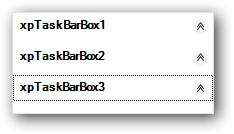

# Getting started

This section describes how to add `XPTaskBar` control in a Windows Forms application and overview of its basic functionalities.

## Assembly deployment

The following list of assemblies should be added as reference to use the XPTaskBar in any application:

<table>
<tr>
<td>
{{'**Required assemblies**'| markdownify }}
</td>
<td>
{{'**Description**'| markdownify }}
</td>
</tr>
<tr>
<td>
Syncfusion.Grid.Base.dll
</td>
<td>
Syncfusion.Grid.Base contains classes that contains fundamentals and base classes of GridControl.
</td>
</tr>
<tr>
<td>
Syncfusion.Grid.Windows.dll
</td>
<td>
Syncfusion.Grid.Windows contains classes that handles all UI operations, fundamentals and base classes of GridControl which are used in the XPTaskBar control.
</td>
</tr>
<tr>
<td>
Syncfusion.Shared.Base.dll
</td>
<td>
Syncfusion.Shared.Base contains style related properties of XPTaskBar and various editor controls.
</td>
</tr>
<tr>
<td>
Syncfusion.Shared.Windows.dll
</td>
<td>
Syncfusion.Shared.Windows contains style related properties of XPTaskBar and various editor controls.
</td>
</tr>
<tr>
<td>
Syncfusion.Tools.Base.dll
</td>
<td>
Syncfusion.Tools.Base contains base class which used for XPTaskBar control.
</td>
</tr>
<tr>
<td>
Syncfusion.Tools.Windows.dll
</td>
<td>
Syncfusion.Tools.Windows contains the class that handles all UI operations and contains helper class of XPTaskBar control.
</td>
</tr>
</table>

## Installing NuGet Packages

To use XPTaskBar control in Windows Forms application via nuget, the following packages should be installed.
 
<table>
<tr>
<td>{{'**S.No**'| markdownify }}
</td>
<td>{{'**Framework version**'| markdownify }}
</td>
<td>{{'**NuGet Packages**'| markdownify }}
</td>
</tr>
<tr>
<td> 1
</td>
<td> 2.0
</td>
<td> Syncfusion.Tools.Windows20
</td>
</tr>
<tr>
<td> 2
</td>
<td> 3.5
</td>
<td> Syncfusion.Tools.Windows35
</td>
</tr>
<tr>
<td> 3
</td>
<td> 4.0
</td>
<td> Syncfusion.Tools.Windows40
</td>
</tr>
<tr>
<td> 4
</td>
<td> 4.5
</td>
<td> Syncfusion.Tools.Windows45
</td>
</tr>
<tr>
<td> 5
</td>
<td> 4.5.1
</td>
<td>Syncfusion.Tools.Windows451
</td>
</tr>
<tr>
<td> 6
</td>
<td> 4.6
</td>
<td>Syncfusion.Tools.Windows46
</td>
</tr>
</table>
 
Please find more details regarding how to install the nuget packages in windows form application in the below link:
 
[How to install nuget packages](https://help.syncfusion.com/windowsforms/nuget-packages)

# Creating simple application with XPTaskBar

You can create the Windows Forms application with XPTaskBar control as follows:

1. [Creating project](#creating-the-project)
2. [Adding control via Designer](#adding-control-via-designer)
3. [Adding control manually in code](#adding-control-manually-in-code)

### Creating the project

Create a new Windows Forms project in the Visual Studio to display the XPTaskBar with  functionalities.

## Adding control via designer

The XPTaskBar control can be added to the application by dragging it from the toolbox and dropping it in a designer view. The following required assembly references will be added automatically:

* Syncfusion.Grid.Base.dll
* Syncfusion.Grid.Windows.dll
* Syncfusion.Shared.Base.dll
* Syncfusion.Shared.Windows.dll
* Syncfusion.Tools.Base.dll
* Syncfusion.Tools.Windows.dll

**Adding XPTaskBarBox**

To add XPTaskBarBox, click on `Add TaskBarBox` in Smart Tag of XPTaskBar in design view.

**Adding XPTaskBarItems**

XPTaskBarItems can be added to XPTaskBarBox using `Items` collection, in Smart Tag of XPTaskBarBox in design view.

## Adding control manually in code

To add control manually in C#, follow the given steps:

1. Add the following required assembly references to the project:

* Syncfusion.Grid.Base.dll
* Syncfusion.Grid.Windows.dll
* Syncfusion.Shared.Base.dll
* Syncfusion.Shared.Windows.dll
* Syncfusion.Tools.Base.dll
* Syncfusion.Tools.Windows.dll

2. Include the namespaces **Syncfusion.Tools.Windows**.





using Syncfusion.Tools.Windows;





Imports Syncfusion.Tools.Windows



 

2. Create `XPTaskBar` control instance and add it to the form.





XPTaskBar xpTaskBar1 = new XPTaskBar();

this.Controls.Add(xpTaskBar1);





Dim xpTaskBar1 As XPTaskBar = New XPTaskBar()

Me.Controls.Add(xpTaskBar1)





**Adding XPTaskBarBox**

Create an instance for `XPTaskBarBox` class and add it to XPTaskBar's controls collection.





XPTaskBarBox xpTaskBarBox1 = new XPTaskBarBox();
XPTaskBarBox xpTaskBarBox2 = new XPTaskBarBox();
XPTaskBarBox xpTaskBarBox3 = new XPTaskBarBox();

this.xpTaskBarBox1.Text = "xpTaskBarBox1";
this.xpTaskBarBox2.Text = "xpTaskBarBox2";
this.xpTaskBarBox3.Text = "xpTaskBarBox3";

this.xpTaskBar1.Controls.Add(this.xpTaskBarBox1);
this.xpTaskBar2.Controls.Add(this.xpTaskBarBox2);
this.xpTaskBar3.Controls.Add(this.xpTaskBarBox3);





Dim xpTaskBarBox1 As XPTaskBarBox = New XPTaskBarBox()
Dim xpTaskBarBox2 As XPTaskBarBox = New XPTaskBarBox()
Dim xpTaskBarBox3 As XPTaskBarBox = New XPTaskBarBox()

Me.xpTaskBarBox1.Text = "xpTaskBarBox1"
Me.xpTaskBarBox2.Text = "xpTaskBarBox2"
Me.xpTaskBarBox3.Text = "xpTaskBarBox3"

Me.xpTaskBar1.Controls.Add(Me.xpTaskBarBox1)
Me.xpTaskBar2.Controls.Add(Me.xpTaskBarBox2)
Me.xpTaskBar3.Controls.Add(Me.xpTaskBarBox3)





**Adding XPTaskBarItems**

XPTaskBarItems can be added to XPTaskBarBox using `Items` collection in XPTaskBarBox class.





this.xpTaskBarBox1.Items.AddRange(new Syncfusion.Windows.Forms.Tools.XPTaskBarItem[] {
            new Syncfusion.Windows.Forms.Tools.XPTaskBarItem("XPTaskBarItem5", System.Drawing.Color.Empty, -1, "XPTaskBarItem5"),
            new Syncfusion.Windows.Forms.Tools.XPTaskBarItem("XPTaskBarItem6", System.Drawing.Color.Empty, -1, "XPTaskBarItem6")});





Me.xpTaskBarBox1.Items.AddRange(New Syncfusion.Windows.Forms.Tools.XPTaskBarItem[] {
            New Syncfusion.Windows.Forms.Tools.XPTaskBarItem("XPTaskBarItem5", System.Drawing.Color.Empty, -1, "XPTaskBarItem5"),
            New Syncfusion.Windows.Forms.Tools.XPTaskBarItem("XPTaskBarItem6", System.Drawing.Color.Empty, -1, "XPTaskBarItem6")})





