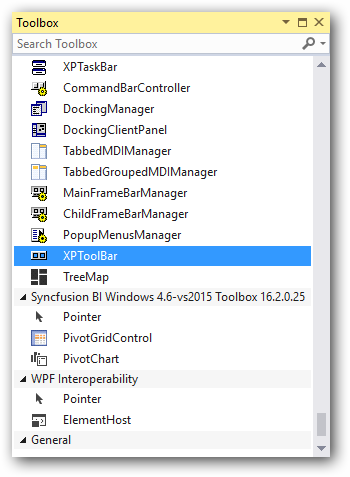
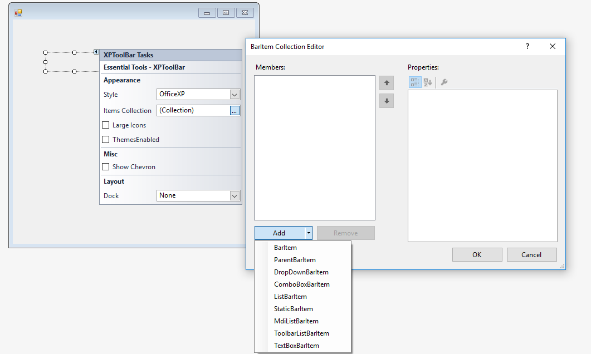
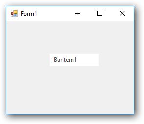
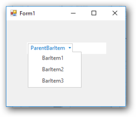
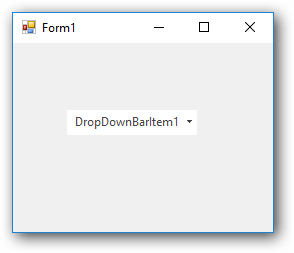
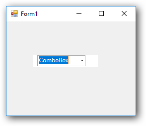
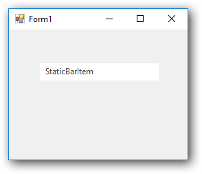
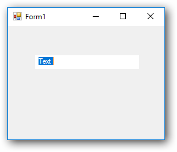
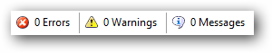

# Getting started

This section describes how to add `XPToolBar` control in a Windows Forms application and overview of its basic functionalities.

## Assembly deployment

Refer [control dependencies](https://help.syncfusion.com/windowsforms/control-dependencies#xptoolbar) section to get the list of assemblies or NuGet package needs to be added as reference to use the control in any application.
 
Please find more details regarding how to install the nuget packages in windows form application in the below link:
 
[How to install nuget packages](https://help.syncfusion.com/windowsforms/nuget-packages)

# Creating simple application with XPToolBar

You can create the Windows Forms application with XPToolBar control as follows:

1. [Creating project](#creating-the-project)
2. [Adding control via designer](#adding-control-via-designer)
3. [Adding control manually using code](#adding-control-manually-using-code)
4. [Supported BarItem types](#Supported-BarItem-types)
5. [Adding separators](#Adding-separators)

### Creating the project

Create a new Windows Forms project in the Visual Studio to display the XPToolBar with  functionalities.

## Adding control via Form designer

The XPToolBar control can be added to the application by dragging it from the toolbox and dropping it in a designer view. The following required assembly references will be added automatically:

* Syncfusion.Grid.Base.dll
* Syncfusion.Grid.Windows.dll
* Syncfusion.Shared.Base.dll
* Syncfusion.Shared.Windows.dll
* Syncfusion.Tools.Base.dll
* Syncfusion.Tools.Windows.dll

**Adding BarItems**

BarItems can be added to XPToolBar using `Items` collection in Smart Tags of XPToolBar control.

## Adding control manually using code

To add control manually in C#, follow the given steps:

**Step 1** - Add the following required assembly references to the project:

* Syncfusion.Grid.Base.dll
* Syncfusion.Grid.Windows.dll
* Syncfusion.Shared.Base.dll
* Syncfusion.Shared.Windows.dll
* Syncfusion.Tools.Base.dll
* Syncfusion.Tools.Windows.dll

**Step 2** - Include the namespaces **Syncfusion.Windows.Forms.Tools.XPMenus**.





using Syncfusion.Windows.Forms.Tools.XPMenus;





Imports Syncfusion.Windows.Forms.Tools.XPMenus



 

**Step 3** - Create `XPToolBar` control instance and add it to the form.





 XPToolBar xpToolBar1 = new XPToolBar();

this.Controls.Add(xpToolBar1);





Dim xpToolBar1 As XPToolBar = New XPToolBar()

Me.Controls.Add(xpToolBar1)





**Adding BarItem**

Create an instance for required `BarItem` and add it to XPToolbar's Item collection.





ComboBoxBarItem comboBoxBarItem1 = new ComboBoxBarItem();
ParentBarItem parentBarItem1 = new ParentBarItem();

parentBarItem1.Text="parentBarItem1";

this.xpToolBar1.Bar.Items.AddRange(new BarItem[] {
            this.comboBoxBarItem1,
            this.parentBarItem1});





Dim comboBoxBarItem1 As ComboBoxBarItem = New ComboBoxBarItem()
Dim parentBarItem1 As ParentBarItem = New ParentBarItem()

Me.parentBarItem1.Text="parentBarItem1"

Me.xpToolBar1.Bar.Items.AddRange(New BarItem[] {
            Me.comboBoxBarItem1,
            Me.parentBarItem1})





## Supported BarItem types

The various types of BarItems supported by XPToolBar are:

* **BarItem**

BarItem represents an individual item in a menu structure.

* **ParentBarItem**

ParentBarItems represents the submenu that can be dropped down. BarItems can be added to ParentBarItems using `Item` collection property.

* **DropDownBarItem**

DropDownBarItem represents SubMenu that will drop down a popup when clicked on it

* **ComboBoxBarItem**

ComboBoxBarItem represents a BarItem that provides the combo box functionality in the XPMenus.

* **StaticBarItem**

 StaticBarItem represents a BarItem that could be used as a label for an adjacent BarItem.

* **TextBoxBarItem**

TextBoxBarItem represents a BarItem that provides the TextBox functionality in the XPMenus.

## Adding separators

In the absence of a BarManager, you can add separators to the items by editing the XPToolBar.SeparatorIndices property list.

Property table

<table>
<tr>
<th>
XPToolBar property</th><th>
Description</th></tr>
<tr>
<td>
SeparatorIndices</td><td>
Specifies the Indices values after which the separator have to be placed in an XPToolbar.</td></tr>
</table>





this.xpToolBar1.SeparatorIndices.AddRange(new int[] {1, 2});




Me.xpToolBar1.SeparatorIndices.AddRange(New Integer() {1, 2})





