# Adding bar items to a toolbar

The various types of BarItems supported by XPToolBar are,

* BarItem
* ParentBarItem
* DropDownBarItem
* ComboBoxBarItem
* ListBarItem
* StaticBarItem
* ToolbarListBarItem
* TextBoxBarItem

## BarItem

BarItem represents an individual item in a menu structure.

>**NOTE** :  
Please refer ["Getting Started"](https://help.syncfusion.com/windowsforms/xptoolbar/getting-started) section for adding BarItem to the XPToolBar control.

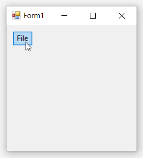

## ParentBarItem

ParentBarItems represents the submenu that appears on drop down list. BarItems can be added to ParentBarItems using Item collection editor.

### Through Designer

1. Once XPToolBar control is added, we can add the parent bar item by right-clicking on the control in the designer and select **Properties**. Now, in the **Properties** panel, under **Misc > Items** select the items from the **BarItem Collection Editor**.

   

   

2. In **BarItem Collection Editor** window, under **Appearance > Text** we can set the text for parent bar item.

   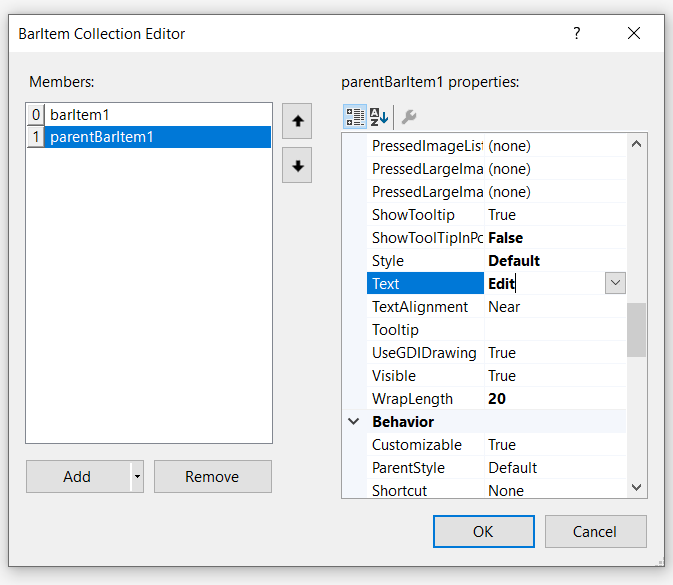

3. Smilarly, we can add the sub menu items in **BarItem Collection Editor** window under **Misc > Items**.

   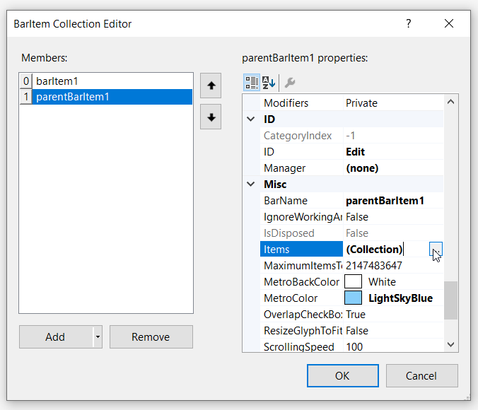

   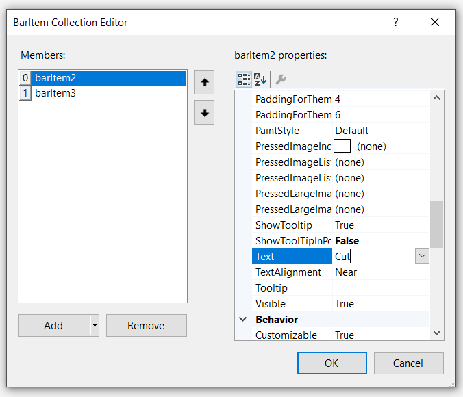

4. Smilarly, we can add the image for sub menu items in **BarItem Collection Editor** window under **Appearance > Image**.

   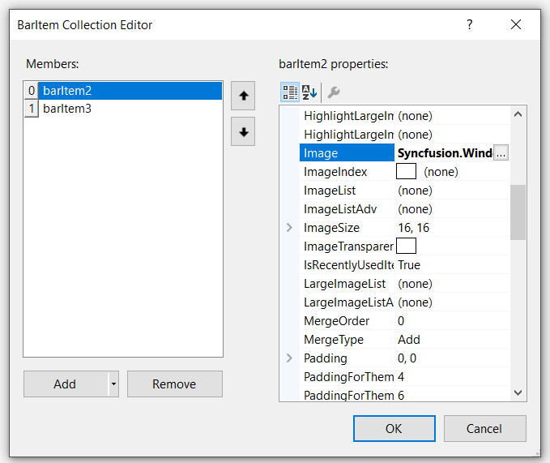

5. Finally, we can add **ParentBarItem** with sub menu items in XPToolBar control.

   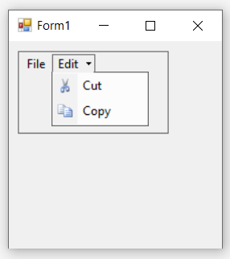

### Through Code

The below code snippets add **ParentBarItem** to the XPToolbar control.




//Declaration
private Syncfusion.Windows.Forms.Tools.XPMenus.XPToolBar xpToolBar1;
private Syncfusion.Windows.Forms.Tools.XPMenus.BarItem barItem1;
private Syncfusion.Windows.Forms.Tools.XPMenus.ParentBarItem parentBarItem1;
private Syncfusion.Windows.Forms.Tools.XPMenus.BarItem barItem2;
private Syncfusion.Windows.Forms.Tools.XPMenus.BarItem barItem3;
private System.Windows.Forms.Panel panel1;

//Initializing
this.xpToolBar1 = new Syncfusion.Windows.Forms.Tools.XPMenus.XPToolBar();
this.barItem1 = new Syncfusion.Windows.Forms.Tools.XPMenus.BarItem();
this.parentBarItem1 = new Syncfusion.Windows.Forms.Tools.XPMenus.ParentBarItem();
this.barItem2 = new Syncfusion.Windows.Forms.Tools.XPMenus.BarItem();
this.barItem3 = new Syncfusion.Windows.Forms.Tools.XPMenus.BarItem();
this.panel1 = new System.Windows.Forms.Panel();

// barItem1
this.barItem1.Text = "File";

// barItem2
this.barItem2.Image = System.Drawing.Image.FromFile(@"..\..\..\Cut.png");
this.barItem2.Text = "Cut";

// barItem3
this.barItem3.Image = System.Drawing.Image.FromFile(@"..\..\..\Copy.png");
this.barItem3.Text = "Copy";

// parentBarItem1
this.parentBarItem1.Text = "Edit";          
this.parentBarItem1.Items.AddRange(new Syncfusion.Windows.Forms.Tools.XPMenus.BarItem[] { this.barItem2, this.barItem3});

// panel1
this.panel1.Controls.Add(this.xpToolBar1);

// xpToolBar1
this.xpToolBar1.Text = "xpToolBar1";
this.xpToolBar1.Bar.Items.AddRange(new Syncfusion.Windows.Forms.Tools.XPMenus.BarItem[] { this.barItem1, this.parentBarItem1});

//Form
this.Controls.Add(this.panel1);





'Declaration
Private xpToolBar1 As Syncfusion.Windows.Forms.Tools.XPMenus.XPToolBar
Private barItem1 As Syncfusion.Windows.Forms.Tools.XPMenus.BarItem
Private parentBarItem1 As Syncfusion.Windows.Forms.Tools.XPMenus.ParentBarItem
Private barItem2 As Syncfusion.Windows.Forms.Tools.XPMenus.BarItem
Private barItem3 As Syncfusion.Windows.Forms.Tools.XPMenus.BarItem
Private panel1 As System.Windows.Forms.Panel

'Initializing
Me.xpToolBar1 = New Syncfusion.Windows.Forms.Tools.XPMenus.XPToolBar()
Me.barItem1 = New Syncfusion.Windows.Forms.Tools.XPMenus.BarItem()
Me.parentBarItem1 = New Syncfusion.Windows.Forms.Tools.XPMenus.ParentBarItem()
Me.barItem2 = New Syncfusion.Windows.Forms.Tools.XPMenus.BarItem()
Me.barItem3 = New Syncfusion.Windows.Forms.Tools.XPMenus.BarItem()
Me.panel1 = New System.Windows.Forms.Panel()

' barItem1
Me.barItem1.Text = "File"

' barItem2
Me.barItem2.Image = System.Drawing.Image.FromFile("..\..\..\Cut.png")
Me.barItem2.Text = "Cut"

' barItem3
Me.barItem3.Image = System.Drawing.Image.FromFile("..\..\..\Copy.png")
Me.barItem3.Text = "Copy"

' parentBarItem1
Me.parentBarItem1.Text = "Edit"
Me.parentBarItem1.Items.AddRange(New Syncfusion.Windows.Forms.Tools.XPMenus.BarItem() { Me.barItem2, Me.barItem3})

' panel1
Me.panel1.Controls.Add(Me.xpToolBar1)

' xpToolBar1
Me.xpToolBar1.Text = "xpToolBar1"
Me.xpToolBar1.Bar.Items.AddRange(New Syncfusion.Windows.Forms.Tools.XPMenus.BarItem() { Me.barItem1, Me.parentBarItem1})

'Form
Me.Controls.Add(Me.panel1)




## DropDownBarItem

DropDownBarItem represents submenu that will appear as popup when clicked on it.

### Through Designer

1. Once XPToolBar control is added, we can add **DropDownBarItem** by right-clicking on the control in the designer and select **Properties**. Now, in the **Properties** panel, under **Misc > Items** select the items from the **BarItem Collection Editor**.

   

   

2. In **BarItem Collection Editor** window, under **Appearance > Text** we can set the text for DropDownBarItem.

   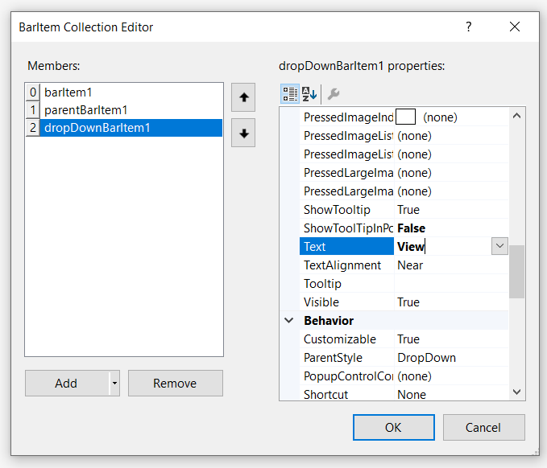

3. To add sub menu items as popup of **DropDownBarItem** we need to drag and drop **PopupControlContainer** to the application and associate this by using **PopupControlContainer** property of DropDownBarItem.

   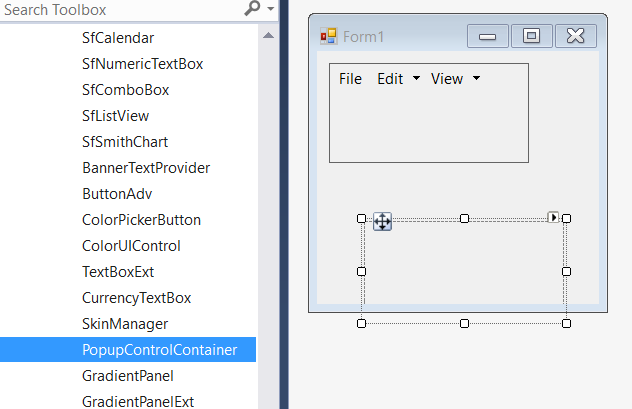

   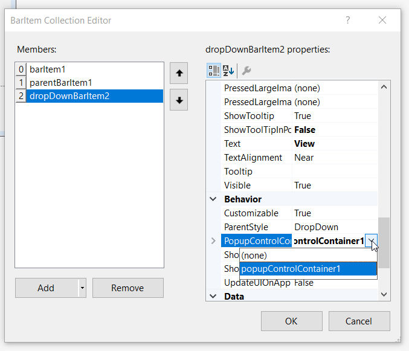

4. Drag and drop any control like Button, Label, TextBox, etc... to the **PopupControlContainer**. In this illustration, we have used **Button**.

### Through Code

The below code snippets add **DropDownBarItem** to the XPToolbar control.




//Declaration
private Syncfusion.Windows.Forms.Tools.XPMenus.XPToolBar xpToolBar1;
private Syncfusion.Windows.Forms.Tools.XPMenus.BarItem barItem1;
private Syncfusion.Windows.Forms.Tools.XPMenus.ParentBarItem parentBarItem1;
private Syncfusion.Windows.Forms.Tools.XPMenus.BarItem barItem2;
private Syncfusion.Windows.Forms.Tools.XPMenus.BarItem barItem3;
private System.Windows.Forms.Panel panel1;
private System.Windows.Forms.Button button1;
private Syncfusion.Windows.Forms.Tools.XPMenus.DropDownBarItem dropDownBarItem1;
private Syncfusion.Windows.Forms.PopupControlContainer popupControlContainer1;

//Initializing
this.xpToolBar1 = new Syncfusion.Windows.Forms.Tools.XPMenus.XPToolBar();
this.barItem1 = new Syncfusion.Windows.Forms.Tools.XPMenus.BarItem();
this.parentBarItem1 = new Syncfusion.Windows.Forms.Tools.XPMenus.ParentBarItem();
this.barItem2 = new Syncfusion.Windows.Forms.Tools.XPMenus.BarItem();
this.barItem3 = new Syncfusion.Windows.Forms.Tools.XPMenus.BarItem();
this.panel1 = new System.Windows.Forms.Panel();
this.button1 = new System.Windows.Forms.Button();
this.dropDownBarItem1 = new Syncfusion.Windows.Forms.Tools.XPMenus.DropDownBarItem();
this.popupControlContainer1 = new Syncfusion.Windows.Forms.PopupControlContainer(this.components);

// barItem1
this.barItem1.Text = "File";

// barItem2
this.barItem2.Image = System.Drawing.Image.FromFile(@"..\..\..\Cut.png");
this.barItem2.Text = "Cut";

// barItem3
this.barItem3.Image = System.Drawing.Image.FromFile(@"..\..\..\Copy.png");
this.barItem3.Text = "Copy";

// parentBarItem1
this.parentBarItem1.Text = "Edit";          
this.parentBarItem1.Items.AddRange(new Syncfusion.Windows.Forms.Tools.XPMenus.BarItem[] { this.barItem2, this.barItem3});

// dropDownBarItem1
this.dropDownBarItem1.PopupControlContainer = this.popupControlContainer1;
this.dropDownBarItem1.Text = "View";

// popupControlContainer1
this.popupControlContainer1.Controls.Add(this.button1);

// button1
this.button1.Text = "Toolbars";
this.button1.Width = 90;

// panel1
this.panel1.Controls.Add(this.xpToolBar1);

// xpToolBar1
this.xpToolBar1.Text = "xpToolBar1";
this.xpToolBar1.Bar.Items.AddRange(new Syncfusion.Windows.Forms.Tools.XPMenus.BarItem[] { this.barItem1, this.parentBarItem1, this.dropDownBarItem1});

//Form
this.Controls.Add(this.panel1);





'Declaration
Private xpToolBar1 As Syncfusion.Windows.Forms.Tools.XPMenus.XPToolBar
Private barItem1 As Syncfusion.Windows.Forms.Tools.XPMenus.BarItem
Private parentBarItem1 As Syncfusion.Windows.Forms.Tools.XPMenus.ParentBarItem
Private barItem2 As Syncfusion.Windows.Forms.Tools.XPMenus.BarItem
Private barItem3 As Syncfusion.Windows.Forms.Tools.XPMenus.BarItem
Private panel1 As System.Windows.Forms.Panel
Private button1 As System.Windows.Forms.Button
Private dropDownBarItem1 As Syncfusion.Windows.Forms.Tools.XPMenus.DropDownBarItem
Private popupControlContainer1 As Syncfusion.Windows.Forms.PopupControlContainer

'Initializing
Me.xpToolBar1 = New Syncfusion.Windows.Forms.Tools.XPMenus.XPToolBar()
Me.barItem1 = New Syncfusion.Windows.Forms.Tools.XPMenus.BarItem()
Me.parentBarItem1 = New Syncfusion.Windows.Forms.Tools.XPMenus.ParentBarItem()
Me.barItem2 = New Syncfusion.Windows.Forms.Tools.XPMenus.BarItem()
Me.barItem3 = New Syncfusion.Windows.Forms.Tools.XPMenus.BarItem()
Me.panel1 = New System.Windows.Forms.Panel()
Me.button1 = New System.Windows.Forms.Button()
Me.dropDownBarItem1 = New Syncfusion.Windows.Forms.Tools.XPMenus.DropDownBarItem()
Me.popupControlContainer1 = New Syncfusion.Windows.Forms.PopupControlContainer(Me.components)

' barItem1
Me.barItem1.Text = "File"

' barItem2
Me.barItem2.Image = System.Drawing.Image.FromFile("..\..\..\Cut.png")
Me.barItem2.Text = "Cut"

' barItem3
Me.barItem3.Image = System.Drawing.Image.FromFile("..\..\..\Copy.png")
Me.barItem3.Text = "Copy"

' parentBarItem1
Me.parentBarItem1.Text = "Edit"
Me.parentBarItem1.Items.AddRange(New Syncfusion.Windows.Forms.Tools.XPMenus.BarItem() { Me.barItem2, Me.barItem3})

' dropDownBarItem1
Me.dropDownBarItem1.PopupControlContainer = Me.popupControlContainer1
Me.dropDownBarItem1.Text = "View"

' popupControlContainer1
Me.popupControlContainer1.Controls.Add(Me.button1)

' button1
Me.button1.Text = "Toolbars"
Me.button1.Width = 90

' panel1
Me.panel1.Controls.Add(Me.xpToolBar1)

' xpToolBar1
Me.xpToolBar1.Text = "xpToolBar1"
Me.xpToolBar1.Bar.Items.AddRange(New Syncfusion.Windows.Forms.Tools.XPMenus.BarItem() { Me.barItem1, Me.parentBarItem1, Me.dropDownBarItem1})

'Form
Me.Controls.Add(Me.panel1)




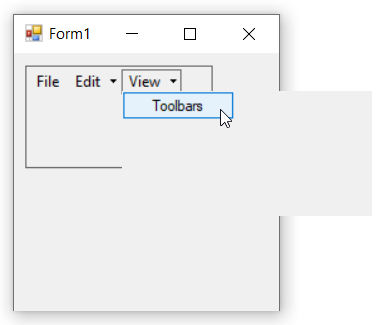

## ComboBoxBarItem

ComboBoxBarItem represents a BarItem that provides the combo box functionality in the XPToolbar.

### Through Designer

1. Once XPToolBar control is added, we can add the combobox bar item by right-clicking on the control in the designer and select **Properties**. Now, in the **Properties** panel, under **Misc > Items** select the items from the **BarItem Collection Editor**.

   

   

2. In **BarItem Collection Editor** window, under **Data > TextBoxValue** we can set the text for combobox bar item.

   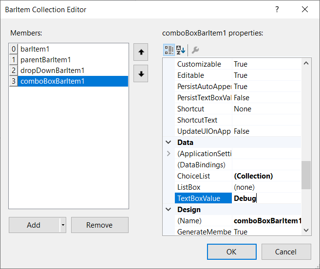

3. Similarly, we can add items collections in **properties** panel, under **Data > ChoiceList** by using **String Collection Editor**.

   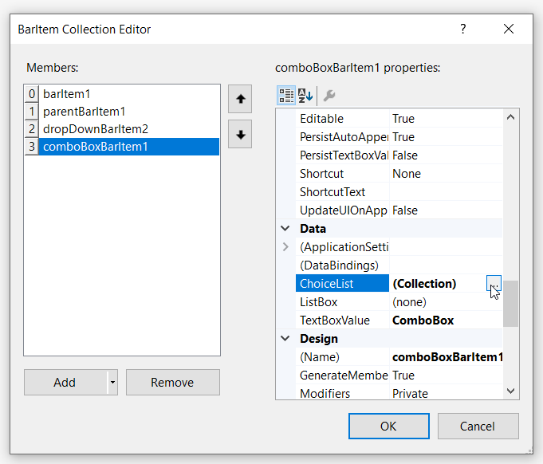
 
   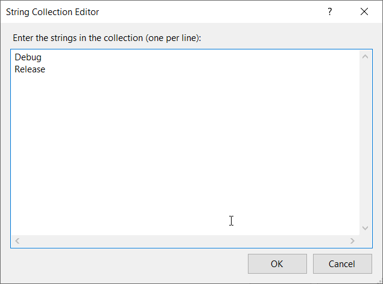

4. Finally, we have add the ComboBoxBarItem in XPToolBar control successfully.

   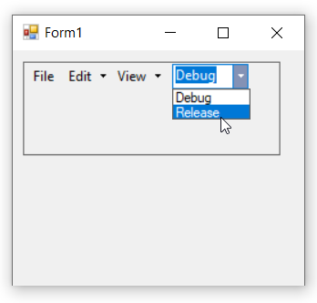

### Through Code

The below code snippets add **ComboBoxBarItem** to the XPToolbar control.




//Declaration
private Syncfusion.Windows.Forms.Tools.XPMenus.XPToolBar xpToolBar1;
private Syncfusion.Windows.Forms.Tools.XPMenus.BarItem barItem1;
private Syncfusion.Windows.Forms.Tools.XPMenus.ParentBarItem parentBarItem1;
private Syncfusion.Windows.Forms.Tools.XPMenus.BarItem barItem2;
private Syncfusion.Windows.Forms.Tools.XPMenus.BarItem barItem3;
private System.Windows.Forms.Panel panel1;
private System.Windows.Forms.Button button1;
private Syncfusion.Windows.Forms.Tools.XPMenus.DropDownBarItem dropDownBarItem1;
private Syncfusion.Windows.Forms.PopupControlContainer popupControlContainer1;
private Syncfusion.Windows.Forms.Tools.XPMenus.ComboBoxBarItem comboBoxBarItem1;

//Initializing
this.xpToolBar1 = new Syncfusion.Windows.Forms.Tools.XPMenus.XPToolBar();
this.barItem1 = new Syncfusion.Windows.Forms.Tools.XPMenus.BarItem();
this.parentBarItem1 = new Syncfusion.Windows.Forms.Tools.XPMenus.ParentBarItem();
this.barItem2 = new Syncfusion.Windows.Forms.Tools.XPMenus.BarItem();
this.barItem3 = new Syncfusion.Windows.Forms.Tools.XPMenus.BarItem();
this.panel1 = new System.Windows.Forms.Panel();
this.button1 = new System.Windows.Forms.Button();
this.dropDownBarItem1 = new Syncfusion.Windows.Forms.Tools.XPMenus.DropDownBarItem();
this.popupControlContainer1 = new Syncfusion.Windows.Forms.PopupControlContainer(this.components);
this.comboBoxBarItem1 = new Syncfusion.Windows.Forms.Tools.XPMenus.ComboBoxBarItem();

// barItem1
this.barItem1.Text = "File";

// barItem2
this.barItem2.Image = System.Drawing.Image.FromFile(@"..\..\..\Cut.png");
this.barItem2.Text = "Cut";

// barItem3
this.barItem3.Image = System.Drawing.Image.FromFile(@"..\..\..\Copy.png");
this.barItem3.Text = "Copy";

// parentBarItem1
this.parentBarItem1.Text = "Edit";          
this.parentBarItem1.Items.AddRange(new Syncfusion.Windows.Forms.Tools.XPMenus.BarItem[] { this.barItem2, this.barItem3});

// dropDownBarItem1
this.dropDownBarItem1.PopupControlContainer = this.popupControlContainer1;
this.dropDownBarItem1.Text = "View";

// popupControlContainer1
this.popupControlContainer1.Controls.Add(this.button1);

// button1
this.button1.Text = "Toolbars";
this.button1.Width = 90;

// comboBoxBarItem1
this.comboBoxBarItem1.ChoiceList.AddRange(new string[] { "Debug", "Release"});
this.comboBoxBarItem1.TextBoxValue = "Debug";
this.comboBoxBarItem1.MinWidth = 70;

// panel1
this.panel1.Controls.Add(this.xpToolBar1);

// xpToolBar1
this.xpToolBar1.Text = "xpToolBar1";
this.xpToolBar1.Bar.Items.AddRange(new Syncfusion.Windows.Forms.Tools.XPMenus.BarItem[] { this.barItem1, this.parentBarItem1, this.dropDownBarItem1, this.comboBoxBarItem1});

//Form
this.Controls.Add(this.panel1);





'Declaration
Private xpToolBar1 As Syncfusion.Windows.Forms.Tools.XPMenus.XPToolBar
Private barItem1 As Syncfusion.Windows.Forms.Tools.XPMenus.BarItem
Private parentBarItem1 As Syncfusion.Windows.Forms.Tools.XPMenus.ParentBarItem
Private barItem2 As Syncfusion.Windows.Forms.Tools.XPMenus.BarItem
Private barItem3 As Syncfusion.Windows.Forms.Tools.XPMenus.BarItem
Private panel1 As System.Windows.Forms.Panel
Private button1 As System.Windows.Forms.Button
Private dropDownBarItem1 As Syncfusion.Windows.Forms.Tools.XPMenus.DropDownBarItem
Private popupControlContainer1 As Syncfusion.Windows.Forms.PopupControlContainer
Private comboBoxBarItem1 As Syncfusion.Windows.Forms.Tools.XPMenus.ComboBoxBarItem

'Initializing
Me.xpToolBar1 = New Syncfusion.Windows.Forms.Tools.XPMenus.XPToolBar()
Me.barItem1 = New Syncfusion.Windows.Forms.Tools.XPMenus.BarItem()
Me.parentBarItem1 = New Syncfusion.Windows.Forms.Tools.XPMenus.ParentBarItem()
Me.barItem2 = New Syncfusion.Windows.Forms.Tools.XPMenus.BarItem()
Me.barItem3 = New Syncfusion.Windows.Forms.Tools.XPMenus.BarItem()
Me.panel1 = New System.Windows.Forms.Panel()
Me.button1 = New System.Windows.Forms.Button()
Me.dropDownBarItem1 = New Syncfusion.Windows.Forms.Tools.XPMenus.DropDownBarItem()
Me.popupControlContainer1 = New Syncfusion.Windows.Forms.PopupControlContainer(Me.components)
Me.comboBoxBarItem1 = New Syncfusion.Windows.Forms.Tools.XPMenus.ComboBoxBarItem()

' barItem1
Me.barItem1.Text = "File"

' barItem2
Me.barItem2.Image = System.Drawing.Image.FromFile("..\..\..\Cut.png")
Me.barItem2.Text = "Cut"

' barItem3
Me.barItem3.Image = System.Drawing.Image.FromFile("..\..\..\Copy.png")
Me.barItem3.Text = "Copy"

' parentBarItem1
Me.parentBarItem1.Text = "Edit"
Me.parentBarItem1.Items.AddRange(New Syncfusion.Windows.Forms.Tools.XPMenus.BarItem() { Me.barItem2, Me.barItem3})

' dropDownBarItem1
Me.dropDownBarItem1.PopupControlContainer = Me.popupControlContainer1
Me.dropDownBarItem1.Text = "View"

' popupControlContainer1
Me.popupControlContainer1.Controls.Add(Me.button1)

' button1
Me.button1.Text = "Toolbars"
Me.button1.Width = 90

' comboBoxBarItem1
Me.comboBoxBarItem1.ChoiceList.AddRange(New String() { "Debug", "Release"})
Me.comboBoxBarItem1.TextBoxValue = "Debug"
Me.comboBoxBarItem1.MinWidth = 70

' panel1
Me.panel1.Controls.Add(Me.xpToolBar1)

' xpToolBar1
Me.xpToolBar1.Text = "xpToolBar1"
Me.xpToolBar1.Bar.Items.AddRange(New Syncfusion.Windows.Forms.Tools.XPMenus.BarItem() { Me.barItem1, Me.parentBarItem1, Me.dropDownBarItem1, Me.comboBoxBarItem1})

'Form
Me.Controls.Add(Me.panel1)




## ListBarItem

By using ListBarItem, you have to represent a dynamic list of BarItems.

### Through Designer

1. Once XPToolBar control is added, We can add the **ListBarItem** by right-clicking on the control in the designer and select **Properties**. Now, in the **Properties** panel, under **Misc > Items** select the item from the **BarItem Collection Editor**.

   

   

2. In **BarItem Collection Editor** window, under **Appearance > Text** we can set the text for **ListBarItem**.

   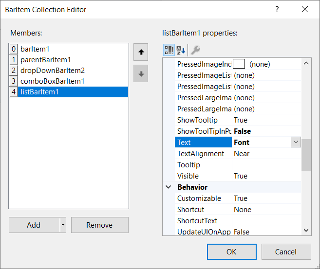

3. Similarly, we can add child items in **properties** panel, under **Data > ChildCaptions** by using **String Collection Editor**.

   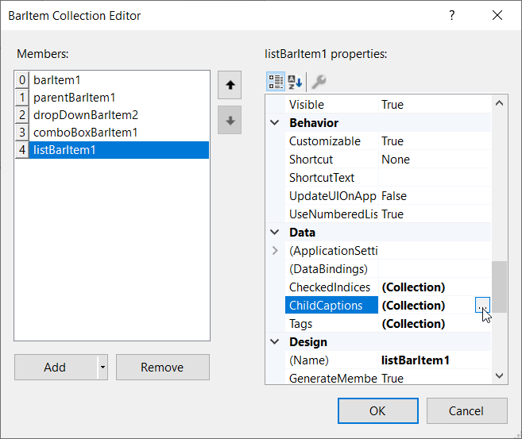

   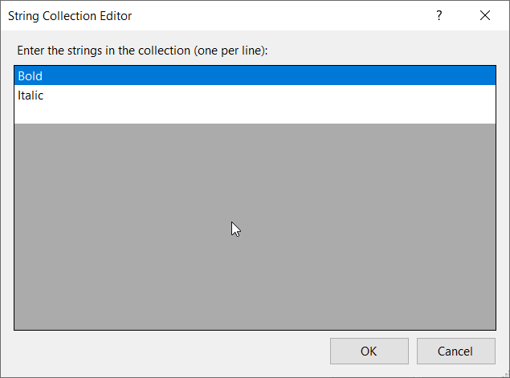

6. Finally, we have add the ListBarItem in XPToolBar control successfully.

   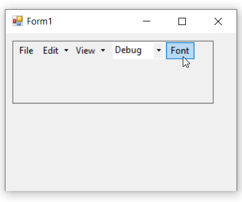

### Through Code

The below code snippets add a list bar item to the XPToolbar control




//Declaration
private Syncfusion.Windows.Forms.Tools.XPMenus.XPToolBar xpToolBar1;
private Syncfusion.Windows.Forms.Tools.XPMenus.BarItem barItem1;
private Syncfusion.Windows.Forms.Tools.XPMenus.ParentBarItem parentBarItem1;
private Syncfusion.Windows.Forms.Tools.XPMenus.BarItem barItem2;
private Syncfusion.Windows.Forms.Tools.XPMenus.BarItem barItem3;
private System.Windows.Forms.Panel panel1;
private System.Windows.Forms.Button button1;
private Syncfusion.Windows.Forms.Tools.XPMenus.DropDownBarItem dropDownBarItem1;
private Syncfusion.Windows.Forms.PopupControlContainer popupControlContainer1;
private Syncfusion.Windows.Forms.Tools.XPMenus.ComboBoxBarItem comboBoxBarItem1;
private Syncfusion.Windows.Forms.Tools.XPMenus.ListBarItem listBarItem1;

//Initializing
this.xpToolBar1 = new Syncfusion.Windows.Forms.Tools.XPMenus.XPToolBar();
this.barItem1 = new Syncfusion.Windows.Forms.Tools.XPMenus.BarItem();
this.parentBarItem1 = new Syncfusion.Windows.Forms.Tools.XPMenus.ParentBarItem();
this.barItem2 = new Syncfusion.Windows.Forms.Tools.XPMenus.BarItem();
this.barItem3 = new Syncfusion.Windows.Forms.Tools.XPMenus.BarItem();
this.panel1 = new System.Windows.Forms.Panel();
this.button1 = new System.Windows.Forms.Button();
this.dropDownBarItem1 = new Syncfusion.Windows.Forms.Tools.XPMenus.DropDownBarItem();
this.popupControlContainer1 = new Syncfusion.Windows.Forms.PopupControlContainer(this.components);
this.comboBoxBarItem1 = new Syncfusion.Windows.Forms.Tools.XPMenus.ComboBoxBarItem();
this.listBarItem1 = new Syncfusion.Windows.Forms.Tools.XPMenus.ListBarItem();

// barItem1
this.barItem1.Text = "File";

// barItem2
this.barItem2.Image = System.Drawing.Image.FromFile(@"..\..\..\Cut.png");
this.barItem2.Text = "Cut";

// barItem3
this.barItem3.Image = System.Drawing.Image.FromFile(@"..\..\..\Copy.png");
this.barItem3.Text = "Copy";

// parentBarItem1
this.parentBarItem1.Text = "Edit";          
this.parentBarItem1.Items.AddRange(new Syncfusion.Windows.Forms.Tools.XPMenus.BarItem[] { this.barItem2, this.barItem3});

// dropDownBarItem1
this.dropDownBarItem1.PopupControlContainer = this.popupControlContainer1;
this.dropDownBarItem1.Text = "View";

// popupControlContainer1
this.popupControlContainer1.Controls.Add(this.button1);

// button1
this.button1.Text = "Toolbars";
this.button1.Width = 90;

// comboBoxBarItem1
this.comboBoxBarItem1.ChoiceList.AddRange(new string[] { "Debug", "Release"});
this.comboBoxBarItem1.TextBoxValue = "Debug";
this.comboBoxBarItem1.MinWidth = 70;

// listBarItem1
this.listBarItem1.ChildCaptions.AddRange(new string[] {"Bold", "Italic"});
this.listBarItem1.SizeToFit = true;
this.listBarItem1.Text = "Font";

// xpToolBar1
this.xpToolBar1.Text = "xpToolBar1";
this.xpToolBar1.Bar.Items.AddRange(new Syncfusion.Windows.Forms.Tools.XPMenus.BarItem[] { this.barItem1, this.parentBarItem1, this.dropDownBarItem1, this.comboBoxBarItem1, this.listBarItem1});

// panel1
this.panel1.BorderStyle = System.Windows.Forms.BorderStyle.FixedSingle;
this.panel1.Controls.Add(this.xpToolBar1);

//Form
this.Text = "Form1";
this.Controls.Add(this.panel1);





'Declaration
Private xpToolBar1 As Syncfusion.Windows.Forms.Tools.XPMenus.XPToolBar
Private barItem1 As Syncfusion.Windows.Forms.Tools.XPMenus.BarItem
Private parentBarItem1 As Syncfusion.Windows.Forms.Tools.XPMenus.ParentBarItem
Private barItem2 As Syncfusion.Windows.Forms.Tools.XPMenus.BarItem
Private barItem3 As Syncfusion.Windows.Forms.Tools.XPMenus.BarItem
Private panel1 As System.Windows.Forms.Panel
Private button1 As System.Windows.Forms.Button
Private dropDownBarItem1 As Syncfusion.Windows.Forms.Tools.XPMenus.DropDownBarItem
Private popupControlContainer1 As Syncfusion.Windows.Forms.PopupControlContainer
Private comboBoxBarItem1 As Syncfusion.Windows.Forms.Tools.XPMenus.ComboBoxBarItem
Private listBarItem1 As Syncfusion.Windows.Forms.Tools.XPMenus.ListBarItem

'Initializing
Me.xpToolBar1 = New Syncfusion.Windows.Forms.Tools.XPMenus.XPToolBar()
Me.barItem1 = New Syncfusion.Windows.Forms.Tools.XPMenus.BarItem()
Me.parentBarItem1 = New Syncfusion.Windows.Forms.Tools.XPMenus.ParentBarItem()
Me.barItem2 = New Syncfusion.Windows.Forms.Tools.XPMenus.BarItem()
Me.barItem3 = New Syncfusion.Windows.Forms.Tools.XPMenus.BarItem()
Me.panel1 = New System.Windows.Forms.Panel()
Me.button1 = New System.Windows.Forms.Button()
Me.dropDownBarItem1 = New Syncfusion.Windows.Forms.Tools.XPMenus.DropDownBarItem()
Me.popupControlContainer1 = New Syncfusion.Windows.Forms.PopupControlContainer(Me.components)
Me.comboBoxBarItem1 = New Syncfusion.Windows.Forms.Tools.XPMenus.ComboBoxBarItem()
Me.listBarItem1 = New Syncfusion.Windows.Forms.Tools.XPMenus.ListBarItem()

' barItem1
Me.barItem1.Text = "File"

' barItem2
Me.barItem2.Image = System.Drawing.Image.FromFile("..\..\..\Cut.png")
Me.barItem2.Text = "Cut"

' barItem3
Me.barItem3.Image = System.Drawing.Image.FromFile("..\..\..\Copy.png")
Me.barItem3.Text = "Copy"

' parentBarItem1
Me.parentBarItem1.Text = "Edit"
Me.parentBarItem1.Items.AddRange(New Syncfusion.Windows.Forms.Tools.XPMenus.BarItem() { Me.barItem2, Me.barItem3})

' dropDownBarItem1
Me.dropDownBarItem1.PopupControlContainer = Me.popupControlContainer1
Me.dropDownBarItem1.Text = "View"

' popupControlContainer1
Me.popupControlContainer1.Controls.Add(Me.button1)

' button1
Me.button1.Text = "Toolbars"
Me.button1.Width = 90

' comboBoxBarItem1
Me.comboBoxBarItem1.ChoiceList.AddRange(New String() { "Debug", "Release"})
Me.comboBoxBarItem1.TextBoxValue = "Debug"
Me.comboBoxBarItem1.MinWidth = 70

' listBarItem1
Me.listBarItem1.ChildCaptions.AddRange(New String() {"Bold", "Italic"})
Me.listBarItem1.SizeToFit = True
Me.listBarItem1.Text = "Font"

' xpToolBar1
Me.xpToolBar1.Text = "xpToolBar1"
Me.xpToolBar1.Bar.Items.AddRange(New Syncfusion.Windows.Forms.Tools.XPMenus.BarItem() { Me.barItem1, Me.parentBarItem1, Me.dropDownBarItem1, Me.comboBoxBarItem1, Me.listBarItem1})

' panel1
Me.panel1.BorderStyle = System.Windows.Forms.BorderStyle.FixedSingle
Me.panel1.Controls.Add(Me.xpToolBar1)

'Form
Me.Text = "Form1"
Me.Controls.Add(Me.panel1)




## StaticBarItem

StaticBarItem represents a BarItem that could be used as a label for an adjacent BarItem.

### Through Designer

1. Once XPToolBar control is added, We can add the **StaticBarItem** by right-clicking on the control in the designer and select **Properties**. Now, in the **Properties** panel, under **Misc > Items** select the item from the **BarItem Collection Editor**.

   

   

2. In **BarItem Collection Editor** window, under **Appearance > Text** we can set the text for **StaticBarItem**.

   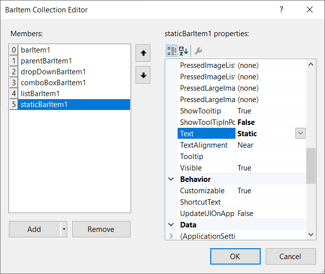

### Through Code

The below code snippets add a static bar item to the XPToolbar control




//Declaration
private Syncfusion.Windows.Forms.Tools.XPMenus.XPToolBar xpToolBar1;
private Syncfusion.Windows.Forms.Tools.XPMenus.BarItem barItem1;
private Syncfusion.Windows.Forms.Tools.XPMenus.ParentBarItem parentBarItem1;
private Syncfusion.Windows.Forms.Tools.XPMenus.BarItem barItem2;
private Syncfusion.Windows.Forms.Tools.XPMenus.BarItem barItem3;
private System.Windows.Forms.Panel panel1;
private System.Windows.Forms.Button button1;
private Syncfusion.Windows.Forms.Tools.XPMenus.DropDownBarItem dropDownBarItem1;
private Syncfusion.Windows.Forms.PopupControlContainer popupControlContainer1;
private Syncfusion.Windows.Forms.Tools.XPMenus.ComboBoxBarItem comboBoxBarItem1;
private Syncfusion.Windows.Forms.Tools.XPMenus.ListBarItem listBarItem1;
private Syncfusion.Windows.Forms.Tools.XPMenus.StaticBarItem staticBarItem1;

//Initializing
this.xpToolBar1 = new Syncfusion.Windows.Forms.Tools.XPMenus.XPToolBar();
this.barItem1 = new Syncfusion.Windows.Forms.Tools.XPMenus.BarItem();
this.parentBarItem1 = new Syncfusion.Windows.Forms.Tools.XPMenus.ParentBarItem();
this.barItem2 = new Syncfusion.Windows.Forms.Tools.XPMenus.BarItem();
this.barItem3 = new Syncfusion.Windows.Forms.Tools.XPMenus.BarItem();
this.panel1 = new System.Windows.Forms.Panel();
this.button1 = new System.Windows.Forms.Button();
this.dropDownBarItem1 = new Syncfusion.Windows.Forms.Tools.XPMenus.DropDownBarItem();
this.popupControlContainer1 = new Syncfusion.Windows.Forms.PopupControlContainer(this.components);
this.comboBoxBarItem1 = new Syncfusion.Windows.Forms.Tools.XPMenus.ComboBoxBarItem();
this.listBarItem1 = new Syncfusion.Windows.Forms.Tools.XPMenus.ListBarItem();
this.staticBarItem1 = new Syncfusion.Windows.Forms.Tools.XPMenus.StaticBarItem();

// barItem1
this.barItem1.Text = "File";

// barItem2
this.barItem2.Image = System.Drawing.Image.FromFile(@"..\..\..\Cut.png");
this.barItem2.Text = "Cut";

// barItem3
this.barItem3.Image = System.Drawing.Image.FromFile(@"..\..\..\Copy.png");
this.barItem3.Text = "Copy";

// parentBarItem1
this.parentBarItem1.Text = "Edit";          
this.parentBarItem1.Items.AddRange(new Syncfusion.Windows.Forms.Tools.XPMenus.BarItem[] { this.barItem2, this.barItem3});

// dropDownBarItem1
this.dropDownBarItem1.PopupControlContainer = this.popupControlContainer1;
this.dropDownBarItem1.Text = "View";

// popupControlContainer1
this.popupControlContainer1.Controls.Add(this.button1);

// button1
this.button1.Text = "Toolbars";
this.button1.Width = 90;

// comboBoxBarItem1
this.comboBoxBarItem1.ChoiceList.AddRange(new string[] { "Debug", "Release"});
this.comboBoxBarItem1.TextBoxValue = "Debug";
this.comboBoxBarItem1.MinWidth = 70;

// listBarItem1
this.listBarItem1.ChildCaptions.AddRange(new string[] {"Bold", "Italic"});
this.listBarItem1.SizeToFit = true;
this.listBarItem1.Text = "Font";

// staticBarItem1
this.staticBarItem1.SizeToFit = true;
this.staticBarItem1.Text = "Segoe UI";

// xpToolBar1
this.xpToolBar1.Text = "xpToolBar1";
this.xpToolBar1.Bar.Items.AddRange(new Syncfusion.Windows.Forms.Tools.XPMenus.BarItem[] { this.barItem1, this.parentBarItem1, this.dropDownBarItem1, this.comboBoxBarItem1, this.listBarItem1, this.staticBarItem1});

// panel1
this.panel1.BorderStyle = System.Windows.Forms.BorderStyle.FixedSingle;
this.panel1.Controls.Add(this.xpToolBar1);

//Form
this.Text = "Form1";
this.Controls.Add(this.panel1);





'Declaration
Private xpToolBar1 As Syncfusion.Windows.Forms.Tools.XPMenus.XPToolBar
Private barItem1 As Syncfusion.Windows.Forms.Tools.XPMenus.BarItem
Private parentBarItem1 As Syncfusion.Windows.Forms.Tools.XPMenus.ParentBarItem
Private barItem2 As Syncfusion.Windows.Forms.Tools.XPMenus.BarItem
Private barItem3 As Syncfusion.Windows.Forms.Tools.XPMenus.BarItem
Private panel1 As System.Windows.Forms.Panel
Private button1 As System.Windows.Forms.Button
Private dropDownBarItem1 As Syncfusion.Windows.Forms.Tools.XPMenus.DropDownBarItem
Private popupControlContainer1 As Syncfusion.Windows.Forms.PopupControlContainer
Private comboBoxBarItem1 As Syncfusion.Windows.Forms.Tools.XPMenus.ComboBoxBarItem
Private listBarItem1 As Syncfusion.Windows.Forms.Tools.XPMenus.ListBarItem
Private staticBarItem1 As Syncfusion.Windows.Forms.Tools.XPMenus.StaticBarItem

'Initializing
Me.xpToolBar1 = New Syncfusion.Windows.Forms.Tools.XPMenus.XPToolBar()
Me.barItem1 = New Syncfusion.Windows.Forms.Tools.XPMenus.BarItem()
Me.parentBarItem1 = New Syncfusion.Windows.Forms.Tools.XPMenus.ParentBarItem()
Me.barItem2 = New Syncfusion.Windows.Forms.Tools.XPMenus.BarItem()
Me.barItem3 = New Syncfusion.Windows.Forms.Tools.XPMenus.BarItem()
Me.panel1 = New System.Windows.Forms.Panel()
Me.button1 = New System.Windows.Forms.Button()
Me.dropDownBarItem1 = New Syncfusion.Windows.Forms.Tools.XPMenus.DropDownBarItem()
Me.popupControlContainer1 = New Syncfusion.Windows.Forms.PopupControlContainer(Me.components)
Me.comboBoxBarItem1 = New Syncfusion.Windows.Forms.Tools.XPMenus.ComboBoxBarItem()
Me.listBarItem1 = New Syncfusion.Windows.Forms.Tools.XPMenus.ListBarItem()
Me.staticBarItem1 = New Syncfusion.Windows.Forms.Tools.XPMenus.StaticBarItem()

' barItem1
Me.barItem1.Text = "File"

' barItem2
Me.barItem2.Image = System.Drawing.Image.FromFile("..\..\..\Cut.png")
Me.barItem2.Text = "Cut"

' barItem3
Me.barItem3.Image = System.Drawing.Image.FromFile("..\..\..\Copy.png")
Me.barItem3.Text = "Copy"

' parentBarItem1
Me.parentBarItem1.Text = "Edit"
Me.parentBarItem1.Items.AddRange(New Syncfusion.Windows.Forms.Tools.XPMenus.BarItem() { Me.barItem2, Me.barItem3})

' dropDownBarItem1
Me.dropDownBarItem1.PopupControlContainer = Me.popupControlContainer1
Me.dropDownBarItem1.Text = "View"

' popupControlContainer1
Me.popupControlContainer1.Controls.Add(Me.button1)

' button1
Me.button1.Text = "Toolbars"
Me.button1.Width = 90

' comboBoxBarItem1
Me.comboBoxBarItem1.ChoiceList.AddRange(New String() { "Debug", "Release"})
Me.comboBoxBarItem1.TextBoxValue = "Debug"
Me.comboBoxBarItem1.MinWidth = 70

' listBarItem1
Me.listBarItem1.ChildCaptions.AddRange(New String() {"Bold", "Italic"})
Me.listBarItem1.SizeToFit = True
Me.listBarItem1.Text = "Font"

' staticBarItem1
Me.staticBarItem1.SizeToFit = True
Me.staticBarItem1.Text = "Segoe UI"

' xpToolBar1
Me.xpToolBar1.Text = "xpToolBar1"
Me.xpToolBar1.Bar.Items.AddRange(New Syncfusion.Windows.Forms.Tools.XPMenus.BarItem() { Me.barItem1, Me.parentBarItem1, Me.dropDownBarItem1, Me.comboBoxBarItem1, Me.listBarItem1, Me.staticBarItem1})

' panel1
Me.panel1.BorderStyle = System.Windows.Forms.BorderStyle.FixedSingle
Me.panel1.Controls.Add(Me.xpToolBar1)

'Form
Me.Text = "Form1"
Me.Controls.Add(Me.panel1)




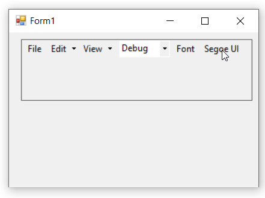

## ToolbarListBarItem

ToolbarList bar item is used to display the current list of toolbars and their states.

### Through Designer

1. Once XPToolBar control is added, We can add the **ToolbarListBarItem** by right-clicking on the control in the designer and select **Properties**. Now, in the **Properties** panel, under **Misc > Items** select the item from the **BarItem Collection Editor**.

   

   

2. In **BarItem Collection Editor** window, under **Appearance > Text** we can set the text for **ToolbarListBarItem**.

   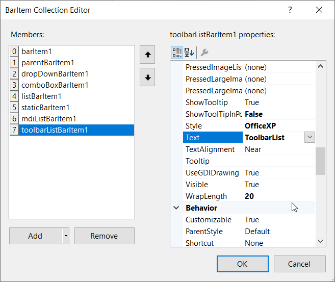

3. Similarly, we can add the items in **properties** panel, under **Misc > Items** by using **BarItem Collection Editor**.

   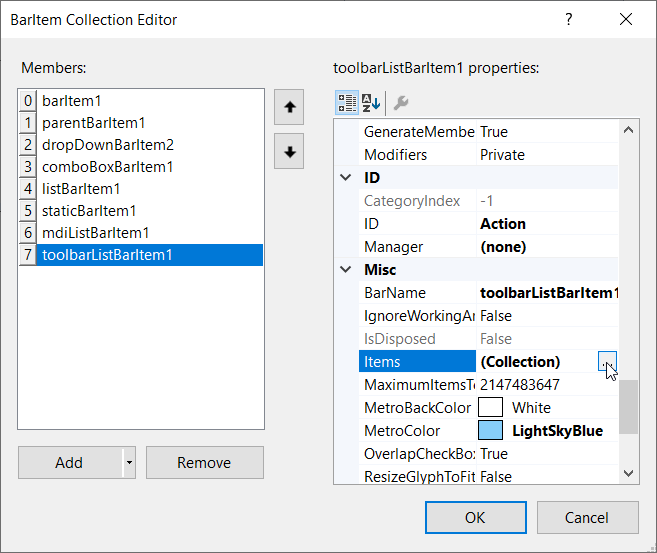

   

### Through Code

The below code snippets add a ToolbarListBarItem to the XPToolbar control.




//Declaration
private Syncfusion.Windows.Forms.Tools.XPMenus.XPToolBar xpToolBar1;
private Syncfusion.Windows.Forms.Tools.XPMenus.BarItem barItem1;
private Syncfusion.Windows.Forms.Tools.XPMenus.ParentBarItem parentBarItem1;
private Syncfusion.Windows.Forms.Tools.XPMenus.BarItem barItem2;
private Syncfusion.Windows.Forms.Tools.XPMenus.BarItem barItem3;
private System.Windows.Forms.Panel panel1;
private System.Windows.Forms.Button button1;
private Syncfusion.Windows.Forms.Tools.XPMenus.DropDownBarItem dropDownBarItem1;
private Syncfusion.Windows.Forms.PopupControlContainer popupControlContainer1;
private Syncfusion.Windows.Forms.Tools.XPMenus.ComboBoxBarItem comboBoxBarItem1;
private Syncfusion.Windows.Forms.Tools.XPMenus.ListBarItem listBarItem1;
private Syncfusion.Windows.Forms.Tools.XPMenus.StaticBarItem staticBarItem1;
private Syncfusion.Windows.Forms.Tools.XPMenus.ToolbarListBarItem toolbarListBarItem1;

//Initializing
this.xpToolBar1 = new Syncfusion.Windows.Forms.Tools.XPMenus.XPToolBar();
this.barItem1 = new Syncfusion.Windows.Forms.Tools.XPMenus.BarItem();
this.parentBarItem1 = new Syncfusion.Windows.Forms.Tools.XPMenus.ParentBarItem();
this.barItem2 = new Syncfusion.Windows.Forms.Tools.XPMenus.BarItem();
this.barItem3 = new Syncfusion.Windows.Forms.Tools.XPMenus.BarItem();
this.panel1 = new System.Windows.Forms.Panel();
this.button1 = new System.Windows.Forms.Button();
this.dropDownBarItem1 = new Syncfusion.Windows.Forms.Tools.XPMenus.DropDownBarItem();
this.popupControlContainer1 = new Syncfusion.Windows.Forms.PopupControlContainer(this.components);
this.comboBoxBarItem1 = new Syncfusion.Windows.Forms.Tools.XPMenus.ComboBoxBarItem();
this.listBarItem1 = new Syncfusion.Windows.Forms.Tools.XPMenus.ListBarItem();
this.staticBarItem1 = new Syncfusion.Windows.Forms.Tools.XPMenus.StaticBarItem();
this.toolbarListBarItem1 = new Syncfusion.Windows.Forms.Tools.XPMenus.ToolbarListBarItem();

// barItem1
this.barItem1.Text = "File";

// barItem2
this.barItem2.Image = System.Drawing.Image.FromFile(@"..\..\..\Cut.png");
this.barItem2.Text = "Cut";

// barItem3
this.barItem3.Image = System.Drawing.Image.FromFile(@"..\..\..\Copy.png");
this.barItem3.Text = "Copy";

// parentBarItem1
this.parentBarItem1.Text = "Edit";          
this.parentBarItem1.Items.AddRange(new Syncfusion.Windows.Forms.Tools.XPMenus.BarItem[] { this.barItem2, this.barItem3});

// dropDownBarItem1
this.dropDownBarItem1.PopupControlContainer = this.popupControlContainer1;
this.dropDownBarItem1.Text = "View";

// popupControlContainer1
this.popupControlContainer1.Controls.Add(this.button1);

// button1
this.button1.Text = "Toolbars";
this.button1.Width = 90;

// comboBoxBarItem1
this.comboBoxBarItem1.ChoiceList.AddRange(new string[] { "Debug", "Release"});
this.comboBoxBarItem1.TextBoxValue = "Debug";
this.comboBoxBarItem1.MinWidth = 70;

// listBarItem1
this.listBarItem1.ChildCaptions.AddRange(new string[] {"Bold", "Italic"});
this.listBarItem1.SizeToFit = true;
this.listBarItem1.Text = "Font";

// staticBarItem1
this.staticBarItem1.SizeToFit = true;
this.staticBarItem1.Text = "Segoe UI";

// toolbarListBarItem1
this.toolbarListBarItem1.SizeToFit = true;
this.toolbarListBarItem1.Text = "Help";

// xpToolBar1
this.xpToolBar1.Text = "xpToolBar1";
this.xpToolBar1.Bar.Items.AddRange(new Syncfusion.Windows.Forms.Tools.XPMenus.BarItem[] { this.barItem1, this.parentBarItem1, this.dropDownBarItem1, this.comboBoxBarItem1, this.listBarItem1, this.staticBarItem1, this.toolbarListBarItem1});

// panel1
this.panel1.BorderStyle = System.Windows.Forms.BorderStyle.FixedSingle;
this.panel1.Controls.Add(this.xpToolBar1);

//Form
this.Text = "Form1";
this.Controls.Add(this.panel1);





'Declaration
Private xpToolBar1 As Syncfusion.Windows.Forms.Tools.XPMenus.XPToolBar
Private barItem1 As Syncfusion.Windows.Forms.Tools.XPMenus.BarItem
Private parentBarItem1 As Syncfusion.Windows.Forms.Tools.XPMenus.ParentBarItem
Private dropDownBarItem1 As Syncfusion.Windows.Forms.Tools.XPMenus.DropDownBarItem
Private comboBoxBarItem1 As Syncfusion.Windows.Forms.Tools.XPMenus.ComboBoxBarItem
Private listBarItem1 As Syncfusion.Windows.Forms.Tools.XPMenus.ListBarItem
Private staticBarItem1 As Syncfusion.Windows.Forms.Tools.XPMenus.StaticBarItem
Private mdiListBarItem1 As Syncfusion.Windows.Forms.Tools.XPMenus.MdiListBarItem
Private toolbarListBarItem1 As Syncfusion.Windows.Forms.Tools.XPMenus.ToolbarListBarItem

'Initializing
Me.xpToolBar1 = New Syncfusion.Windows.Forms.Tools.XPMenus.XPToolBar()
Me.barItem1 = New Syncfusion.Windows.Forms.Tools.XPMenus.BarItem()
Me.parentBarItem1 = New Syncfusion.Windows.Forms.Tools.XPMenus.ParentBarItem()
Me.dropDownBarItem1 = New Syncfusion.Windows.Forms.Tools.XPMenus.DropDownBarItem()
Me.comboBoxBarItem1 = New Syncfusion.Windows.Forms.Tools.XPMenus.ComboBoxBarItem()
Me.listBarItem1 = New Syncfusion.Windows.Forms.Tools.XPMenus.ListBarItem()
Me.staticBarItem1 = New Syncfusion.Windows.Forms.Tools.XPMenus.StaticBarItem()
Me.mdiListBarItem1 = New Syncfusion.Windows.Forms.Tools.XPMenus.MdiListBarItem()
Me.toolbarListBarItem1 = New Syncfusion.Windows.Forms.Tools.XPMenus.ToolbarListBarItem()

'Add a bar items to the control
Me.barItem1.Text = "File"
Me.parentBarItem1.Text = "Edit"
Me.dropDownBarItem1.Text = "View"
Me.comboBoxBarItem1.TextBoxValue = "Debug"
Me.listBarItem1.Text = "List"
Me.staticBarItem1.Text = "Static"
Me.toolbarListBarItem1.Text = "ToolbarList"
Me.xpToolBar1.Bar.Items.AddRange(New Syncfusion.Windows.Forms.Tools.XPMenus.BarItem() { Me.barItem1, Me.parentBarItem1, Me.dropDownBarItem1, Me.comboBoxBarItem1, Me.listBarItem1, Me.staticBarItem1, Me.mdiListBarItem1, Me.toolbarListBarItem1})
Me.Controls.Add(Me.xpToolBar1)




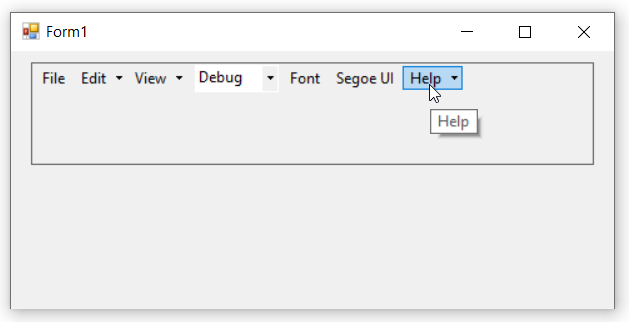

## TextBoxBarItem

TextBoxBarItem is used to provides the TextBox functionality in the **XPToolBar**.

### Through Designer

1. Once XPToolBar control is added, We can add the **TextBoxBarItem** by right-clicking on the control in the designer and select **Properties**. Now, in the **Properties** panel, under **Misc > Items** select the item from the **BarItem Collection Editor**.

   

   

2. In **BarItem Collection Editor** window, under **Misc > TextBoxValue** we can set the text for **TextBoxBarItem**.

   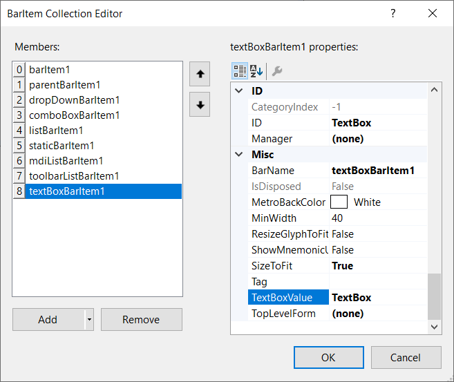

### Through Code

The below code snippets add a TextBoxBarItem to the XPToolbar control.




//Declaration
private Syncfusion.Windows.Forms.Tools.XPMenus.XPToolBar xpToolBar1;
private Syncfusion.Windows.Forms.Tools.XPMenus.BarItem barItem1;
private Syncfusion.Windows.Forms.Tools.XPMenus.ParentBarItem parentBarItem1;
private Syncfusion.Windows.Forms.Tools.XPMenus.BarItem barItem2;
private Syncfusion.Windows.Forms.Tools.XPMenus.BarItem barItem3;
private System.Windows.Forms.Panel panel1;
private System.Windows.Forms.Button button1;
private Syncfusion.Windows.Forms.Tools.XPMenus.DropDownBarItem dropDownBarItem1;
private Syncfusion.Windows.Forms.PopupControlContainer popupControlContainer1;
private Syncfusion.Windows.Forms.Tools.XPMenus.ComboBoxBarItem comboBoxBarItem1;
private Syncfusion.Windows.Forms.Tools.XPMenus.ListBarItem listBarItem1;
private Syncfusion.Windows.Forms.Tools.XPMenus.StaticBarItem staticBarItem1;
private Syncfusion.Windows.Forms.Tools.XPMenus.ToolbarListBarItem toolbarListBarItem1;
private Syncfusion.Windows.Forms.Tools.XPMenus.TextBoxBarItem textBoxBarItem1;

//Initializing
this.xpToolBar1 = new Syncfusion.Windows.Forms.Tools.XPMenus.XPToolBar();
this.barItem1 = new Syncfusion.Windows.Forms.Tools.XPMenus.BarItem();
this.parentBarItem1 = new Syncfusion.Windows.Forms.Tools.XPMenus.ParentBarItem();
this.barItem2 = new Syncfusion.Windows.Forms.Tools.XPMenus.BarItem();
this.barItem3 = new Syncfusion.Windows.Forms.Tools.XPMenus.BarItem();
this.panel1 = new System.Windows.Forms.Panel();
this.button1 = new System.Windows.Forms.Button();
this.dropDownBarItem1 = new Syncfusion.Windows.Forms.Tools.XPMenus.DropDownBarItem();
this.popupControlContainer1 = new Syncfusion.Windows.Forms.PopupControlContainer(this.components);
this.comboBoxBarItem1 = new Syncfusion.Windows.Forms.Tools.XPMenus.ComboBoxBarItem();
this.listBarItem1 = new Syncfusion.Windows.Forms.Tools.XPMenus.ListBarItem();
this.staticBarItem1 = new Syncfusion.Windows.Forms.Tools.XPMenus.StaticBarItem();
this.toolbarListBarItem1 = new Syncfusion.Windows.Forms.Tools.XPMenus.ToolbarListBarItem();
this.textBoxBarItem1 = new Syncfusion.Windows.Forms.Tools.XPMenus.TextBoxBarItem();

// barItem1
this.barItem1.Text = "File";

// barItem2
this.barItem2.Image = System.Drawing.Image.FromFile(@"..\..\..\Cut.png");
this.barItem2.Text = "Cut";

// barItem3
this.barItem3.Image = System.Drawing.Image.FromFile(@"..\..\..\Copy.png");
this.barItem3.Text = "Copy";

// parentBarItem1
this.parentBarItem1.Text = "Edit";          
this.parentBarItem1.Items.AddRange(new Syncfusion.Windows.Forms.Tools.XPMenus.BarItem[] { this.barItem2, this.barItem3});

// dropDownBarItem1
this.dropDownBarItem1.PopupControlContainer = this.popupControlContainer1;
this.dropDownBarItem1.Text = "View";

// popupControlContainer1
this.popupControlContainer1.Controls.Add(this.button1);

// button1
this.button1.Text = "Toolbars";
this.button1.Width = 90;

// comboBoxBarItem1
this.comboBoxBarItem1.ChoiceList.AddRange(new string[] { "Debug", "Release"});
this.comboBoxBarItem1.TextBoxValue = "Debug";
this.comboBoxBarItem1.MinWidth = 70;

// listBarItem1
this.listBarItem1.ChildCaptions.AddRange(new string[] {"Bold", "Italic"});
this.listBarItem1.SizeToFit = true;
this.listBarItem1.Text = "Font";

// staticBarItem1
this.staticBarItem1.SizeToFit = true;
this.staticBarItem1.Text = "Segoe UI";

// toolbarListBarItem1
this.toolbarListBarItem1.SizeToFit = true;
this.toolbarListBarItem1.Text = "Help";

// textBoxBarItem1
this.textBoxBarItem1.SizeToFit = true;
this.textBoxBarItem1.TextBoxValue = "Run";

// xpToolBar1
this.xpToolBar1.Text = "xpToolBar1";
this.xpToolBar1.Bar.Items.AddRange(new Syncfusion.Windows.Forms.Tools.XPMenus.BarItem[] { this.barItem1, this.parentBarItem1, this.dropDownBarItem1, this.comboBoxBarItem1, this.listBarItem1, this.staticBarItem1, this.toolbarListBarItem1, this.textBoxBarItem1});

// panel1
this.panel1.BorderStyle = System.Windows.Forms.BorderStyle.FixedSingle;
this.panel1.Controls.Add(this.xpToolBar1);

//Form
this.Text = "Form1";
this.Controls.Add(this.panel1);





'Declaration
Private xpToolBar1 As Syncfusion.Windows.Forms.Tools.XPMenus.XPToolBar
Private barItem1 As Syncfusion.Windows.Forms.Tools.XPMenus.BarItem
Private parentBarItem1 As Syncfusion.Windows.Forms.Tools.XPMenus.ParentBarItem
Private barItem2 As Syncfusion.Windows.Forms.Tools.XPMenus.BarItem
Private barItem3 As Syncfusion.Windows.Forms.Tools.XPMenus.BarItem
Private panel1 As System.Windows.Forms.Panel
Private button1 As System.Windows.Forms.Button
Private dropDownBarItem1 As Syncfusion.Windows.Forms.Tools.XPMenus.DropDownBarItem
Private popupControlContainer1 As Syncfusion.Windows.Forms.PopupControlContainer
Private comboBoxBarItem1 As Syncfusion.Windows.Forms.Tools.XPMenus.ComboBoxBarItem
Private listBarItem1 As Syncfusion.Windows.Forms.Tools.XPMenus.ListBarItem
Private staticBarItem1 As Syncfusion.Windows.Forms.Tools.XPMenus.StaticBarItem
Private toolbarListBarItem1 As Syncfusion.Windows.Forms.Tools.XPMenus.ToolbarListBarItem
Private textBoxBarItem1 As Syncfusion.Windows.Forms.Tools.XPMenus.TextBoxBarItem

'Initializing
Me.xpToolBar1 = New Syncfusion.Windows.Forms.Tools.XPMenus.XPToolBar()
Me.barItem1 = New Syncfusion.Windows.Forms.Tools.XPMenus.BarItem()
Me.parentBarItem1 = New Syncfusion.Windows.Forms.Tools.XPMenus.ParentBarItem()
Me.barItem2 = New Syncfusion.Windows.Forms.Tools.XPMenus.BarItem()
Me.barItem3 = New Syncfusion.Windows.Forms.Tools.XPMenus.BarItem()
Me.panel1 = New System.Windows.Forms.Panel()
Me.button1 = New System.Windows.Forms.Button()
Me.dropDownBarItem1 = New Syncfusion.Windows.Forms.Tools.XPMenus.DropDownBarItem()
Me.popupControlContainer1 = New Syncfusion.Windows.Forms.PopupControlContainer(Me.components)
Me.comboBoxBarItem1 = New Syncfusion.Windows.Forms.Tools.XPMenus.ComboBoxBarItem()
Me.listBarItem1 = New Syncfusion.Windows.Forms.Tools.XPMenus.ListBarItem()
Me.staticBarItem1 = New Syncfusion.Windows.Forms.Tools.XPMenus.StaticBarItem()
Me.toolbarListBarItem1 = New Syncfusion.Windows.Forms.Tools.XPMenus.ToolbarListBarItem()
Me.textBoxBarItem1 = New Syncfusion.Windows.Forms.Tools.XPMenus.TextBoxBarItem()

' barItem1
Me.barItem1.Text = "File"

' barItem2
Me.barItem2.Image = System.Drawing.Image.FromFile("..\..\..\Cut.png")
Me.barItem2.Text = "Cut"

' barItem3
Me.barItem3.Image = System.Drawing.Image.FromFile("..\..\..\Copy.png")
Me.barItem3.Text = "Copy"

' parentBarItem1
Me.parentBarItem1.Text = "Edit"
Me.parentBarItem1.Items.AddRange(New Syncfusion.Windows.Forms.Tools.XPMenus.BarItem() { Me.barItem2, Me.barItem3})

' dropDownBarItem1
Me.dropDownBarItem1.PopupControlContainer = Me.popupControlContainer1
Me.dropDownBarItem1.Text = "View"

' popupControlContainer1
Me.popupControlContainer1.Controls.Add(Me.button1)

' button1
Me.button1.Text = "Toolbars"
Me.button1.Width = 90

' comboBoxBarItem1
Me.comboBoxBarItem1.ChoiceList.AddRange(New String() { "Debug", "Release"})
Me.comboBoxBarItem1.TextBoxValue = "Debug"
Me.comboBoxBarItem1.MinWidth = 70

' listBarItem1
Me.listBarItem1.ChildCaptions.AddRange(New String() {"Bold", "Italic"})
Me.listBarItem1.SizeToFit = True
Me.listBarItem1.Text = "Font"

' staticBarItem1
Me.staticBarItem1.SizeToFit = True
Me.staticBarItem1.Text = "Segoe UI"

' toolbarListBarItem1
Me.toolbarListBarItem1.SizeToFit = True
Me.toolbarListBarItem1.Text = "Help"

' textBoxBarItem1
Me.textBoxBarItem1.SizeToFit = True
Me.textBoxBarItem1.TextBoxValue = "Run"

' xpToolBar1
Me.xpToolBar1.Text = "xpToolBar1"
Me.xpToolBar1.Bar.Items.AddRange(New Syncfusion.Windows.Forms.Tools.XPMenus.BarItem() { Me.barItem1, Me.parentBarItem1, Me.dropDownBarItem1, Me.comboBoxBarItem1, Me.listBarItem1, Me.staticBarItem1, Me.toolbarListBarItem1, Me.textBoxBarItem1})

' panel1
Me.panel1.BorderStyle = System.Windows.Forms.BorderStyle.FixedSingle
Me.panel1.Controls.Add(Me.xpToolBar1)

'Form
Me.Text = "Form1"
Me.Controls.Add(Me.panel1)




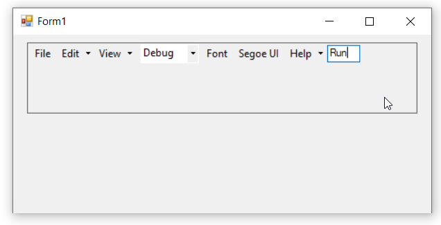

## Separator

Separator is Used for separation of bar items visually in a **XPToolBar**.

### Through Designer

1. Once XPToolBar control is added, We can add the **Separator** by right-clicking on the control in the designer and select **Properties**. Now, in the **Properties** panel, under **Misc > SeparatorIndices** set the **Indices** values which the separator have to be placed from the **Int32 Collection Editor**.

   

   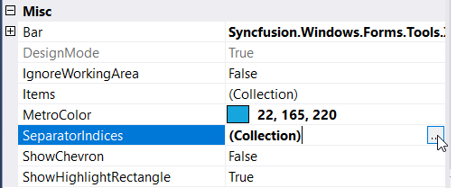

   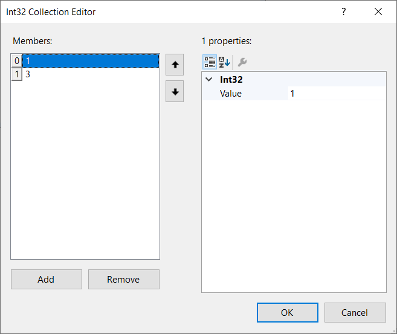

### Through Code

The below code snippets add a **Separator** to the XPToolbar control.




//Declaration
private Syncfusion.Windows.Forms.Tools.XPMenus.XPToolBar xpToolBar1;
private Syncfusion.Windows.Forms.Tools.XPMenus.BarItem barItem1;
private Syncfusion.Windows.Forms.Tools.XPMenus.ParentBarItem parentBarItem1;
private Syncfusion.Windows.Forms.Tools.XPMenus.BarItem barItem2;
private Syncfusion.Windows.Forms.Tools.XPMenus.BarItem barItem3;
private System.Windows.Forms.Panel panel1;
private System.Windows.Forms.Button button1;
private Syncfusion.Windows.Forms.Tools.XPMenus.DropDownBarItem dropDownBarItem1;
private Syncfusion.Windows.Forms.PopupControlContainer popupControlContainer1;
private Syncfusion.Windows.Forms.Tools.XPMenus.ComboBoxBarItem comboBoxBarItem1;
private Syncfusion.Windows.Forms.Tools.XPMenus.ListBarItem listBarItem1;
private Syncfusion.Windows.Forms.Tools.XPMenus.StaticBarItem staticBarItem1;
private Syncfusion.Windows.Forms.Tools.XPMenus.ToolbarListBarItem toolbarListBarItem1;
private Syncfusion.Windows.Forms.Tools.XPMenus.TextBoxBarItem textBoxBarItem1;

//Initializing
this.xpToolBar1 = new Syncfusion.Windows.Forms.Tools.XPMenus.XPToolBar();
this.barItem1 = new Syncfusion.Windows.Forms.Tools.XPMenus.BarItem();
this.parentBarItem1 = new Syncfusion.Windows.Forms.Tools.XPMenus.ParentBarItem();
this.barItem2 = new Syncfusion.Windows.Forms.Tools.XPMenus.BarItem();
this.barItem3 = new Syncfusion.Windows.Forms.Tools.XPMenus.BarItem();
this.panel1 = new System.Windows.Forms.Panel();
this.button1 = new System.Windows.Forms.Button();
this.dropDownBarItem1 = new Syncfusion.Windows.Forms.Tools.XPMenus.DropDownBarItem();
this.popupControlContainer1 = new Syncfusion.Windows.Forms.PopupControlContainer(this.components);
this.comboBoxBarItem1 = new Syncfusion.Windows.Forms.Tools.XPMenus.ComboBoxBarItem();
this.listBarItem1 = new Syncfusion.Windows.Forms.Tools.XPMenus.ListBarItem();
this.staticBarItem1 = new Syncfusion.Windows.Forms.Tools.XPMenus.StaticBarItem();
this.toolbarListBarItem1 = new Syncfusion.Windows.Forms.Tools.XPMenus.ToolbarListBarItem();
this.textBoxBarItem1 = new Syncfusion.Windows.Forms.Tools.XPMenus.TextBoxBarItem();

// barItem1
this.barItem1.Text = "File";

// barItem2
this.barItem2.Image = System.Drawing.Image.FromFile(@"..\..\..\Cut.png");
this.barItem2.Text = "Cut";

// barItem3
this.barItem3.Image = System.Drawing.Image.FromFile(@"..\..\..\Copy.png");
this.barItem3.Text = "Copy";

// parentBarItem1
this.parentBarItem1.Text = "Edit";          
this.parentBarItem1.Items.AddRange(new Syncfusion.Windows.Forms.Tools.XPMenus.BarItem[] { this.barItem2, this.barItem3});

// dropDownBarItem1
this.dropDownBarItem1.PopupControlContainer = this.popupControlContainer1;
this.dropDownBarItem1.Text = "View";

// popupControlContainer1
this.popupControlContainer1.Controls.Add(this.button1);

// button1
this.button1.Text = "Toolbars";
this.button1.Width = 90;

// comboBoxBarItem1
this.comboBoxBarItem1.ChoiceList.AddRange(new string[] { "Debug", "Release"});
this.comboBoxBarItem1.TextBoxValue = "Debug";
this.comboBoxBarItem1.MinWidth = 70;

// listBarItem1
this.listBarItem1.ChildCaptions.AddRange(new string[] {"Bold", "Italic"});
this.listBarItem1.SizeToFit = true;
this.listBarItem1.Text = "Font";

// staticBarItem1
this.staticBarItem1.SizeToFit = true;
this.staticBarItem1.Text = "Segoe UI";

// toolbarListBarItem1
this.toolbarListBarItem1.SizeToFit = true;
this.toolbarListBarItem1.Text = "Help";

// textBoxBarItem1
this.textBoxBarItem1.SizeToFit = true;
this.textBoxBarItem1.TextBoxValue = "Run";

// xpToolBar1
this.xpToolBar1.Text = "xpToolBar1";
this.xpToolBar1.Bar.Items.AddRange(new Syncfusion.Windows.Forms.Tools.XPMenus.BarItem[] { this.barItem1, this.parentBarItem1, this.dropDownBarItem1, this.comboBoxBarItem1, this.listBarItem1, this.staticBarItem1, this.toolbarListBarItem1, this.textBoxBarItem1});
this.xpToolBar1.SeparatorIndices.AddRange(new int[] {1, 3});

// panel1
this.panel1.BorderStyle = System.Windows.Forms.BorderStyle.FixedSingle;
this.panel1.Controls.Add(this.xpToolBar1);

//Form
this.Text = "Form1";
this.Controls.Add(this.panel1);





'Declaration
Private xpToolBar1 As Syncfusion.Windows.Forms.Tools.XPMenus.XPToolBar
Private barItem1 As Syncfusion.Windows.Forms.Tools.XPMenus.BarItem
Private parentBarItem1 As Syncfusion.Windows.Forms.Tools.XPMenus.ParentBarItem
Private barItem2 As Syncfusion.Windows.Forms.Tools.XPMenus.BarItem
Private barItem3 As Syncfusion.Windows.Forms.Tools.XPMenus.BarItem
Private panel1 As System.Windows.Forms.Panel
Private button1 As System.Windows.Forms.Button
Private dropDownBarItem1 As Syncfusion.Windows.Forms.Tools.XPMenus.DropDownBarItem
Private popupControlContainer1 As Syncfusion.Windows.Forms.PopupControlContainer
Private comboBoxBarItem1 As Syncfusion.Windows.Forms.Tools.XPMenus.ComboBoxBarItem
Private listBarItem1 As Syncfusion.Windows.Forms.Tools.XPMenus.ListBarItem
Private staticBarItem1 As Syncfusion.Windows.Forms.Tools.XPMenus.StaticBarItem
Private toolbarListBarItem1 As Syncfusion.Windows.Forms.Tools.XPMenus.ToolbarListBarItem
Private textBoxBarItem1 As Syncfusion.Windows.Forms.Tools.XPMenus.TextBoxBarItem

'Initializing
Me.xpToolBar1 = New Syncfusion.Windows.Forms.Tools.XPMenus.XPToolBar()
Me.barItem1 = New Syncfusion.Windows.Forms.Tools.XPMenus.BarItem()
Me.parentBarItem1 = New Syncfusion.Windows.Forms.Tools.XPMenus.ParentBarItem()
Me.barItem2 = New Syncfusion.Windows.Forms.Tools.XPMenus.BarItem()
Me.barItem3 = New Syncfusion.Windows.Forms.Tools.XPMenus.BarItem()
Me.panel1 = New System.Windows.Forms.Panel()
Me.button1 = New System.Windows.Forms.Button()
Me.dropDownBarItem1 = New Syncfusion.Windows.Forms.Tools.XPMenus.DropDownBarItem()
Me.popupControlContainer1 = New Syncfusion.Windows.Forms.PopupControlContainer(Me.components)
Me.comboBoxBarItem1 = New Syncfusion.Windows.Forms.Tools.XPMenus.ComboBoxBarItem()
Me.listBarItem1 = New Syncfusion.Windows.Forms.Tools.XPMenus.ListBarItem()
Me.staticBarItem1 = New Syncfusion.Windows.Forms.Tools.XPMenus.StaticBarItem()
Me.toolbarListBarItem1 = New Syncfusion.Windows.Forms.Tools.XPMenus.ToolbarListBarItem()
Me.textBoxBarItem1 = New Syncfusion.Windows.Forms.Tools.XPMenus.TextBoxBarItem()

' barItem1
Me.barItem1.Text = "File"

' barItem2
Me.barItem2.Image = System.Drawing.Image.FromFile("..\..\..\Cut.png")
Me.barItem2.Text = "Cut"

' barItem3
Me.barItem3.Image = System.Drawing.Image.FromFile("..\..\..\Copy.png")
Me.barItem3.Text = "Copy"

' parentBarItem1
Me.parentBarItem1.Text = "Edit"
Me.parentBarItem1.Items.AddRange(New Syncfusion.Windows.Forms.Tools.XPMenus.BarItem() { Me.barItem2, Me.barItem3})

' dropDownBarItem1
Me.dropDownBarItem1.PopupControlContainer = Me.popupControlContainer1
Me.dropDownBarItem1.Text = "View"

' popupControlContainer1
Me.popupControlContainer1.Controls.Add(Me.button1)

' button1
Me.button1.Text = "Toolbars"
Me.button1.Width = 90

' comboBoxBarItem1
Me.comboBoxBarItem1.ChoiceList.AddRange(New String() { "Debug", "Release"})
Me.comboBoxBarItem1.TextBoxValue = "Debug"
Me.comboBoxBarItem1.MinWidth = 70

' listBarItem1
Me.listBarItem1.ChildCaptions.AddRange(New String() {"Bold", "Italic"})
Me.listBarItem1.SizeToFit = True
Me.listBarItem1.Text = "Font"

' staticBarItem1
Me.staticBarItem1.SizeToFit = True
Me.staticBarItem1.Text = "Segoe UI"

' toolbarListBarItem1
Me.toolbarListBarItem1.SizeToFit = True
Me.toolbarListBarItem1.Text = "Help"

' textBoxBarItem1
Me.textBoxBarItem1.SizeToFit = True
Me.textBoxBarItem1.TextBoxValue = "Run"

' xpToolBar1
Me.xpToolBar1.Text = "xpToolBar1"
Me.xpToolBar1.Bar.Items.AddRange(New Syncfusion.Windows.Forms.Tools.XPMenus.BarItem() { Me.barItem1, Me.parentBarItem1, Me.dropDownBarItem1, Me.comboBoxBarItem1, Me.listBarItem1, Me.staticBarItem1, Me.toolbarListBarItem1, Me.textBoxBarItem1})
Me.xpToolBar1.SeparatorIndices.AddRange(New Integer() {1, 3})

' panel1
Me.panel1.BorderStyle = System.Windows.Forms.BorderStyle.FixedSingle
Me.panel1.Controls.Add(Me.xpToolBar1)

'Form
Me.Text = "Form1"
Me.Controls.Add(Me.panel1)




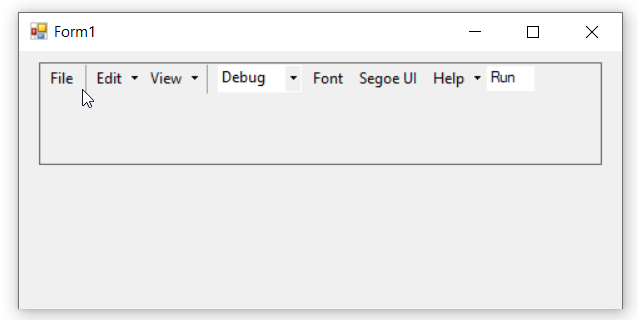

