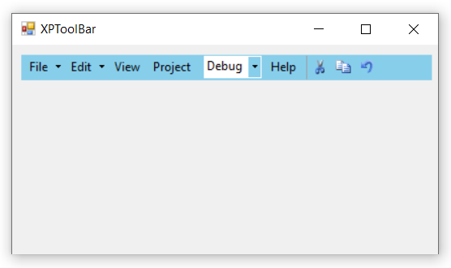
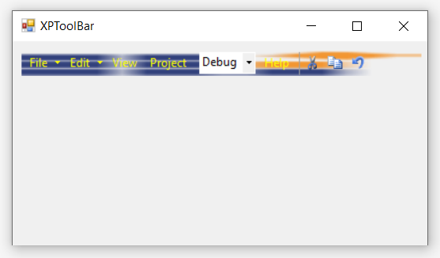
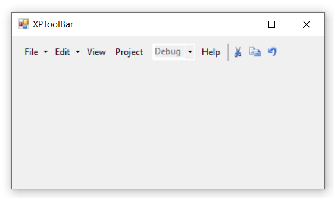
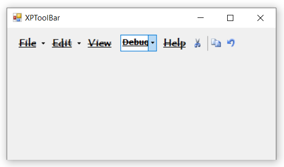
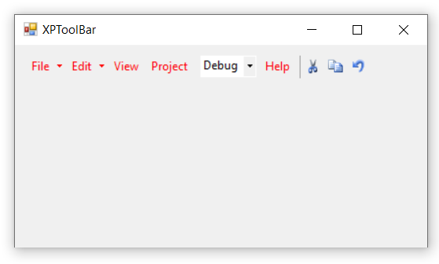
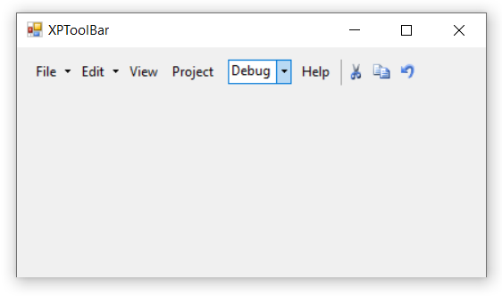

# Appearance Customization

## Background Color

The [`BackColor`](https://help.syncfusion.com/cr/windowsforms/Syncfusion.Tools.Windows~Syncfusion.Windows.Forms.Tools.XPMenus.BarControlInternal~BackColor.html) property is used to set the background color of XPToolBar control. Background color is used to improve the visual appearance of the control.

The below code snippet will explain how to set background color of XPToolBar control.




this.xpToolBar1.BackColor = System.Drawing.Color.SkyBlue;





Me.xpToolBar1.BackColor = System.Drawing.Color.SkyBlue




## Background Image

The [`BackgroundImage`](https://docs.microsoft.com/en-us/dotnet/api/system.windows.forms.control.backgroundimage?redirectedfrom=MSDN&view=netframework-4.7.2#System_Windows_Forms_Control_BackgroundImage) property is used to set the background image of XPToolBar control. Also we can adjust the image by using [`BackgroundImageLayout`](https://docs.microsoft.com/en-us/dotnet/api/system.windows.forms.control.backgroundimagelayout?redirectedfrom=MSDN&view=netframework-4.7.2#System_Windows_Forms_Control_BackgroundImageLayout) property. The layout can be None, Tile, Center, Stretch and Zoom.

The below code snippet is to set the background image of XPToolBar.




this.xpToolBar1.BackgroundImage = System.Drawing.Image.FromFile(@"..\..\..\logo.png");
this.xpToolBar1.BackgroundImageLayout = System.Windows.Forms.ImageLayout.Stretch;





Me.xpToolBar1.BackgroundImage = System.Drawing.Image.FromFile("..\..\..\logo.png")
Me.xpToolBar1.BackgroundImageLayout = System.Windows.Forms.ImageLayout.Stretch




## Enable/Disable

XPToolBar is enabled by default when they are created. But its visibility can be changed based on user requirement through the [`Enabled`](https://docs.microsoft.com/en-us/dotnet/api/system.windows.forms.control.enabled?redirectedfrom=MSDN&view=netframework-4.7.2#System_Windows_Forms_Control_Enabled) property. Smilarly, we can disable individual bar items by using the [`Enabled`](https://help.syncfusion.com/cr/windowsforms/Syncfusion.Tools.Windows~Syncfusion.Windows.Forms.Tools.XPMenus.BarItem~Enabled.html) property of each item.

The below code snippet will explain how to disable XPToolBar.




this.xpToolBar1.Enabled = false;
this.parentBarItem1.Enabled = false;
this.barItem4.Enabled = false;





Me.xpToolBar1.Enabled = False
Me.parentBarItem1.Enabled = False
Me.barItem4.Enabled = False




## Font

The [`Font`](https://help.syncfusion.com/cr/windowsforms/Syncfusion.Tools.Windows~Syncfusion.Windows.Forms.Tools.XPMenus.BarControlInternal~Font.html) property is used to set the "FontFamily", "FontStyle", and "FontSize" of XPToolBar control.

The below code snippet will explain the procedure to set font for toolbar.




this.xpToolBar1.Font = new System.Drawing.Font("Tempus Sans ITC", 12F, ((System.Drawing.FontStyle)((System.Drawing.FontStyle.Bold | System.Drawing.FontStyle.Strikeout))));





Me.xpToolBar1.Font = New System.Drawing.Font("Tempus Sans ITC", 12F, (CType((System.Drawing.FontStyle.Bold Or System.Drawing.FontStyle.Strikeout), System.Drawing.FontStyle)))




## Foreground Color

The [`ForeColor`](https://docs.microsoft.com/en-us/dotnet/api/system.windows.forms.control.forecolor?redirectedfrom=MSDN&view=netframework-4.7.2#System_Windows_Forms_Control_ForeColor) property is used to set foreground color for toolbar.

The below code snippet will explain the procedure to set foreground color for toolbar.




this.xpToolBar1.ForeColor = System.Drawing.Color.Red;





Me.xpToolBar1.ForeColor = System.Drawing.Color.Red




## Size

The [`Size`](https://docs.microsoft.com/en-us/dotnet/api/system.windows.forms.control.size?redirectedfrom=MSDN&view=netframework-4.7.2#System_Windows_Forms_Control_Size) property is used to set the height and width of XPToolBar.

The below code snippet is used to set the size of XPToolBar.




this.xpToolBar1.Size = new System.Drawing.Size(878, 300);





Me.xpToolBar1.Size = New System.Drawing.Size(878, 300)




