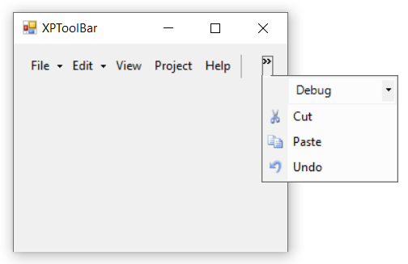

# Chevron/Overflow Button in Windows Forms xp toolbar (XPToolbar)

Overflow button is used to expand a toolbar and view other options that may not be currently visible. The [`ShowChevron`](https://help.syncfusion.com/cr/windowsforms/Syncfusion.Windows.Forms.Tools.XPMenus.XPToolBar.html#Syncfusion_Windows_Forms_Tools_XPMenus_XPToolBar_ShowChevron) property is used to indicates whether to show overflow button or not.

The below code snippets is used to enable the chevron in **XPToolBar**.




this.xpToolBar1.ShowChevron = true;





Me.xpToolBar1.ShowChevron = True




