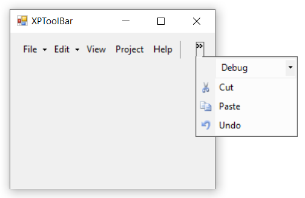

---
layout: post
title: Chevron and Overflow Button in Windows Forms XPToolBar | Syncfusion®
description: Chevron or Overflow Button support enables accessing toolbar items that are hidden when available space is limited.
platform: WindowsForms
control: XPToolBar
documentation: ug
---

# Chevron and Overflow Button in Windows Forms XPToolBar

Overflow button is used to expand a toolbar and view other options that may not be currently visible. The [`ShowChevron`](https://help.syncfusion.com/cr/windowsforms/Syncfusion.Windows.Forms.Tools.XPMenus.XPToolBar.html#Syncfusion_Windows_Forms_Tools_XPMenus_XPToolBar_ShowChevron) property is used to indicates whether to show overflow button or not.

The below code snippets is used to enable the chevron in **XPToolBar**.




this.xpToolBar1.ShowChevron = true;





Me.xpToolBar1.ShowChevron = True




