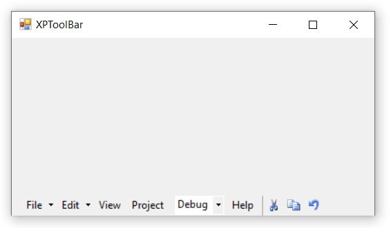

# Docking in Windows Forms xptoolbar (XPToolbar)

Docking is a process of positioning the control inside the form. The [`Dock`](https://docs.microsoft.com/en-us/dotnet/api/system.windows.forms.control.dock?redirectedfrom=MSDN&view=netframework-4.7.2#System_Windows_Forms_Control_Dock) property is used to place the control by left, right, top, bottom, fill and none.

The below code snippets is used to set the docking in **XPToolBar**.




this.xpToolBar1.Dock = System.Windows.Forms.DockStyle.Bottom;





Me.xpToolBar1.Dock = System.Windows.Forms.DockStyle.Bottom




