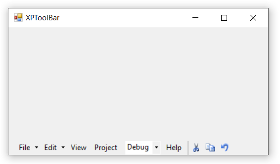

---
layout: post
title: Docking in Windows Forms XPToolBar | Syncfusion®
description: Docking support enables positioning XPToolBar on the top, bottom, left, right, fill, or custom regions of a form.
platform: WindowsForms
control: XPToolBar
documentation: ug
---

# Docking in Windows Forms XPToolBar

Docking is a process of positioning the control inside the form. The [`Dock`](https://learn.microsoft.com/en-us/dotnet/api/system.windows.forms.control.dock) property is used to place the control by left, right, top, bottom, fill and none.

>**NOTE**:
When the XPToolBar control is placed inside a panel for layout purposes as shown in the [Getting Started](https://help.syncfusion.com/windowsforms/xptoolbar/getting-started) documentation, dock the toolbar within its parent panel by setting the [`Dock`](https://learn.microsoft.com/en-us/dotnet/api/system.windows.forms.control.dock) property instead of manually positioning it.

The below code snippet is used to set the docking in **XPToolBar**.




this.xpToolBar1.Dock = System.Windows.Forms.DockStyle.Bottom;





Me.xpToolBar1.Dock = System.Windows.Forms.DockStyle.Bottom




