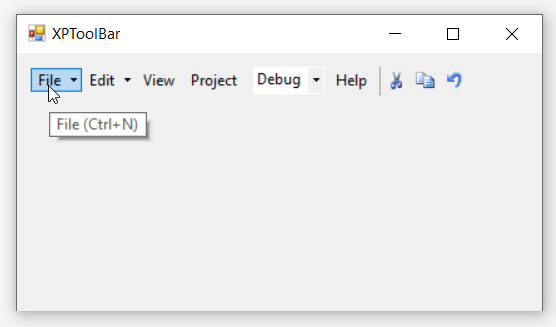
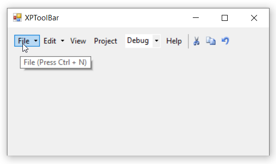

# Keyboard Shortcuts 

The bar items can be selected through keyboard operation by specifying the shortcuts via the [`Shortcut`](https://help.syncfusion.com/cr/windowsforms/Syncfusion.Windows.Forms.Tools.XPMenus.BarItem.html#Syncfusion_Windows_Forms_Tools_XPMenus_BarItem__ctor_System_String_System_EventHandler_System_Windows_Forms_Shortcut_) property of each item.

>**NOTE**      
1. By using this keyboard shortcuts, we can access the bar items functionality through [`Click`](https://help.syncfusion.com/cr/windowsforms/Syncfusion.Windows.Forms.Tools.XPMenus.BarItem.html) event.               
2. In this illustration, we have used **BarItem**. Similarly, we have set the shortcuts for ParentBarItem, DropDownBarItem, ComboBoxBarItem, ListBarItem, StaticBarItem, ToolbarListBarItem and TextBoxBarItem.

The below code snippet shows how shortcut is assigned to the bar item.




this.barItem1.Shortcut = System.Windows.Forms.Shortcut.CtrlN;





Me.barItem1.Shortcut = System.Windows.Forms.Shortcut.CtrlN




User can also specify custom text in place of keyboard shortcuts region using the [`ShortcutText`](https://help.syncfusion.com/cr/windowsforms/Syncfusion.Windows.Forms.Tools.XPMenus.BarItem.html#Syncfusion_Windows_Forms_Tools_XPMenus_BarItem_ShortcutText) property.




this.barItem1.Shortcut = System.Windows.Forms.Shortcut.CtrlN;
this.barItem1.ShortcutText = "Press Ctrl + N";





Me.barItem1.Shortcut = System.Windows.Forms.Shortcut.CtrlN
Me.barItem1.ShortcutText = "Press Ctrl + N"




