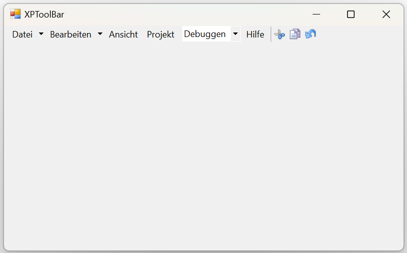

# Localization in Windows Forms xp toolbar (XPToolbar)

Localization is the process of making application multilingual by formatting the content according to the cultures. This involves configuring the application for a specific language. Culture is the combination of language and location. For example, en-US is the culture for English spoken in United States; en-GB is the culture for English spoken in Great Britain.

The below code snippet will explain how to set the localize text in **German** culture.




this.parentBarItem1.Text = "Datei";
this.dropDownBarItem1.Text = "Bearbeiten";
this.barItem4.Text = "Ansicht";
this.barItem5.Text = "Projekt";
this.comboBoxBarItem1.TextBoxValue = "Debuggen";
this.barItem6.Text = "Hilfe";





Me.parentBarItem1.Text = "Datei"
Me.dropDownBarItem1.Text = "Bearbeiten"
Me.barItem4.Text = "Ansicht"
Me.barItem5.Text = "Projekt"
Me.comboBoxBarItem1.TextBoxValue = "Debuggen"
Me.barItem6.Text = "Hilfe"




**German Culture**

**French Culture**

**Arabic Culture**

