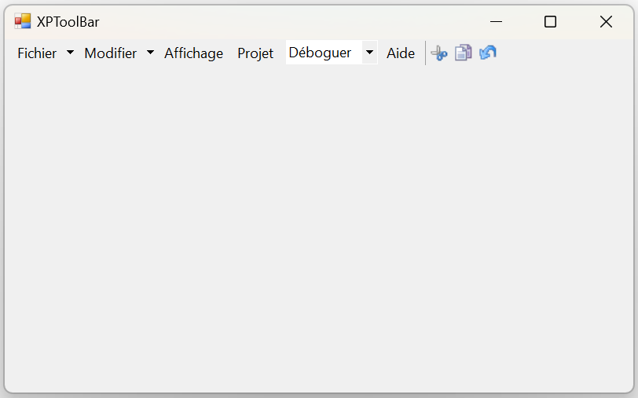
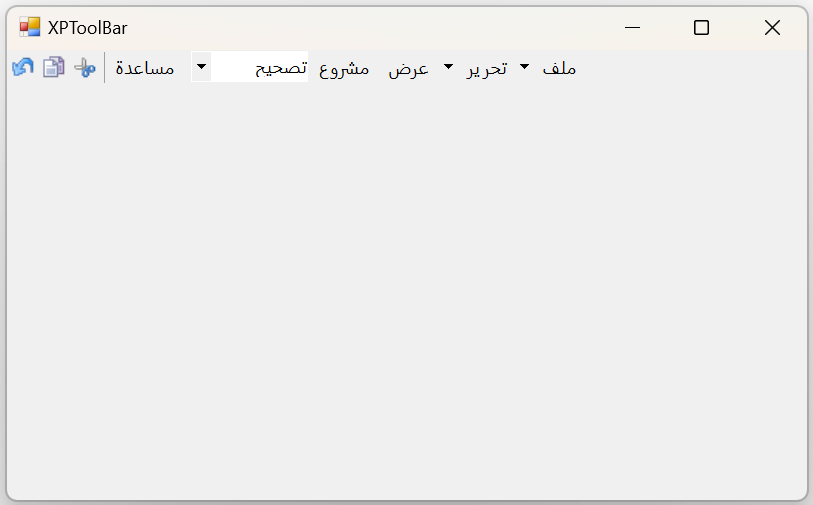

# Localization in Windows Forms xp toolbar (XPToolbar)

Localization is the process of making application multilingual by formatting the content according to the cultures. This involves configuring the application for a specific language. Culture is the combination of language and location. For example, en-US is the culture for English spoken in United States; en-GB is the culture for English spoken in Great Britain.

The below code snippet will explain how to set the localize text in **German** culture.




private Syncfusion.Windows.Forms.Tools.XPMenus.ParentBarItem parentBarItem1;
private Syncfusion.Windows.Forms.Tools.XPMenus.DropDownBarItem dropDownBarItem1;
private Syncfusion.Windows.Forms.Tools.XPMenus.BarItem barItem4;
private Syncfusion.Windows.Forms.Tools.XPMenus.BarItem barItem5;
private Syncfusion.Windows.Forms.Tools.XPMenus.ComboBoxBarItem comboBoxBarItem1;
private Syncfusion.Windows.Forms.Tools.XPMenus.BarItem barItem6;
private Syncfusion.Windows.Forms.Tools.XPMenus.XPToolBar xpToolBar;
private Syncfusion.Windows.Forms.Tools.XPMenus.BarItem cutItem;
private Syncfusion.Windows.Forms.Tools.XPMenus.BarItem pasteItem;
private Syncfusion.Windows.Forms.Tools.XPMenus.BarItem undoItem;

this.parentBarItem1 = new Syncfusion.Windows.Forms.Tools.XPMenus.ParentBarItem();
this.dropDownBarItem1 = new Syncfusion.Windows.Forms.Tools.XPMenus.DropDownBarItem();
this.barItem4 = new Syncfusion.Windows.Forms.Tools.XPMenus.BarItem();
this.barItem5 = new Syncfusion.Windows.Forms.Tools.XPMenus.BarItem();
this.comboBoxBarItem1 = new Syncfusion.Windows.Forms.Tools.XPMenus.ComboBoxBarItem();
this.barItem6 = new Syncfusion.Windows.Forms.Tools.XPMenus.BarItem();
this.xpToolBar = new Syncfusion.Windows.Forms.Tools.XPMenus.XPToolBar();
this.cutItem = new Syncfusion.Windows.Forms.Tools.XPMenus.BarItem();
this.pasteItem = new Syncfusion.Windows.Forms.Tools.XPMenus.BarItem();
this.undoItem = new Syncfusion.Windows.Forms.Tools.XPMenus.BarItem();

this.parentBarItem1.Text = "Datei";

this.dropDownBarItem1.Text = "Bearbeiten";

this.barItem4.Text = "Ansicht";

this.barItem5.Text = "Projekt";

this.comboBoxBarItem1.TextBoxValue = "Debuggen";
this.comboBoxBarItem1.MinWidth = 120;

this.barItem6.Text = "Hilfe";

this.cutItem.ID = "Cu&t";
this.cutItem.ImageIndex = 9;
this.cutItem.ImageList = this.imageList1;

this.pasteItem.ID = "&Paste";
this.pasteItem.ImageIndex = 8;
this.pasteItem.ImageList = this.imageList1;

this.undoItem.ID = "&Undo";
this.undoItem.ImageIndex = 12;
this.undoItem.ImageList = this.imageList1;

xpToolBar.Items.AddRange(new Syncfusion.Windows.Forms.Tools.XPMenus.BarItem[] { parentBarItem1, dropDownBarItem1, barItem4, barItem5, comboBoxBarItem1,
                                        barItem6,  cutItem, pasteItem, undoItem });
xpToolBar.SeparatorIndices.AddRange(new int[] { 0, 6 });
this.Controls.Add(xpToolBar);





Private parentBarItem1 As Syncfusion.Windows.Forms.Tools.XPMenus.ParentBarItem
Private dropDownBarItem1 As Syncfusion.Windows.Forms.Tools.XPMenus.DropDownBarItem
Private barItem4 As Syncfusion.Windows.Forms.Tools.XPMenus.BarItem
Private barItem5 As Syncfusion.Windows.Forms.Tools.XPMenus.BarItem
Private comboBoxBarItem1 As Syncfusion.Windows.Forms.Tools.XPMenus.ComboBoxBarItem
Private barItem6 As Syncfusion.Windows.Forms.Tools.XPMenus.BarItem
Private xpToolBar As Syncfusion.Windows.Forms.Tools.XPMenus.XPToolBar
Private cutItem As Syncfusion.Windows.Forms.Tools.XPMenus.BarItem
Private pasteItem As Syncfusion.Windows.Forms.Tools.XPMenus.BarItem
Private undoItem As Syncfusion.Windows.Forms.Tools.XPMenus.BarItem

Me.parentBarItem1 = New Syncfusion.Windows.Forms.Tools.XPMenus.ParentBarItem()
Me.dropDownBarItem1 = New Syncfusion.Windows.Forms.Tools.XPMenus.DropDownBarItem()
Me.barItem4 = New Syncfusion.Windows.Forms.Tools.XPMenus.BarItem()
Me.barItem5 = New Syncfusion.Windows.Forms.Tools.XPMenus.BarItem()
Me.comboBoxBarItem1 = New Syncfusion.Windows.Forms.Tools.XPMenus.ComboBoxBarItem()
Me.barItem6 = New Syncfusion.Windows.Forms.Tools.XPMenus.BarItem()
Me.xpToolBar = New Syncfusion.Windows.Forms.Tools.XPMenus.XPToolBar()
Me.cutItem = New Syncfusion.Windows.Forms.Tools.XPMenus.BarItem()
Me.pasteItem = New Syncfusion.Windows.Forms.Tools.XPMenus.BarItem()
Me.undoItem = New Syncfusion.Windows.Forms.Tools.XPMenus.BarItem()

Me.parentBarItem1.Text = "Datei"

Me.dropDownBarItem1.Text = "Bearbeiten"

Me.barItem4.Text = "Ansicht"

Me.barItem5.Text = "Projekt"

Me.comboBoxBarItem1.TextBoxValue = "Debuggen"
Me.comboBoxBarItem1.MinWidth = 120

Me.barItem6.Text = "Hilfe"

Me.cutItem.ID = "Cu&t"
Me.cutItem.ImageIndex = 9
Me.cutItem.ImageList = Me.imageList1

Me.pasteItem.ID = "&Paste"
Me.pasteItem.ImageIndex = 8
Me.pasteItem.ImageList = Me.imageList1

Me.undoItem.ID = "&Undo"
Me.undoItem.ImageIndex = 12
Me.undoItem.ImageList = Me.imageList1

xpToolBar.Items.AddRange(New Syncfusion.Windows.Forms.Tools.XPMenus.BarItem() {
    parentBarItem1, dropDownBarItem1, barItem4, barItem5, comboBoxBarItem1, barItem6, cutItem, pasteItem, undoItem
})
xpToolBar.SeparatorIndices.AddRange(New Integer() {0, 6})

Me.Controls.Add(xpToolBar)




**German Culture**

**French Culture**

**Arabic Culture**

