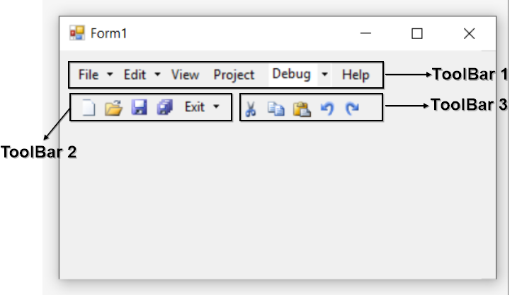

# Multiple Toolbar in Windows Forms xptoolbar (XPToolbar)

We can add different layers of toolbar either on-after-the-other or one-below-the-other. The below code snippet will explain how to add multiple toolbar in an application.




//Declaration
private System.Windows.Forms.Panel panel1;
private Syncfusion.Windows.Forms.Tools.XPMenus.XPToolBar xpToolBar3;
private Syncfusion.Windows.Forms.Tools.XPMenus.BarItem barItem8;
private Syncfusion.Windows.Forms.Tools.XPMenus.BarItem barItem9;
private Syncfusion.Windows.Forms.Tools.XPMenus.BarItem barItem10;
private Syncfusion.Windows.Forms.Tools.XPMenus.BarItem barItem11;
private Syncfusion.Windows.Forms.Tools.XPMenus.BarItem barItem12;
private Syncfusion.Windows.Forms.Tools.XPMenus.XPToolBar xpToolBar2;
private Syncfusion.Windows.Forms.Tools.XPMenus.BarItem barItem4;
private Syncfusion.Windows.Forms.Tools.XPMenus.BarItem barItem5;
private Syncfusion.Windows.Forms.Tools.XPMenus.BarItem barItem6;
private Syncfusion.Windows.Forms.Tools.XPMenus.BarItem barItem7;
private Syncfusion.Windows.Forms.Tools.XPMenus.XPToolBar xpToolBar1;
private Syncfusion.Windows.Forms.Tools.XPMenus.ParentBarItem parentBarItem1;
private Syncfusion.Windows.Forms.Tools.XPMenus.ParentBarItem parentBarItem2;
private Syncfusion.Windows.Forms.Tools.XPMenus.BarItem barItem1;
private Syncfusion.Windows.Forms.Tools.XPMenus.BarItem barItem2;
private Syncfusion.Windows.Forms.Tools.XPMenus.ComboBoxBarItem comboBoxBarItem1;
private Syncfusion.Windows.Forms.Tools.XPMenus.BarItem barItem3;
private Syncfusion.Windows.Forms.Tools.XPMenus.ParentBarItem parentBarItem3;

//Initializing
this.panel1 = new System.Windows.Forms.Panel();
this.xpToolBar1 = new Syncfusion.Windows.Forms.Tools.XPMenus.XPToolBar();
this.parentBarItem1 = new Syncfusion.Windows.Forms.Tools.XPMenus.ParentBarItem();
this.parentBarItem2 = new Syncfusion.Windows.Forms.Tools.XPMenus.ParentBarItem();
this.barItem1 = new Syncfusion.Windows.Forms.Tools.XPMenus.BarItem();
this.barItem2 = new Syncfusion.Windows.Forms.Tools.XPMenus.BarItem();
this.comboBoxBarItem1 = new Syncfusion.Windows.Forms.Tools.XPMenus.ComboBoxBarItem();
this.barItem3 = new Syncfusion.Windows.Forms.Tools.XPMenus.BarItem();
this.xpToolBar2 = new Syncfusion.Windows.Forms.Tools.XPMenus.XPToolBar();
this.barItem4 = new Syncfusion.Windows.Forms.Tools.XPMenus.BarItem();
this.barItem5 = new Syncfusion.Windows.Forms.Tools.XPMenus.BarItem();
this.barItem6 = new Syncfusion.Windows.Forms.Tools.XPMenus.BarItem();
this.barItem7 = new Syncfusion.Windows.Forms.Tools.XPMenus.BarItem();
this.xpToolBar3 = new Syncfusion.Windows.Forms.Tools.XPMenus.XPToolBar();
this.barItem8 = new Syncfusion.Windows.Forms.Tools.XPMenus.BarItem();
this.barItem9 = new Syncfusion.Windows.Forms.Tools.XPMenus.BarItem();
this.barItem10 = new Syncfusion.Windows.Forms.Tools.XPMenus.BarItem();
this.barItem11 = new Syncfusion.Windows.Forms.Tools.XPMenus.BarItem();
this.barItem12 = new Syncfusion.Windows.Forms.Tools.XPMenus.BarItem();
this.parentBarItem3 = new Syncfusion.Windows.Forms.Tools.XPMenus.ParentBarItem();

// panel1
this.panel1.Controls.Add(this.xpToolBar1);
this.panel1.Location = new System.Drawing.Point(12, 12);
this.panel1.Name = "panel1";
this.panel1.Size = new System.Drawing.Size(600, 32);
            
// xpToolBar1
this.xpToolBar1.Bar.Items.AddRange(new Syncfusion.Windows.Forms.Tools.XPMenus.BarItem[] {this.parentBarItem1, this.parentBarItem2, this.barItem1, this.barItem2, this.comboBoxBarItem1, this.barItem3});
this.xpToolBar1.Dock = System.Windows.Forms.DockStyle.Top;
this.xpToolBar1.Location = new System.Drawing.Point(0, 0);
this.xpToolBar1.MetroColor = System.Drawing.Color.FromArgb(((int)(((byte)(22)))), ((int)(((byte)(165)))), ((int)(((byte)(220)))));
this.xpToolBar1.Name = "xpToolBar1";
this.xpToolBar1.Size = new System.Drawing.Size(598, 30);

// parentBarItem1
this.parentBarItem1.MetroColor = System.Drawing.Color.LightSkyBlue;
this.parentBarItem1.SizeToFit = true;
this.parentBarItem1.Style = Syncfusion.Windows.Forms.VisualStyle.OfficeXP;
this.parentBarItem1.Text = "File";
           
// parentBarItem2
this.parentBarItem2.MetroColor = System.Drawing.Color.LightSkyBlue;
this.parentBarItem2.SizeToFit = true;
this.parentBarItem2.Style = Syncfusion.Windows.Forms.VisualStyle.OfficeXP;
this.parentBarItem2.Text = "Edit";
            
// barItem1
this.barItem1.SizeToFit = true;
this.barItem1.Text = "View";
           
// barItem2
this.barItem2.SizeToFit = true;
this.barItem2.Text = "Project";
            
// comboBoxBarItem1
this.comboBoxBarItem1.SizeToFit = true;
this.comboBoxBarItem1.TextBoxValue = "Debug";
           
// barItem3
this.barItem3.SizeToFit = true;
this.barItem3.Text = "Help";
           
// xpToolBar2
this.xpToolBar2.Bar.Items.AddRange(new Syncfusion.Windows.Forms.Tools.XPMenus.BarItem[] {this.barItem4, this.barItem5, this.barItem6, this.barItem7, this.parentBarItem3});
this.xpToolBar2.Location = new System.Drawing.Point(17, 48);
this.xpToolBar2.MetroColor = System.Drawing.Color.FromArgb(((int)(((byte)(22)))), ((int)(((byte)(165)))), ((int)(((byte)(220)))));
this.xpToolBar2.Name = "xpToolBar2";
this.xpToolBar2.Size = new System.Drawing.Size(191, 29);
           
// barItem4
this.barItem4.Image = new ImageExt(System.Drawing.Image.FromFile(@"..\..\..\New.png"));
this.barItem4.SizeToFit = true;
           
// barItem5
this.barItem5.Image = new ImageExt(System.Drawing.Image.FromFile(@"..\..\..\Open.png"));
this.barItem5.SizeToFit = true;
          
// barItem6
this.barItem6.Image = new ImageExt(System.Drawing.Image.FromFile(@"..\..\..\Save.png"));
this.barItem6.SizeToFit = true;
            
// barItem7
this.barItem7.Image = new ImageExt(System.Drawing.Image.FromFile(@"..\..\..\SaveAll.png"));
this.barItem7.SizeToFit = true;
           
// xpToolBar3
this.xpToolBar3.Bar.Items.AddRange(new Syncfusion.Windows.Forms.Tools.XPMenus.BarItem[] {this.barItem8, this.barItem9, this.barItem10, this.barItem11, this.barItem12});
this.xpToolBar3.Location = new System.Drawing.Point(177, 48);
this.xpToolBar3.MetroColor = System.Drawing.Color.FromArgb(((int)(((byte)(22)))), ((int)(((byte)(165)))), ((int)(((byte)(220)))));
this.xpToolBar3.Name = "xpToolBar3";
this.xpToolBar3.Size = new System.Drawing.Size(138, 29);
            
// barItem8
this.barItem8.Image = new ImageExt(System.Drawing.Image.FromFile(@"..\..\..\Cut.png"));
this.barItem8.SizeToFit = true;
           
// barItem9
this.barItem9.Image = new ImageExt(System.Drawing.Image.FromFile(@"..\..\..\Copy.png"));
this.barItem9.SizeToFit = true;
            
// barItem10
this.barItem10.Image = new ImageExt(System.Drawing.Image.FromFile(@"..\..\..\Paste.png"));
this.barItem10.SizeToFit = true;
            
// barItem11
this.barItem11.Image = new ImageExt(System.Drawing.Image.FromFile(@"..\..\..\Undo.png"));
this.barItem11.SizeToFit = true;
           
// barItem12
this.barItem12.Image = new ImageExt(System.Drawing.Image.FromFile(@"..\..\..\Redo.png"));
this.barItem12.SizeToFit = true;
            
// parentBarItem3
this.parentBarItem3.MetroColor = System.Drawing.Color.LightSkyBlue;
this.parentBarItem3.SizeToFit = true;
this.parentBarItem3.Style = Syncfusion.Windows.Forms.VisualStyle.OfficeXP;
this.parentBarItem3.Text = "Run";
            
// Form1
this.ClientSize = new System.Drawing.Size(774, 253);
this.Controls.Add(this.panel1);
this.Controls.Add(this.xpToolBar2);
this.Controls.Add(this.xpToolBar3);
this.Name = "Form1";
this.Text = "Form1";
this.panel1.ResumeLayout(false);
((System.ComponentModel.ISupportInitialize)(this.comboBoxBarItem1)).EndInit();
this.ResumeLayout(false);





'Declaration
Private panel1 As System.Windows.Forms.Panel
Private xpToolBar3 As Syncfusion.Windows.Forms.Tools.XPMenus.XPToolBar
Private barItem8 As Syncfusion.Windows.Forms.Tools.XPMenus.BarItem
Private barItem9 As Syncfusion.Windows.Forms.Tools.XPMenus.BarItem
Private barItem10 As Syncfusion.Windows.Forms.Tools.XPMenus.BarItem
Private barItem11 As Syncfusion.Windows.Forms.Tools.XPMenus.BarItem
Private barItem12 As Syncfusion.Windows.Forms.Tools.XPMenus.BarItem
Private xpToolBar2 As Syncfusion.Windows.Forms.Tools.XPMenus.XPToolBar
Private barItem4 As Syncfusion.Windows.Forms.Tools.XPMenus.BarItem
Private barItem5 As Syncfusion.Windows.Forms.Tools.XPMenus.BarItem
Private barItem6 As Syncfusion.Windows.Forms.Tools.XPMenus.BarItem
Private barItem7 As Syncfusion.Windows.Forms.Tools.XPMenus.BarItem
Private xpToolBar1 As Syncfusion.Windows.Forms.Tools.XPMenus.XPToolBar
Private parentBarItem1 As Syncfusion.Windows.Forms.Tools.XPMenus.ParentBarItem
Private parentBarItem2 As Syncfusion.Windows.Forms.Tools.XPMenus.ParentBarItem
Private barItem1 As Syncfusion.Windows.Forms.Tools.XPMenus.BarItem
Private barItem2 As Syncfusion.Windows.Forms.Tools.XPMenus.BarItem
Private comboBoxBarItem1 As Syncfusion.Windows.Forms.Tools.XPMenus.ComboBoxBarItem
Private barItem3 As Syncfusion.Windows.Forms.Tools.XPMenus.BarItem
Private parentBarItem3 As Syncfusion.Windows.Forms.Tools.XPMenus.ParentBarItem

'Initializing
Me.panel1 = New System.Windows.Forms.Panel()
Me.xpToolBar1 = New Syncfusion.Windows.Forms.Tools.XPMenus.XPToolBar()
Me.parentBarItem1 = New Syncfusion.Windows.Forms.Tools.XPMenus.ParentBarItem()
Me.parentBarItem2 = New Syncfusion.Windows.Forms.Tools.XPMenus.ParentBarItem()
Me.barItem1 = New Syncfusion.Windows.Forms.Tools.XPMenus.BarItem()
Me.barItem2 = New Syncfusion.Windows.Forms.Tools.XPMenus.BarItem()
Me.comboBoxBarItem1 = New Syncfusion.Windows.Forms.Tools.XPMenus.ComboBoxBarItem()
Me.barItem3 = New Syncfusion.Windows.Forms.Tools.XPMenus.BarItem()
Me.xpToolBar2 = New Syncfusion.Windows.Forms.Tools.XPMenus.XPToolBar()
Me.barItem4 = New Syncfusion.Windows.Forms.Tools.XPMenus.BarItem()
Me.barItem5 = New Syncfusion.Windows.Forms.Tools.XPMenus.BarItem()
Me.barItem6 = New Syncfusion.Windows.Forms.Tools.XPMenus.BarItem()
Me.barItem7 = New Syncfusion.Windows.Forms.Tools.XPMenus.BarItem()
Me.xpToolBar3 = New Syncfusion.Windows.Forms.Tools.XPMenus.XPToolBar()
Me.barItem8 = New Syncfusion.Windows.Forms.Tools.XPMenus.BarItem()
Me.barItem9 = New Syncfusion.Windows.Forms.Tools.XPMenus.BarItem()
Me.barItem10 = New Syncfusion.Windows.Forms.Tools.XPMenus.BarItem()
Me.barItem11 = New Syncfusion.Windows.Forms.Tools.XPMenus.BarItem()
Me.barItem12 = New Syncfusion.Windows.Forms.Tools.XPMenus.BarItem()
Me.parentBarItem3 = New Syncfusion.Windows.Forms.Tools.XPMenus.ParentBarItem()

' panel1
Me.panel1.Controls.Add(Me.xpToolBar1)
Me.panel1.Location = New System.Drawing.Point(12, 12)
Me.panel1.Name = "panel1"
Me.panel1.Size = New System.Drawing.Size(600, 32)

' xpToolBar1
Me.xpToolBar1.Bar.Items.AddRange(New Syncfusion.Windows.Forms.Tools.XPMenus.BarItem() {Me.parentBarItem1, Me.parentBarItem2, Me.barItem1, Me.barItem2, Me.comboBoxBarItem1, Me.barItem3})
Me.xpToolBar1.Dock = System.Windows.Forms.DockStyle.Top
Me.xpToolBar1.Location = New System.Drawing.Point(0, 0)
Me.xpToolBar1.MetroColor = System.Drawing.Color.FromArgb((CInt(Fix((CByte(22))))), (CInt(Fix((CByte(165))))), (CInt(Fix((CByte(220))))))
Me.xpToolBar1.Name = "xpToolBar1"
Me.xpToolBar1.Size = New System.Drawing.Size(598, 30)

' parentBarItem1
Me.parentBarItem1.MetroColor = System.Drawing.Color.LightSkyBlue
Me.parentBarItem1.SizeToFit = True
Me.parentBarItem1.Style = Syncfusion.Windows.Forms.VisualStyle.OfficeXP
Me.parentBarItem1.Text = "File"

' parentBarItem2
Me.parentBarItem2.MetroColor = System.Drawing.Color.LightSkyBlue
Me.parentBarItem2.SizeToFit = True
Me.parentBarItem2.Style = Syncfusion.Windows.Forms.VisualStyle.OfficeXP
Me.parentBarItem2.Text = "Edit"

' barItem1
Me.barItem1.SizeToFit = True
Me.barItem1.Text = "View"

' barItem2
Me.barItem2.SizeToFit = True
Me.barItem2.Text = "Project"

' comboBoxBarItem1
Me.comboBoxBarItem1.SizeToFit = True
Me.comboBoxBarItem1.TextBoxValue = "Debug"

' barItem3
Me.barItem3.SizeToFit = True
Me.barItem3.Text = "Help"

' xpToolBar2
Me.xpToolBar2.Bar.Items.AddRange(New Syncfusion.Windows.Forms.Tools.XPMenus.BarItem() {Me.barItem4, Me.barItem5, Me.barItem6, Me.barItem7, Me.parentBarItem3})
Me.xpToolBar2.Location = New System.Drawing.Point(17, 48)
Me.xpToolBar2.MetroColor = System.Drawing.Color.FromArgb((CInt(Fix((CByte(22))))), (CInt(Fix((CByte(165))))), (CInt(Fix((CByte(220))))))
Me.xpToolBar2.Name = "xpToolBar2"
Me.xpToolBar2.Size = New System.Drawing.Size(191, 29)

' barItem4
Me.barItem4.Image = New ImageExt(System.Drawing.Image.FromFile("..\..\..\New.png"))
Me.barItem4.SizeToFit = True

' barItem5
Me.barItem5.Image = New ImageExt(System.Drawing.Image.FromFile("..\..\..\Open.png"))
Me.barItem5.SizeToFit = True

' barItem6
Me.barItem6.Image = New ImageExt(System.Drawing.Image.FromFile("..\..\..\Save.png"))
Me.barItem6.SizeToFit = True

' barItem7
Me.barItem7.Image = New ImageExt(System.Drawing.Image.FromFile("..\..\..\SaveAll.png"))
Me.barItem7.SizeToFit = True

' xpToolBar3
Me.xpToolBar3.Bar.Items.AddRange(New Syncfusion.Windows.Forms.Tools.XPMenus.BarItem() {Me.barItem8, Me.barItem9, Me.barItem10, Me.barItem11, Me.barItem12})
Me.xpToolBar3.Location = New System.Drawing.Point(177, 48)
Me.xpToolBar3.MetroColor = System.Drawing.Color.FromArgb((CInt(Fix((CByte(22))))), (CInt(Fix((CByte(165))))), (CInt(Fix((CByte(220))))))
Me.xpToolBar3.Name = "xpToolBar3"
Me.xpToolBar3.Size = New System.Drawing.Size(138, 29)

' barItem8
Me.barItem8.Image = New ImageExt(System.Drawing.Image.FromFile("..\..\..\Cut.png"))
Me.barItem8.SizeToFit = True

' barItem9
Me.barItem9.Image = New ImageExt(System.Drawing.Image.FromFile("..\..\..\Copy.png"))
Me.barItem9.SizeToFit = True

' barItem10
Me.barItem10.Image = New ImageExt(System.Drawing.Image.FromFile("..\..\..\Paste.png"))
Me.barItem10.SizeToFit = True

' barItem11
Me.barItem11.Image = New ImageExt(System.Drawing.Image.FromFile("..\..\..\Undo.png"))
Me.barItem11.SizeToFit = True

' barItem12
Me.barItem12.Image = New ImageExt(System.Drawing.Image.FromFile("..\..\..\Redo.png"))
Me.barItem12.SizeToFit = True

' parentBarItem3
Me.parentBarItem3.MetroColor = System.Drawing.Color.LightSkyBlue
Me.parentBarItem3.SizeToFit = True
Me.parentBarItem3.Style = Syncfusion.Windows.Forms.VisualStyle.OfficeXP
Me.parentBarItem3.Text = "Run"

' Form1
Me.ClientSize = New System.Drawing.Size(774, 253)
Me.Controls.Add(Me.panel1)
Me.Controls.Add(Me.xpToolBar2)
Me.Controls.Add(Me.xpToolBar3)
Me.Name = "Form1"
Me.Text = "Form1"
Me.panel1.ResumeLayout(False)
CType(Me.comboBoxBarItem1, System.ComponentModel.ISupportInitialize).EndInit()
Me.ResumeLayout(False)




