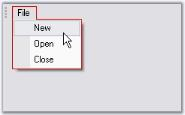

# UpdateUI Event

UpdateUI event is handled when the mouse moves over the bar item or before it gets shown in a dropdown.

N> This event will be handled only when BarManager.UpdateUIMFCStyle property or BarItem.UpdateUIOnAppIdle is enabled. These properties decides whether to handle this event or not.



//Sets the dropdown border color before it is pulled down

private void barItem1_UpdateUI(object sender, System.EventArgs e)

{

MenuColors.DropDownBorderColor = Color.Red;

}





'Sets the dropdown border color before it is pulled down

Private Sub barItem1_UpdateUI(ByVal sender As Object, ByVal e As System.EventArgs)

MenuColors.DropDownBorderColor = Color.Red

End Sub





UpdateUIMFCStyle and UpdateUIOnAppIdle properties in UI Command Update Patterns topic.

