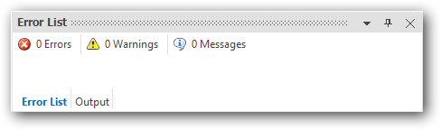

# XPToolbar

XPToolbar control is a container for a group of commands or control, which have relative functions. Supports build-in BarItems similar to the functionality of Menu, ComboBox, TextBox, Label and much more.

# Key features

**BarItem Types** - Provides rich set of built-in controls to be added as a BarItem of the XPToolbar

**VisualStyle** - Provides options to customize the look and feel of XPToolBar using various built-in styles.

**Image settings** - Provides option to set large Icons and also to set BackgroundImage

**Separators** - Provides options to set Seperator for particular indices.

