# Themes in Windows Forms xptoolbar (XPToolbar)

Theming is the process of applying rich look and feel to visual elements of a control. The [`Style`](https://help.syncfusion.com/cr/windowsforms/) property is used to set the visual style of the XPToolBar control. This control provides the following theming options:

* Default
* Metro
* Office2003
* Office2007
* Office2007Outlook
* Office2010
* Office2016Black
* Office2016Colorful
* Office2016DarkGray
* Office2016White
* OfficeXP
* VS2005
* VS2010

The below code snippet will set the visual style as "Office2016Black" to the control.




this.xpToolBar1.Style = Syncfusion.Windows.Forms.VisualStyle.Office2016Black;





Me.xpToolBar1.Style = Syncfusion.Windows.Forms.VisualStyle.Office2016Black




## Office2016Black

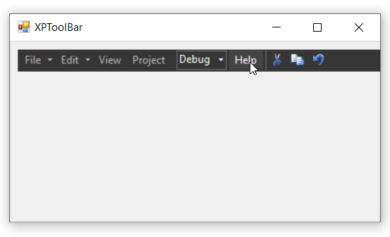

## Default

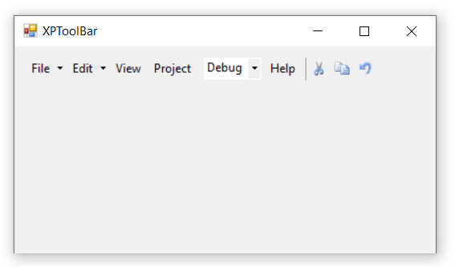

## Metro

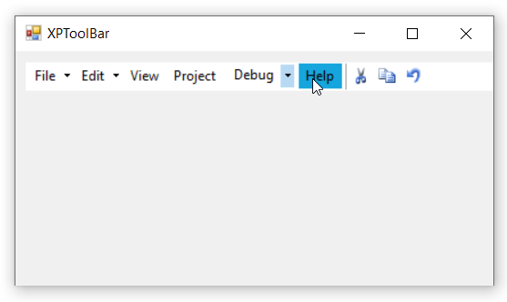

## Office2003

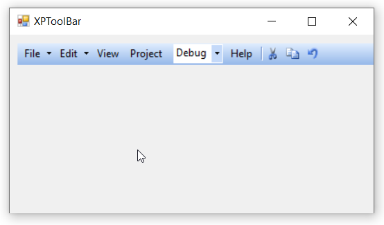

## Office2007

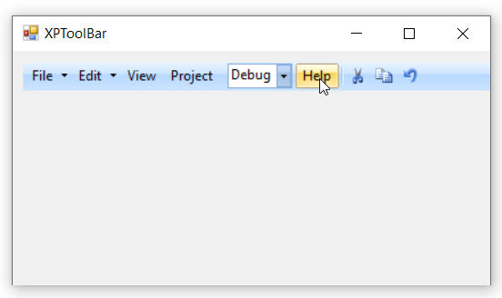

## Office2007Outlook

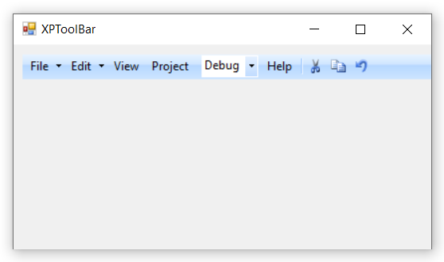

## Office2010

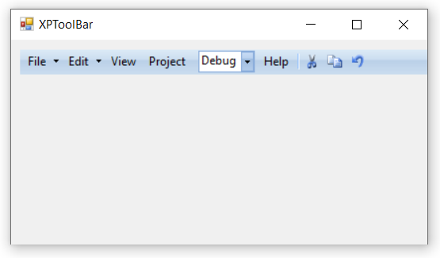

## Office2016Colorful

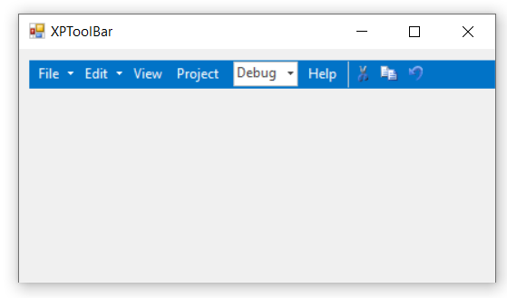

## Office2016DarkGray

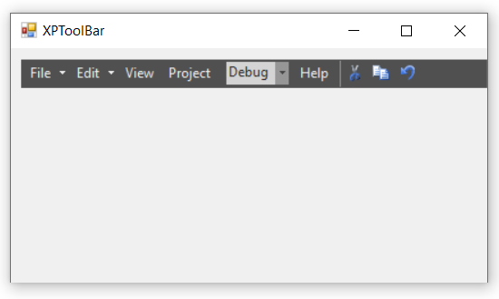

## Office2016White

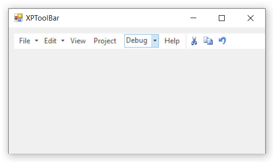

## OfficeXP

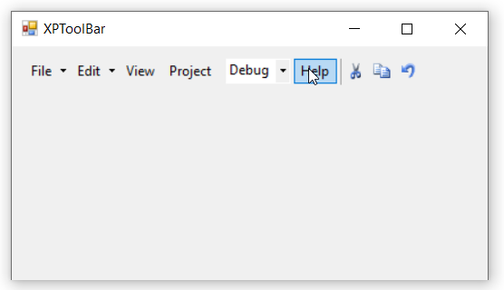

## VS2005

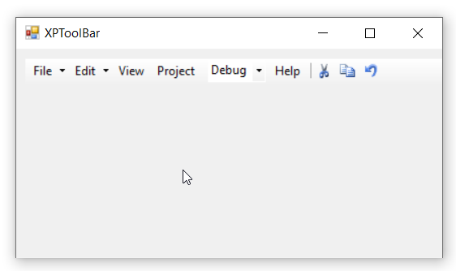

## VS2010

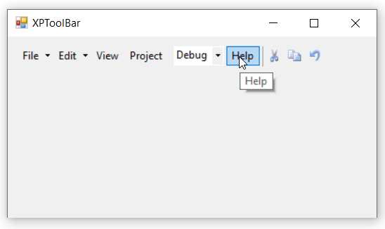
