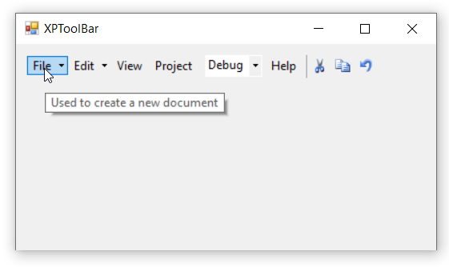

# Tooltip

Tooltip is nothing but a hint, showing short format or customized text about the bar item, when mouse hover on it. By enabling [`ShowTooltip`](https://help.syncfusion.com/cr/windowsforms/Syncfusion.Tools.Windows~Syncfusion.Windows.Forms.Tools.XPMenus.BarItem~ShowTooltip.html) property of each bar item, we can display tooltip while hovering. The [`Tooltip`](https://help.syncfusion.com/cr/windowsforms/Syncfusion.Tools.Windows~Syncfusion.Windows.Forms.Tools.XPMenus.BarItem~Tooltip.html) property is used to set short format or customized text for the tooltip.

>**NOTE**       
1. The [`ShowTooltip`](https://help.syncfusion.com/cr/windowsforms/Syncfusion.Tools.Windows~Syncfusion.Windows.Forms.Tools.XPMenus.BarItem~ShowTooltip.html) property is set as true by default. In this case, it will display the exact text set in the [`Text`](https://help.syncfusion.com/cr/windowsforms/Syncfusion.Tools.Windows~Syncfusion.Windows.Forms.Tools.XPMenus.BarItem~Text.html) property of each bar item.         
2. In this illustration, we have used **BarItem**. Similarly, we have set the tooltip for ParentBarItem, DropDownBarItem, ComboBoxBarItem, ListBarItem, StaticBarItem, ToolbarListBarItem and TextBoxBarItem.

The below code snippet will explain how to set tooltip for bar items.




this.barItem1.ShowTooltip = true;
this.barItem1.Tooltip = "Used to create a new document";





Me.barItem1.ShowTooltip = True
Me.barItem1.Tooltip = "Used to create a new document"




