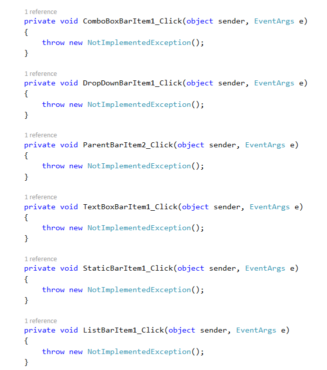

# Trigger Bar Items

On selection, the bar items functionality is handled through the [`Click`](https://help.syncfusion.com/cr/windowsforms/Syncfusion.Tools.Windows~Syncfusion.Windows.Forms.Tools.XPMenus.BarItem~Click_EV.html) event for further operations.

> **NOTE**          
> Bar items can also be operated through keyboard shortcuts. The [`Click`](https://help.syncfusion.com/cr/windowsforms/Syncfusion.Tools.Windows~Syncfusion.Windows.Forms.Tools.XPMenus.BarItem~Click_EV.html) event will be invoked when pressing the shortcut keys.   

The below code snippet shows how to append click event for bar items through code behind.




this.barItem1.Click += BarItem1_Click1;
this.parentBarItem2.Click += ParentBarItem2_Click;
this.dropDownBarItem1.Click += DropDownBarItem1_Click;
this.comboBoxBarItem1.Click += ComboBoxBarItem1_Click;
this.listBarItem1.Click += ListBarItem1_Click;
this.staticBarItem1.Click += StaticBarItem1_Click;
this.textBoxBarItem1.Click += TextBoxBarItem1_Click;





Me.barItem1.Click += BarItem1_Click1
Me.parentBarItem2.Click += ParentBarItem2_Click
Me.dropDownBarItem1.Click += DropDownBarItem1_Click
Me.comboBoxBarItem1.Click += ComboBoxBarItem1_Click
Me.listBarItem1.Click += ListBarItem1_Click
Me.staticBarItem1.Click += StaticBarItem1_Click
Me.textBoxBarItem1.Click += TextBoxBarItem1_Click




