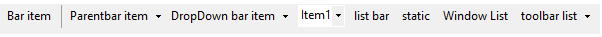
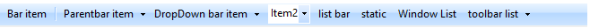
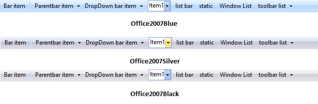
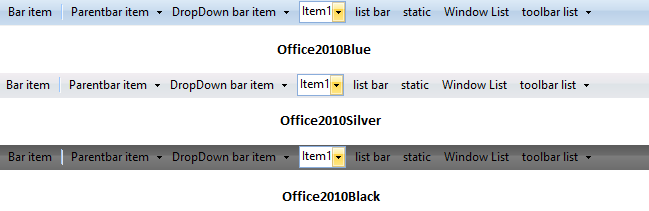
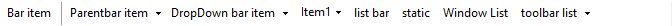

# XPToolbar properties

## Appearance properties

Property table

<table>
<tr>
<th>
XPToolbar property</th><th>
Description</th></tr>
<tr>
<td>
BackColor</td><td>
Sets the back color for the XPToolbar.</td></tr>
<tr>
<td>
BackgroundImage</td><td>
Sets the background image for the XPToolbar.</td></tr>
<tr>
<td>
BackgroundImage layout</td><td>
Specifies the layout of the image. Title, Center, Stretch, Zoom are the option. Default value is Tile.</td></tr>
<tr>
<td>
Font</td><td>
Sets the font style for the text.</td></tr>
<tr>
<td>
ForeColor</td><td>
Sets the foreground color of the text.</td></tr>
<tr>
<td>
LargeIcons</td><td>
Indicates whether images are used from the LargeImageList.</td></tr>
<tr>
<td>
Office2007Theme</td><td>
Specifies the color scheme for Office2007Theme.</td></tr>
<tr>
<td>
RightToLeft</td><td>
Indicates whether control is rendered in RTL mode.</td></tr>
<tr>
<td>
Style</td><td>
Indicates the visual style for the control.</td></tr>
<tr>
<td>
Text</td><td>
Sets the control's text.</td></tr>
<tr>
<td>
ThemesEnabled</td><td>
Specifies whether XP theme is enabled or not.</td></tr>
</table>

## Behavior properties

Property table

<table>
<tr>
<th>
XPToolbar property</th><th>
Description</th></tr>
<tr>
<td>
Enabled</td><td>
Indicates if the control is enabled or not.</td></tr>
<tr>
<td>
RotateWhenVertical</td><td>
Indicates whether the items will be drawn vertical when the XPToolbar is docked vertically. Default value is vertical.</td></tr>
<tr>
<td>
UpdateUIMFCStyle</td><td>
Indicates whether UpdateUI event should be fired.</td></tr>
<tr>
<td>
Visible</td><td>
Indicates whether the control is visible or not.</td></tr>
<tr>
<td>
ShowHighlightRectangle</td><td>
Highlights the bar items on mouse hovering. By default it is set to `true`.</td></tr>
<tr>
<td>
ShowChevron</td><td>
Indicates whether to show chevron. (Default - `true`)</td></tr>
</table>

## Visual style

XPToolBar offers various built in themes for its professional representation as follows

•	Default

•	OfficeXP

•	VS2005

•	VS2010

•	Office2007Outlook

•	Office2003

•	Office2007

•	Office2010

•	Metro

•	Office2016Colorful

•	Office2016White

•	Office2016DarkGray

•	Office2016Black

**Default**

This option helps to set the Default appearance.



 

//Default

this.xpToolBar1.Style = Syncfusion.Windows.Forms.VisualStyle.Default;

 

 

'Default

Me.xpToolBar1.Style = Syncfusion.Windows.Forms.VisualStyle.Default





  

**OfficeXP**

This option helps to set the OfficeXP appearance.



 

//OfficeXP

this.xpToolBar1.Style = Syncfusion.Windows.Forms.VisualStyle.OfficeXP;

 

 

'OfficeXP

Me.xpToolBar1.Style = Syncfusion.Windows.Forms.VisualStyle.OfficeXP





  

**VS2005**

This option helps to set the VS2005 appearance.



 

//VS2005

this.xpToolBar1.Style = Syncfusion.Windows.Forms.VisualStyle.VS2005;

 

 

'VS2005

Me.xpToolBar1.Style = Syncfusion.Windows.Forms.VisualStyle.VS2005





  

 **VS2010**

This option helps to set the VS2010 appearance.



 

//VS2010

this.xpToolBar1.Style = Syncfusion.Windows.Forms.VisualStyle.VS2010;

 

 

'VS2010

Me.xpToolBar1.Style = Syncfusion.Windows.Forms.VisualStyle.VS2010





  

 **Office2007Outlook**

This option helps to set the Office2007Outlook appearance.



 

//Office2007Outlook

this.xpToolBar1.Style = Syncfusion.Windows.Forms.VisualStyle.Office2007Outlook;

 

 

'Office2007Outlook

Me.xpToolBar1.Style = Syncfusion.Windows.Forms.VisualStyle.Office2007Outlook





  

 **Office2003**

This option helps to set the Office2003 appearance.



 

//Office2003

this.xpToolBar1.Style = Syncfusion.Windows.Forms.VisualStyle.Office2003;

 

 

'Office2003

Me.xpToolBar1.Style = Syncfusion.Windows.Forms.VisualStyle.Office2003





  

 **Office2007**

This option helps to set the Office2007 appearance.



 

this.xpToolBar1.Style = Syncfusion.Windows.Forms.VisualStyle.Office2007;

//Sets the Blue Color Scheme

this.xpToolBar1.Office2007Theme = Syncfusion.Windows.Forms.Office2007Theme.Blue;

//Sets the Silver Color Scheme

this.xpToolBar1.Office2007Theme = Syncfusion.Windows.Forms.Office2007Theme.Silver;

//Sets the Black Color Scheme

this.xpToolBar1.Office2007Theme = Syncfusion.Windows.Forms.Office2007Theme.Black;

 

 

Me.xpToolBar1.Style = Syncfusion.Windows.Forms.VisualStyle.Office2007

'Sets the Blue Color Scheme

Me.xpToolBar1.Office2007Theme = Syncfusion.Windows.Forms.Office2007Theme.Blue

'Sets the Silver Color Scheme

Me.xpToolBar1.Office2007Theme = Syncfusion.Windows.Forms.Office2007Theme.Silver

'Sets the Black Color Scheme

Me.xpToolBar1.Office2007Theme = Syncfusion.Windows.Forms.Office2007Theme.Black





  

 **Custom colors**

We can also apply custom colors to the XPToolbar control by setting Office2007ColorScheme to "_Managed_", and specifying the custom color through the ApplyManagedColors method as follows.



  

this.xpToolBar1.Office2007Theme = Syncfusion.Windows.Forms.Office2007Theme.Managed;

Office2007Colors.ApplyManagedColors(this, Color.DarkOrange);



 

Me.xpToolBar1.Office2007Theme = Syncfusion.Windows.Forms.Office2007Theme.Managed

Office2007Colors.ApplyManagedColors(this, Color.DarkOrange)





  

 **Office2010**

This option helps to set the Office2010 appearance.



 

this.xpToolBar1.Style = Syncfusion.Windows.Forms.VisualStyle.Office2010;

//Sets the Blue Color Scheme

this.xpToolBar1.Office2010Theme = Syncfusion.Windows.Forms.Office2010Theme.Blue;

//Sets the Silver Color Scheme

this.xpToolBar1.Office2010Theme = Syncfusion.Windows.Forms.Office2010Theme.Silver;

//Sets the Black Color Scheme

this.xpToolBar1.Office2010Theme = Syncfusion.Windows.Forms.Office2010Theme.Black;

 

 

Me.xpToolBar1.Style = Syncfusion.Windows.Forms.VisualStyle.Office2010

'Sets the Blue Color Scheme

Me.xpToolBar1.Office2010Theme = Syncfusion.Windows.Forms.Office2010Theme.Blue

'Sets the Silver Color Scheme

Me.xpToolBar1.Office2010Theme = Syncfusion.Windows.Forms.Office2010Theme.Silver

'Sets the Black Color Scheme

Me.xpToolBar1.Office2010Theme = Syncfusion.Windows.Forms.Office2010Theme.Black





  

 **Custom colors**

We can also apply custom colors to the XPToolbar control by setting Office2010ColorScheme to "_Managed_", and specifying the custom color through the ApplyManagedColors method as follows.



  

this.xpToolBar1.Office2010Theme = Syncfusion.Windows.Forms.Office2010Theme.Managed;

Office2010Colors.ApplyManagedColors(this, Color.DarkMagenta);



 

Me.xpToolBar1.Office2010Theme = Syncfusion.Windows.Forms.Office2010Theme.Managed

Office2010Colors.ApplyManagedColors(this, Color.DarkMagenta)





  

 **Metro**

This option helps to set the Metro appearance.



 

//Metro

this.xpToolBar1.Style = Syncfusion.Windows.Forms.VisualStyle.Metro;

 

 

'Metro

Me.xpToolBar1.Style = Syncfusion.Windows.Forms.VisualStyle.Metro





  

**Office2016Colorful**

This option helps to set the Office2016Colorful appearance.



 

//Office2016Colorful

this.xpToolBar1.Style = Syncfusion.Windows.Forms.VisualStyle.Office2016Colorful;

 

 

'Office2016Colorful

Me.xpToolBar1.Style = Syncfusion.Windows.Forms.VisualStyle.Office2016Colorful





 

 **Office2016White**

This option helps to set the Office2016White appearance.



 

//Office2016White

this.xpToolBar1.Style = Syncfusion.Windows.Forms.VisualStyle.Office2016White;

 

 

'Office2016White

Me.xpToolBar1.Style = Syncfusion.Windows.Forms.VisualStyle.Office2016White





  

**Office2016DarkGray**

This option helps to set the Office2016DarkGray appearance.



 

//Office2016DarkGray

this.xpToolBar1.Style = Syncfusion.Windows.Forms.VisualStyle.Office2016DarkGray;

 

 

'Office2016DarkGray

Me.xpToolBar1.Style = Syncfusion.Windows.Forms.VisualStyle.Office2016DarkGray





 

 **Office2016Black**

This option helps to set the Office2016Black appearance.



 

//Office2016Black

this.xpToolBar1.Style = Syncfusion.Windows.Forms.VisualStyle.Office2016Black;



 

'Office2016Black

Me.xpToolBar1.Style = Syncfusion.Windows.Forms.VisualStyle.Office2016Black





  
