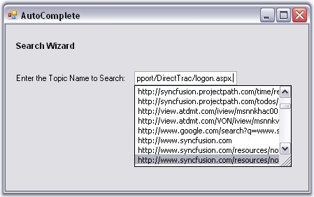
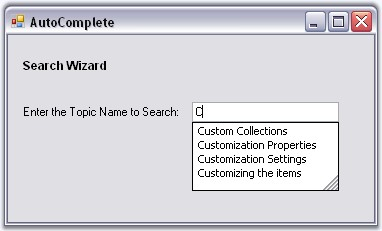
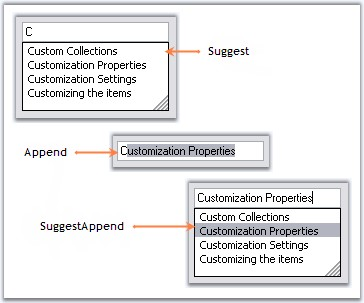

# DataSource

This section explains to you all about the data settings for the AutoComplete control.

## Data Settings

The data for the autocompletion is maintained by the AutoComplete control itself. This is referred to as History Data List mode. The following properties deal with data settings.

<table>
<tr>
<th>
AutoComplete Properties</th><th>
Description</th></tr>
<tr>
<td>
CategoryName</td><td>
Specifies a unique or shared name that can be given to an AutoComplete control so that it can persist the values under that name. For example, when the CategoryName "URL" is provided for an AutoComplete control on a particular form, all values persisted by that AutoComplete control are also accessible to other AutoComplete controls on others forms or on the same form with the CategoryName "URL". </td></tr>
<tr>
<td>
DataSource</td><td>
Sets the Datasource to the Autocomplete control. The AutoComplete control automatically picks the "History Data List" mode or "Data source" mode based on the values set for the DataSource property. When the datasource property is set to NULL (default value is NULL), the control defaults to History Data List mode. It is to be remembered that the properties CategoryName, AutoAddItem and AutoSerialize have to be set appropriately for the History Data List mode to work properly.</td></tr>
</table>



this.autoComplete1.CategoryName = "FTP";

this.autoComplete1.DataSource = DataTable1;





Me.autoComplete1.CategoryName = "FTP"

Me.autoComplete1.DataSource = DataTable1


N> You can set External datasource for the autocompletion. See External DataSource topic.


 
 [How to delete the items in the list at runtime?](http://docs.syncfusion.com/windowsforms/autocomplete/faq/how-to-delete-the-items-in-the-list-at-run-time)

 

## Source for AutoComplete Control

### Dynamic Source at RunTime

Enabling the AutoComplete.AutoAddItem property allows you to save your entries at runtime. Pressing Enter key saves your entry. Refer [Through Designer](http://docs.syncfusion.com/windowsforms/autocomplete/creating-autocomplete-control#through-designer).

### Setting AutoCompletion Source Through Designer

The different sources available for auto completion are specified using the Control.AutoCompleteSource property. When the end user enters a letter in the TextBox for example, the letter is matched with the source available and displays the dropdown item accordingly.

<table>
<tr>
<th>
Property</th><th>
Description</th></tr>
<tr>
<td>
AutoCompleteSource</td><td>
Auto completion source for the control. The different sources are,{{ 'FileSystem' | markdownify }} - Files system as source,{{ 'HistoryList' | markdownify }} - Includes all the URLs in the history list,{{ 'RecentlyUsedList' | markdownify }} - Includes the list of most recently used URLs,{{ 'AllUrl' | markdownify }} - Equivalent source of HistoryList and RecentlyUsedList as the source,{{ 'AllSystemSources' | markdownify }} - Equivalent source of AllUrls and FileSystem as the source (Default value of AutoCompleteSource when AutoCompleteMode is set to values other than default value),{{ 'ListItems' | markdownify }} - Specifies the items in the control, {{ 'FileSystemDirectories' | markdownify }} - Specifies directory names alone without file names,{{ 'CustomSource' | markdownify }} - Uses the string values entered in AutoCompleteCustomSource property and{{ 'None' | markdownify }} - There is no source for the auto completion.</td></tr>
</table>



this.textBox1.AutoCompleteSource = System.Windows.Forms.AutoCompleteSource.HistoryList;




Me.textBox1.AutoCompleteSource = System.Windows.Forms.AutoCompleteSource.HistoryList



  

### Custom Source

AutoComplete control lets you specify a set of auto completion text using String Collection Editor. This editor is invoked using Control.AutoCompleteCustomSource property. 

 

At runtime when you type the first letter, it automatically displays the auto completion list added through this editor.

N> Control.AutoCompleteSource property should be set to "CustomSource" for this setting to be effective.



this.textBox1.AutoCompleteSource = System.Windows.Forms.AutoCompleteSource.CustomSource;

this.textBox1.AutoCompleteCustomSource.AddRange(new string[] {"Customization Settings", "Customization Properties",

"Customizing the items", "Custom Collections"});





Me.textBox1.AutoCompleteSource = System.Windows.Forms.AutoCompleteSource.CustomSource

Me.textBox1.AutoCompleteCustomSource.AddRange(New String[] {"Customization Settings", "Customization Properties",

"Customizing the items", "Custom Collections"})



  

### Mode of AutoCompletion

AutoCompletion modes can be specified using AutoCompleteMode property.

<table>
<tr>
<th>
Property</th><th>
Description</th></tr>
<tr>
<td>
AutoCompleteMode</td><td>
Gets or sets an option that controls how automatic completion, works for the control. The available modes are,{{ 'None' | markdownify }} - No autocompletion is provided for this target edit control,{{ 'Suggest' | markdownify }} - The autocompletion is presented as a list of probable matches in the form of a drop-down window,{{ 'Append' | markdownify }} - The closest match is added to the partial string in the edit control and{{ 'SuggestAppend' | markdownify }} - A list of probable matches are displayed and the entry is completed in the edit control with the closest match.</td></tr>
</table>



this.textBox1.AutoCompleteMode = System.Windows.Forms.AutoCompleteMode.SuggestAppend;





Me.textBox1.AutoCompleteMode = System.Windows.Forms.AutoCompleteMode.SuggestAppend


 

## External Datasource

You can specify an external datasource for the AutoComplete control to use as the history list. This can be specified through the AutoComplete.DataSource property. The object specified for this property can be any object that implements IList or IListSource. 

1. Set AutoComplete mode to AutoSuggest.
2. Set the DataSource in the form's Load event as follows.

   ~~~ cs

		private void Form1_Load(object sender, System.EventArgs e)

		{

			// Set up the datasource on the Autocomplete control. 

		this.oleDbDataAdapter1.Fill(this.dataSet11.organization);

		this.autoComplete1.DataSource = this.dataSet11.organization;

		}
   ~~~
   {:.prettyprint}

   ~~~ vbnet

		Private Sub Form1_Load(ByVal sender As Object, ByVal e As System.EventArgs)

			 ' Set up the datasource on the Autocomplete control  .

		Me.oleDbDataAdapter1.Fill(Me.dataSet11.organization)

		Me.autoComplete1.DataSource = Me.dataSet11.organization

		End Sub

   ~~~
   {:.prettprint}

3. AutoCompleteItemSelected event is raised when you select a new item has, when the AutoComplete dropdown list is displayed. In this event, for example, the code to display corresponding OrgID of the OrganizationName on the label is included. The following code retrieves the corresponding item from the datasource, for the selected item in the AutoComplete control.

   ~~~ cs

		private void autoComplete1_AutoCompleteItemSelected(object sender,Syncfusion.Windows.Forms.Tools.AutoCompleteItemEventArgs args)

		{

		  // Displays corresponding OrgID of the OrganizationName on the label.

		this.label1.Text = args.ItemArray[0].ToString();

		}
   ~~~
   {:.prettyprint}

   ~~~ vbnet

		Private Sub autoComplete1_AutoCompleteItemSelected(ByVal sender As Object, ByVal args As Syncfusion.Windows.Forms.Tools.AutoCompleteItemEventArgs)

		  ' Displays corresponding OrgID of the OrganizationName on the label.

		Me.label1.Text = args.ItemArray(0).ToString()

		End Sub

   ~~~
   {:.prettyprint}

  

Refer to [Multiple Columns](http://docs.syncfusion.com/windowsforms/autocomplete/multiple-columns) section for more information on configuring data sources with multiple columns.
