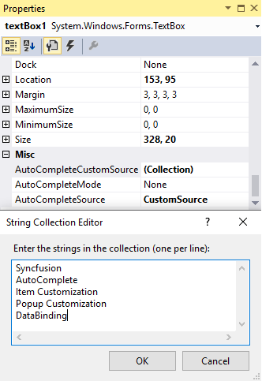

# DataSource in Windows Forms AutoComplete

The AutoComplete component supports variety of data sources such as DataTables, DataSets, or any component that implement interfaces such as IList, IBindingList, ITypedList, and IListSource. For assigning data source to AutoComplete, use the [DataSource](https://help.syncfusion.com/cr/windowsforms/Syncfusion.Windows.Forms.Tools.AutoComplete.html#Syncfusion_Windows_Forms_Tools_AutoComplete_DataSource) property. This section explains about the different types of data binding mechanisms and data settings supported by the AutoComplete component.

## Data settings

The data for the autocompletion is maintained by the AutoComplete component itself. This is referred to as History Data List mode. The following properties deal with data settings.

<table>
<tr>
<th>
AutoComplete properties</th><th>
Description</th></tr>
<tr>
<td>
CategoryName</td><td>
Specifies a unique or shared name that can be given to an AutoComplete component, so that it can persist the values under that name. For example, when the CategoryName "URL" is provided for an AutoComplete component on a particular form, all the values persisted by that AutoComplete component are also accessible to other AutoComplete component on others forms or on the same form with the CategoryName "URL". </td></tr>
<tr>
<td>
DataSource</td><td>
Sets the Datasource to the Autocomplete component. The AutoComplete component automatically picks the "History Data List" mode or "Data source" mode based on the values set for the DataSource property. When the datasource property is set to NULL (default value is NULL), the component defaults to History Data List mode. It is to be remembered that the properties CategoryName, AutoAddItem, and AutoSerialize have to be set appropriately for the History Data List mode to work properly.</td></tr>
</table>





this.autoComplete1.CategoryName = "FTP";

this.autoComplete1.DataSource = DataTable1;





Me.autoComplete1.CategoryName = "FTP"

Me.autoComplete1.DataSource = DataTable1





## Dynamic source at run time

Enabling the [AutoAddItem](https://help.syncfusion.com/cr/windowsforms/Syncfusion.Windows.Forms.Tools.AutoComplete.html#Syncfusion_Windows_Forms_Tools_AutoComplete_AutoAddItem) property allows you to save your entries at run time, and pressing the `Enter` key saves your entry.

## Built-in source

The different built-in source (FileSystem, HistoryList, AllUrl, etc) can be set to the AutoComplete component using the `AutoCompleteSource` property of the editor control.

<table>
<tr>
<th>Built-in DataSource Support.</th>
<th>Description </th>
</tr>
<tr>
<td>FileSystem </td>
<td>It specifies file system as source.</td>
</tr>
<tr>
<td>HistoryList</td>
<td>Includes all the URLs in the history list.</td>
</tr>
<tr>
<td>RecentlyUsedList</td>
<td>Includes a list of most recently used URLs.</td>
</tr>
<tr>
<td>AllUrl</td>
<td>Equivalent source of HistoryList and RecentlyUsedList as the source.</td>
</tr>
<tr>
<td>AllSystemSources</td>
<td>Equivalent source of AllUrls and FileSystem as the source (default value of AutoCompleteSource when AutoCompleteMode is set to some values other than default value).</td>
</tr>
<tr>
<td>ListItems</td>
<td>Specifies the items in the control.</td>
</tr>
<tr>
<td> FileSystemDirectories</td>
<td>Specifies directory names alone without file names.</td>
</tr>
<tr>
<td>CustomSource </td>
<td>Uses the string values entered in AutoCompleteCustomSource property.</td>
</tr>
<tr>
<td>None</td>
<td>There is no source for the auto completion.</td>
</tr>
</table>





this.textBox1.AutoCompleteSource = System.Windows.Forms.AutoCompleteSource.HistoryList;





Me.textBox1.AutoCompleteSource = System.Windows.Forms.AutoCompleteSource.HistoryList





## Custom source

The AutoComplete component allows you add a set of text using `String Collection Editor`, and this editor window will be shown by clicking the `AutoCompleteCustomSource` property in property window of the editor control. The `AutoCompleteSource` property should be set to `CustomSource` for using custom items added through String Collection Editor.

 




    this.textBox1.AutoCompleteSource = System.Windows.Forms.AutoCompleteSource.CustomSource;

    this.textBox1.AutoCompleteCustomSource.AddRange(new string[] {"Syncfusion", "AutoComplete",
    "Item Customization", "Popup Customization", "DataBinding"});





    Me.textBox1.AutoCompleteSource = System.Windows.Forms.AutoCompleteSource.CustomSource

    Me.textBox1.AutoCompleteCustomSource.AddRange(New String[] {"Syncfusion", "AutoComplete",
    "Item Customization", "Popup Customization", "DataBinding"})





 

## Binding custom collections 

The different custom collections that can be bound to the [DataSource](https://help.syncfusion.com/cr/windowsforms/Syncfusion.Windows.Forms.Tools.AutoComplete.html#Syncfusion_Windows_Forms_Tools_AutoComplete_DataSource) property of the AutoComplete component are listed as follows.

* BindingList Collection
* ArrayList Collection
* Observable Collection
* Collection Base
* Generic Collections
* DataTable

A sample that demonstrates the binding of various data source is available [here](https://github.com/SyncfusionExamples/AutoCompleteModes_in_AutoComplete_Component/tree/master/DataSourceBinding) 
