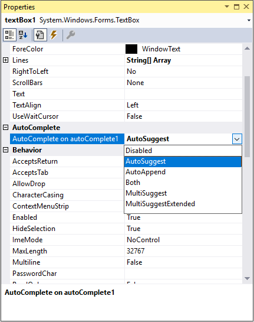

# Getting Started

You can add auto complete functionality to any editor control using the [AutoComplete](https://help.syncfusion.com/cr/windowsforms/Syncfusion.Tools.Windows~Syncfusion.Windows.Forms.Tools.AutoComplete.html) component in Windows Forms.

## Assembly deployment

Refer to the [Control dependencies](https://help.syncfusion.com/windowsforms/control-dependencies#autocomplete) section to get the list of assemblies or NuGet package that needs to be added as reference to use the component in any application.

Refer to this [documentation](https://help.syncfusion.com/windowsforms/nuget-packages) to find more details about installing nuget packages in a Windows Forms application.

## Creating an application with AutoComplete

### Adding control via designer

Create a new Windows Forms application in Visual Studio. Drag the AutoComplete control from toolbox to form design view. The required assemblies will be added automatically. Drag the MS TextBox control or any editor control into form design view.

### Enabling AutoComplete functionality for TextBox control

Set the **AutoComplete on autoComplete1** property as AutoSuggest using the drop-down provided in the TextBox properties dialog window. The Default value is `Disabled`.

### Adding control via code

1. Create a new Windows Forms application in Visual Studio. Add the following required assembly references:

* Syncfusion.Grid.Base
* Syncfusion.Grid.Windows
* Syncfusion.Shared.Base
* Syncfusion.Shared.Windows
* Syncfusion.SpellChecker.Base
* Syncfusion.Tools.Base
* Syncfusion.Tools.Windows

2. Add the required namespace and create an instance for [AutoComplete](https://help.syncfusion.com/cr/windowsforms/Syncfusion.Tools.Windows~Syncfusion.Windows.Forms.Tools.AutoComplete.html) and TextBox controls.





Using Syncfusion.Windows.Forms.Tools

public Form1()
{

    InitializeComponent();
    AutoComplete autoComplete1 = new AutoComplete();
    TextBox textBox1 = new TextBox();
    this.Controls.Add(textBox1);
}





Imports Syncfusion.Windows.Forms.Tools

Public Sub New()

    InitializeComponent()
    Dim autoComplete1 As AutoComplete = New AutoComplete()
    Dim textBox1 As TextBox = New TextBox()
    Me.Controls.Add(textBox1)

End Sub





### Enabling the AutoComplete functionality for TextBox Control

Use the [SetAutoComplete](https://help.syncfusion.com/cr/windowsforms/Syncfusion.Tools.Windows~Syncfusion.Windows.Forms.Tools.AutoComplete~SetAutoComplete.html) method to add the [AutoComplete](https://help.syncfusion.com/cr/windowsforms/Syncfusion.Tools.Windows~Syncfusion.Windows.Forms.Tools.AutoComplete.html) component with the TextBox control.





public Form1()

{

        InitializeComponent();
        AutoComplete autoComplete1 = new AutoComplete();
        TextBox textBox1 = new TextBox();
        autoComplete1.SetAutoComplete(textBox1, AutoCompleteModes.AutoSuggest);
        this.Controls.Add(textBox1);
}





Public Sub New()

    InitializeComponent()
    Dim autoComplete1 As AutoComplete = New AutoComplete()
    Dim textBox1 As TextBox = New TextBox()
    autoComplete1.SetAutoComplete(textBox1, AutoCompleteModes.AutoSuggest)
    Me.Controls.Add(textBox1)

End Sub





## Datasource

The AutoComplete component supports variety of data sources such as DataTables, DataSets, or any component that implement interfaces like IList, IBindingList, ITypedList, or IListSource. For assigning data source to AutoComplete, use the [DataSource](https://help.syncfusion.com/cr/windowsforms/Syncfusion.Tools.Windows~Syncfusion.Windows.Forms.Tools.AutoComplete~DataSource.html) property.





private void Form1_Load(object sender, EventArgs e)
{

            //Create a data table
            DataTable dt = new DataTable("Table1");
            dt.Columns.Add("Country");
            dt.Columns.Add("Capital");

            // Create a data set
            DataSet ds = new DataSet();
            ds.Tables.Add(dt);
            dt.Rows.Add(new string[] { "United Kingdom ", "London" });
            dt.Rows.Add(new string[] { "USA", "Washington, D.C." });
            dt.Rows.Add(new string[] { "Brazil", "Brasilia" });
            dt.Rows.Add(new string[] { "France", "Paris" });
            dt.Rows.Add(new string[] { "Russia", "Moscow" });
            dt.Rows.Add(new string[] { "India", "Delhi" });
            DataView view = new DataView(dt);

            // Setting data source to AutoComplete
            this.autoComplete1.DataSource = view;
}





Private Sub Form1_Load(ByVal sender As Object, ByVal e As EventArgs)

    'Create dataTable
    Dim dt As DataTable = New DataTable("Table1")
    dt.Columns.Add("Country")
    dt.Columns.Add("Capital")

    'Create a Data Set
    Dim ds As DataSet = New DataSet()
    ds.Tables.Add(dt)
    dt.Rows.Add(New String() {"United Kingdom ", "London"})
    dt.Rows.Add(New String() {"USA", "Washington, D.C."})
    dt.Rows.Add(New String() {"Brazil", "Brasilia"})
    dt.Rows.Add(New String() {"France", "Paris"})
    dt.Rows.Add(New String() {"Russia", "Moscow"})
    dt.Rows.Add(New String() {"India", "Delhi"})
    Dim view As DataView = New DataView(dt)

    ' setting datasource to autocomplete
    Me.autoComplete1.DataSource = view
End Sub





