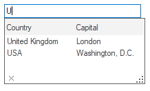
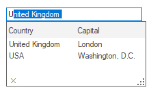
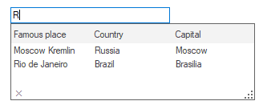
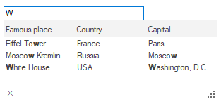
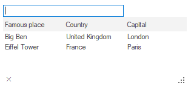
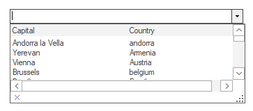
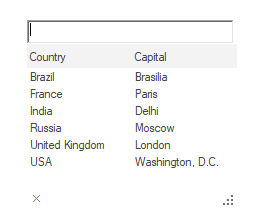
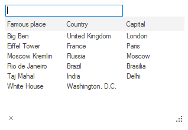

# Working with AutoComplete in Windows Forms AutoComplete

This section explains how to work with various options in the AutoComplete component.

## Setting AutoComplete modes

The AutoComplete component provides the auto-complete support to the editor control based on the input text. It can be done using the [SetAutoComplete](https://help.syncfusion.com/cr/windowsforms/Syncfusion.Windows.Forms.Tools.AutoComplete.html#Syncfusion_Windows_Forms_Tools_AutoComplete_SetAutoComplete_System_Windows_Forms_Control_Syncfusion_Windows_Forms_Tools_AutoCompleteModes_) method.

The different types of AutoComplete modes are as follows.

<table> 
<tr>
<th>
AutoComplete modes</th><th>
Description</th></tr>
<tr>
<td>AutoSuggest</td>
<td>
Suggests and displays a list of probable matches in the drop-down list by setting the AutoCompleteMode to AutoSuggest.
 

</td>
</tr>
<tr>
<td> AutoAppend </td>
<td>
Appends the most appropriate match for the current content in the editor control automatically.
 

</td>
</tr>

<tr>
<td> Both </td>
<td>
Activates both AutoAppend and AutoSuggest modes of auto completion for the editor control.
 

</td>
</tr>

<tr>
<td> Disabled </td>
<td>
Disables auto complete support for the editor control.
 

</td>
</tr>

<tr>
<td> MultiSuggest </td>
<td>
Checks whether the beginning of items in the list pop up matches with user input string. Then matched cases from various columns are shown as suggestions. The MultiSuggest mode is an extended mode of AutoSuggest.
  
 
</td>
</tr>

<tr>
<td> MultiSuggestExtend </td>
<td>
Checks whether the entered character or sequence of character is present in any part of the word in list popup item. Then matched cases from various columns are shown as suggestions.
 

</td>
</tr>

</table>

The following code snippet shows how to update the AutoComplete modes.





    autoComplete1.SetAutoComplete(this.textBox1, Syncfusion.Windows.Forms.Tools.AutoCompleteModes.MultiSuggestExtended);





    autoComplete1.SetAutoComplete(Me.textBox1, Syncfusion.Windows.Forms.Tools.AutoCompleteModes.MultiSuggestExtended)



 

N> The values are filtered from the column which is set as matching column for auto complete. By default, the [MatchingColumn](https://help.syncfusion.com/cr/windowsforms/Syncfusion.Windows.Forms.Tools.AutoCompleteDataColumnInfo.html#Syncfusion_Windows_Forms_Tools_AutoCompleteDataColumnInfo_MatchingColumn) value is `true` for the first column of binding source.

A sample that demonstrates the AutoComplete mode is available [here](https://github.com/SyncfusionExamples/AutoCompleteModes_in_AutoComplete_Component/tree/master/AutoComplete%20Modes)

## Case sensitivity

Specifies whether to ignore case for string comparison. It can be enabled by setting the [CaseSensitive](https://help.syncfusion.com/cr/windowsforms/Syncfusion.Windows.Forms.Tools.AutoComplete.html#Syncfusion_Windows_Forms_Tools_AutoComplete_CaseSensitive) property to `true`. The default value of this property is `true`.





    autoComplete1.CaseSensitive = true;





    autoComplete1.CaseSensitive = True





## Match mode

The [MatchMode](https://help.syncfusion.com/cr/windowsforms/Syncfusion.Windows.Forms.Tools.AutoComplete.html#Syncfusion_Windows_Forms_Tools_AutoComplete_MatchMode) property specifies the mode where the most appropriate match for the current content in the editor control is filled in the AutoComplete history list. The default value is `Automatic`.

The following code snippet implements column configuration.





this.autoComplete1.MatchMode = AutoCompleteMatchModes.Automatic;





Me.autoComplete1.MatchMode = AutoCompleteMatchModes.Automatic





## Matching column 

The [MatchingColumn](https://help.syncfusion.com/cr/windowsforms/Syncfusion.Windows.Forms.Tools.AutoCompleteDataColumnInfo.html#Syncfusion_Windows_Forms_Tools_AutoCompleteDataColumnInfo_MatchingColumn) indicates the represented column to be treated as matching column. The default value of this property is `true` for 0th index column.

Refresh column before setting MatchingColumn using the [RefreshColumns](https://help.syncfusion.com/cr/windowsforms/Syncfusion.Windows.Forms.Tools.AutoComplete.html#Syncfusion_Windows_Forms_Tools_AutoComplete_RefreshColumns) method. 





this.autoComplete1.RefreshColumns();
this.autoComplete1.Columns[1].MatchingColumn = true;





    Me.autoComplete1.RefreshColumns()
    Me.autoComplete1.Columns(1).MatchingColumn = true





## Sorting items

Specifies whether sorting needs to be performed in the items present in the AutoComplete popup. It can be done by setting the [AutoSortList](https://help.syncfusion.com/cr/windowsforms/Syncfusion.Windows.Forms.Tools.AutoComplete.html#Syncfusion_Windows_Forms_Tools_AutoComplete_AutoSortList) property to `true`. The default value of this property is `true`.





    autoComplete1.AutoSortList = true;





    autoComplete1.AutoSortList = True





N> The items are sorted on the basis of the column whose [MatchingColumn](https://help.syncfusion.com/cr/windowsforms/Syncfusion.Windows.Forms.Tools.AutoCompleteDataColumnInfo.html#Syncfusion_Windows_Forms_Tools_AutoCompleteDataColumnInfo_MatchingColumn) are set to `true`. 

## Handling duplicate values

The duplicate values can be used in AutoComplete data source by setting the [EnableDuplicateValues](https://help.syncfusion.com/cr/windowsforms/Syncfusion.Windows.Forms.Tools.AutoComplete.html#Syncfusion_Windows_Forms_Tools_AutoComplete_EnableDuplicateValues) property to `true`.





    autoComplete1.EnableDuplicateValues = true;





    autoComplete1.EnableDuplicateValues = True





## Maintaining history of user inputs

### Adding items to history list

The current input text in the editor control can be added to the history list at run time when the Enter key is pressed. This support can be enabled by setting the [AutoAddItem](https://help.syncfusion.com/cr/windowsforms/Syncfusion.Windows.Forms.Tools.AutoComplete.html#Syncfusion_Windows_Forms_Tools_AutoComplete_AutoAddItem) property to `true`. The default value of this property is `false`.





    autoComplete1.AutoAddItem = true;





    autoComplete1.AutoAddItem = True





### Deleting items from history list

The current selected item can be removed from auto complete popup when the `Delete` key is pressed at run time. This support can be enabled by setting the [AllowListDelete](https://help.syncfusion.com/cr/windowsforms/Syncfusion.Windows.Forms.Tools.AutoComplete.html#Syncfusion_Windows_Forms_Tools_AutoComplete_AllowListDelete) property to `true`.





    autoComplete1.AllowListDelete = true;





    autoComplete1.AllowListDelete = True





### Deleting history

The history items persisted by the AutoComplete component can be deleted by invoking the [ResetHistory](https://help.syncfusion.com/cr/windowsforms/Syncfusion.Windows.Forms.Tools.AutoComplete.html#Syncfusion_Windows_Forms_Tools_AutoComplete_ResetHistory) method. The entire history list in the AutoComplete popup will be deleted.





    autoComplete1.ResetHistory();





    autoComplete1.ResetHistory();





## Setting maximum number of suggestions

You can limit the number of suggestions need to be displayed in the AutoComplete popup using the [MaxNumberofSuggestion](https://help.syncfusion.com/cr/windowsforms/Syncfusion.Windows.Forms.Tools.AutoComplete.html#Syncfusion_Windows_Forms_Tools_AutoComplete_MaxNumberofSuggestion) property.





    autoComplete1.MaxNumberofSuggestion = 2;





    autoComplete1.MaxNumberofSuggestion = 2





## Integration with MS ComboBox

If MS ComboBox is used as editor control, the Combobox dropdown can be suppressed and overridden by the AutoComplete component using the [OverrideCombo](https://help.syncfusion.com/cr/windowsforms/Syncfusion.Windows.Forms.Tools.AutoComplete.html#Syncfusion_Windows_Forms_Tools_AutoComplete_OverrideCombo) property.

A sample that demonstrates the above feature is available [here](https://github.com/SyncfusionExamples/AutoCompleteModes_in_AutoComplete_Component/tree/master/OverrideCombo)

## Integration with RichTextBox control

The auto-complete functionality can be added to the RichTextBox control. The following steps are used to integrate the RichTextBox with the AutoComplete component:

1. Implement the `IEditControlsEmbed` interface in a CustomRichTextBox class that enables the AutoComplete functionality for the RichTextBox control.





    public class CustomRichTextBox : System.Windows.Forms.RichTextBox, IEditControlsEmbed

     {
           // Returns the active RichTextBox control.
            public Control GetActiveEditControl(IEditControlsEmbedListener listener)
            {
                       return (Control)this;
            }
     }





    Public Class CustomRichTextBox Inherits System.Windows.Forms.RichTextBox Implements IEditControlsEmbed
     ' Returns the active RichTextBox control.
     Public Function GetActiveEditControl(ByVal listener As IEditControlsEmbedListener) As Control

         Return CType(Me, Control)

     End Function

     End Class




{{ codesnippet1 | OrderList_Indent_Level_1 }}

2. Create an instance for the CustomRichTextBox class and the AutoComplete component. Then, use the [SetAutoComplete](https://help.syncfusion.com/cr/windowsforms/Syncfusion.Windows.Forms.Tools.AutoComplete.html#Syncfusion_Windows_Forms_Tools_AutoComplete_SetAutoComplete_System_Windows_Forms_Control_Syncfusion_Windows_Forms_Tools_AutoCompleteModes_) method of AutoComplete component to enable auto-complete support for the RichTextBox control.





    Syncfusion.Windows.Forms.Tools.AutoComplete autoComplete1= new Syncfusion.Windows.Forms.Tools.AutoComplete();
    CustomRichTextBox richTextBox1= new CustomRichTextBox();    
    autoComplete1.SetAutoComplete(richTextBox1, Syncfusion.Windows.Forms.Tools.AutoCompleteModes.AutoSuggest);





    Dim autoComplete1 As Syncfusion.Windows.Forms.Tools.AutoComplete = New Syncfusion.Windows.Forms.Tools.AutoComplete 
    Dim richTextBox1 As CustomRichTextBox = New CustomRichTextBox
    autoComplete1.SetAutoComplete(richTextBox1, AutoCompleteModes.AutoSuggest)




{{ codesnippet2 | OrderList_Indent_Level_1 }}

A sample that demonstrates the integration with RichTextBox control is available [here](https://github.com/SyncfusionExamples/AutoCompleteModes_in_AutoComplete_Component/tree/master/RichTextBox%20Integration)

## Opening the AutoComplete popup programmatically

The AutoComplete popup can be shown programmatically using the [AutoCompletePopup](https://help.syncfusion.com/cr/windowsforms/Syncfusion.Windows.Forms.Tools.AutoComplete.html#Syncfusion_Windows_Forms_Tools_AutoComplete_AutoCompletePopup) method. 





    autoComplete1.AutoCompletePopup.ParentControl = textBox1;
    this.autoComplete1.AutoCompletePopup.ShowPopup(Point.Empty);





    autoComplete1.AutoCompletePopup.ParentControl = textBox1

    autoComplete1.AutoCompletePopup.ShowPopup(Point.Empty)





