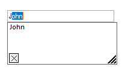
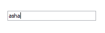
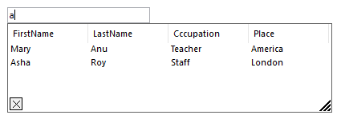
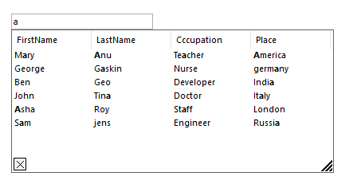

# AutoComplete Modes

The AutoComplete modes provide auto-completion options to auto suggest and append text from user choice.

The following AutoComplete modes are available:

* AutoSuggest
* AutoAppend
* Both
* MultiSuggest
* MultiSuggestExtended

## AutoSuggest

Displays possible matches for the current content of the active edit control in the form of pop-up window with selectable list of matches.





this.autoComplete1.SetAutoComplet(this.textBox1, Syncfusion.Windows.Forms.Tools.AutoCompleteModes.AutoSuggest); 





Me.autoComplete1.SetAutoComplete(Me.textBox1, Syncfusion.Windows.Forms.Tools.AutoCompleteModes.AutoSuggest)



 

## AutoAppend

Automatically appends most appropriate match for the current content of the edit control. The user can choose whether to type further or accept the appended word.





this.autoComplete1.SetAutoComplete(this.textBox1, Syncfusion.Windows.Forms.Tools.AutoCompleteModes.AutoAppend);





Me.autoComplete1.SetAutoComplete(Me.textBox1, Syncfusion.Windows.Forms.Tools.AutoCompleteModes.AutoAppend)



 

## Both

Activates both AutoAppend and AutoSuggest modes of auto completion for the target control.





this.autoComplete1.SetAutoComplete(this.textBox1, Syncfusion.Windows.Forms.Tools.AutoCompleteModes.Both);





Me.autoComplete1.SetAutoComplete(Me.textBox1, Syncfusion.Windows.Forms.Tools.AutoCompleteModes.Both)



 

## Disabled

Disables the auto complete support. 





this.autoComplete1.SetAutoComplete(this.textBox1, Syncfusion.Windows.Forms.Tools.AutoCompleteModes.Disabled);





Me.autoComplete1.SetAutoComplete(Me.textBox1, Syncfusion.Windows.Forms.Tools.AutoCompleteModes.Disabled)



 

## MultiSuggest

Displays possible matches of multiple columns for the current content of the active edit control in the form of pop-up window with selectable list of matches. Multisuggest mode is an extended mode of AutoSuggest.





this.autoComplete1.SetAutoComplete(this.textBox1, Syncfusion.Windows.Forms.Tools.AutoCompleteModes.MultiSuggest);





Me.autoComplete1.SetAutoComplete(Me.textBox1, Syncfusion.Windows.Forms.Tools.AutoCompleteModes.MultiSuggest)



 

## MultiSuggestExtend

Displays possible entries of the current content of the active edit control in the form of pop-up window with selectable list of matches. All possible matches will be highlighted.





this.autoComplete1.SetAutoComplete(this.textBox1, Syncfusion.Windows.Forms.Tools.AutoCompleteModes.MultiSuggestExtended);





Me.autoComplete1.SetAutoComplete(Me.textBox1, Syncfusion.Windows.Forms.Tools.AutoCompleteModes.MultiSuggestExtended)



 
