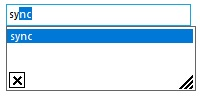

---
layout: post
title: How to Programmatically Display an AutoComplete Popup | Syncfusion
description: Display the AutoComplete popup programmatically in Syncfusion® Windows Forms AutoComplete control using built-in popup APIs and more.
platform: WindowsForms
control: Tools
documentation: ug
---

# How to Programmatically Display an AutoComplete Popup in Windows Forms

[AutoComplete popup](https://help.syncfusion.com/windowsforms/autocomplete/working-with-autocomplete#opening-the-autocomplete-popup-programmatically) can be displayed programmatically.

The following code demonstrates the same.





this.autoComplete1.AutoCompletePopup.ParentControl = this.textBox1;

this.autoComplete1.AutoCompletePopup.ShowPopup(Point.Empty);





Me.autoComplete1.AutoCompletePopup.ParentControl = Me.textBox1

Me.autoComplete1.AutoCompletePopup.ShowPopup(Point.Empty)





 