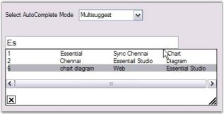

# How to match items in all the columns using AutoComplete control?

Matching items in multiple columns is possible using the AutoComplete control. You can set the AutoCompleteModes to MultiSuggest or MultiExtended mode for this.

MultiSuggest - Possible matches from Multiple columns for the current content of the Active edit control, are presented in the form of a popup window with a selectable list of matches. MultiSuggest mode is an extended mode of AutoSuggest. On selecting this mode, you can get the matching items in the active edit control from all the columns. 



this.autoComplete1.SetAutoComplete(this.textBoxExt1 , Syncfusion.Windows.Forms.Tools.AutoCompleteModes.MultiSuggest);




Me.autoComplete1.SetAutoComplete(Me.textBoxExt1 , Syncfusion.Windows.Forms.Tools.AutoCompleteModes.MultiSuggest)



 

MultiSuggestExtended - This mode highlights all possible matches from Multiple columns, for the current content of the Active edit control, presented in the form of a popup window, with a selectable list of matches.



this.autoComplete1.SetAutoComplete(this.textBoxExt1 , Syncfusion.Windows.Forms.Tools.AutoCompleteModes.MultiSuggestExtended);





Me.autoComplete1.SetAutoComplete(Me.textBoxExt1 , Syncfusion.Windows.Forms.Tools.AutoCompleteModes.MultiSuggestExtended)


 
