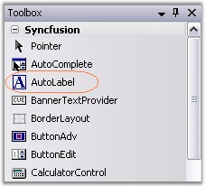
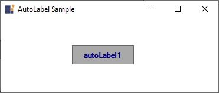

# Getting Started

This section briefly describes how to create a new Windows Forms project in Visual Studio and add the **"AutoLabel"** control with its basic functionalities.

## Assembly deployment
Refer to the [control dependencies](https://help.syncfusion.com/windowsforms/control-dependencies#autolabel) section to get the list of assemblies or NuGet package details that need to be added as reference to use the control in any application.

[Click here](https://help.syncfusion.com/windowsforms/nuget-packages) to find more details on how to install NuGet packages in a Windows Forms application.

## Adding the AutoLabel control through the designer

The following steps illustrate how to create an **"AutoLabel"** control through the designer:

**Step 1**: Create a new Windows Forms application in Visual Studio.

**Step 2**: The **"AutoLabel"** control can be added to an application by dragging it from the toolbox to the design view. The following dependent assemblies will be added automatically.

* Syncfusion.Shared.Base

   

**Step 3**: Set the desired properties for the **"AutoLabel"** control through the **"Properties"** dialog.

**Step 4**: Run the application.

   

## Adding the AutoLabel control through code

The following steps illustrate how to create an **"AutoLabel"** control programmatically:

**Step 1**: Create a C# or VB application though Visual Studio.

**Step 2**: Add the following assembly reference to the project.

* Syncfusion.Shared.Base

**Step 3**: Include the required namespace.




using Syncfusion.Windows.Forms.Tools;
		




Imports Syncfusion.Windows.Forms.Tools




**Step 4**: Create an instance of the **"AutoLabel"** control and add it to the form.




private Syncfusion.Windows.Forms.Tools.AutoLabel autoLabel1;
this.autoLabel1 = new Syncfusion.Windows.Forms.Tools.AutoLabel();





Private autoLabel1 As Syncfusion.Windows.Forms.Tools.AutoLabel
Me.autoLabel1 = New Syncfusion.Windows.Forms.Tools.AutoLabel()




**Step 5**: Set the following properties for the **"AutoLabel"** control and add it to the form.




this.autoLabel1.Text = "autoLabel1";
this.autoLabel1.BackColor = System.Drawing.Color.DarkGray;
this.autoLabel1.ForeColor = System.Drawing.Color.DarkBlue;
this.autoLabel1.Font = new System.Drawing.Font("Microsoft Sans Serif", 8.25F, System.Drawing.FontStyle.Bold, System.Drawing.GraphicsUnit.Point, ((byte)(0)));
this.autoLabel1.TextAlign = System.Drawing.ContentAlignment.MiddleCenter;

// Add the AutoLabel control to the Form.
this.Controls.Add(this.autoLabel1);
  




Me.autoLabel1.Text = "autoLabel1"
Me.autoLabel1.BackColor = System.Drawing.Color.DarkGray
Me.autoLabel1.ForeColor = System.Drawing.Color.DarkBlue
Me.autoLabel1.Font = New System.Drawing.Font("Microsoft Sans Serif", 8.25F, System.Drawing.FontStyle.Bold, System.Drawing.GraphicsUnit.Point, CByte((0)))
Me.autoLabel1.TextAlign = System.Drawing.ContentAlignment.MiddleCenter

' Add the AutoLabel control to the Form.
Me.Controls.Add(Me.autoLabel1)




**Step 6**: Run the application.

  

